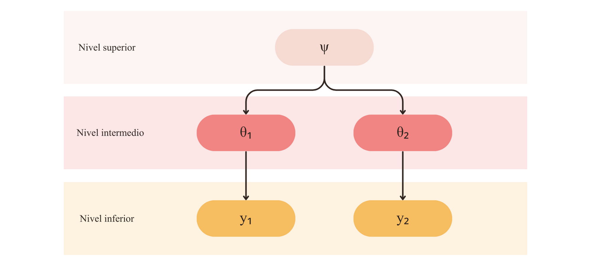
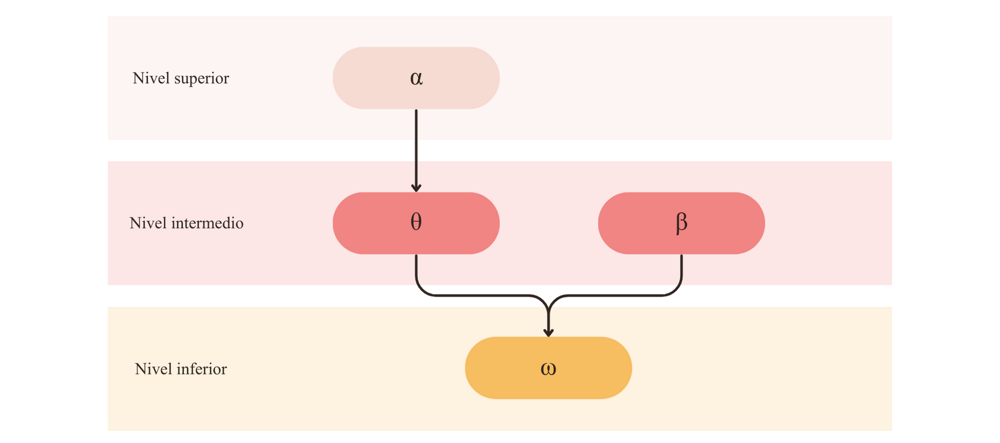

```{r results='hide', message=FALSE, echo=FALSE, warning=FALSE}
set.seed(1406)
library(showtext)
showtext_auto()
font_add_google(name="Noto Serif", family = "libre")
library(ggplot2)
library(dplyr)
library(tidyr)
library(DiagrammeR)
library(webshot)
library(ggraph)
library(igraph)
library(tibble)
library(mvtnorm)
```

```{=tex}
\thispagestyle{empty}
\begin{center}
    \vspace*{0.5cm}
    \huge\textbf{Análisis de comentarios en redes sociales con latent Dirichlet allocation}
    
    \vspace{4cm}
    \includegraphics[width=0.3\textwidth]{logo_unr.png}
  
    \vspace{0cm}
    \large{Facultad de Ciencias Económicas y Estadística}
    
    \vspace{0cm}
    \large{Alumna: Alfonsina Badin}
    
    \vspace{0cm}
    \large{Director: Ignacio Evangelista}
    
    \vspace{0.5cm}
    \large{2025}
    
\end{center}
```

\clearpage
\pagenumbering{arabic}
\setcounter{page}{1}

\renewcommand{\contentsname}{Índice}

\setcounter{tocdepth}{4}
\tableofcontents

\clearpage

\newpage

# Agradecimientos

\newpage

# Resumen

\newpage

# Introducción {#sec-introduccion}

A lo largo de los años, las redes sociales se han convertido en el medio de comunicación más utilizado. Diariamente, los usuarios ingresan a ellas para conversar con otras personas, dar a conocer sus puntos de vista, compartir experiencias, informarse sobre las últimas noticias y entretenerse.

En el año 2020, a raíz de la pandemia mundial por COVID-19, hubo un tipo de contenido que se popularizó con gran velocidad: el *streaming*.  El *streaming* es una combinación de radio y televisión, que se transmite en vivo en una plataforma gratuita (YouTube o Twitch) y luego es publicado *On-Demand* para que el usuario pueda verlo fuera de su horario habitual si así lo desea. Por lo general el formato consta de un panel de conductores que charlan de tópicos comunes para la audiencia, generando debates interesantes con los que los usuarios se pueden llegar a identificar. Dentro de cada canal de *streaming* se transmiten distintos programas que tienen un perfil particular y objetivos diferentes ya que su contenido puede variar en entretenimiento, humor, chimentos, noticias, etc.  

Su popularidad se debe a que es un contenido gratuito, cercano y que genera una **comunidad** entre los conductores y sus oyentes, quienes no sólo interactúan en vivo a través de un *chat* sino que dejan sus comentarios en otras redes sociales: Instagram, TikTok, YouTube, entre otros.

Al publicar los programas *On-Demand*, los canales de *streaming* acceden a un recurso valioso que refleja la opinión de sus oyentes: los comentarios de YouTube. El análisis de estos textos puede resultar en conclusiones interesantes para los canales ya que permite un entendimiento de los sentimientos que tiene su comunidad con respecto a cada contenido.

Para llevar a cabo este análisis, el presente informe utiliza **latent Dirichlet allocation (LDA)**, una técnica de aprendizaje automático no supervisado que clasifica automáticamente los textos en diferentes categorías o temas según las características del corpus. Esta metodología permite detectar patrones temáticos recurrentes en grandes volúmenes de datos textuales, como los comentarios de YouTube, y extraer información valiosa.

LDA se basa en un modelo probabilístico generativo y es especialmente útil para modelar datos discretos como textos. Es un modelo bayesiano jerárquico de tres niveles, en el cual cada documento (en este caso, cada comentario) se representa como una mezcla de temas, y cada tema se define como una mezcla de palabras. En este sentido, LDA no solo agrupa comentarios en función de temas compartidos, sino que también asigna probabilidades a cada palabra dentro de cada tema, proporcionando una representación explícita y estructurada del contenido del corpus.

Esta capacidad de modelar documentos como combinaciones de múltiples temas lo hace particularmente adecuado para analizar la diversidad temática de los comentarios de YouTube. Por ejemplo, un comentario podría estar relacionado en un 60% con el tema "entretenimiento" y en un 40% con el tema "noticias", lo que permite identificar la interacción entre los intereses de los usuarios.

Esta tesina tiene por objeto de estudio la técnica latent Dirichlet allocation. Se brinda una introducción al tema, abarcando las definiciones básicas, sus componentes, sus variantes, sus ventajas y limitaciones y sus campos de aplicación. Se incluyen también los conceptos teóricos necesarios para comprender la metodología. Adicionalmente, se presenta la aplicación del modelo en comentarios de redes sociales.

\newpage

# Objetivos

## Objetivo general

El objetivo general del presente proyecto es profundizar en el estudio y aplicación del modelo latent Dirichlet allocation (LDA) para la identificación de tópicos o categorías.

## Objetivos específicos

- Comprender las bases del procesamiento de lenguaje natural (NLP por sus siglas en inglés) y las técnicas de representación computacional de texto.
- Mencionar los desafíos y limitaciones que conlleva el ajuste de LDA y propuestas que han surgido para contrarrestar dichos inconvenientes.
- Aplicar LDA en un conjunto comentarios en español (argentino) en la red social YouTube para comprender las opiniones de los oyentes.

\newpage

# Metodología

## Estadística Bayesiana

La estadística bayesiana es un enfoque que, mediante el uso del teorema de Bayes, actualiza la probabilidad de una hipótesis a medida que se obtienen más datos, combinando las observaciones con las creencias previas. A diferencia de la estadística frecuentista, que interpreta las probabilidades como frecuencias relativas en un gran número de ensayos, la bayesiana trata la probabilidad como un grado de creencia o confianza.

Kruschke presenta una analogía muy clara para entender el concepto: si al abrir una ventana se ve el suelo mojado, es natural creer que ha llovido. Sin embargo, al abrir aún mas la ventana se observa que los autos están secos y que el agua es solo un charco junto a las plantas del vecino. La idea de la lluvia pierde toda su fuerza y la creencia cambia a que el vecino regó las plantas. De esto trata precisamente la estadística bayesiana: es la reasignación de la credibilidad en función de nueva evidencia.

__Teorema de Bayes:__ Sea $\theta$ una hipótesis o conjetura que se tiene sobre el fenómeno en estudio e $y$ evidencia o nueva información, el grado de incertidumbre (o credibilidad) de esa hipótesis se puede actualizar teniendo en cuenta la nueva evidencia.

$$
\underbrace{p(\theta | y)}_{\substack{\text{Disribución} \\ \textit{a posteriori}}} = \frac{ \overbrace{p(y | \theta)}^{\text{Verosimilitud}} \quad \overbrace{p(\theta)}^{\text{Distribución }\textit{a priori}} }{ \underbrace{p(y)}_{\text{Evidencia}} }
$$

Donde:

- Distribución _a posteriori_ ($p(\theta|y)$): densidad condicional que describe la creencia del valor real de $\theta$  luego de haber observado $y$.
- Verosimilitud ($p(y|\theta)$): describe la certeza de que $y$ sea el resultado del estudio si el conocimiento de $\theta$ fuera acertado.
- Distirbución _a priori_ ($p(\theta)$): describe la creencia inicial que se asignó a $\theta$ antes de observar $y$. Esta asignación puede estar basada en investigaciones previas, en conocimiento personal o determinada desde la ignorancia absoluta.
- Evidencia ($p(y)$): es la probabilidad marginal de los datos y actúa como constante de normalización para procurar que $\int p(\theta|y) d\theta = 1$ ya que $p(y)=\int_\Theta p(y|\theta)p(\theta)d\theta$.

Dado que los datos $y$ ya fueron observados, la distribución _a posteriori_ es una función de $theta$ y resulta

$$p(\theta|y)\propto p(y|\theta)p(\theta)$$

Continuando con la analogía de la ventana, $p(\theta)$ es la probabilidad de que haya llovido y $p(y|\theta)$ es la probabilidad de que los autos estén secos y la humedad sea de un charco habiendo llovido. $p(\theta|y)$ es la creencia de la lluvia, dado lo observado al abrir más la ventana.

La media de la distribución _a posteriori_ resulta en un promedio ponderado de la media previa y la media de la muestra observada. Este comportamiento determina la forma de la distribución _a posteriori_ y la ubicación de sus medidas descriptivas. La ponderación mencionada depende de la fuerza de la creencia inicial y de la cantidad de datos observados. En la Figura \@ref(fig:fig1) se puede observar el cambio en la disribución _a posteriori_ en distintos casos.

```{r fig1, fig.cap= "El efecto del peso de la evidencia en la distribución *a posteriori*", echo=FALSE, warning=FALSE}
casos <- list(
  "A" = list(titulo = "(A) Priori fuerte + pocos datos a favor",
             prior_mu = 10, prior_sd = 0.5,  # Prior muy angosto (seguro)
             data_mu = 11,  data_sd = 2.0),  # Datos dispersos y cerca
  
  "B" = list(titulo = "(B) Priori fuerte + pocos datos en contra",
             prior_mu = 10, prior_sd = 0.5,  # Prior muy angosto (seguro)
             data_mu = 18,  data_sd = 2.0),  # Datos dispersos y lejos
  
  "C" = list(titulo = "(C) Priori débil + muchos datos a favor",
             prior_mu = 10, prior_sd = 3.0,  # Prior plano (inseguro)
             data_mu = 11,  data_sd = 0.5),  # Datos muy concentrados
  
  "D" = list(titulo = "(D) Priori débil + muchos datos en contra",
             prior_mu = 10, prior_sd = 3.0,  # Prior plano (inseguro)
             data_mu = 18,  data_sd = 0.5)   # Datos muy concentrados y lejos
)

# --- 2. Función para calcular la Posterior (Modelo Normal-Normal) ---
calcular_posterior <- function(caso) {
  # Precisiones (inverso de la varianza)
  prec_prior <- 1 / (caso$prior_sd^2)
  prec_data  <- 1 / (caso$data_sd^2)
  
  # Parámetros posteriores
  post_prec <- prec_prior + prec_data
  post_sd   <- sqrt(1 / post_prec)
  post_mu   <- (prec_prior * caso$prior_mu + prec_data * caso$data_mu) / post_prec
  
  return(c(mu = post_mu, sd = post_sd))
}

# --- 3. Generación de Datos para el Gráfico ---
plot_data <- data.frame()
x_grid <- seq(2, 26, length.out = 500) # Rango del eje X

for (key in names(casos)) {
  c <- casos[[key]]
  post <- calcular_posterior(c)
  
  # Generar densidades
  df_temp <- data.frame(
    x = x_grid,
    Caso = c$titulo,
    Priori = dnorm(x_grid, mean = c$prior_mu, sd = c$prior_sd),
    Verosimilitud = dnorm(x_grid, mean = c$data_mu, sd = c$data_sd), # "Datos"
    Posteriori = dnorm(x_grid, mean = post["mu"], sd = post["sd"])
  )
  
  plot_data <- rbind(plot_data, df_temp)
}

plot_data_long <- plot_data %>%
  pivot_longer(cols = c("Priori", "Verosimilitud", "Posteriori"), 
               names_to = "Distribucion", 
               values_to = "Densidad")

plot_data_long$Distribucion <- factor(plot_data_long$Distribucion, 
                                      levels = c("Priori", "Verosimilitud", "Posteriori"))

ggplot(plot_data_long, 
       aes(x = x, y = Densidad, color = Distribucion, fill = Distribucion)) +
  geom_line(size = 0.7) +
  geom_area(alpha = 0.5, position = "identity") +
  facet_wrap(~Caso, scales = "free_y", ncol = 2) +
  scale_color_manual(values = c("Priori" = "#F6BD60",        
                                "Verosimilitud" = "#F28482", 
                                "Posteriori" = "#84A59D")) +  
  scale_fill_manual(values = c("Priori" = "#F6BD60", 
                               "Verosimilitud" = "#F28482", 
                               "Posteriori" = "#84A59D")) +
  theme_grey(base_family = "serif") +
  labs(iy = "Densidad de Probabilidad",
       x = "Valor del Parámetro (θ)") +
  theme(legend.position = "bottom",
        strip.text = element_text(size = 9),
        text = element_text(size = 9))
```

### Modelos hacia adelante

Los modelos hacia adelante parten de suposiciones sobre los parámetros o las distribuciones que generan los datos y buscan modelar cómo estos datos podrían haberse producido. Es un paso fundamental para comprender el camino por el que pasa un dato para ser observado por el modelo y permite construir $p(y,\boldsymbol\theta)=p(\boldsymbol\theta)p(y|\boldsymbol\theta)$. Este enfoque es útil para simular datos y predecir resultados futuros basados en los modelos probabilísticos definidos calculando la distribución predictiva _a posteriori_ $p(\tilde y|y)=\int p(\tilde y|\boldsymbol\theta)p(\boldsymbol\theta|y)d\theta$.

Para ilustrarlo, se considera un canal de YouTube del que se tiene conocimiento de su público (mediante los comentarios). Se sabe que la comunidad opina desde dos puntos de vista: apoyo y crítica. Estas temáticas están compuestas por las siguientes palabras:
$$\begin{split}
\beta_{\text{apoyo}} &= \{\text{"orgullo"}:0.4, \text{"llorar"}:0.3, \text{"comprañía"}:0.2, \text{"aguante"}:0.1\} \\
\beta_{\text{crítica}} &= \{\text{"mal"}:0.4, \text{"irrespetuoso"}:0.3, \text{"absurdo"}:0.2, \text{"llorar"}:0.1\} 
\end{split}$$

Un usuario vio un video en particular donde se toca un tema sensible para él y, si bien él es un fiel consumidor del contenido del canal, necesita presentar su opinión. Entonces, se define

$$\boldsymbol\theta = [40\% \text{ apoyo}, 60\% \text{ crítica}]$$

Con esta composición de comentario entonces, se propone crear uno con 5 palabras siguiendo el siguiente proceso:

Palabra 1:

1. Se selecciona un valor aleatorio que determina el tema de la palabra. Si el valor es menor a 0.6 se selecciona el tema crítica, si no se selecciona apoyo. $z_1=0.54\Rightarrow \text{tema}_1 = \text{Crítica}$.

2. Se toma un valor aleatorio que determina la palabra del tema. Continuando con la lógica anterior, si el valor es menor al peso de cada palabra, se selecciona la misma. $w_1=0.49\Rightarrow \text{palabra}_1=\text{"irrespetuoso"}$.

Palabra 2:

1. $z=0.03\Rightarrow \text{tema}_2=\text{Crítica}$ 

2. $w_1=0.24\Rightarrow \text{palabra}_2=\text{"mal"}$

Palabra 3:

1. $z=0.81\Rightarrow \text{tema}_3=\text{Apoyo}$ 

2. $w_1=0.19\Rightarrow \text{palabra}_3=\text{"orgullo"}$

Continuando con el resto de las palabras, se obtiene el comentario 
$$"\underbrace{\text{irrespetuoso}}_{\text{crítica}}\quad\underbrace{\text{mal}}_{\text{crítica}} \quad \underbrace{\text{orgullo}}_{\text{apoyo}} \quad \underbrace{\text{llorar}}_{\text{crítica}} \quad \underbrace{\text{aguante}}_{\text{apoyo}}"$$ 

Este comentario claramente carece de sentido al ojo humano pero es evidente que está cargado, según $\boldsymbol\theta$, con cada tema. En la vida real, se conoce el comentario pero no se tiene en claro las intenciones del usuario al comentar ni las palabras que pertenecen a él ni a los temas. El verdadero desafío es descubrir qué parámetros (en este caso $\beta_{\text{apoyo}}, \beta_{\text{crítica}}$ y $\boldsymbol\theta$) son los que han afectado en el modelo para la creación del comentario.

### Modelos hacia atrás

El modelo hacia atrás, formalmente denominado inferencia bayesiana, es el proceso inverso al modelado generativo. Mientras que el modelo hacia adelante simula datos a partir de parámetros conocidos, el modelo hacia atrás parte de los datos observados (el efecto) para reconstruir las distribuciones de probabilidad de los parámetros latentes que los generaron (la causa). Su objetivo fundamental es derivar la distribución _a posteriori_, actualizando las creencias previas mediante la aplicación del teorema de Bayes.

Para ilustralo, se toma el comentario generado en el ejemplo anterior y se intenta buscar o entender qué pasó por la mente del usuario, sabiendo el vocabulario de cada tema $\beta_{\text{apoyo}}$ y $\beta_{\text{crítica}}$.  

A cada palabra se le identifica el tema más probable según su peso en el vocabulario: $"\underbrace{\text{irrespetuoso}}_{\text{crítica}}\quad\underbrace{\text{mal}}_{\text{crítica}} \quad \underbrace{\text{orgullo}}_{\text{apoyo}} \quad \underbrace{\text{llorar}}_{\text{apoyo}} \quad \underbrace{\text{aguante}}_{\text{apoyo}}"$. Sumando los casos de cada tema, se obtienen $3$ palabras del tema apoyo y $2$ para crítica, entonces $\hat{\boldsymbol\theta}=[60\% \text{ apoyo}, 40\% \text{ crítica}]$. Se observa que el resutado de $\hat{\boldsymbol\theta}$ difiere del $\boldsymbol\theta$ que generó el mismo comentario, esto se debe a la repetición de la palabra $\text{"llorar"}$ en ambos temas y al peso que tiene en cada uno.

### Modelos jerárquicos

Cuando se cuenta con datos de muchas fuentes que están relacionadas de alguna manera, se hace uso de los modelos jerárquicos. Estos proveen un marco matemático para describir las dependencias entre múltiples parámetros, de forma que la estimación de un parámetro depende de la estimación de otro(s) parámetro(s).

Un modelo es jerárquico si puede factorizaste en una cadena de dependencias con niveles:

1. Nivel inferior (verosimilitud): describe la distribución de los datos en función de los parámetros.
2. Nivel intermedio ( _priori_ ): describe la distribución de los parámetros que afectan a la verosimilitud. Esta depende de parámetros provenientes de una distribución más grande, definida por hiper-parámetros.
3. Nivel superior ( _priori_ de los hiper-parámetros): describe la distribución de los hiper-parámetros.

La fuerza de los modelos jerárquicos es su adaptabilidad a distintos casos de estudio ya que se pueden aplicar a modelos con múltiples dependencias (niveles escalables) y a parámetros clasificados según un agrupamiento. Por ejemplo, para un caso de dos grupos, el modelo jerárquico se vería como en la Figura \@ref(fig:fig2).

```{r fig2, fig.cap= "Diagrama del flujo de un modelo jerárquico a 3 niveles con dos grupos", echo=FALSE, warning=FALSE, fig.align='center', fig.width=10,fig.height=7, out.width="90%"}

```

La distribución _a posteriori_ dependerá de todos los parámetros existentes en el modelo. Sea $y_{ij}$ la observación i-ésima del grupo j, donde $i=\overline{1,n}$ y $j = \overline{1,k}$, se tiene que:

$$\begin{split}
p(\boldsymbol\theta,\boldsymbol\Psi|\boldsymbol y) &\propto p(\boldsymbol y|\boldsymbol\theta, \boldsymbol\Psi) p(\boldsymbol\theta,\boldsymbol\Psi) \\
&\propto \Biggl{(}\prod_{i=1}^n\prod_{j=1}^kp(y_{ij}|\theta_j,\boldsymbol\Psi)\Biggl{)}\Biggl{(}\prod_{j=1}^kp(\theta_j|\boldsymbol\Psi)p(\boldsymbol\psi)\Biggl{)} \\
&\propto \underbrace{\prod_{i=1}^n\prod_{j=1}^kp(y_{ij}|\theta_j,\boldsymbol\Psi)}_{\text{verosimilitud}} \quad \underbrace{\prod_{j=1}^kp(\theta_j|\boldsymbol\Psi)}_{\textit{priori}} \quad 
\underbrace{p(\boldsymbol\psi)}_{\textit{hiper-priori}}
\end{split}$$

Para ilustrar el concepto con el caso del usuario y su comentario en YouTube, se presenta el modelo de la Figura \@ref(fig:fig3). Para cada comentario, se asigna una mezcla de temas $\boldsymbol\theta$ y, para cada posición $i=\overline {1,n}$ en el comentario:

1. Se elige un tópico según $\boldsymbol\theta$,
2. se elige una palabra del tópico según $\boldsymbol\beta$.

```{r fig3, fig.cap= "Diagrama del flujo de un modelo jerárquico a 3 niveles con dos grupos", echo=FALSE, warning=FALSE, fig.align='center', fig.width=10, fig.height=7, out.width="90%"}

```

Al definir un modelo jerárquico se establecen dependencias condicionales entre parámetros e hiperparámetros. Sin embargo, surge un desafío matemático inmediato: al multiplicar la distribución _a priori_ por la verosimilitud (según la Regla de Bayes), la expresión resultante suele ser matemáticamente intratable, dificultando la obtención de la distribución _a posteriori_. Para sortear este obstáculo, la estadística bayesiana recurre a las distribuciones conjugadas.

Se dice que una familia de distribuciones es conjugada respecto a una función de verosimilitud cuando la distribución _a posteriori_ resultante pertenece a la misma familia paramétrica que la distribución _a priori_. La principal ventaja de utilizar estas parejas es que transforma un problema complejo de integración en una simple operación aritmética: los parámetros de la _a posteriori_ se obtienen sumando los conteos de los datos observados a los hiperparámetros originales.

Un ejemplo clásico es el modelo Beta-Binomial. Sea una variable aleatoria $Y \sim \text{Binomial}(n, \theta)$ con  $\theta \sim \text{Beta}(\alpha, \beta)$, la distribución resultante es también una Beta, específicamente $\theta|y \sim \text{Beta}(\alpha + y, \beta + n - y)$.

**¿Hace falta hacer un apartado y explicar al menos dos conjugadas con demostración? Ejemplo beta-binomial caso univariado y dirichlet-multinomial para el multivariado, siento que no resta pero no suma tampoco ya que no se usa...**

A pesar de su elegancia matemática, el uso exclusivo de distribuciones conjugadas puede resultar restrictivo, limitando la flexibilidad del modelado para representar fenómenos complejos. Cuando el cálculo analítico exacto de la distribución _a posteriori_ resulta imposible, es necesario recurrir a métodos de aproximación.

### Métodos de aproximación

En modelos bayesianos de alta dimensionalidad, como LDA, obtener la distribución _a posteriori_ implica resolver una integral sobre el espacio conjunto de todos los parámetros (el denominador de Bayes). Esta operación es computacionalmente inviable excepto en casos triviales, razón por la cual la aplicación práctica de la inferencia bayesiana se vio históricamente limitada.

Sin embargo, con el avance de la capacidad computacional, surgieron métodos de aproximación estocástica. El objetivo central de estos algoritmos no es calcular la fórmula exacta de la distribución, sino obtener una muestra representativa de valores simulados que converjan a la distribución _a posteriori_ objetivo.

#### Markov chain Monte Carlo

Un método de aproximación de la distirbución _a posteriori_ son las cadenas de Markov Monte Carlo (MCMC, por sus siglas en inglés) que, mediante un algoritmo iterativo, genera una secuencia de valores cuya distribución, después de un número suficiente de pasos, converge a la deseada.

El algoritmo hace uso de cadenas de Markov, un proceso donde el sigueinte paso depende únicamente del paso actual (se le llama propiedad de falta de memoria). Matemáticamente $P(X_{t+1}|X_t,...,X_2,X_1)=P(X_{t+1}|X_t)$.

Existen algunos algoritmos MCMC que determinan cómo se dan los pasos, como metrópolis-hastings, hamiltonian Monte Carlo y Gibbs, que será descrita en detalle ya que se utiliza en la aplicación de LDA.

Para garantizar que el resultado de MCMC es fiable, se utilizan estadísticos de diagnóstico:

- $\hat R$ (estadístico de Gelman-Rubin): compara la varianza entre cadenas inicializadas en puntos dispersos con la varianza intra-cadena. Un $\hat R \approx 1$ implica una buena mezcla y convergencia.
- $ACF$ (autocorrelación): mide la dependencia entre pasos sucesivos. Un alto valor de $ACF$ implica una cadena ineficiente.
- $ESS$ (tamaño efectivo de muestra): calcula el número de muestras independientes que equivalen a la cantidad de información obtenida de la muestra. Un $ESS$ bajo en comparación al tamaño de la cadena implica un muestreo ineficiente.

#### Muestreo de Gibbs

El muestreo de Gibbs es un algoritmo iterativo que construya una secuencia dependiente de valores de parámetros. Se trata de un caso especial de metrópolis-hastings con una tasa de aceptación del $100\%$ (nunca se rechazan las muestras). Opera explorando la condicionalidad.

$$p(x|y)=\frac{p(x,y)}{p(y)}\propto p(x,y)$$

Para ilustrar el algoritmo se plantea un caso bivariado para obtener la distribución de $(x,y)$. El algoritmo de Gibbs procede de la siguiente manera:

Paso 0 (inicialización): Se establecen valores iniciales arbitrarios para los parámetros, denotados como $(x^{(0)}, y^{(0)})$.

Paso s (Iteración): Para generar la muestra en la iteración $s$ (donde $s = 1, 2, \dots$):

1. Actualización de $x$: Se genera un nuevo valor $x^{(s)}$ muestreando de su distribución condicional, condicionada al valor más reciente de $y$.

$$x^{(s)} \sim p(x \mid y^{(s-1)})$$

2. Actualización de $y$: Se genera un nuevo valor $y^{(s)}$ muestreando de su distribución condicional, condicionada al valor de $x$ que acaba de ser actualizado en el paso anterior.

$$y^{(s)} \sim p(y \mid x^{(s)})$$

El par $(x^{(s)}, y^{(s)})$ constituye la nueva muestra de la cadena de Markov.

Este ciclo se repite un gran número de veces. Bajo condiciones de regularidad, la secuencia de pares generada $\{(x^{(s)}, y^{(s)})\}$ converge en distribución a la distribución conjunta objetivo $p(x, y)$. En la figura \@ref(fig:fig4) se puede observar el caso presentado: las observaciones de $(x,y)$ tienden a acercarse a la zona de alta probabilidad.

```{r fig4, fig.cap= "Exploración del espacio conjnto de (X,Y) mediante muestreo de Gibbs", echo=FALSE, warning=FALSE, fig.height=7, out.width="50%", fig.align='center'}
mu <- c(10, 10)
sigma <- matrix(c(5, 4, 4, 5), nrow = 2) 

grid_x <- seq(0, 20, length.out = 100)
grid_y <- seq(0, 20, length.out = 100)
grid <- expand.grid(x = grid_x, y = grid_y)
grid$z <- dmvnorm(grid, mean = mu, sigma = sigma)

gibbs_step_x <- function(y_current, mu, sigma) {
  rho <- sigma[1,2] / sqrt(sigma[1,1] * sigma[2,2])
  mu_cond <- mu[1] + rho * (sqrt(sigma[1,1])/sqrt(sigma[2,2])) * (y_current - mu[2])
  sigma_cond <- sigma[1,1] * (1 - rho^2)
  rnorm(1, mu_cond, sqrt(sigma_cond))
}

gibbs_step_y <- function(x_current, mu, sigma) {
  rho <- sigma[1,2] / sqrt(sigma[1,1] * sigma[2,2])
  mu_cond <- mu[2] + rho * (sqrt(sigma[2,2])/sqrt(sigma[1,1])) * (x_current - mu[1])
  sigma_cond <- sigma[2,2] * (1 - rho^2)
  rnorm(1, mu_cond, sqrt(sigma_cond))
}

set.seed(123)
n_iter <- 15 
samples <- matrix(NA, nrow = n_iter, ncol = 2)
colnames(samples) <- c("x", "y")

current_x <- 2
current_y <- 18
samples[1, ] <- c(current_x, current_y)

for (i in 2:n_iter) {
  current_x <- gibbs_step_x(current_y, mu, sigma)
  current_y <- gibbs_step_y(current_x, mu, sigma)
  samples[i, ] <- c(current_x, current_y)
}
df_samples <- as.data.frame(samples)
df_samples$iter <- 1:n_iter

ggplot() +
  stat_contour(data = grid, aes(x = x, y = y, z = z), bins = 6, color = "grey40") +
  geom_path(data = df_samples, aes(x = x, y = y), color = "#F28482", size = 0.8, arrow = arrow(length = unit(0.2, "cm"))) +
  geom_point(data = df_samples, aes(x = x, y = y), color = "#F28482", size = 2) +
  annotate("text", x = df_samples[1,1], y = df_samples[1,2], label = "Inicio", vjust = -1) +
  coord_fixed() +
  theme_grey(base_family = "serif") +
  labs(x = "Variable X", y = "Variable Y") +
  theme(text = element_text(size = 9, family = "serif"))

```


## Machine learning

El aprendizaje automático (_machine learning_, ML) es una rama de la inteligencia artificial que permite a las computadoras aprender patrones y tomar decisiones a partir de datos, sin ser programadas explícitamente para cada tarea. Es especialmente útil en problemas complejos, donde hay muchas reglas por seguir y/o entornos inconsistentes ya que los modelos de ML se adaptan fácilmente a nuevos datos.

Un ejemplo utilizado en lo cotidiano es el filtro de _spam_ de la casilla de correo electrónico. Con algunos ejemplos de correos _spam_ y correos legítimos o _ham_ (datos de entrenamiento), el código detrás del filtro logra aprender la naturaleza de cada uno de estos elementos, logrando así clasificar nuevos casos. Los modelos de ML se evalúan con métricas de _performance_ que se miden con datos de prueba.

Los sitemas de _machine learning_ se pueden clasificar en función de la cantidad de supervisión que reciben en el entrenamiento entre supervisados y no supervizados. 

En el aprendizaje supervisado, los modelos se entrenan con un conjunto de datos que ya cuenta con las respuestas del modelo (datos de entrenamiento). Por ejemplo, si un filtro de _spam_ recibe correos con la etiqueta _spam_ y _no spam_ en el entrenamiento, se está hablando de un aprendizaje supervisado. Entre las técnicas más importantes del aprendizaje supervisado se encuentran _k-nearest neighbors_ (KNN), regresión lineal, regresión logística, _support vector machine_ (SVM), árboles de decisión, _random forest_, redes neuronales, etc.

En el aprendizaje no supervisado, los datos de entrenamiento no cuentan con etiquetas, se dice que el sistema intenta aprender sin profesor. Por ejemplo, si se quisiera agrupar a clientes de un negocio según su consumo, el algoritmo detecta las similitudes y diferencias entre ellos y define un agrupamiento que será evaluado con las métricas de _performance_ y ajustado según su resultado.

\newpage

## Procesamiento de Lenguaje Natural (NLP)

El texto, tal como lo leemos y comprendemos los humanos, es rico en significado pero carece de una estructura numérica, que es la base del procesamiento en los algoritmos de aprendizaje automático. El procesamiento de lenguaje natural es un área de investigación dentro de la informática y la inteligencia artificial (IA) que se ocupa de procesar el lenguaje humano. Este procesamiento generalmente implica traducir el lenguaje natural en datos (números) que una computadora puede usar para aprender sobre el mundo.

El proceso abarca tareas como la recolección, limpieza, normalización y tokenización de texto, estas últimas dos son las responsables de que la información textual pueda ser estructurada de manera que los modelos la interpreten y analicen eficazmente. En la Figura \@ref(fig:diagrama1)  [@vajjala2020] se pueden observar los pasos que comprende el proceso.

```{r diagrama1, fig.cap="Etapas del NLP", out.width="100%", fig.align='center',echo=FALSE, warning=FALSE, message=FALSE}
library(knitr)
knitr::include_graphics("figs/diagrama1.png")
```

Aunque no sea evidente, el procesamiento de lenguaje natural (NLP) aparece en el día a día de las personas. Tiene una amplia variedad de aplicaciones prácticas, lo que lo convierte en una herramienta esencial en diversos campos, por ejemplo:

- mejoras en motores de búsqueda web,
- corrección ortográfica durante la búsqueda,
- revisión gramatical y ortográfica,
- desarrollo de chatbots y asistentes virtuales,
- generación de índices y tablas de contenido,
- filtrado de spam en correo electrónico,
- personalización en campañas de marketing.

Este amplio rango de usos subraya su importancia como puente entre los lenguajes humanos y las capacidades computacionales.

### Recolección de datos

El primer paso esencial en cualquier proyecto de procesamiento de lenguaje natural es la recolección de datos. Esta etapa determina la calidad y relevancia de los resultados que se obtendrán al aplicar técnicas avanzadas como latent Dirichlet allocation (LDA). Existen diferentes enfoques para recopilar datos en NLP, dependiendo de los objetivos del análisis y la disponibilidad de recursos. A continuación, se describen las principales estrategias de recolección de datos:

#### Uso de conjuntos de datos públicos {-}

Una opción inicial es buscar conjuntos de datos públicos que sean relevantes para la tarea específica. Si el conjunto de datos es adecuado, se puede proceder directamente a construir y evaluar un modelo. Sin embargo, cuando no se encuentra un dataset que cumpla los requisitos, se debe considerar generar datos personalizados.

#### Obtención de datos de internet {-}

Otra estrategia consiste en identificar fuentes relevantes de datos en internet, como foros de consumidores o plataformas de discusión donde se publiquen consultas. Estos datos pueden ser extraídos automáticamente a través de técnicas de *web scraping* y, posteriormente, etiquetados manualmente por anotadores humanos.

#### Combinación de fuentes de datos {-}

En la práctica, los conjuntos de datos suelen provenir de fuentes heterogéneas, como *datasets* públicos, datos etiquetados manualmente y datos de internet, al mismo tiempo. Esta combinación es especialmente útil para construir modelos en etapas iniciales, cuando los datos específicos para un escenario particular son limitados.

En esta tesina se optó por hacer uso de una *API* de Google para obtener los datos de entrada para el análisis, este proceso será detallado en la sección Aplicación práctica.

Esta etapa es crucial para garantizar la disponibilidad de datos limpios y útiles, que son la base para las siguientes etapas de procesamiento y modelado. Una vez que se cuenta con los datos recolectados, se procede al siguiente paso: la limpieza y el preprocesamiento de texto.

### Limpieza de texto

La extracción y limpieza de texto se refiere al proceso de extraer de los datos de entrada el texto sin procesar, eliminando toda la información no textual, como marcas, metadatos, etc., y convirtiéndolo al formato de codificación requerido. La extracción de texto es un paso estándar en el manejo de datos y, usualmente, no emplea técnicas específicas de NLP. Sin embargo, es un paso importante que tiene implicaciones para todos los demás aspectos. Además, también puede ser la parte más demandante en términos de tiempo dentro de un proyecto.

#### Pasos preliminares {-}

Previo a la limpieza del texto, es necesario llevar a cabo una serie de transformaciones básicas que garanticen la homogeneidad del corpus. En primer lugar, se convierte todo el texto a minúsculas con el fin de evitar que palabras idénticas sean tratadas como distintas debido a diferencias en el uso de mayúsculas, por ejemplo, “Video” y “video”. Otro paso fundamental consiste en la eliminación de signos de puntuación, caracteres especiales y espacios innecesarios, que no aportan información semántica al análisis y pueden generar una dispersión artificial en el vocabulario. En esta etapa también se contempla la reducción de espacios múltiples a un único espacio, asegurando así una identificación más precisa de las palabras.

Finalmente, se corrigen patrones de escritura característicos de entornos informales, como la repetición exagerada de letras para enfatizar una emoción (por ejemplo, “amoo” en lugar de “amo” o “encantaa” en lugar de “encanta”). Este tipo de modificaciones, frecuentes en comentarios de redes sociales, pueden aumentar la longitud del vocabulario y dificultar la identificación de términos representativos. La normalización de estas formas al estándar correspondiente resulta clave para mejorar la coherencia interna del corpus y facilitar los pasos posteriores de análisis.

#### Tokenización {-}

La tokenización es un paso fundamental en el procesamiento del lenguaje natural que tiene como objetivo transformar el texto libre en una secuencia de unidades discretas que puedan ser procesadas computacionalmente. Consiste en segmentar el texto en unidades mínimas llamadas tokens, cuya definición depende de la granularidad aplicada en el proceso:

- A nivel de palabra: cada token corresponde a una palabra. Ejemplo: “Muy bueno el video” → [“Muy”, “bueno”, “el”, “video”].
- A nivel de sub-palabra: cada token es un fragmento de una palabra. Ejemplo: “jugando” → [“jug”, “ando”].
- A nivel de carácter: cada token es un único carácter (letra, signo de puntuación, número, etc.). Ejemplo: “sol” → [“s”, “o”, “l”].
- A nivel de oración: cada token corresponde a una oración completa. Ejemplo: “Hoy llueve. Mañana saldrá el sol.” → [“Hoy llueve.”, “Mañana saldrá el sol.”].

#### Normalización de unicode {-}

Al limpiar texto, especialmente que se ha obtenido a través de _web scrapping_, es posible que se encuentren varios caracteres _unicode_, incluidos símbolos, emojis y otros caracteres gráficos, algunos ejemplos se muestran en la Figura \@ref(fig:diagrama2) [@vajjala2020].

```{r diagrama2, fig.cap="Caracteres Unicode y su representación gráfica", out.width="100%", fig.align='center',echo=FALSE, warning=FALSE, message=FALSE}
knitr::include_graphics("figs/diagrama2.png")
```

Para interpretar estos símbolos no textuales y caracteres especiales se utiliza la normalización de _unicode_, que convierte el texto en alguna forma de representación binaria para ser almacenado en una computadora. Existen varios esquemas de codificación, y la codificación predeterminada puede variar según el sistema operativo. En términos generales, se eliminan todos los caracteres que no pertenecen al alfabeto.

#### Eliminación de stopwords {-}

Las *stopwords* son palabras funcionales que, si bien cumplen un rol gramatical importante (como preposiciones, artículos, pronombres...), no aportan contenido semántico relevante al análisis del significado global del texto.

El objetivo de esta etapa es reducir el ruido lingüístico y centrar el análisis en las palabras que efectivamente comunican información. Por ejemplo, en frases como `"gracias por el dato"` o `"esto es una joya"`, las palabras `por`, `el`, `es`, `una` son típicamente consideradas *stopwords*, mientras que `gracias`, `dato`, `joya` son términos de interés.

Para llevar a cabo esta tarea se utilizará el paquete `tm` (*Text mining*) que cuenta con un listado de *stopwords* (Tabla \@ref(tab:stopwords)) y funciones como `removeWords` que permite eliminarlas de un texto dado.

```{r stopwords, echo=FALSE, warning=FALSE, message=FALSE}
library(tm)
library(kableExtra)
library(dplyr)

palabras <- stopwords("es")
ncol <- 10
nrow <- 2
palabras <- palabras[1:(nrow * ncol)]
mat <- matrix(palabras, nrow = nrow, byrow = TRUE)
df <- as.data.frame(mat, stringsAsFactors = FALSE)
kable(df, format = "latex", booktabs = TRUE,
      caption = "Algunas stopwords del paquete",
      col.names = NULL) %>%
  kable_styling(latex_options = c("HOLD_position", "scale_down", "striped"))
```

#### Corrección ortográfica {-}

La corrección de errores en la escritura es un aspecto fundamental del procesamiento del lenguaje natural ya que los textos pueden contener diferentes tipos de fallos que afectan su comprensión y coherencia. Los errores en la redacción pueden clasificarse en tres categorías principales *(Moyotl-Hernández, 2016)*:

- Errores ortográficos: ocurren cuando una palabra escrita no existe dentro del idioma.
- Errores gramaticales: Se presentan cuando las palabras utilizadas existen en el idioma, pero no son correctas en el contexto de la oración.
- Errores de estilo: se refieren a palabras redundantes, ambiguas o repetidas que afectan la claridad del texto.

En este sentido, un corrector ortográfico tiene como objetivo identificar palabras mal escritas dentro de un texto y sugerir la opción más adecuada a partir de un conjunto de términos válidos en el idioma. 

#### Corrección ortográfica empleando distancia de Levenshtein-Damerau {-}

La distancia de Levenshtein o distancia de edición es una medida utilizada para calcular la similitud entre palabras, se trata de un conteo de operaciones requeridas para convertir una cadena de caracteres (una palabra) en otra. Las operaciones de edición son:

- Intersección de un caracter: hogr $\rightarrow$ hogar (agregar ‘a’ entre la ‘h’ y la ‘g’).
- Eliminación de un caracter: arggentina $\rightarrow$ argentina (eliminar la ‘g’).
- Sustitución de un caracter por otro: numero $\rightarrow$ número (reemplazar la ‘u’ por la ‘ú’).

Hay una generalización de esta medida que considera el intercambio de dos caracteres como una operación: la distancia de Levenshtein-Damerau. En este método, aparece:

- Transposición de caracteres: paelta $\rightarrow$ paleta (intercambia el lugar de la ‘e’ y la ‘l’).

El método de corrección basado en la distancia de Levenshtein-Damerau se fundamenta en la búsqueda de la palabra más similar dentro de un diccionario para corregir una palabra mal escrita. Este procedimiento implica generar todas las posibles transformaciones de la palabra errónea mediante las operaciones de edición. Luego, cada una de estas transformaciones se compara con las palabras existentes en el diccionario, y aquellas que coincidan se agregan a una lista de sugerencias. Finalmente, la mejor corrección será aquella con la menor distancia a la palabra original.  

En la Tabla \@ref(tab:tablaburri) se muestran todas las palabras generadas a partir de la palabra errónea `burri` con una sola operación de edición. 

```{r tablaburri, echo=FALSE, warning=FALSE, message=FALSE, }
tabla_op <- data.frame(
  Operación = c("Eliminación", "Inserción", "Sustitución", "Transposición"),
  `Palabras generadas` = c(
    "urri, brri, buri, bur",
    "aburri, bburri, cburri, ..., zburri, burris, burria, ..., burriz",
    "aurri, burrs, murri, ..., burro, burrq, ..., burrz",
    "ubrri, bruri, burir"
  )
)

kable(tabla_op, format = "latex", booktabs = TRUE,
      caption = "Posibles transformaciones de la palabra burri con distancia de edición uno",
      col.names = c("Operación", "Palabras generadas")) %>%
  kable_styling(latex_options = c("HOLD_position", "striped"))
```

El desafío radica en seleccionar la cantidad de operaciones admitidas para la corrección y cuál de estas opciones es la más apropiada. En el siguiente código se define un diccionario ficticio para este caso y se calcula la distancia L-D haciendo uso del paquete `stringdist` para cada palabra del mismo. En la Tabla \@ref(tab:tablaburri1) se observan los resultados.

```{r warning=FALSE, message=FALSE, results='hide'}
# Paquetes
library(stringdist)
library(dplyr)
# 1. Token a corregir
token <- "burri"
# 2. Diccionario ficticio 
diccionario <- c("burro", "burrito", "barri", "burla", 
                 "perro", "aburris", "aburro", "caballo")
# 3. Calculamos distancia DL
resultados <- tibble::tibble(
  candidato = diccionario,
  distancia = stringdist(token, diccionario, method = "dl")
) %>%
  arrange(distancia, candidato)
```

```{r tablaburri1, echo=FALSE, warning=FALSE, message=FALSE}
n <- nrow(resultados)
half <- ceiling(n/2)

resultados <- tibble::tibble(
  candidato1 = resultados$candidato[1:half],
  distancia1 = resultados$distancia[1:half],
  candidato2 = resultados$candidato[(half+1):n],
  distancia2 = resultados$distancia[(half+1):n]
)

kable(resultados, format = "latex", booktabs = TRUE,
      caption = paste0("Posibles correcciones para la palabra '", token, "'"),
      col.names = c("Candidato", "Distancia", "Candidato", "Distancia")) %>%
  kable_styling(latex_options = c("HOLD_position", "striped", "scale_down"))
```

Si bien es fácil identificar que `perro` o `caballo` no son buenas correcciones, observando el resultado de la distancia L-D se llega a la misma conclusión. Para este conjunto de datos y el ejemplo en particular, hay correcciones mejores en función de este cálculo.

En síntesis, el uso de la distancia de Levenshtein-Damerau constituye una herramienta potente para la corrección ortográfica, ya que permite identificar palabras candidatas a partir de criterios formales de similitud.  No obstante, los desafíos principales radican en establecer un umbral de tolerancia adecuado y en gestionar la carga computacional asociada. Una tolerancia demasiado estricta puede dejar sin corregir errores evidentes, mientras que una tolerancia demasiado laxa puede introducir correcciones incorrectas. A su vez, el proceso de comparar un término erróneo contra todas las palabras de un diccionario extenso es computacionalmente intensivo. De igual modo, disponer de un diccionario amplio, representativo y ajustado al dominio del corpus resulta esencial para que las sugerencias tengan sentido lingüístico y contextual. En conjunto, ambos elementos, son determinantes para perfeccionar los procesos de corrección ortográfica y garantizar resultados confiables en etapas posteriores del análisis de texto.

#### Lematización {-}

La lematización es un proceso de normalización léxica en NLP cuyo objetivo es reducir las palabras a su forma canónica o “lema”. Al aplicar lematización:

- Se eliminan variaciones flexivas (tiempo verbal, número, género).
- Se conserva el significado léxico de la palabra.
- Se mejora la coherencia del vocabulario al reducir distintas formas a un único término.

El paquete `UDPipe` implementa modelos de *Universal Dependencies* que permiten realizar tokenización, etiquetado gramatical y lematización de textos en múltiples lenguas.

```{r message=FALSE, warning=FALSE, results='hide'}
library(udpipe)
udmodel <- udpipe_load_model("spanish-gsd-ud-2.5-191206.udpipe")
texto <- c("Los estudiantes estaban estudiando en la biblioteca.")
anot <- udpipe_annotate(udmodel, x = texto, doc_id = 1)
```

```{r tablalematizacion, echo=FALSE, warning=FALSE, message=FALSE}
anot <- as.data.frame(anot)

udpipe_out <- data.frame(
  Token = anot$token,
  Lema  = anot$lemma,
  UPOS  = anot$upos
)
kable(udpipe_out, format = "latex", booktabs = TRUE,
      caption = "Salida de UDPipe: tokens, lemas y categorías gramaticales") %>%
  kable_styling(latex_options = c("HOLD_position", "striped", "scale_down"))
```

En la Tabla \@ref(tab:tablalematizacion) se observan los resultados de la lematización con una oración simple. El código devuelve palabras separadas, los lemas correspondientes y el tipo de palabra procesada, entre ellas:

- DET: determinante.
- NOUN: sustantivo.
- VERB: verbo.
- ADP: adposición.
- PUNCT: puntuación.

Estos son algunos de los tipos de palabras que el paquete `UDPipe` reconoce. Este etiquetado permite filtrar aquellas categorías con mayor carga semántica (sustantivos, verbos, adjetivos, adverbios y nombres propios) y así disminuir la dimensionalidad de la entrada del modelo.

### Representación de texto

La extracción de características relevantes (*feature extraction*) es un paso clave para el procesamiento de texto, ya que incluso el mejor modelo de *machine learning* devuelve resultados pobres si la información de entrada es inadecuada. En este apartado se desarrollarán algunas técnicas para transformar texto en una representación numérica robusta que pueda alimentar un algoritmo correctamente.

#### Representación vectorial {-}

La representación vectorial de un texto consiste en la transformación de una palabra u oración a un vector de números reales dentro de un espacio vectorial de $n$ dimensiones. Esta transformación se realiza a través de un modelo matemático y el vector resultante sirve para cuantificar las similitudes y diferencias entre dos fragmentos de texto. La manera más común de medir esta comparación es a través de la similitud coseno (o coseno del ángulo entre vectores).

Dados dos vectores, $A$ y $B$, cada uno con $n$ componentes, la similitud coseno se calcula como:

$$
\cos{(\theta)}=\frac{A \cdot B}{|A||B|}
$$

Un resultado de 1 implica similitud total (el ángulo $θ$ es $0º$), y un resultado de -1 implica diferencia total (el ángulo $θ$ es $180º$). Además de la similitud coseno, la distancia euclídea es otra métrica frecuente para medir la proximidad o lejanía entre vectores.

#### One-Hot Encoding {-}

Una de las formas más sencillas y fundamentales de representar texto numéricamente es mediante la codificación _One-Hot_. En este enfoque, cada palabra $v$ del corpus $V$ se asocia a un identificador único y se representa como un vector binario de tamaño igual a $V$. Este vector está compuesto de todos ceros, excepto en la posición correspondiente a la palabra en el vocabulario, donde se ubica un 1.

Para ilustrar, se considera el siguiente corpus:

- D1: El perro muerde.
- D2: El gato muerde.
- D3: El perro ladra.
- D4: El gato maúlla.

Luego de preprocesar el texto, el vocabulario resultante está compuesto por cinco palabras únicas:

$$"perro","muerde", "gato", "ladra","maúlla"$$

A cada palabra de este se le asigna un índice único y será representada como un vector binario de longitud 5.

$$perro \rightarrow [1,0,0,0,0];...;ladra\rightarrow[0,0,0,1,0];maúlla\rightarrow[0,0,0,0,1]$$

Entonces, la oración D1: “El perro muerde” se representa con _One-Hot encoding_ como la matriz:

$$
\mathbf{}\left[
\begin{array}{ccccc}
1 & 0 & 0 & 0 & 0\\
0 & 1 & 0 & 0 & 0
\end{array}\right]
$$

Si bien es un método simple, presenta dos desventajas principales: la alta dimensionalidad y la falta de información semántica, ya que la distancia coseno entre cualquier par de palabras distintas es 0 ya que las matrices resultan ortogonales.

#### Bag of words {-}

Una de las representaciones más clásicas del texto es el enfoque _bag of words_ (BoW). Este método trata a un documento como una bolsa de palabras, ignorando su orden sintáctico, pero manteniendo un registro de la frecuencia con la que aparece cada término. La intuición detrás de BoW es que la frecuencia de ciertos términos puede caracterizar el contenido de un documento.

Al igual que en _One-Hot encoding_, BoW asigna un identificador único a cada palabra del vocabulario. Luego, representa cada documento como un vector de longitud igual al tamaño del vocabulario, donde el valor en cada posición indica cuántas veces aparece esa palabra en el documento.

Tomando el ejemplo anterior, la representación BoW para la primera oración (El perro muerde) es $[1,1,0,0,0]$. Los documentos se vuelven comparables en función de su contenido léxico, como se observa en la Figura \@ref(fig:bowejemplo): los documentos D1 y D2 tienen mayor similitud ya que comparten el término $muerde$, también D1 y D3 porque comparten el término $perro$. 

```{r bowejemplo, fig.cap="Similitud entre las oraciones analizadas con BoW utilizando la similitud coseno", fig.align='center',echo=FALSE, warning=FALSE, message=FALSE, fig.width=5, fig.height=4, out.width="70%"}
library(lsa)
library(ggplot2)
library(reshape2)

vocabulario <- c("perro", "muerde", "gato", "ladra", "maúlla")
D1 <- c(1, 1, 0, 0, 0)
D2 <- c(0, 1, 1, 0, 0)
D3 <- c(1, 0, 0, 1, 0)
D4 <- c(0, 0, 1, 0, 1)
DTM <- matrix(c(D1, D2, D3, D4), 
              nrow = 4, 
              byrow = TRUE, 
              dimnames = list(c("D1", "D2", "D3", "D4"), vocabulario))
matriz_similitud <- cosine(t(DTM))
matriz_melted <- melt(matriz_similitud)

ggplot(matriz_melted, aes(Var1, Var2, fill = value)) +
  geom_tile(color = "white") +
  scale_fill_gradient2(low = "#F7EDE2", high = "#F28482", mid = "#F5CAC3", 
                       midpoint = 0.5, limit = c(0,1), 
                       name = "Similitud Coseno") +
  geom_text(aes(Var2, Var1, label = value), color = "grey30", size = 4) +
  labs(x = "Documento", y = "Documento") +
  coord_fixed() +
  theme_minimal() +
  theme(text = element_text(family = "serif"))
```

#### TF-IDF {-}

TF-IDF (_Term Frequency-Inverse Document Frequency_) es una técnica fundamental que refina BoW al asignar pesos distintos a las palabras, destacando la importancia de aquellas que son relevantes en un documento específico pero raras en el conjunto total de documentos (corpus).

El valor TF-IDF para una palabra $t$ en un documento $d$ se calcula como el producto de dos componentes:

$$ TF\text{-}IDF(t,d)=TF(t,d)IDF(t) $$

Donde:

- TF mide la frecuencia de un término en un documento, normalizada por la cantidad total de términos en ese documento:

$$TF(t,d)=\frac{\text{Nº ocurrencias de }t\text{ en }d\text{}}{\text{Total de términos en }d}$$

- IDF mide la rareza de una palabra a lo largo de todos los documentos. Esta métrica penaliza los términos comunes (como artículos o preposiciones) y valora los poco frecuentes, lo que aumenta su poder discriminatorio:

$$IDF(t)=\log\biggl(\frac{\text{Nº total de documentos}}{\text{Nº de documentos donde aparece }t}\biggl)$$

Para el ejemplo de las 4 oraciones, un término como "perro" aparece en dos documentos, por lo que su IDF es más bajo que el de un término como "ladra", que aparece solo una vez. Esto hace que "ladra" sea más relevante para el documento D3 que lo que es "perro" para D1. En la Tabla \@ref(tab:tablatfidf) se puede observar el resulado del cálculo detallado que realiza la técnica para las 4 oraciones. 

```{r tablatfidf, echo=FALSE, warning=FALSE, message=FALSE}
library(proxy)
docs <- c("El perro muerde",
          "El gato muerde",
          "El perro ladra",
          "El gato maúlla")
corpus <- Corpus(VectorSource(docs))
dtm <- DocumentTermMatrix(corpus,
                          control = list(
                            tolower = TRUE,
                            removePunctuation = TRUE,
                            removeNumbers = TRUE,
                            stopwords = TRUE))
dtm_tfidf <- weightTfIdf(dtm)
m_tfidf <- as.matrix(dtm_tfidf)
m_tfidf <- round(m_tfidf, 2)
kable(m_tfidf, format = "latex", booktabs = TRUE,
      caption = "Cálculo de TF-IDF para cada documento",
      col.names = NULL) %>%
  kable_styling(latex_options = c("HOLD_position", "scale_down", "striped"))
```

En comparación con BoW, TF-IDF logra una diferenciación más fina entre documentos al asignar menor peso a palabras frecuentes, lo que resulta en una matriz de similitud como la que se visualiza en la Figura \@ref(fig:tfidfejemplo). Los documentos D2 y D4 tienen menos similitud entre sí que D2 y D1, ya que este segundo par comparte el término $muerde$ que es menos frecuente que $gato$.

```{r tfidfejemplo, fig.cap="Similitud entre las oraciones analizadas con TF-IDF utilizando la similitud coseno", fig.align='center',echo=FALSE, warning=FALSE, message=FALSE, fig.width=5, fig.height=4, out.width="70%"}
sim_tfidf <- cosine(t(m_tfidf))

matriz_melted <- melt(sim_tfidf, varnames = c("Doc_i", "Doc_j"), value.name = "sim")
matriz_melted$label <- sprintf("%.2f", matriz_melted$sim)

ggplot(matriz_melted, aes(Doc_i, Doc_j, fill = sim)) +
  geom_tile(color = "white") +
  scale_fill_gradient2(low = "#F7EDE2", high = "#F28482", mid = "#F5CAC3",
                       midpoint = 0.5, limits = c(0, 1), name = "Similitud Coseno") +
  geom_text(aes(label = label), color = "grey30", size = 4) +
  labs(x = "Documento", y = "Documento") +
  coord_fixed() +
  theme_minimal()
```

#### Embeddings {-}

En el campo del Procesamiento del Lenguaje Natural, los _embeddings_ (incrustaciones vectoriales) han transformado la representación de texto. A diferencia de las representaciones esparsas y de alta dimensionalidad como _One-Hot_ y TF-IDF, los embeddings producen representaciones vectoriales densas y compactas que capturan relaciones semánticas complejas.

Un embedding es esencialmente un vector numérico de tamaño fijo que encapsula el significado de una palabra en un contexto lingüístico. Estas representaciones permiten que palabras con significados similares se encuentren cercanas en el espacio vectorial. La base de esta técnica es la hipótesis distribucional, que establece que "el significado de una palabra está determinado por las palabras con las que co-ocurre".

#### Word2Vec {-}

_Word2Vec_, propuesto por Mikolov et al. (2013), marcó un hito al ofrecer una manera eficiente de generar representaciones vectoriales densas para palabras que capturan relaciones semánticas y sintácticas. _Word2Vec_ utiliza redes neuronales poco profundas y ofrece dos arquitecturas principales:

- _Continuous Bag of Words_ (CBOW): Predice la palabra central ($w_t$) a partir del contexto circundante. Es computacionalmente eficiente y funciona bien en corpus más pequeños.

- _Skip-gram_: Predice las palabras de contexto a partir de una palabra central ($w_t$). Es más efectivo para capturar relaciones semánticas en corpus grandes y complejos.

Ambas arquitecturas se basan en minimizar una función de pérdida que optimiza la probabilidad de predecir correctamente palabras dentro de una "ventana de contexto".

#### GloVe  {-}

_GloVe_ (_Global Vectors for Word Representation_), presentado por Pennington et al. en 2014, surgió como un enfoque híbrido que combina las ventajas de los modelos predictivos locales (_Word2Vec_) y las estadísticas de co-ocurrencia globales del corpus.

A diferencia de _Word2Vec_, que se entrena solo con ventanas locales, _GloVe_ optimiza una función de costo que relaciona directamente el producto escalar de los vectores de dos palabras ($w_i^T \tilde{w}_j$) con el logaritmo de su frecuencia de co-ocurrencia en todo el corpus ($\log X_{ij}$).

La función de costo de GloVe se define como:

$$J = \sum_{i=1}^{V}\sum_{j=1}^{V} f(X_{ij}) (w_i^T \tilde{w}_j + b_i + \tilde{b}_j - \log X_{ij})^2$$

Donde $X_{ij}$ es el número de veces que la palabra $j$ aparece en el contexto de la palabra $i$, y $f(X_{ij})$ es una función de ponderación que gestiona la importancia de las co-ocurrencias. Al incorporar esta información global (la matriz de co-ocurrencia), _GloVe_ logra una representación vectorial que refleja de manera más robusta la estructura semántica de todo el conjunto de datos.

#### BERT  {-}

Con la introducción de _BERT_ (_Bidirectional Encoder Representations from Transformers_) por Devlin et al. en 2018, la representación de texto experimentó un cambio fundamental, pasando de embeddings estáticos (como _Word2Vec_ y _GloVe_) a embeddings contextuales. _BERT_ se basa en la arquitectura _Transformer_, la cual utiliza mecanismos de auto-atención para evaluar las dependencias entre todas las palabras de una secuencia simultáneamente.

La innovación clave de _BERT_ es su capacidad de entrenamiento bidireccional. El modelo procesa la secuencia completa, permitiendo que la representación vectorial de una palabra se base en el contexto que le precede y el que le sigue. Esto resuelve la ambigüedad semántica que presentaban los otros métodos, ya que el modelo captura el significado específico de una palabra con el contexto y no lo toma como un elemento aislado.

El modelo se preentrena sobre grandes volúmenes de texto mediante dos tareas:

- _Masked Language Model_ (MLM): Se enmascara una fracción de palabras al azar y el modelo debe predecir las palabras ocultas. Esta tarea obliga a _BERT_ a aprender representaciones bidireccionales profundas.

- _Next Sentence Prediction_ (NSP): El modelo recibe dos oraciones y debe predecir si la segunda sigue lógicamente a la primera. Esto entrena a _BERT_ a comprender las relaciones entre oraciones.

_BERT_ produce embeddings dinámicos de alta dimensionalidad. Además de generar representaciones, el modelo es diseñado para ser ajustado (fine-tuned) con una pequeña cantidad de datos específicos de la tarea.

\newpage

# Aplicación práctica

En este apartado se expone la aplicación práctica de las técnicas de procesamiento de lenguaje natural (NLP) y del modelo latent Dirichlet allocation (LDA) sobre la base de comentarios recolectados de YouTube. El objetivo es mostrar, paso a paso, cómo los procedimientos teóricos previamente descritos se implementan en un corpus real, abarcando desde la carga inicial de los datos hasta la construcción de la matriz documento–término y el posterior modelado de tópicos.

## Recolección de datos: comentarios de YouTube

Utilizando la API de YouTube brindada por el servicio de Google Cloud y con la herramienta App Scripts integrada en SpreadSheets (Google), se realizó una recolección de informacion básica de los videos publicados entre el 1 de enero del 2023 y el 21 de diciembre del 2024 de los canales más vistos del país: LuzuTV, Olga, Un Poco De Ruido, La Casa Streaming, Bondi Live, Vorterix, Ubana Play y Blender. Luego, filtrando solo los videos con duración mayor a 10 minutos (para evitar incluir *shorts* o recortes), se utilizó la misma API conectada a R (versión 4.4.0) y el paquete `tuber` para la recolección de comentarios de los videos identificados en la primer instancia (\hyperref[sec-anexoA]{\underline{\text{Anexo}}}). En la Tabla \@ref(tab:recoleccion1) se puede identificar la cantidad de información recolectada para cada canal de *streaming*.

```{r recoleccion1, warning=FALSE, message=FALSE, echo=FALSE} 
library(readxl)
library(janitor)
library(lubridate)
library(stringr)
library(tidytext)

comentarios <- rbind(
  read_excel("data/processed/comentarios_procesado_1.xlsx"),
  read_excel("data/processed/comentarios_procesado_2.xlsx")
) %>%
  distinct()

comentarios <- comentarios %>%
  mutate(correccion = str_remove_all(correccion, "&[a-z]+;|<[^>]+>")) %>%
  filter(!is.na(correccion), correccion != "") %>%
  mutate(correccio = gsub(c("quot", "amp", "br", "lt", "gt", "nbsp", "na", "NA"),"",correccion)) %>%
  mutate(correccion = str_replace_all(
    string = correccion,
    pattern = regex("(?i)\\b((j|k)+[aeiou]+){2,}[a-z]*\\b|\\b[jks]{3,}\\b"),
    replacement = "risa"
  )
  )

videos <- read_excel("data/raw/videos.xlsx")

base <- videos %>%
  left_join(comentarios, by = c("video_id" = "videoId")) %>%
  filter(publishedAt <= as.Date("05/09/2025", "%d/%m/%Y")) %>% 
  distinct()

fotos <- c("figs/logos_streaming/luzu.png", "figs/logos_streaming/olga.png", "figs/logos_streaming/un_poco_de_ruido.png", 
           "figs/logos_streaming/la_casa.png", "figs/logos_streaming/bondi.png","figs/logos_streaming/vorterix.png" , 
           "figs/logos_streaming/urbana.png", "figs/logos_streaming/blender.png")

foto_latex <- sprintf("\\includegraphics[width=0.9cm]{%s}", fotos)

conteo_videos <- videos %>%
  group_by(canal) %>%
  summarise(videos = n(), comentarios = sum(comentarios_api))

tabla <- videos %>%
  select(video_id,canal) %>%
  left_join(comentarios , by = c("video_id" = "videoId")) %>%
  group_by(canal) %>%
  summarise(comentarios = n()) %>%
  left_join(videos %>%
  group_by(canal) %>%
  summarise(videos = n(), comentarios_api = sum(comentarios_api)), by = c("canal" = "canal")) %>%
  mutate(diferencia = comentarios_api-comentarios,
         foto = foto_latex)

fila_total <- data.frame(
  canal = "Total",
  comentarios = sum(tabla$comentarios, na.rm = TRUE),
  videos = sum(tabla$videos, na.rm = TRUE),
  comentarios_api = sum(tabla$comentarios_api, na.rm = TRUE),
  diferencia = "",
  foto = "",
  check.names = FALSE
)

tabla_final <- rbind(tabla, fila_total) %>%
  select(
    Fotos = foto,
    Canal = canal,
    Videos = videos,
    `Comentarios API` = comentarios_api,
    `Comentarios Recolectados` = comentarios
  )

kable(tabla_final,
      format   = "latex",
      booktabs = TRUE,
      escape   = FALSE,
      align    = c("c","l","r","r","r"),
      caption  = "Información recolectada de cada canal",
      format.args = list(big.mark = ".", decimal.mark = ",")) %>%
  kable_styling(full_width = FALSE, position = "center", latex_options = "hold_position") %>%
  row_spec(0, extra_css = "vertical-align: middle !important;") %>%
  row_spec(nrow(tabla_final), background = "gray!15", bold = TRUE)

correcciones <- read_excel("data/processed/correcciones_1.xlsx")
```

Es de destacar que la API de YouTube cuenta con un límite de consulta para las respuestas a comentarios: se retienen únicamente los primeros 5 comentarios por cadena (es decir, el comentario original y las respuestas anidadas a este). Sin embargo, por estar dentro de un mismo "hilo", estos comentarios no cambian drásticamente en su temática y no afecta los fines de esta investigación. Además, el límite mencionado no permite tomar toda la información de una sola corrida, hubo que realizar la recolección de a un día por canal usando dos conexiones en simultáneo. Esta diferencia en la recolección se mitiga filtrando los comentarios según su fecha de publicación previa al día 05/09/2025 (día de la primera recolección). 

## Limpieza de comentarios

En total se recopilaron `r format(sum(tabla$comentarios), big.mark = ".", scientific = FALSE)` comentarios a los que se les aplicó una secuencia de preprocesamiento estándar en NLP:

1. Eliminación de enlaces web y *hashtags* con hipervínculos.
2. Minúsculas: conversión completa del texto a minúscula para evitar duplicidad por capitalización.
3. Colapso de vocales repetidas: reducción de alargamientos (“amoo”, “encantaa” $\rightarrow$ “amo”, “encanta”), útil para comentarios informales.
4. Filtrado de caracteres: se conservaron únicamente letras del alfabeto español (incluyendo tildes y “ñ”) y espacios, eliminando números, emojis y signos.
5. Normalización de espacios: supresión de espacios múltiples.
6. Eliminación de stopwords: remoción de palabras que no aportan carga semántica.

Con el objetivo de asistir la corrección ortográfica y preservar la jerga propia del dominio, se construyó un diccionario combinado a partir de dos fuentes: por un lado, las 20.000 palabras más frecuentes del propio corpus de comentarios y, por otro, un listado exhaustivo de palabras en español extraído de la base *Kaikki.org*, que recopila el contenido de *Wiktionary*. De esta manera, el diccionario resultante no solo incorpora modismos, nombres propios y expresiones características del corpus analizado, sino también un repertorio amplio de formas válidas del idioma español, constituyendo así una base más robusta para la etapa de corrección ortográfica.

La estrategia propuesta para la corrección ortográfica es identificar *tokens* fuera del diccionario y proponer correcciones mediante la distancia de Leveinshtein-Damerau. En caso de empate en la distancia mínima, se seleccionará como corrección al candidato de mayor frecuencia en el diccionario, lo que favorece a las expresiones más habituales del corpus. Si bien Damerau sugiere que la gran mayoría de los errores se corrigen con una sola edición, en el presente trabajo se adoptó un umbral máximo de distancia menor o igual a 3. Esta decisión responde a la naturaleza del corpus, comentarios de YouTube, donde son habituales errores acumulados o repeticiones de caracteres.

Para optimizar el proceso de corrección, se incorporó un filtro preliminar basado en bigramas de caracteres, entendidos como secuencias de dos caracteres consecutivos dentro de una palabra. El procedimiento consiste en comparar los bigramas del *token* erróneo con los de cada candidato del diccionario y conservar únicamente aquellos que presentan al menos dos coincidencias. De este modo, se descartan antes del cálculo de la distancia de edición aquellas palabras que no comparten una estructura básica con el *token* original. Por ejemplo, la palabra `burri` genera los bigramas `bu`, `ur`, `rr` y `ri`. El candidato `burro` supera el filtro, ya que comparte los bigramas `bu`, `ur` y `rr`, mientras que `casa` no lo cumple, dado que ninguno de sus bigramas (`ca`, `as`, `sa`) coincide con los del término analizado.

En la Tabla \@ref(tab:correccion) se pueden ver algunos ejemplos de la corrección realizada para _tokens_ erróneos y su frecuencia de aparición, en total se aplicaron correcciones efectivas en `r format(sum(correcciones$token != correcciones$correccion, na.rm=TRUE), big.mark = ".", scientific = FALSE)` _tokens_ únicos.

```{r correccion, warning=FALSE, message=FALSE, echo=FALSE}
set.seed(2026)
tabla_correccion <- correcciones %>%
  select(`Palabra original` = token, `Corrección` = correccion, Frecuencia = frecuencia) %>%
  sample_n(5) 
kable(tabla_correccion,
      format   = "latex",
      booktabs = TRUE,
      escape   = FALSE,
      caption  = "Correcciones realizadas",
      format.args = list(big.mark = ".", decimal.mark = ",")) %>%
  kable_styling(full_width = FALSE, position = "center", latex_options = "hold_position") %>%
  row_spec(0, extra_css = "vertical-align: middle !important;")
```

Además, se aplicó una regla de normalización específica para las manifestaciones de risa escrita. Dada la alta variabilidad morfológica de estas expresiones (ej. "jajaja", "jeje", "jsjsjs", "kjjjj"), tratarlas como términos distintos diluiría su peso semántico en el modelo. Para solucionar esto, se diseñó una expresión regular capaz de capturar dos patrones principales: secuencias repetidas de consonantes  (j, k) seguidas de vocales (ej. "jajaja") y secuencias de tres o más caracteres restringidos a "j", "k" y "s", comunes en la jerga digital actual (ej. "jsjsjs"). Todas las coincidencias fueron reemplazadas por el token único "risa". Esta unificación permite que el algoritmo LDA interprete correctamente la reacción de la audiencia como un único concepto, independientemente de la grafía utilizada por el usuario.

Finalmente, se eliminaron etiquetas _html_ que pudieron pasar los filtros y correcciones anteriores como _quot_, _br_ y _amp_. **COMENTAR NO LEMATIZACIÓN**.

A modo de exploración inicial, se analizó la frecuencia de términos resultantes. La Figura @ref(fig:frecuencias) exhibe los 20 términos más preponderantes en el corpus global.

```{r frecuencias, fig.cap= "20 términos más frecuentes luego de la limpieza", echo=FALSE, warning=FALSE, fig.align='center',echo=FALSE, warning=FALSE, message=FALSE, fig.width=5, fig.height=4, out.width="70%"}
tokens_frec <- base %>%
  select(correccion) %>%
  unnest_tokens(word, correccion) %>%
  filter(nchar(word) > 2) %>%
  group_by(word) %>%
  summarise(frecuencia = n()) %>%
  arrange(desc(frecuencia)) %>%
  slice_max(frecuencia, n = 20)

ggplot(tokens_frec, aes(x = frecuencia, y = reorder(word, frecuencia))) +
  geom_col(fill = "#F6BD60") +
  labs(x = "Frecuencia absoluta", y = NULL) +
  theme_grey(base_family = "serif")
```

En primer lugar, la aparición tan frecuente del término "risa" valida la decisión metodológica de normalizar las expresiones. Si no se hubieran unificado las variantes (como "jajaja", "jsjsjs"), el listado de palabras habría aumentado mucho y se habría perdido la fuerza de la risa dentro de los comentarios de cada video. En segundo lugar, se observa un sentimiento predominante de adhesión positiva, términos como "amo", "mejor", "gracias", "bien" y "siempre" denotan una comunidad formada por los espectadores.

Finalmente, el gráfico expone el que aparecen con alta frecuencia nombres propios de conductores específicos como "Nico" (Occhiato), "Flor" (Jazmín Peña) y figuras invitadas o referentes como "Cazu" (Cazzu), lo que anticipa que los tópicos latentes probablemente se agruparán no solo por temáticas abstractas, sino alrededor de personalidades y programas específicos.

## Representación de los comentarios

Una vez depurado el corpus y normalizadas las expresiones informales, es necesario transformar la información textual no estructurada en una representación numérica apta para el modelado probabilístico. 

# Bibliografía

::: {#refs}
:::