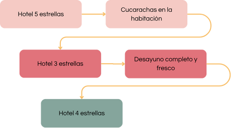
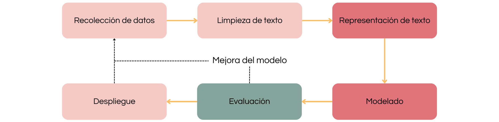
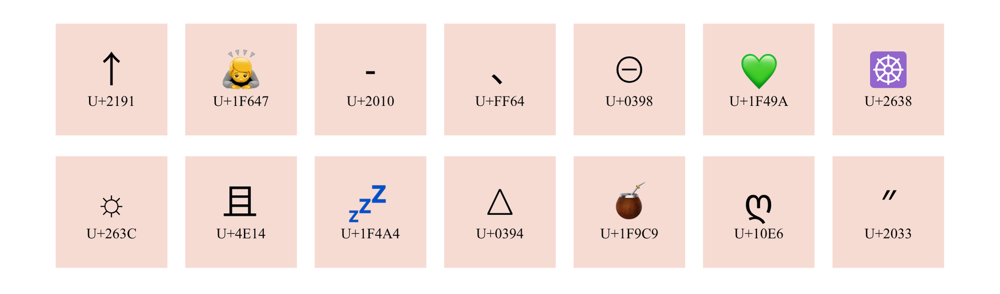

```{r results='hide', message=FALSE, echo=FALSE, warning=FALSE}
set.seed(1406)
library(showtext)
showtext_auto()
font_add_google(name="Noto Serif", family = "libre")
```

```{=tex}
\thispagestyle{empty}
\begin{center}
    \vspace*{0.5cm}
    \huge\textbf{Análisis de comentarios en redes sociales con latent Dirichlet allocation}
    
    \vspace{4cm}
    \includegraphics[width=0.3\textwidth]{logo_unr.png}
  
    \vspace{0cm}
    \large{Facultad de Ciencias Económicas y Estadística}
    
    \vspace{0cm}
    \large{Alumna: Alfonsina Badin}
    
    \vspace{0cm}
    \large{Director: Ignacio Evangelista}
    
    \vspace{0.5cm}
    \large{2025}
    
\end{center}
```

\clearpage
\pagenumbering{arabic}
\setcounter{page}{1}

\renewcommand{\contentsname}{Índice}

\setcounter{tocdepth}{4}
\tableofcontents

\clearpage

\newpage

# Agradecimientos

\newpage

# Resumen

\newpage

# Introducción {#sec-introduccion}

A lo largo de los años, las redes sociales se han convertido en el medio de comunicación más utilizado. Diariamente, los usuarios ingresan a ellas para conversar con otras personas, dar a conocer sus puntos de vista, compartir experiencias, informarse sobre las últimas noticias y entretenerse.

En el año 2020, a raíz de la pandemia mundial por COVID-19, hubo un tipo de contenido que se popularizó con gran velocidad: el *streaming*.  El *streaming* es una combinación de radio y televisión, que se transmite en vivo en una plataforma gratuita (YouTube o Twitch) y luego es publicado *On-Demand* para que el usuario pueda verlo fuera de su horario habitual si así lo desea. Por lo general el formato consta de un panel de conductores que charlan de tópicos comunes para la audiencia, generando debates interesantes con los que los usuarios se pueden llegar a identificar. Dentro de cada canal de *streaming* se transmiten distintos programas que tienen un perfil particular y objetivos diferentes ya que su contenido puede variar en entretenimiento, humor, chimentos, noticias, etc.  

Su popularidad se debe a que es un contenido gratuito, cercano y que genera una **comunidad** entre los conductores y sus oyentes, quienes no sólo interactúan en vivo a través de un *chat* sino que dejan sus comentarios en otras redes sociales: Instagram, TikTok, YouTube, entre otros.

Al publicar los programas *On-Demand*, los canales de *streaming* acceden a un recurso valioso que refleja la opinión de sus oyentes: los comentarios de YouTube. El análisis de estos textos puede resultar en conclusiones interesantes para los canales ya que permite un entendimiento de los sentimientos que tiene su comunidad con respecto a cada contenido.

Para llevar a cabo este análisis, el presente informe utiliza **latent Dirichlet allocation (LDA)**, una técnica de aprendizaje automático no supervisado que clasifica automáticamente los textos en diferentes categorías o temas según las características del corpus. Esta metodología permite detectar patrones temáticos recurrentes en grandes volúmenes de datos textuales, como los comentarios de YouTube, y extraer información valiosa.

LDA se basa en un modelo probabilístico generativo y es especialmente útil para modelar datos discretos como textos. Es un modelo bayesiano jerárquico de tres niveles, en el cual cada documento (en este caso, cada comentario) se representa como una mezcla de temas, y cada tema se define como una mezcla de palabras. En este sentido, LDA no solo agrupa comentarios en función de temas compartidos, sino que también asigna probabilidades a cada palabra dentro de cada tema, proporcionando una representación explícita y estructurada del contenido del corpus.

Esta capacidad de modelar documentos como combinaciones de múltiples temas lo hace particularmente adecuado para analizar la diversidad temática de los comentarios de YouTube. Por ejemplo, un comentario podría estar relacionado en un 60% con el tema "entretenimiento" y en un 40% con el tema "noticias", lo que permite identificar la interacción entre los intereses de los usuarios.

Esta tesina tiene por objeto de estudio la técnica latent Dirichlet allocation. Se brinda una introducción al tema, abarcando las definiciones básicas, sus componentes, sus variantes, sus ventajas y limitaciones y sus campos de aplicación. Se incluyen también los conceptos teóricos necesarios para comprender la metodología. Adicionalmente, se presenta la aplicación del modelo en comentarios de redes sociales.

\newpage

# Objetivos

## Objetivo general

El objetivo general del presente proyecto es profundizar en el estudio y aplicación del modelo latent Dirichlet allocation (LDA) para la identificación de tópicos o categorías.

## Objetivos específicos

- Comprender las bases del procesamiento de lenguaje natural (NLP por sus siglas en inglés) y las técnicas de representación computacional de texto.
- Mencionar los desafíos y limitaciones que conlleva el ajuste de LDA y propuestas que han surgido para contrarrestar dichos inconvenientes.
- Aplicar LDA en un conjunto comentarios en español (argentino) en la red social YouTube para comprender las opiniones de los oyentes.

\newpage

# Metodología

## Estadística Bayesiana

La estadística bayesiana es un enfoque de la estadística que, haciendo uso del teorema de Bayes, actualiza la probabilidad de una hipótesis a medida que se dispone de más datos haciendo una combinación entre observaciones y creencias previas. A diferencia de la estadística frecuentista, que interpreta las probabilidades como frecuencias relativas de eventos en un gran número de ensayos, la estadística bayesiana trata las probabilidades como grados de creencia o confianza.

__Teorema de Bayes:__ Sea $\theta$ una hipótesis o conjetura que se tiene sobre el fenómeno en estudio y $E$ evidencia o nueva información al respecto, se puede actualizar el grado de incertidumbre (o creencia) de esa hipotesis teniendo en cuenta la nueva evidencia como

$$
p(\theta|E)=\frac{p(E|\theta)p(\theta)}{p(E)}
$$

La **probabilidad a priori** es la creencia inicial sobre la hipótesis, se realiza antes de observar los datos para luego actualizarla mediante la probabilidad condicional (regla de Bayes), obteniendo así la **probabilidad posterior**. Esta probabilidad posterior se convierte en la nueva creencia actualizada después de considerar la evidencia proporcionada por los datos.

En el enfoque bayesiano entonces, cada conjunto de nuevos datos permite actualizar la probabilidad posterior, lo que lo hace especialmente útil en contextos donde se obtiene información de manera continua. Por ejemplo, la puntuación de un hotel se puede actualizar con cada opinión obtenida mediante un modelo bayesiano (Figura \@ref(fig:bayes1)).

```{r bayes1, fig.cap="Ejemplo de modelo bayesiano", out.width="100%", fig.align='center',echo=FALSE, warning=FALSE, message=FALSE}

```

Un modelo estadístico en este contexto, integra información previa y actual y se pueden definir los modelos hacia atrás (inferencia) o los modelos hacia adelante (generativos) para el análisis de un fenómeno.

### Modelos hacia atrás: inferencia bayesiana

Los modelos hacia atrás se enfocan en deducir información sobre parámetros desconocidos a partir de datos observados. Este tipo de modelo es útil cuando el interés principal está en obtener conclusiones sobre aspectos no observables de una población. En este caso, la probabilidad posterior es la clave, ya que refleja el grado de creencia actualizado en los parámetros dados los datos.

Continuando con el ejemplo del hotel, siendo $X$ la cantidad de veces en las que una persona puntúa a un hotel con un calificación de $i$ y $p_i$ la probabilidad de hacerlo, se tiene que $X\sim Multinomial^{(1)}(p_1,p_2,p_3,p_4,p_5)$. Estas probabilidades pueden ser modeladas utilizando la distribución $Dirichlet$ ya que permite capturar la incertidumbre sobre las probabilidades de cada categoría: modelo $Dirichlet-Multinomial$.

Suponiendo inicialmente que no se tiene preferencias sobre la cantidad de estrellas, se utiliza un prior $Dirichlet$ uniforme:

$$
{p}=(p_1,p_2,p_3,p_4,p_5)\sim Dirichlet(\alpha_1,\alpha_2,\alpha_3,\alpha_4,\alpha_5)
$$

donde $\alpha_i=1 \space{}\space{}\space{} \forall i=1,2,3,4,5$. Luego, para cada hotel, se puede calcular la distribución posterior del vector de parámetros $p$ utilizando la fórmula de la distribución $Dirichlet$ posterior e información existente del puntaje de los hoteles.

$$
Dirichlet_{Hotel1} \sim (1215,418,68,9,8)
$$

$$
Dirichlet_{Hotel2} \sim (856,819,260,89,57)
$$

Con estas distribuciones se realizan 1000 simulaciones de $\bold p$ que darán cuenta de la distribución posterior de estas probabilidades. En la Figura \@ref(fig:atras1) se puede observar la densidad de cada elemento de $\bold p$ con cada posterior.

```{r atras1, fig.cap="Densidad de los puntajes para cada hotel", fig.align='center',echo=FALSE, warning=FALSE, message=FALSE, fig.width=5, fig.height=4, out.width="70%"}
# Librerías
library(ggplot2)
library(gtools)

# Prior Dirichlet uniforme
alpha_prior <- c(1, 1, 1, 1, 1)

# Observaciones
observaciones_holiday_inn <- c(1214, 417, 67, 8, 7)
observaciones_savoy <- c(855, 818, 259, 88, 56)

# Posterior Dirichlet
posterior_holiday_inn <- alpha_prior + observaciones_holiday_inn
posterior_savoy <- alpha_prior + observaciones_savoy

# Simulaciones
sim_holiday_inn <- rdirichlet(1000, posterior_holiday_inn)
sim_savoy <- rdirichlet(1000, posterior_savoy)

# Data frame
df_holiday_inn <- data.frame(Proporcion = c(sim_holiday_inn[, 1], sim_holiday_inn[, 2], sim_holiday_inn[, 3], sim_holiday_inn[, 4], sim_holiday_inn[, 5]), 
                             Estrellas = factor(rep(c("Excelente", "Muy bueno", "Regular", "Malo", "Horrible"), each = 1000), 
                                                levels = c("Excelente", "Muy bueno", "Regular", "Malo", "Horrible"), ordered = TRUE), 
                             Hotel = "Hotel 1")

df_savoy <- data.frame(Proporcion = c(sim_savoy[, 1], sim_savoy[, 2], sim_savoy[, 3], sim_savoy[, 4], sim_savoy[, 5]), 
                       Estrellas = factor(rep(c("Excelente", "Muy bueno", "Regular", "Malo", "Horrible"), each = 1000), 
                                          levels = c("Excelente", "Muy bueno", "Regular", "Malo", "Horrible"), ordered = TRUE), 
                       Hotel = "Hotel 2")

df <- rbind(df_holiday_inn, df_savoy)

# Grafico
ggplot(df, aes(x = Proporcion, colour = Hotel, fill = Hotel)) +
  geom_density(alpha = 0.7) +
  labs(x = "p", y = "Credibilidad") +
  facet_wrap(~ Estrellas, scale = "free", nrow=5) +
  scale_fill_manual(values = c("#84A59D","#F5CAC3")) +
  scale_color_manual(values = c("#84A59D","#F5CAC3")) +
  scale_x_continuous(limits=c(0,1)) +
  theme_grey()
```

Ambos hoteles tienen baja probabilidad de tener calificaciones malas (y con mucha credibilidad), y en la calificación más alta se observa que el Hotel 1 es superadora ¿Qué sucedería si por una falla en la cocina se agregan 100 puntajes de ‘Horrible’ para este hotel? Su distribución quedaría $Dirichlet_{Hotel1} \sim (1215,418,68,9,108)$ y su nuevo posterior se modifica notoriamente, tal como se observa en la Figura \@ref(fig:atras2).

```{r atras2, fig.cap="Densidad de los puntajes para cada hotel con los nuevos puntajes del Hotel 1", fig.align='center',echo=FALSE, warning=FALSE, message=FALSE, fig.width=5, fig.height=4, out.width="70%"}
observaciones_holiday_inn_n <- c(0, 0, 0, 0, 100)
posterior_holiday_inn_n <- posterior_holiday_inn + observaciones_holiday_inn_n
sim_holiday_inn <- rdirichlet(1000, posterior_holiday_inn_n)
df_holiday_inn_n <- data.frame(Proporcion = c(sim_holiday_inn[, 1], sim_holiday_inn[, 2], sim_holiday_inn[, 3], sim_holiday_inn[, 4], sim_holiday_inn[, 5]), 
                             Estrellas = factor(rep(c("Excelente", "Muy bueno", "Regular", "Malo", "Horrible"), each = 1000), 
                                                levels = c("Excelente", "Muy bueno", "Regular", "Malo", "Horrible"), ordered = TRUE), 
                             Hotel = "Hotel 1")
df <- rbind(df_holiday_inn_n, df_savoy)

# Grafico
ggplot(df, aes(x = Proporcion, colour = Hotel, fill = Hotel)) +
  geom_density(alpha = 0.7) +
  labs(x = "p", y = "Credibilidad") +
  facet_wrap(~ Estrellas, scale = "free", nrow=5) +
  scale_fill_manual(values = c("#84A59D","#F5CAC3")) +
  scale_color_manual(values = c("#84A59D","#F5CAC3")) +
  scale_x_continuous(limits=c(0,1)) +
  theme_grey()
```

La inferencia bayesiana intenta asignar una cierta credibilidad a cada resultado posibile y actualizarla a medida que se recolecta información.

### Modelos hacia adelante: modelo generativo

Los modelos hacia adelante parten de suposiciones sobre los parámetros o las distribuciones que generan los datos y buscan modelar cómo estos datos podrían haberse producido. Este enfoque es útil para simular datos y predecir resultados futuros basados en los modelos probabilísticos definidos. En la estadística bayesiana, este proceso incluye tanto la generación de datos simulados como la comparación con datos observados para refinar modelos y creencias.

Continuando con el ejemplo anterior con una perspectiva generativa, se podría buscar el puntaje promedio que le espera al Hotel 1 utilizando la última distribución posterior. Para ello se realizan 1000 simulaciones de $\bold p$ usando la distribución $Dirichlet_{Hotel 1} \sim (1215,418,68,9,108)$, así se obtiene un conjunto de 1000 vectores que le asignan diferentes probabilidades a los puntajes.

```{r adelante1, fig.cap="Frecuencia esperada para cada clasificación", fig.align='center',echo=FALSE, warning=FALSE, message=FALSE, fig.width=5, fig.height=4, out.width="70%"}
# Simulación con posterior
n_simulaciones <- 1000
simulaciones_nuevas <- rdirichlet(n_simulaciones, posterior_holiday_inn_n)

# Nuevos puntajes para el hotel
puntajes <- numeric()
for (i in 1:1000) {
  puntajes[i] <- sum(rmultinom(1,1,simulaciones_nuevas[i,])*(1:5))
}

# Data frame de puntaje promedio
df_puntajes <- data.frame(
  puntaje = factor(puntajes, levels = 1:5, 
                   labels = c("Horrible", "Malo", "Regular", "Muy bueno", "Excelente"))
)

# Grafico
ggplot(df_puntajes, aes(x = puntaje)) +
  geom_bar(binwidth = 0.1, fill = "#F28482", color = "#F28482") +
  labs(x = "Calificación", y = "Frecuencia") +
  theme_grey()
```

Con este conocimiento sobre el comportamiento de la clasificación del Hotel 1, se podría esperar con gran credibilidad que el hotel obtenga a futuro una calificación “Horrible” o “Malo”. Sin dudas las últimas 100 calificaciones malas tuvieron gran impacto en la reputación del hotel. 

Este modelo usa la probabilidad a priori para simular cómo los datos podrían verse antes de tener datos reales. Es útil para prever el comportamiento de los datos bajo ciertas suposiciones.

### El modelo jerárquico

Un modelo jerárquico es una expresión que relaciona un conjunto de parámetros a través de la credibilidad de sus estimaciones, de forma que la estimación de un parámetro depende de la estimación de otro(s) parámetro(s).

Por ejemplo, al estudiar la probabilidad de recuperación de una operación cardíaca con un conjunto de datos que recopila información de pacientes en distintos hospitales, diferentes ciudades y que han sido operados por diversos equipos, se debería hacer uso de un modelo jerárquico. Cada equipo quirúrgico tiene un cierto número de recuperaciones dentro de una cantidad de cirugías, entonces la probabilidad de recuperación de cada uno $\theta_e$ depende de un parámetro $\omega_h$ que describe la probabilidad típica de recuperación para el hospital, que a su vez depende de un parámetro $\alpha_c$ que describe la probabilidad a nivel ciudad.

Lo que hace que el modelado jerárquico sea tan efectivo es que la estimación de cada parámetro individual se ve influenciada simultáneamente por los datos de todos los demás individuos. Esto ocurre porque todos los individuos informan a los parámetros de nivel superior, los cuales a su vez limitan todos los parámetros individuales. Estas dependencias estructurales entre parámetros proporcionan estimaciones más informadas de todos los parámetros.

Los parámetros que están en distintos niveles de la jerarquía coexisten en un espacio paramétrico conjunto, independientemente del nivel al que pertenezcan, y es donde interviene la regla de Bayes. 

Formalmente, sean $\theta$ y $\omega$ dos parámetros, la regla de Bayes aplicada al espacio conjunto implica:

$$p(\theta,\omega|D) = \frac{p(D|\theta,\omega)p(\theta,\omega)}{p(D)}$$
$$p(\theta,\omega|D) \propto p(D|\theta,\omega)p(\theta,\omega)$$

Lo que resulta particular de los modelos jerárquicos es que los términos del lado derecho pueden factorizarse siguiendo una cadena estructurada de dependencias. En el caso más simple:

$$p(\theta,\omega|D)\propto p(D|\theta)\space p(\theta|\omega)\space p(\omega)$$

Esta refactorización refuerza que los datos dependen únicamente del parámetro $\theta$ y que este depende del parámetro de nivel superior $\omega$, mientras que $\omega$ es independiente del resto de los parámetros.

### Markov Chain Monte Carlo

El objetivo principal de la inferencia bayesiana es obtener una representación acertada de la distribución posterior. Una de las maneras de hacerlo es tomar una gran muestra de puntos representativos del _posterior_, pero, por lo general, no es posible acceder de una forma explícita. Entonces se utilizan métodos de _Markov Chain Monte Carlo_ (MCMC) para aproximar dicha distribución mediante el uso de cadenas de Markov.

Una cadena de Markov es un proceso estocástico que describe una secuencia de estados donde la probabilidad de pasar al estado siguiente depende únicamente del estado actual y no del historial previo; esta propiedad se conoce como memoria corta. En el contexto de los algoritmos MCMC, las cadenas de Markov se utilizan para generar muestras dependientes que, tras un período de convergencia, representan fielmente la distribución posterior que se desea aproximar.

Uno de los algoritmos fundamentales de MCMC es el algoritmo de Metrópolis. Su idea central es que, aún sin conocer la forma exacta de la distibución objetivo, se puede construir una cadena de Markov que "visite" distintas regiones del espacio paramétrico con una frecuencia proporcional a la probabilidad posterior.

Imaginando una avenida con muchos hoteles, cada uno con una calificación promedio (de 1 a 5 estrellas) dada por los huéspedes. Un viajero desea pasar una cantidad de noches en hoteles proporcionales a cuán bien valorados están, pero no conoce de antemano qué calificación tiene cada hotel ni cuántos hoteles hay en total.

Entonces, el viajero procede a:

1. Elegir al azar un hotel vecino que quiera visitar.

2. Si la calificación del hotel propuesto es mayor a la del hotel actual, acepta el cambio y se muda.

3. Si la calificación del hotel propuesto es menor, decide mudarse si el cociente entre ambas calificaciones es mayor que un número aleatorio entre 0 y 1. De esta manera, existe la posibildiad de mudarse a hoteles peores, aunque sea una noche, sin perder de vista el objetivo inicial.

4. Si no se muda, permanece en el hotel actual y vuelve a proponer un nuevo movimiento al día siguiente.

Después de suficientes noches, el viajero terminará pasando más tiempo en los hoteles con mejores calificaciones, aunque nunca haya conocido el mapa completo de hoteles ni sus valores globales.

El algoritmo de Metropolis funciona de manera análoga:

- la calle con hoteles representa el espacio paramétrico,

- la calificación de cada hotel es el valor de la densidad posterior en ese punto,

- el movimiento probabilístico entre hoteles replica el criterio de aceptación del algoritmo.

Así, incluso sin conocer la forma completa de la distribución posterior, el algoritmo garantiza que puntos con mayor probabilidad posterior serán visitados con mayor frecuencia, permitiendo aproximar la distribución a posteriori mediante las muestras generadas.

#### Muestreo de Gibbs {-}

Aunque el algoritmo de Metropolis resulta intuitivo y conceptualmente simple, su aplicación directa a modelos con muchos parámetros presenta limitaciones importantes. En espacios paramétricos de alta dimensión, proponer un nuevo valor para todo el vector de parámetros a la vez suele conducir a propuestas muy alejadas del estado actual, lo que provoca tasas de aceptación extremadamente bajas. Alternativamente, propuestas demasiado pequeñas generan cadenas que avanzan muy lentamente. En ambos casos, la eficiencia del muestreo disminuye drásticamente y la cadena puede tardar mucho tiempo en explorar adecuadamente la distribución posterior.

Una estrategia natural para mitigar estos problemas consiste en actualizar un parámetro a la vez, manteniendo los demás fijos. Esta idea convierte una propuesta multidimensional en una secuencia de propuestas unidimensionales mucho más manejables. Si, además, el modelo es jerárquico y utiliza distribuciones conjugadas, es posible obtener las distribuciones condicionales completas de cada parámetro: distribuciones exactas que describen cómo debería comportarse un parámetro dado el valor actual de todos los demás.

El algoritmo _Gibbs Sampling_ surge como una alternativa eficiente al algoritmo de Metropolis en modelos con múltiples parámetros y estructura jerárquica. En lugar de generar propuestas arbitrarias y luego decidir si aceptarlas, Gibbs actualiza cada parámetro muestreándolo directamente de su distribución condicional completa, es decir, la distribución del parámetro dado el valor actual de todos los demás. Debido a que estas condicionales provienen de la propia estructura del modelo, cada actualización es automáticamente coherente con la distribución objetivo y, por lo tanto, la probabilidad de aceptación es siempre uno. En este sentido, Gibbs puede verse como un caso particular del algoritmo de Metropolis en el que las propuestas nunca se rechazan.

En téminos formales, si el vector de parámetros es $\theta=(\theta_1,...,\theta_p)$, el algoritmo consiste en actualizar secuencialmente cada componente muestreando las distribuciones:

$$\theta_1^{t+1}\sim p(\theta_1|\theta_2^{(t)}, \theta_3^{(t)},...,D),$$
$$\theta_2^{t+1}\sim p(\theta_2|\theta_1^{(t)}, \theta_3^{(t)},...,D)$$

Tras suficientes iteraciones, esta secuencia de actualizaciones genera una cadena de Markov cuya distribución estacionaria coincide con la distribución posterior conjunta, permitiendo aproximarla mediante las muestras de la cadena.

## Machine learning

El Aprendizaje Automático (_machine learning_, ML) es una rama de la inteligencia artificial que permite a las computadoras aprender patrones y tomar decisiones a partir de datos, sin ser programadas explícitamente para cada tarea. Es especialmente útil en problemas complejos, donde hay muchas reglas por seguir y/o entornos inconsistentes ya que los modelos de ML se adaptan fácilmente a nuevos datos.

Un ejemplo utilizado en lo cotidiano es el filtro de _spam_ de la casilla de correo electrónico. Con algunos ejemplos de correos _spam_ y correos legítimos o _ham_ (datos de entrenamiento), el código detrás del filtro logra aprender la naturaleza de cada uno de estos elementos, logrando así clasificar nuevos casos. Los modelos de ML se evalúan con métricas de _performance_ que se miden con datos de prueba.

Los sitemas de _machine learning_ se pueden clasificar en función de la cantidad de supervisión que reciben en el entrenamiento. 

### Aprendizaje supervisado

En el aprendizaje supervisado, los datos de entrenamiento que se usan como entrada al algoritmo incluyen los resultados deseados ( _labels_ ). Por ejemplo, si el filtro de _spam_ recibe correos con la etiqueta _spam_ y _ham_ en el entrenamiento, se está hablando de un aprendizaje supervisado.

Entre las técnicas más importantes del aprendizaje supervisado se encuentran _k-nearest neighbors_ (KNN), regresión lineal, regresión logística, _support vector machine_ (SVM), árboles de decisión, _random forest_, redes neuronales, etc.

### Aprendizaje no supervisado

En el aprendizaje no supervisado, los datos de entrenamiento no cuentan con etiquetas, se dice que el sistema intenta aprender sin profesor. Por ejemplo, si se quisiera agrupar a clientes de un negocio según su consumo, el algoritmo detecta las similitudes y diferencias entre ellos y define un agrupamiento que será evaluado con las métricas de _performance_ y ajustado según su resultado.

\newpage

## Procesamiento de Lenguaje Natural (NLP)

El texto, tal como lo leemos y comprendemos los humanos, es rico en significado pero carece de una estructura numérica, que es la base del procesamiento en los algoritmos de aprendizaje automático. El procesamiento de lenguaje natural es un área de investigación dentro de la informática y la inteligencia artificial (IA) que se ocupa de procesar el lenguaje humano. Este procesamiento generalmente implica traducir el lenguaje natural en datos (números) que una computadora puede usar para aprender sobre el mundo.

El proceso abarca tareas como la recolección, limpieza, normalización y tokenización de texto, estas últimas dos son las responsables de que la información textual pueda ser estructurada de manera que los modelos la interpreten y analicen eficazmente. En la Figura \@ref(fig:diagrama1)  [@vajjala2020] se pueden observar los pasos que comprende el proceso.

```{r diagrama1, fig.cap="Etapas del NLP", out.width="100%", fig.align='center',echo=FALSE, warning=FALSE, message=FALSE}

```

Aunque no sea evidente, el procesamiento de lenguaje natural (NLP) aparece en el día a día de las personas. Tiene una amplia variedad de aplicaciones prácticas, lo que lo convierte en una herramienta esencial en diversos campos, por ejemplo:

- mejoras en motores de búsqueda web,
- corrección ortográfica durante la búsqueda,
- revisión gramatical y ortográfica,
- desarrollo de chatbots y asistentes virtuales,
- generación de índices y tablas de contenido,
- filtrado de spam en correo electrónico,
- personalización en campañas de marketing.

Este amplio rango de usos subraya su importancia como puente entre los lenguajes humanos y las capacidades computacionales.

### Recolección de datos

El primer paso esencial en cualquier proyecto de procesamiento de lenguaje natural es la recolección de datos. Esta etapa determina la calidad y relevancia de los resultados que se obtendrán al aplicar técnicas avanzadas como latent Dirichlet allocation (LDA). Existen diferentes enfoques para recopilar datos en NLP, dependiendo de los objetivos del análisis y la disponibilidad de recursos. A continuación, se describen las principales estrategias de recolección de datos:

#### Uso de conjuntos de datos públicos {-}

Una opción inicial es buscar conjuntos de datos públicos que sean relevantes para la tarea específica. Si el conjunto de datos es adecuado, se puede proceder directamente a construir y evaluar un modelo. Sin embargo, cuando no se encuentra un dataset que cumpla los requisitos, se debe considerar generar datos personalizados.

#### Obtención de datos de internet {-}

Otra estrategia consiste en identificar fuentes relevantes de datos en internet, como foros de consumidores o plataformas de discusión donde se publiquen consultas. Estos datos pueden ser extraídos automáticamente a través de técnicas de *web scraping* y, posteriormente, etiquetados manualmente por anotadores humanos.

#### Combinación de fuentes de datos {-}

En la práctica, los conjuntos de datos suelen provenir de fuentes heterogéneas, como *datasets* públicos, datos etiquetados manualmente y datos de internet, al mismo tiempo. Esta combinación es especialmente útil para construir modelos en etapas iniciales, cuando los datos específicos para un escenario particular son limitados.

En esta tesina se optó por hacer uso de una *API* de Google para obtener los datos de entrada para el análisis, este proceso será detallado en la sección \@ref(sec:aplicacionpractica).

Esta etapa es crucial para garantizar la disponibilidad de datos limpios y útiles, que son la base para las siguientes etapas de procesamiento y modelado. Una vez que se cuenta con los datos recolectados, se procede al siguiente paso: la limpieza y el preprocesamiento de texto.

### Limpieza de texto

La extracción y limpieza de texto se refiere al proceso de extraer de los datos de entrada el texto sin procesar, eliminando toda la información no textual, como marcas, metadatos, etc., y convirtiéndolo al formato de codificación requerido. La extracción de texto es un paso estándar en el manejo de datos y, usualmente, no emplea técnicas específicas de NLP. Sin embargo, es un paso importante que tiene implicaciones para todos los demás aspectos. Además, también puede ser la parte más demandante en términos de tiempo dentro de un proyecto.

#### Pasos preliminares {-}

Previo a la limpieza del texto, es necesario llevar a cabo una serie de transformaciones básicas que garanticen la homogeneidad del corpus. En primer lugar, se convierte todo el texto a minúsculas con el fin de evitar que palabras idénticas sean tratadas como distintas debido a diferencias en el uso de mayúsculas, por ejemplo, “Video” y “video”. Otro paso fundamental consiste en la eliminación de signos de puntuación, caracteres especiales y espacios innecesarios, que no aportan información semántica al análisis y pueden generar una dispersión artificial en el vocabulario. En esta etapa también se contempla la reducción de espacios múltiples a un único espacio, asegurando así una identificación más precisa de las palabras.

Finalmente, se corrigen patrones de escritura característicos de entornos informales, como la repetición exagerada de letras para enfatizar una emoción (por ejemplo, “amoo” en lugar de “amo” o “encantaa” en lugar de “encanta”). Este tipo de modificaciones, frecuentes en comentarios de redes sociales, pueden aumentar la longitud del vocabulario y dificultar la identificación de términos representativos. La normalización de estas formas al estándar correspondiente resulta clave para mejorar la coherencia interna del corpus y facilitar los pasos posteriores de análisis.

#### Tokenización {-}

La tokenización es un paso fundamental en el procesamiento del lenguaje natural que tiene como objetivo transformar el texto libre en una secuencia de unidades discretas que puedan ser procesadas computacionalmente. Consiste en segmentar el texto en unidades mínimas llamadas tokens, cuya definición depende de la granularidad aplicada en el proceso:

- A nivel de palabra: cada token corresponde a una palabra. Ejemplo: “Muy bueno el video” → [“Muy”, “bueno”, “el”, “video”].
- A nivel de sub-palabra: cada token es un fragmento de una palabra. Ejemplo: “jugando” → [“jug”, “ando”].
- A nivel de carácter: cada token es un único carácter (letra, signo de puntuación, número, etc.). Ejemplo: “sol” → [“s”, “o”, “l”].
- A nivel de oración: cada token corresponde a una oración completa. Ejemplo: “Hoy llueve. Mañana saldrá el sol.” → [“Hoy llueve.”, “Mañana saldrá el sol.”].

#### Normalización de Unicode {-}

Al limpiar texto, especialmente que se ha obtenido a través de Web Scrapping, es posible que se encuentren varios caracteres Unicode, incluidos símbolos, emojis y otros caracteres gráficos, algunos ejemplos se muestran en la Figura \@ref(fig:diagrama2) [@vajjala2020].

```{r diagrama2, fig.cap="Caracteres Unicode y su representación gráfica", out.width="100%", fig.align='center',echo=FALSE, warning=FALSE, message=FALSE}

```

Para interpretar estos símbolos no textuales y caracteres especiales se utiliza la normalización de Unicode, que convierte el texto en alguna forma de representación binaria para ser almacenado en una computadora. Existen varios esquemas de codificación, y la codificación predeterminada puede variar según el sistema operativo. 

El siguiente fragmento de código en R ejemplifica la limpieza de emojis en texto. Utilizando expresiones regulares, se eliminan todos los caracteres que no pertenezcan al alfabeto en minúsculas.

```{r warning=FALSE, message=FALSE, size='small'}
comentarios <- c(
  "Me encantó este video 😍🔥", "Lo volvería a ver!!! 💯✔️",
  "Qué aburrido 😴😴 no me gustó", "Muy bueno!!! 👍👏👏"
)
comentarios_limpios <- gsub("[^a-záéíóúñ ]", " ", tolower(comentarios))
comentarios_limpios <- stringr::str_squish(comentarios_limpios)
comentarios_limpios
```

La salida es un conjunto de comentarios donde los emojis y otros símbolos fueron eliminados, manteniendo únicamente el texto en minúsculas y sin caracteres no deseados.

#### Eliminación de stopwords {-}

Las *stopwords* son palabras funcionales que, si bien cumplen un rol gramatical importante (como preposiciones, artículos, pronombres...), no aportan contenido semántico relevante al análisis del significado global del texto.

El objetivo de esta etapa es reducir el ruido lingüístico y centrar el análisis en las palabras que efectivamente comunican información. Por ejemplo, en frases como `"gracias por el dato"` o `"esto es una joya"`, las palabras `por`, `el`, `es`, `una` son típicamente consideradas *stopwords*, mientras que `gracias`, `dato`, `joya` son términos de interés.

Para llevar a cabo esta tarea se utilizará el paquete `tm` (*Text mining*) que cuenta con un listado de *stopwords* (Tabla \@ref(tab:stopwords)) y funciones como `removeWords` que permite eliminarlas de un texto dado.

```{r stopwords, echo=FALSE, warning=FALSE, message=FALSE}
library(tm)
library(kableExtra)
library(dplyr)

palabras <- stopwords("es")
ncol <- 10
nrow <- 2
palabras <- palabras[1:(nrow * ncol)]
mat <- matrix(palabras, nrow = nrow, byrow = TRUE)
df <- as.data.frame(mat, stringsAsFactors = FALSE)
kable(df, format = "latex", booktabs = TRUE,
      caption = "Algunas stopwords del paquete",
      col.names = NULL) %>%
  kable_styling(latex_options = c("HOLD_position", "scale_down", "striped"))
```

```{r warning=FALSE, message=FALSE}
library(tm)
prueba <- c(
  "gracias por el dato",
  "esto es una joya"
)
removeWords(prueba,stopwords("es"))
```

#### Corrección ortográfica {-}

La corrección de errores en la escritura es un aspecto fundamental del procesamiento del lenguaje natural ya que los textos pueden contener diferentes tipos de fallos que afectan su comprensión y coherencia. Los errores en la redacción pueden clasificarse en tres categorías principales *(Moyotl-Hernández, 2016)*:

- Errores ortográficos: ocurren cuando una palabra escrita no existe dentro del idioma.
- Errores gramaticales: Se presentan cuando las palabras utilizadas existen en el idioma, pero no son correctas en el contexto de la oración.
- Errores de estilo: se refieren a palabras redundantes, ambiguas o repetidas que afectan la claridad del texto.

En este sentido, un corrector ortográfico tiene como objetivo identificar palabras mal escritas dentro de un texto y sugerir la opción más adecuada a partir de un conjunto de términos válidos en el idioma. 

#### Corrección ortográfica empleando distancia de Levenshtein-Damerau {-}

La distancia de Levenshtein o distancia de edición es una medida utilizada para calcular la similitud entre palabras, se trata de un conteo de operaciones requeridas para convertir una cadena de caracteres (una palabra) en otra. Las operaciones de edición son:

- Intersección de un caracter: hogr $\rightarrow$ hogar (agregar ‘a’ entre la ‘h’ y la ‘g’).
- Eliminación de un caracter: arggentina $\rightarrow$ argentina (eliminar la ‘g’).
- Sustitución de un caracter por otro: numero $\rightarrow$ número (reemplazar la ‘u’ por la ‘ú’).

Hay una generalización de esta medida que considera el intercambio de dos caracteres como una operación: la distancia de Levenshtein-Damerau. En este método, aparece:

- Transposición de caracteres: paelta $\rightarrow$ paleta (intercambia el lugar de la ‘e’ y la ‘l’).

El método de corrección basado en la distancia de Levenshtein-Damerau se fundamenta en la búsqueda de la palabra más similar dentro de un diccionario para corregir una palabra mal escrita. Este procedimiento implica generar todas las posibles transformaciones de la palabra errónea mediante las operaciones de edición. Luego, cada una de estas transformaciones se compara con las palabras existentes en el diccionario, y aquellas que coincidan se agregan a una lista de sugerencias. Finalmente, la mejor corrección será aquella con la menor distancia a la palabra original.  

En la Tabla \@ref(tab:tablaburri) se muestran todas las palabras generadas a partir de la palabra errónea `burri` con una sola operación de edición. 

```{r tablaburri, echo=FALSE, warning=FALSE, message=FALSE, }
library(knitr)

tabla_op <- data.frame(
  Operación = c("Eliminación", "Inserción", "Sustitución", "Transposición"),
  `Palabras generadas` = c(
    "urri, brri, buri, bur",
    "aburri, bburri, cburri, ..., zburri, burris, burria, ..., burriz",
    "aurri, burrs, murri, ..., burro, burrq, ..., burrz",
    "ubrri, bruri, burir"
  )
)

kable(tabla_op, format = "latex", booktabs = TRUE,
      caption = "Posibles transformaciones de la palabra burri con distancia de edición uno",
      col.names = c("Operación", "Palabras generadas")) %>%
  kable_styling(latex_options = c("HOLD_position", "striped"))
```

El desafío radica en seleccionar la cantidad de operaciones admitidas para la corrección y cuál de estas opciones es la más apropiada. En el siguiente código se define un diccionario ficticio para este caso y se calcula la distancia L-D haciendo uso del paquete `stringdist` para cada palabra del mismo. En la Tabla \@ref(tab:tablaburri1) se observan los resultados.

```{r warning=FALSE, message=FALSE, results='hide'}
# Paquetes
library(stringdist)
library(dplyr)
# 1. Token a corregir
token <- "burri"
# 2. Diccionario ficticio 
diccionario <- c("burro", "burrito", "barri", "burla", 
                 "perro", "aburris", "aburro", "caballo")
# 3. Calculamos distancia DL
resultados <- tibble::tibble(
  candidato = diccionario,
  distancia = stringdist(token, diccionario, method = "dl")
) %>%
  arrange(distancia, candidato)
```

```{r tablaburri1, echo=FALSE, warning=FALSE, message=FALSE}
n <- nrow(resultados)
half <- ceiling(n/2)

resultados <- tibble::tibble(
  candidato1 = resultados$candidato[1:half],
  distancia1 = resultados$distancia[1:half],
  candidato2 = resultados$candidato[(half+1):n],
  distancia2 = resultados$distancia[(half+1):n]
)

kable(resultados, format = "latex", booktabs = TRUE,
      caption = paste0("Posibles correcciones para la palabra '", token, "'"),
      col.names = c("Candidato", "Distancia", "Candidato", "Distancia")) %>%
  kable_styling(latex_options = c("HOLD_position", "striped", "scale_down"))
```

Si bien es fácil identificar que `perro` o `caballo` no son buenas correcciones, observando el resultado de la distancia L-D se llega a la misma conclusión. Para este conjunto de datos y el ejemplo en particular, hay correcciones mejores en función de este cálculo.

En síntesis, el uso de la distancia de Levenshtein-Damerau constituye una herramienta potente para la corrección ortográfica, ya que permite identificar palabras candidatas a partir de criterios formales de similitud.  No obstante, los desafíos principales radican en establecer un umbral de tolerancia adecuado y en gestionar la carga computacional asociada. Una tolerancia demasiado estricta puede dejar sin corregir errores evidentes, mientras que una tolerancia demasiado laxa puede introducir correcciones incorrectas. A su vez, el proceso de comparar un término erróneo contra todas las palabras de un diccionario extenso es computacionalmente intensivo. De igual modo, disponer de un diccionario amplio, representativo y ajustado al dominio del corpus resulta esencial para que las sugerencias tengan sentido lingüístico y contextual. En conjunto, ambos elementos, son determinantes para perfeccionar los procesos de corrección ortográfica y garantizar resultados confiables en etapas posteriores del análisis de texto.

#### Lematización {-}

La lematización es un proceso de normalización léxica en NLP cuyo objetivo es reducir las palabras a su forma canónica o “lema”. Al aplicar lematización:

- Se eliminan variaciones flexivas (tiempo verbal, número, género).
- Se conserva el significado léxico de la palabra.
- Se mejora la coherencia del vocabulario al reducir distintas formas a un único término.

El paquete `UDPipe` implementa modelos de *Universal Dependencies* que permiten realizar tokenización, etiquetado gramatical y lematización de textos en múltiples lenguas.

```{r message=FALSE, warning=FALSE, results='hide'}
library(udpipe)
modelo <- udpipe_download_model(language = "spanish-gsd")
udmodel <- udpipe_load_model(file = modelo$file_model)
texto <- c("Los estudiantes estaban estudiando en la biblioteca.")
anot <- udpipe_annotate(udmodel, x = texto, doc_id = 1)
```

```{r tablalematizacion, echo=FALSE, warning=FALSE, message=FALSE}
anot <- as.data.frame(anot)

udpipe_out <- data.frame(
  Token = anot$token,
  Lema  = anot$lemma,
  UPOS  = anot$upos
)
kable(udpipe_out, format = "latex", booktabs = TRUE,
      caption = "Salida de UDPipe: tokens, lemas y categorías gramaticales") %>%
  kable_styling(latex_options = c("HOLD_position", "striped", "scale_down"))
```

En la Tabla \@ref(tab:tablalematizacion) se observan los resultados de la lematización con una oración simple. El código devuelve palabras separadas, los lemas correspondientes y el tipo de palabra procesada, entre ellas:

- DET: determinante.
- NOUN: sustantivo.
- VERB: verbo.
- ADP: adposición.
- PUNCT: puntuación.

Estos son algunos de los tipos de palabras que el paquete `UDPipe` reconoce. Este etiquetado permite filtrar aquellas categorías con mayor carga semántica (sustantivos, verbos, adjetivos, adverbios y nombres propios) y así disminuir la dimensionalidad de la entrada del modelo.

### Representación de texto

La extracción de características relevantes (*feature extraction*) es un paso clave para el procesamiento de texto, ya que incluso el mejor modelo de *machine learning* devuelve resultados pobres si la información de entrada es inadecuada. En este apartado se desarrollarán algunas técnicas para transformar texto en una representación numérica robusta que pueda alimentar un algoritmo correctamente.

#### Representación vectorial {-}

La representación vectorial de un texto consiste en la transformación de una palabra u oración a un vector de números reales dentro de un espacio vectorial de $n$ dimensiones. Esta transformación se realiza a través de un modelo matemático y el vector resultante sirve para cuantificar las similitudes y diferencias entre dos fragmentos de texto. La manera más común de medir esta comparación es a través de la similitud coseno (o coseno del ángulo entre vectores).

Dados dos vectores, $A$ y $B$, cada uno con $n$ componentes, la similitud coseno se calcula como:

$$
\cos{(\theta)}=\frac{A \cdot B}{|A||B|}
$$

Un resultado de 1 implica similitud total (el ángulo $θ$ es $0º$), y un resultado de -1 implica diferencia total (el ángulo $θ$ es $180º$). Además de la similitud coseno, la distancia euclídea es otra métrica frecuente para medir la proximidad o lejanía entre vectores.

#### One-Hot Encoding {-}

Una de las formas más sencillas y fundamentales de representar texto numéricamente es mediante la codificación _One-Hot_. En este enfoque, cada palabra $V$ del corpus se asocia a un identificador único y se representa como un vector binario de dimensión $|V|$. Este vector está compuesto de todos ceros, excepto en la posición correspondiente a la palabra en el vocabulario, donde se ubica un 1.

Para ilustrar, se considera el siguiente corpus:

- D1: El perro muerde.
- D2: El gato muerde.
- D3: El perro ladra.
- D4: El gato maúlla.

Luego de preprocesar el texto, el vocabulario resultante está compuesto por cinco palabras únicas:

$$"perro","muerde", "gato", "ladra","maúlla"$$

A cada palabra de este se le asigna un índice único y será representada como un vector binario de longitud 5.

$$perro \rightarrow [1,0,0,0,0];...;ladra\rightarrow[0,0,0,1,0];maúlla\rightarrow[0,0,0,0,1]$$

Entonces, la oración D1: “El perro muerde” se representa con _One-Hot encoding_ como la matriz:

$$
\mathbf{}\left[
\begin{array}{ccccc}
1 & 0 & 0 & 0 & 0\\
0 & 1 & 0 & 0 & 0
\end{array}\right]
$$

Si bien es un método simple, presenta dos desventajas principales: la alta dimensionalidad y la falta de información semántica, ya que la distancia coseno entre cualquier par de palabras distintas es 0 ya que las matrices resultan ortogonales.

#### Bag of words {-}

Una de las representaciones más clásicas del texto es el enfoque _bag of words_ (BoW). Este método trata a un documento como una bolsa de palabras, ignorando su orden sintáctico, pero manteniendo un registro de la frecuencia con la que aparece cada término. La intuición detrás de BoW es que la frecuencia de ciertos términos puede caracterizar el contenido de un documento.

Al igual que en _One-Hot encoding_, BoW asigna un identificador único a cada palabra del vocabulario. Luego, representa cada documento como un vector de longitud igual al tamaño del vocabulario, donde el valor en cada posición indica cuántas veces aparece esa palabra en el documento.

Tomando el ejemplo anterior, la representación BoW para la primera oración (El perro muerde) es $[1,1,0,0,0]$. Los documentos se vuelven comparables en función de su contenido léxico, como se observa en la Figura \@ref(fig:bowejemplo): los documentos D1 y D2 tienen mayor similitud ya que comparten el término $muerde$, también D1 y D3 porque comparten el término $perro$. 

```{r bowejemplo, fig.cap="Similitud entre las oraciones analizadas con BoW utilizando la similitud coseno", fig.align='center',echo=FALSE, warning=FALSE, message=FALSE, fig.width=5, fig.height=4, out.width="70%"}
library(lsa)
library(ggplot2)
library(reshape2)

vocabulario <- c("perro", "muerde", "gato", "ladra", "maúlla")
D1 <- c(1, 1, 0, 0, 0)
D2 <- c(0, 1, 1, 0, 0)
D3 <- c(1, 0, 0, 1, 0)
D4 <- c(0, 0, 1, 0, 1)
DTM <- matrix(c(D1, D2, D3, D4), 
              nrow = 4, 
              byrow = TRUE, 
              dimnames = list(c("D1", "D2", "D3", "D4"), vocabulario))
matriz_similitud <- cosine(t(DTM))
matriz_melted <- melt(matriz_similitud)

ggplot(matriz_melted, aes(Var1, Var2, fill = value)) +
  geom_tile(color = "white") +
  scale_fill_gradient2(low = "#F7EDE2", high = "#F28482", mid = "#F5CAC3", 
                       midpoint = 0.5, limit = c(0,1), 
                       name = "Similitud Coseno") +
  geom_text(aes(Var2, Var1, label = value), color = "grey30", size = 4) +
  labs(x = "Documento", y = "Documento") +
  coord_fixed() +
  theme_minimal()
```

#### TF-IDF {-}

TF-IDF (_Term Frequency-Inverse Document Frequency_) es una técnica fundamental que refina a BoW al asignar pesos distintos a las palabras, destacando la importancia de aquellas que son relevantes en un documento específico pero raras en el conjunto total de documentos (corpus).

El valor TF-IDF para una palabra $t$ en un documento $d$ se calcula como el producto de dos componentes:

$$ TF-IDF(t,d)=TF(t,d)IDF(t) $$

Donde:

- TF mide la frecuencia de un término en un documento, normalizada por la cantidad total de términos en ese documento:

$$TF(t,d)=\frac{\text{Nº ocurrencias de t en d}}{\text{Total de términos en d}}$$

- IDF mide la rareza de una palabra a lo largo de todos los documentos. Esta métrica penaliza los términos comunes (como artículos o preposiciones) y valora los poco frecuentes, lo que aumenta su poder discriminatorio:

$$IDF(t)=\log\biggl(\frac{\text{Nº total de documentos}}{\text{Nº de documentos donde aparece t}}\biggl)$$

Para el ejemplo de las 4 oraciones, un término como "perro" aparece en dos documentos, por lo que su IDF es más bajo que el de un término como "ladra", que aparece solo una vez. Esto hace que "ladra" sea más "relevante" para el documento D3 que lo que es "perro" para D1. En la Tabla \@ref(tab:tablatfidf) se puede observar el resulado del cálculo detallado que realiza la técnica para las 4 oraciones. 

```{r tablatfidf, echo=FALSE, warning=FALSE, message=FALSE}
library(proxy)
docs <- c("El perro muerde",
          "El gato muerde",
          "El perro ladra",
          "El gato maúlla")
corpus <- Corpus(VectorSource(docs))
dtm <- DocumentTermMatrix(corpus,
                          control = list(
                            tolower = TRUE,
                            removePunctuation = TRUE,
                            removeNumbers = TRUE,
                            stopwords = TRUE))
dtm_tfidf <- weightTfIdf(dtm)
m_tfidf <- as.matrix(dtm_tfidf)
m_tfidf <- round(m_tfidf, 2)
kable(m_tfidf, format = "latex", booktabs = TRUE,
      caption = "Cálculo de TF-IDF para cada documento",
      col.names = NULL) %>%
  kable_styling(latex_options = c("HOLD_position", "scale_down", "striped"))
```

En comparación con BoW, TF-IDF logra una diferenciación más fina entre documentos al asignar menor peso a palabras frecuentes, lo que resulta en una matriz de similitud como la que se visualiza en la Figura \@ref(fig:tfidfejemplo). Los documentos D2 y D4 tienen menos similitud entre sí que D2 y D1, ya que este segundo par comparte el término $muerde$ que es menos frecuente que $gato$.

```{r tfidfejemplo, fig.cap="Similitud entre las oraciones analizadas con TF-IDF utilizando la similitud coseno", fig.align='center',echo=FALSE, warning=FALSE, message=FALSE, fig.width=5, fig.height=4, out.width="70%"}
sim_tfidf <- cosine(t(m_tfidf))

matriz_melted <- melt(sim_tfidf, varnames = c("Doc_i", "Doc_j"), value.name = "sim")
matriz_melted$label <- sprintf("%.2f", matriz_melted$sim)

ggplot(matriz_melted, aes(Doc_i, Doc_j, fill = sim)) +
  geom_tile(color = "white") +
  scale_fill_gradient2(low = "#F7EDE2", high = "#F28482", mid = "#F5CAC3",
                       midpoint = 0.5, limits = c(0, 1), name = "Similitud Coseno") +
  geom_text(aes(label = label), color = "grey30", size = 4) +
  labs(x = "Documento", y = "Documento") +
  coord_fixed() +
  theme_minimal()
```

#### Embeddings {-}

En el campo del Procesamiento del Lenguaje Natural, los _embeddings_ (incrustaciones vectoriales) han transformado la representación de texto. A diferencia de las representaciones esparsas y de alta dimensionalidad como _One-Hot_ y TF-IDF, los embeddings producen representaciones vectoriales densas y compactas que capturan relaciones semánticas complejas.

Un embedding es esencialmente un vector numérico de tamaño fijo que encapsula el significado de una palabra en un contexto lingüístico. Estas representaciones permiten que palabras con significados similares se encuentren cercanas en el espacio vectorial. La base de esta técnica es la hipótesis distribucional, que establece que "el significado de una palabra está determinado por las palabras con las que co-ocurre".

#### Word2Vec {-}

_Word2Vec_, propuesto por Mikolov et al. (2013), marcó un hito al ofrecer una manera eficiente de generar representaciones vectoriales densas para palabras que capturan relaciones semánticas y sintácticas. _Word2Vec_ utiliza redes neuronales poco profundas y ofrece dos arquitecturas principales:

- _Continuous Bag of Words_ (CBOW): Predice la palabra central ($w_t$) a partir del contexto circundante. Es computacionalmente eficiente y funciona bien en corpus más pequeños.

- _Skip-gram_: Predice las palabras de contexto a partir de una palabra central ($w_t$). Es más efectivo para capturar relaciones semánticas en corpus grandes y complejos.

Ambas arquitecturas se basan en minimizar una función de pérdida que optimiza la probabilidad de predecir correctamente palabras dentro de una "ventana de contexto".

#### GloVe  {-}

_GloVe_ (_Global Vectors for Word Representation_), presentado por Pennington et al. en 2014, surgió como un enfoque híbrido que combina las ventajas de los modelos predictivos locales ( _Word2Vec_ ) y las estadísticas de co-ocurrencia globales del corpus.

A diferencia de _Word2Vec_, que se entrena solo con ventanas locales, _GloVe_ optimiza una función de costo que relaciona directamente el producto escalar de los vectores de dos palabras ($w_i^T \tilde{w}_j$) con el logaritmo de su frecuencia de co-ocurrencia en todo el corpus ($\log X_{ij}$).

La función de costo de GloVe se define como:

$$J = \sum_{i=1}^{V}\sum_{j=1}^{V} f(X_{ij}) (w_i^T \tilde{w}_j + b_i + \tilde{b}_j - \log X_{ij})^2$$

Donde $X_{ij}$ es el número de veces que la palabra $j$ aparece en el contexto de la palabra $i$, y $f(X_{ij})$ es una función de ponderación que gestiona la importancia de las co-ocurrencias. Al incorporar esta información global (la matriz de co-ocurrencia), _GloVe_ logra una representación vectorial que refleja de manera más robusta la estructura semántica de todo el conjunto de datos.

#### BERT  {-}

Con la introducción de _BERT_ ( _Bidirectional Encoder Representations from Transformers_ ) por Devlin et al. en 2018, la representación de texto experimentó un cambio fundamental, pasando de embeddings estáticos (como _Word2Vec_ y _GloVe_) a embeddings contextuales. _BERT_ se basa en la arquitectura _Transformer_, la cual utiliza mecanismos de auto-atención para evaluar las dependencias entre todas las palabras de una secuencia simultáneamente.

La innovación clave de _BERT_ es su capacidad de entrenamiento bidireccional. El modelo procesa la secuencia completa, permitiendo que la representación vectorial de una palabra se base en el contexto que le precede y el que le sigue. Esto resuelve la ambigüedad semántica: la palabra "banco" tendrá un vector distinto si aparece en la frase "banco del río" o "banco financiero", ya que el modelo captura el significado específico dado por el contexto.

El modelo se preentrena sobre grandes volúmenes de texto mediante dos tareas:

- _Masked Language Model_ (MLM): Se enmascara una fracción de palabras al azar y el modelo debe predecir las palabras ocultas. Esta tarea obliga a _BERT_ a aprender representaciones bidireccionales profundas.

- _Next Sentence Prediction_ (NSP): El modelo recibe dos oraciones y debe predecir si la segunda sigue lógicamente a la primera. Esto entrena a _BERT_ a comprender las relaciones entre oraciones.

_BERT_ produce embeddings dinámicos de alta dimensionalidad. Además de generar representaciones, el modelo es diseñado para ser ajustado (fine-tuned) con una pequeña cantidad de datos específicos de la tarea.

## Latent Dirichlet allocation

La técnica de _latent Dirichlet allocation_ (LDA) fue introducida por David M. Blei, Andrew Y. Ng y Michael I. Jordan (2003) como un modelo generativo probabilístico para colecciones de datos discretos, como corpus textuales. El objetivo central de LDA es descubrir automáticamente “temas latentes” dentro de un conjunto de documentos, bajo la hipótesis de que cada documento está compuesto por una mezcla de varios temas, y que cada tema está definido por una distribución de palabras.

Dado un corpus $D$ de $M$ documentos, donde cada documento $d$ contiene $N_d$ palabras (tokens) extraídas de un vocabulario de tamaño $V$, el modelo asume:

- Cada docuento $d$ posee una distribución de probabilidad $\boldsymbol{\theta_d}$ sobre $K$ temas, con $\boldsymbol{\theta_d} \sim Dirichlet(\boldsymbol\alpha )$.
- Cada tema $k$ dispone de una distribución de probabilidad $\boldsymbol{\phi_k}$ sobre el vocabulario, con $\boldsymbol{\phi_k} \sim Dirichlet (\boldsymbol{\beta})$.
- Para cada palabra $n$ en el documento $d$ se elige un tema $z_{d,n}\sim Multinomial(\boldsymbol{\theta_d})$ y se genera la talabra $w_{d,n}\sim Multinomiall(\boldsymbol{\phi_{z_d,n}})$

De esta forma, LDA constituye un modelo jerárquico bayesiano de tres niveles: (i) distribución de temas por documento, (ii) tema seleccionado para cada palabra, (iii) palabra generada desde la distribución de dicho tema.

En la práctica, el objetivo del análisis con LDA es inferir, a partir de los datos observados, las distribuciones latentes $\{\boldsymbol{\theta_d}\}_{d=1}^{M},\space\{\boldsymbol{\phi_k}\}_{k=1}^K$ y las asignaciones de tema $z_{d,n}$. Dado que el cálculo exacto de la distribución posterior no tiene una solución directa, se emplean métodos aproximados que serán detallados más adelante.

Una vez inferido el modelo, se pueden extraer resultados útiles como:

- para cada tema $k$: las palabras con mayor probabilidad en $\boldsymbol{\phi_k}$, lo que permite interpretar el significado de este,
- relacionar documentos entre sí, agruparlos, realizar análisis exploratorios, de clasificación, etc.

LDA se apoya en dos supuestos clave. En primer lugar, adopta la hipótesis de bag-of-words: el orden de las palabras dentro de un documento se ignora y solo importa la cantidad de veces que cada término aparece. En segundo lugar, utiliza la distribución de Dirichlet como _prior_ conjugado de la distribución multinomial, lo cual permite modelar de manera natural distribuciones de probabilidad sobre conjuntos discretos y facilita la inferencia aproximada posterior.

### LDA generativo

Sea $K$ el número de temas y $V$ el tamaño del vocabulario.

1. Para cada tema $k=1,...,K$ se genera una distribución de palabras

$$\boldsymbol{\phi_k}\sim Dirichlet(\boldsymbol\beta)$$

donde $\boldsymbol\beta$ es un vector de hiperparámetros de dimensión $V$ que controla la dispersión de las probabilidades de las palabras dentro de cada tema.

2. Para cada documento $d=1,...,M$ se genera una distribución de temas

$$\boldsymbol{\theta_d}\sim Dirichlet(\boldsymbol\alpha)$$

donde $\boldsymbol\alpha$ es un vector de hiperparámetros de dimensión $K$ que regula cuán concentrada o dispersa es la mezcla de los temas del documento.

3. Para cada palabra $n = 1,...,N_d$ de un documento $d$, se elige un tema latente

$$z_{d,n}\sim Multinomial(\boldsymbol{\theta_d})$$
y se elige una palabra del vocabulario condicionada al tema seleccionado

$$w_{d,n}\sim Multinomial(\boldsymbol{\phi_{z_d,n}})$$

Este procedimiento define la distribución conjunta

$$p(\Phi, \Theta,Z,W\space|\space\alpha, \beta)=\prod_{k=1}^Kp(\phi_k|\beta)\prod_{d=1}^Mp(\theta_d|\alpha)\prod_{n=1}^{N_d}p(z_{d,n}|\theta_d)p(w_{d,n}|\phi_{z_d,n})$$

Para ilustrar el funcionamiento del modelo generativo se considera un corpus simple con $K=2$ temas y un vocabulario de cuatro palabras

$$V=\{\text{"programa", "entrevista", "economía", "inflación"}\}$$

Y se definen los temas como:

- Tema 1: entretenimiento

$$\phi_1=(0.45,0.45,0.05,0.05)$$

- Tema 2: actualidad

$$\phi_2=(0.05,0.05,0.40,0.50)$$

Para generar un documento $d$ con el modelo, el primer paso es definir una mezcla de temas, por ejemplo:

$$\theta_d=(0.7,0.3)$$

Suponiendo que el documento tendrá $N_d = 5$ palabras, el proceso generativo produce, para cada posición $n$, un tema $z_{d,n}$ y luego una palabra $w_{d,n}$. De esta manera, se obtiene:

$$z_{d,n} = (1, 2, 1, 2, 1)$$

$$w_{d,n}= (\text{"entrevista","economia","entrevista","economia","programa"})$$

El documento $d$ queda completamente generado y se continúa el proceso con $d+1$.

```{r echo=FALSE, warning=FALSE, error=FALSE, eval =FALSE,results='hide'}
vocab = c("programa", "entrevista", "economia", "inflacion")
phi1 <- c(0.45, 0.45, 0.05, 0.05)  # Tema 1: entretenimiento
phi2 <- c(0.05, 0.05, 0.40, 0.50)  # Tema 2: actualidad
theta <- c(0.7, 0.3)
N <- 5
z <- sample(1:2, size = N, replace = TRUE, prob = theta)
w <- sapply(z, function(topic) sample(vocab, 1, prob = 
                                      if (topic == 1) phi1 else phi2))
data.frame(
  posicion = 1:N,
  tema_elegido = z,
  palabra_generada = w
)
```

### Inferencia con LDA

El problema central de LDA es recuperar, a partir de las palabras observadas, las estructuras latentes que las generaron: las mezclas de temas por documento $\{\theta_d\}$, las distirbuciones de palabras por tema $\{\phi_k\}$ y las asignaciones de tema para cada palabra $\{z_{d,n}\}$. Y, en definitiva, calculas la distribución a posterior $p(\Phi, \Theta,Z,W\space|\space\alpha, \beta)$.

Blei, Ng y Jordan (2003) demostraron que esta distribución posterior no es analíticamente resoluble debido a la dependencia que tienen las distribuciones entre sí. Esto significa que la “solución exacta” al modelo inverso es intratable. En consecuencia, LDA requiere recurrir a métodos aproximados de inferencia bayesiana como _Collapsed Gibbs Sampling_ (CGS), que es el método empleado en esta tesina.

En el contexto de LDA, CGS (Griffiths & Steyvers, 2004) aparece con la idea de “colapsar” (integrar) las variables $\Theta$ y $\Phi$, aprovechando la conjugación Dirichlet-Multinomial, y tomar muestras únicamente de las variables latentes de asignación $Z$. De esta manera, la muestra posterior de cada $z_{d,n}$ depende únicamente de conteo de palabras y temas observados en el resto del corpus.

$$p(z_{d,n}=k|Z_{¬(d,n)},W,\alpha,\beta) \propto (n^{¬(d,n)}_{d,k}+\alpha_k)\frac{n^{¬(d,n)}_{k,w_{d,n}}+\beta_{w_{d,n}}}{n_k^{¬(d,n)}+\sum_v\beta_v}$$

Donde:

- $n^{¬(d,n)}_{d,k}$ es la cantidad de palabras del documento $d$ asignadas al tema $k$ excluyendo la posición $n$,

- $n^{¬(d,n)}_{k,w_{d,n}}$ es la cantidad de veces que la palabra $w$ fue asignada al tema $k$ en todo el corpus, excluyendo la posición $n$,

- $n_k^{¬(d,n)}$ es el total de palabras asignadas al tema $k$.

Este muestreo se repite típicamente durante cientos o miles de iteraciones. La convergencia se logra cuando las asignaciones $Z$ dejan de variar significativamente.

Una vez estimados los conteos, se reconstruyen las distribuciones posteriores mediante:

$$\hat{\theta}_{d,k}=\frac{n_{d,k}+\alpha_k}{\sum_{k'}(n_{d,k'}+\alpha_{k'})},\space\space\space\hat\phi_{k,v}=\frac{n_{k,v}+\beta_v}{\sum_{v'}(n_{k,v'}+\beta_{v'})}$$

Estos estimadores son medias posteriores y permiten interpretar los temas y la mezcla por documento.

Para ilustrar el mecanismo de inferencia de LDA, se presenta un corpus mínimo y completamente controlado, lo que permite observar de forma explícita cómo funciona una iteración de muestreo Gibbs (Collapsed Gibbs Sampling).

- D1: perro gato.
- D2: gato maulla.
- D3: perro corre

$$V=\{\text{"perro","gato","maúlla","corre"}\}$$

Suponiendo que existen $K=2$ temas y que los hiperparámetros se fijan en valores simétricos ($\alpha = (1,1)\text{ y }\beta=$), se comienza el procedimiento asignando un tema inicial a cada palabra del corpus (\@ref(tab:lda1)). Luego, se definen los conteos iniciales: cuántas palabras del documento $d$ están en el tema $k$, cuántas veces la palabra $w$ se asigna al tema $k$ y el total de palabras del tema $k$.

Para cada palabra $w_{d,n}$, se calcula su probabilidad a posteriori de los temas latentes empleando Gibbs. Es decir, la probabilidad de que la palabra en la posición $n$ del documento $d$ pertenezca al tema $k$, dado el resto de la información del corpus.

(ver si sumar un uso manual de gibbs para 1 palabra)

El siguiente código ajusta el modelo descrito utilizando la librería `topicmodels`, que cuenta con la función `LDA`. La Tabla \@ref(tab:lda3) corresponde a la estimación posterior de $\boldsymbol\theta$, la mezcla de temas para cada documento. Dado que los documentos del ejemplo contienen pocas palabras y combinan términos asociados a ambos temas, las mezclas resultan uniformes $(0.5, 0.5)$. Este comportamiento es esperable en corpus tan pequeños, donde el modelo no cuenta con suficiente evidencia para asignar un tema dominante.

La Tabla \@ref(tab:lda4) corresponde a $\boldsymbol\phi$, la distribución de palabras dentro de cada tema. Aquí sí se observa una clara diferenciación: un tema asigna alta probabilidad a las palabras asociadas al léxico “gato–corre”, mientras que el otro concentra probabilidad en “perro–maulla”. Esto indica que, incluso con pocos datos, _Gibbs Sampling_ recupera patrones temáticos coherentes y consistentes con la estructura del corpus.

```{r, warning=FALSE}
library(topicmodels)
library(tm)

docs <- c("perro gato",
          "gato maulla",
          "perro corre")

corpus <- Corpus(VectorSource(docs))
dtm <- DocumentTermMatrix(corpus,
                          control=list(
                            tolower=TRUE,
                            removePunctuation=TRUE,
                            stopwords=FALSE))

# LDA vía Gibbs
modelo <- topicmodels::LDA(dtm, k=2, method="Gibbs",
              control=list(seed=123, iter=500))

# Mezcla de temas por documento (theta)
temas_doc <- round(posterior(modelo)$topics, 2)

# Distribución de palabras por tema (phi)
pal_temas <- round(posterior(modelo)$terms, 2)
```

```{r lda3, warning=FALSE, message=FALSE, echo=FALSE}
kable(temas_doc, "latex", booktabs = TRUE,
      caption = "Mezcla de temas por documento") %>%
  kable_styling(latex_options="HOLD_position")
```

```{r lda4, echo=FALSE, warning=FALSE, message=FALSE}
kable(pal_temas, "latex", booktabs = TRUE,
      caption = "Mezcla de palabras por tema") %>%
  kable_styling(latex_options="HOLD_position")
```

\newpage

# Bibliografía

::: {#refs}
:::