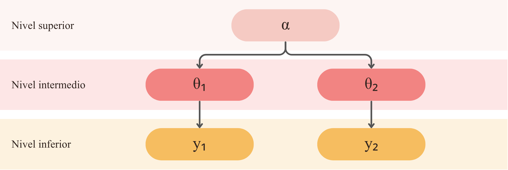
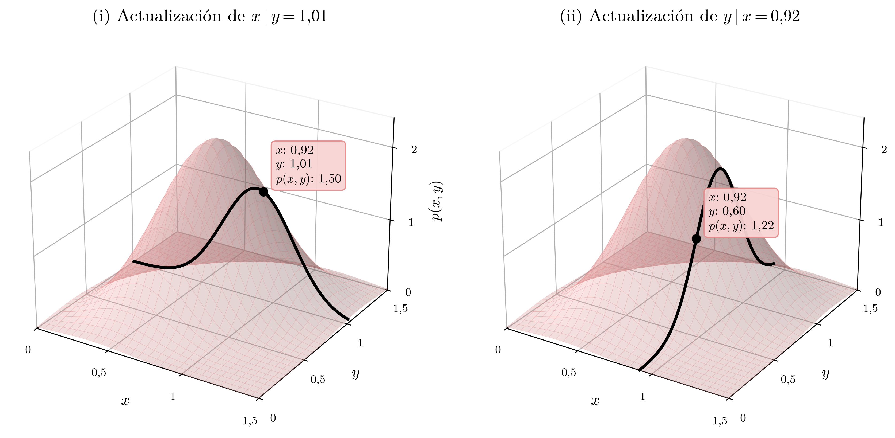
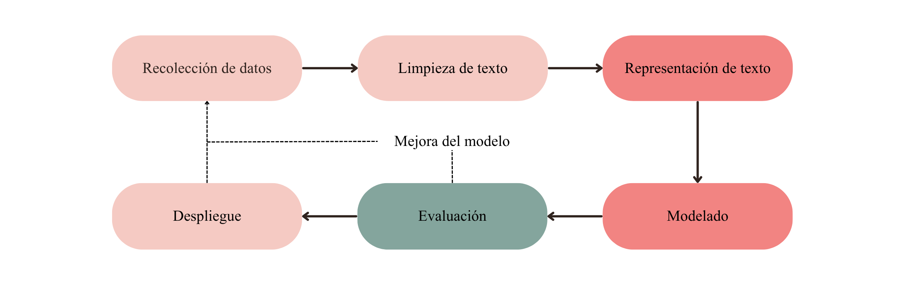
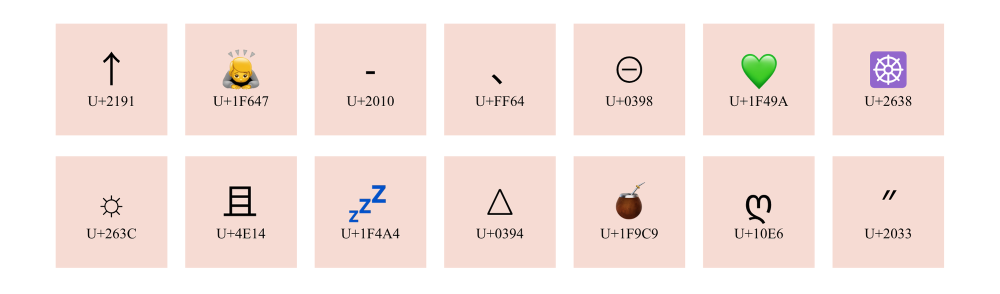
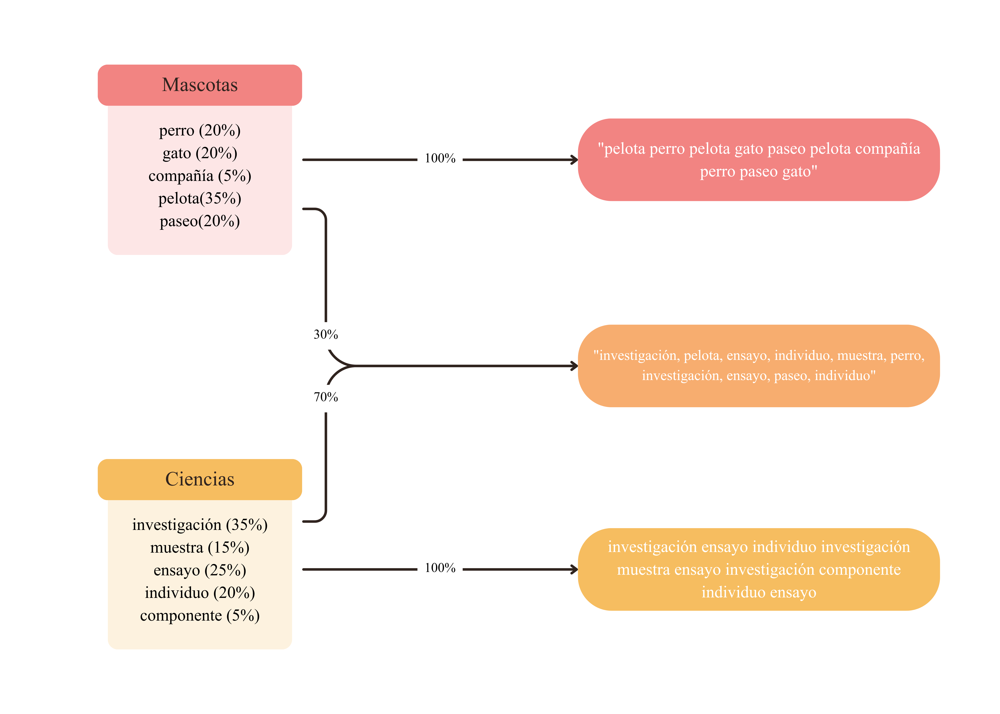
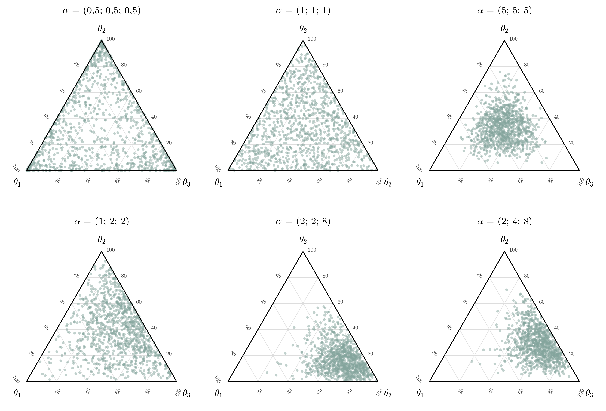

```{r results='hide', message=FALSE, echo=FALSE, warning=FALSE}
set.seed(1406)
library(showtext)
showtext_auto()
font_add_google(name="Noto Serif", family = "libre")
library(ggplot2)
library(dplyr)
library(tidyr)
library(DiagrammeR)
library(webshot)
library(ggraph)
library(igraph)
library(tibble)
library(mvtnorm)
```

\thispagestyle{empty}
\begin{center}
    \vspace*{0.5cm}
    \huge\textbf{Análisis de comentarios en redes sociales con \textit{latent Dirichlet allocation}}
    
    \vspace{4cm}
    \includegraphics[width=0.3\textwidth]{logo_unr.png}
  
    \vspace{0cm}
    \large{Facultad de Ciencias Económicas y Estadística}
    
    \vspace{0cm}
    \large{Alumna: Alfonsina Badin}
    
    \vspace{0cm}
    \large{Director: Ignacio Evangelista}
    
    \vspace{0.5cm}
    \large{2026}
    
\end{center}
\clearpage
\pagenumbering{arabic}
\setcounter{page}{1}

\renewcommand{\contentsname}{Índice}

\setcounter{tocdepth}{4}
\tableofcontents

\clearpage

\newpage

# Agradecimientos

Agradezco a la Universidad Nacional de Rosario, a la Escuela de Estadística y a los profesores de la carrera, por formar un espacio de aprendizaje, crecimiento y desarrollo, donde no solo obtuve los conocimientos propios de la carrera, sino que también me vi transformada como persona y como profesional.

A Nacho, mi director, por saber cuándo darme el impulso que necesitaba y, al mismo tiempo, entender mis tiempos. Supe que quería realizar este trabajo con él hace tres años, y sin dudas su guía fue fundamental para llegar a este punto.

A mi familia, que acompañó todo este proceso con paciencia y cariño, aun sin entender una palabra de lo que estudio. A Santiago, mi motivador y compañero incondicional, especialmente durante este último año.

A los amigos que conocí en la facultad, lo más lindo que me dio esta etapa. Fueron una muy buena razón para ir a cursar, juntarnos horas a estudiar y disfrutar cada parte del recorrido.

A Cami, Luli, Luisi, Vale y Valen, que desde el primer año fueron mi motor. Cuando las cosas se pusieron difíciles, tristes y cuesta arriba, ustedes estuvieron ahí. Seguir sin ustedes hubiera sido prácticamente imposible.

El cierre de esta tesina acompaña el fin de una de las etapas más lindas de mi vida. A todos, gracias.

\newpage

# Resumen

El crecimiento de las plataformas de _streaming_ y de las redes sociales ha generado grandes volúmenes de información textual producida por los usuarios, cuyo análisis permite estudiar los principales temas presentes en sus comunidades. El presente trabajo tiene como objetivo describir el modelo _Latent Dirichlet allocation_ (LDA) y aplicarlo para identificar y analizar patrones temáticos en comentarios de YouTube correspondientes a ocho canales de _streaming_ de Argentina.

La base de datos utilizada fue construida mediante la API de YouTube y estuvo compuesta inicialmente por 1.326.033 comentarios. Luego de las etapas de limpieza y preprocesamiento se conservaron 1.290.550 observaciones para el análisis. Sobre este corpus se estimaron distintos modelos LDA mediante muestreo de Gibbs colapsado, considerando diferentes números de tópicos y especificaciones de los hiperparámetros $\alpha$ y $\beta$. La evaluación de las configuraciones se realizó considerando medidas de perplejidad, coherencia temática e interpretabilidad de los tópicos obtenidos.

A partir de la comparación entre los modelos considerados, se seleccionó una especificación de ocho tópicos con $\alpha = \beta = 1$, que presentó un equilibrio adecuado entre capacidad de generalización, diferenciación temática e interpretabilidad. Los resultados permitieron identificar patrones asociados tanto con contenidos y figuras particulares de los canales como con formas de expresión compartidas entre sus audiencias. Asimismo, se observaron diferencias en la prevalencia de los tópicos entre los canales analizados.

Los resultados muestran que LDA constituye una herramienta útil para explorar grandes volúmenes de texto no estructurado y permiten caracterizar los comentarios analizados como distintas combinaciones de un espacio temático parcialmente compartido, reconociendo al mismo tiempo las limitaciones propias del modelo y del contexto de aplicación.

\newpage

# Introducción {#sec-introduccion}

Las redes sociales se han convertido en el medio de comunicación más utilizado. De forma diaria, los usuarios ingresan a ellas para conversar con otras personas, compartir experiencias, informarse sobre las últimas noticias y entretenerse.

En los últimos años, hubo un tipo de contenido que se popularizó con gran velocidad: el _streaming_. El _streaming_ es una combinación de radio y televisión, que se transmite en vivo en una plataforma gratuita (YouTube o Twitch) y luego es publicado _on-demand_ para que el usuario pueda verlo fuera de su horario habitual si así lo desea. Por lo general el formato consta de un panel de conductores que charlan de tópicos comunes para la audiencia, generando debates interesantes con los que los usuarios se pueden llegar a identificar. Dentro de cada canal de _streaming_ se transmiten distintos programas que tienen un perfil particular y objetivos diferentes ya que su contenido puede variar en entretenimiento, humor, chimentos, noticias, etc.

Su popularidad se debe a que es un contenido gratuito, cercano y que genera una comunidad entre los conductores y sus oyentes, quienes no sólo interactúan en vivo a través de un _chat_ sino que dejan sus comentarios en otras redes sociales: Instagram, TikTok, YouTube, entre otros.

Al publicar los programas _on-demand_, los canales de _streaming_ acceden a un recurso valioso que refleja la opinión de sus oyentes: los comentarios de YouTube. El análisis de estos textos puede resultar en conclusiones interesantes para los canales ya que permite un entendimiento de los patrones discursivos que tiene su comunidad con respecto a cada contenido.

Para llevar a cabo este análisis, el presente informe utiliza **_latent Dirichlet allocation_ (LDA)**, una técnica de aprendizaje automático no supervisado que representa cada documento como una distribución sobre tópicos. Esta metodología permite detectar patrones temáticos recurrentes en grandes volúmenes de datos textuales, como los comentarios de YouTube, y extraer información valiosa.

LDA se basa en un modelo probabilístico generativo y es especialmente útil para modelar datos discretos como textos. Es un modelo bayesiano jerárquico de tres niveles en el cual cada documento (en este caso, cada comentario) se representa como una mezcla de temas, y cada tema se define como una mezcla de palabras. En este sentido, LDA no solo relaciona comentarios en función de temas compartidos, sino que también asigna probabilidades a cada palabra dentro de cada tema, proporcionando una representación explícita y estructurada del contenido del corpus.

Esta capacidad de modelar documentos como combinaciones de múltiples temas hace de LDA una herramienta interesante para analizar la diversidad temática presente en los comentarios de YouTube. Por ejemplo, un comentario podría estar relacionado en un 60% con el tema "entretenimiento" y en un 40% con el tema "noticias", lo que permite identificar la interacción entre los intereses de los usuarios.

Esta tesina tiene por objeto de estudio la técnica _latent Dirichlet allocation_. En primer lugar, se presentan los conceptos teóricos necesarios para comprender el modelo: nociones de estadística bayesiana y de métodos de simulación, las etapas del procesamiento de lenguaje natural y las principales formas de representar texto numéricamente. A partir de ellos, se desarrolla la formulación de LDA, la derivación matemática que sustenta su estimación mediante muestreo de Gibbs colapsado y las métricas utilizadas para evaluarlo. En segundo lugar, se aplica el modelo a un corpus de comentarios de YouTube de ocho canales de _streaming_ argentinos, comparando distintas configuraciones de la cantidad de tópicos y de los hiperparámetros. Finalmente, se discuten las limitaciones del modelo en este contexto y posibles líneas de trabajo futuras.

\newpage

# Objetivos

## Objetivo general

El objetivo general del presente proyecto es profundizar en el estudio y aplicación del modelo _latent Dirichlet allocation_ (LDA) para la identificación de tópicos.

## Objetivos específicos

-   Comprender las bases del procesamiento de lenguaje natural (NLP por sus siglas en inglés) y las técnicas de representación computacional de texto.
-   Mencionar los desafíos y las limitaciones que conlleva el ajuste de LDA y las propuestas que han surgido para contrarrestar dichos inconvenientes.
-   Aplicar LDA en un conjunto de comentarios en español (argentino) en la red social YouTube para comprender los intereses y patrones discursivos expresados por los usuarios.

\newpage

# Metodología

## Estadística Bayesiana {#est-bay}

La estadística bayesiana es un enfoque que, mediante el uso del teorema de Bayes, actualiza la probabilidad de una hipótesis a medida que se obtienen más datos, combinando las observaciones con las creencias previas. A diferencia de la estadística frecuentista, que interpreta las probabilidades como frecuencias relativas en un gran número de ensayos, la bayesiana trata la probabilidad como un grado de creencia o certidumbre.

Kruschke (2014) presenta una analogía muy clara para entender el concepto: si al abrir una ventana se ve el suelo mojado, es natural creer que ha llovido. Sin embargo, al abrir aún más la ventana se observa que los autos están secos y que el agua es solo un charco junto a las plantas del vecino. La idea de la lluvia pierde toda su fuerza y la creencia cambia a que el vecino regó las plantas.

En términos formales, estas explicaciones posibles se traducen en un modelo estadístico donde las "hipótesis" ahora son representadas por parámetros ($\theta$) tratados como variables aleatorias. Así, la incertidumbre ya no recae sobre una idea abstracta, sino sobre la distribución de valores que estos parámetros pueden tomar. De esto trata precisamente la estadística bayesiana: es la reasignación de la credibilidad sobre el conjunto de parámetros de un modelo, en función de los datos observados ($y$).

El teorema de Bayes permite actualizar la distribución de probabilidad de un parámetro (o vector de parámetros) $\theta$ a partir de la observación de un conjunto de datos $y$. La relación se expresa mediante la siguiente ecuación:

$$
\underbrace{p(\theta | y)}_{\substack{\text{Distribución} \\ \textit{a posteriori}}} = \frac{ \overbrace{p(y | \theta)}^{\text{Verosimilitud}} \quad \overbrace{p(\theta)}^{\text{Distribución }\textit{a priori}} }{ \underbrace{p(y)}_{\text{Evidencia}} }
$$

Donde cada componente se define como:

-   Distribución *a posteriori*, $p(\theta|y)$: es la función de densidad condicional que describe la creencia del valor real de $\theta$ luego de haber observado $y$.
-   Verosimilitud, $p(y|\theta)$: es la función de masa o densidad de los datos observados $y$, considerada como función del parámetro $\theta$. Indica qué tan compatibles son los datos con cada valor posible de $\theta$, y es la función que conecta el modelo teórico con la realidad.
-   Distribución *a priori*, $p(\theta)$: describe la creencia inicial que se asignó a $\theta$ antes de observar $y$. Esta asignación puede estar basada en investigaciones previas, en conocimiento personal o determinada desde la ignorancia absoluta.
-   Evidencia, $p(y)$: es la probabilidad marginal de los datos y actúa como constante de normalización. Su rol matemático es asegurar que el área bajo la curva de la distribución a posteriori sea igual a 1, calculándose como $p(y) = \int_{\Theta} p(y|\theta)p(\theta)d\theta$.

Dado que para una muestra de datos fija $y$, la evidencia $p(y)$ es una constante, el teorema suele expresarse en su forma de proporcionalidad, destacando que la forma de la distribución final depende exclusivamente de la información previa y de lo que dicen los datos:

$$p(\theta|y) \propto p(y|\theta)p(\theta)$$

Continuando con la analogía de la ventana, $p(\theta)$ es la probabilidad de que haya llovido y $p(y|\theta)$ es la probabilidad de que los autos estén secos y que la humedad se deba a un charco habiendo llovido. $p(\theta|y)$ es la creencia de la lluvia, dado lo observado al abrir la ventana por segunda vez.

La distribución a posteriori es un compromiso entre la distribución a priori y la función de verosimilitud: combina la información previa sobre el parámetro con la información que aportan los datos observados. El peso relativo de cada una depende de la fuerza de la creencia inicial y de la cantidad de datos observados: una distribución _a priori_ muy concentrada domina cuando hay pocos datos, mientras que, a medida que aumenta el tamaño de la muestra, la verosimilitud pasa a dominar y la distribución _a priori_ pierde influencia. La Figura \@ref(fig:fig1) ilustra este comportamiento en distintos escenarios.

```{r fig1, fig.cap= "El efecto del peso de la evidencia en la distribución \\textit{a posteriori}", echo=FALSE, warning=FALSE, fig.align='center', out.width="70%", message=FALSE}
casos <- list(
  "A" = list(titulo = "(A) Priori fuerte con pocos datos a favor",
             prior_mu = 10, prior_sd = 0.5,  # Prior muy angosto (seguro)
             data_mu = 11,  data_sd = 2.0),  # Datos dispersos y cerca
  
  "B" = list(titulo = "(B) Priori fuerte con pocos datos en contra",
             prior_mu = 10, prior_sd = 0.5,  # Prior muy angosto (seguro)
             data_mu = 18,  data_sd = 2.0),  # Datos dispersos y lejos
  
  "C" = list(titulo = "(C) Priori débil con muchos datos a favor",
             prior_mu = 10, prior_sd = 3.0,  # Prior plano (inseguro)
             data_mu = 11,  data_sd = 0.5),  # Datos muy concentrados
  
  "D" = list(titulo = "(D) Priori débil con muchos datos en contra",
             prior_mu = 10, prior_sd = 3.0,  # Prior plano (inseguro)
             data_mu = 18,  data_sd = 0.5)   # Datos muy concentrados y lejos
)

# --- 2. Función para calcular la Posterior (Modelo Normal-Normal) ---
calcular_posterior <- function(caso) {
  # Precisiones (inverso de la varianza)
  prec_prior <- 1 / (caso$prior_sd^2)
  prec_data  <- 1 / (caso$data_sd^2)
  
  # Parámetros posteriores
  post_prec <- prec_prior + prec_data
  post_sd   <- sqrt(1 / post_prec)
  post_mu   <- (prec_prior * caso$prior_mu + prec_data * caso$data_mu) / post_prec
  
  return(c(mu = post_mu, sd = post_sd))
}

# --- 3. Generación de Datos para el Gráfico ---
plot_data <- data.frame()
x_grid <- seq(2, 26, length.out = 500) # Rango del eje X

for (key in names(casos)) {
  c <- casos[[key]]
  post <- calcular_posterior(c)
  
  # Generar densidades
  df_temp <- data.frame(
    x = x_grid,
    Caso = c$titulo,
    Priori = dnorm(x_grid, mean = c$prior_mu, sd = c$prior_sd),
    Verosimilitud = dnorm(x_grid, mean = c$data_mu, sd = c$data_sd), # "Datos"
    Posteriori = dnorm(x_grid, mean = post["mu"], sd = post["sd"])
  )
  
  plot_data <- rbind(plot_data, df_temp)
}

plot_data_long <- plot_data %>%
  pivot_longer(cols = c("Priori", "Verosimilitud", "Posteriori"), 
               names_to = "Distribucion", 
               values_to = "Densidad")

plot_data_long$Distribucion <- factor(plot_data_long$Distribucion, 
                                      levels = c("Priori", "Verosimilitud", "Posteriori"))

ggplot(plot_data_long, 
       aes(x = x, y = Densidad, color = Distribucion, fill = Distribucion)) +
  geom_line(size = 0.7) +
  geom_area(alpha = 0.5, position = "identity") +
  facet_wrap(~Caso, scales = "free_y", ncol = 2) +
  scale_color_manual(values = c("Priori" = "#F6BD60",        
                                "Verosimilitud" = "#F28482", 
                                "Posteriori" = "#84A59D")) +  
  scale_fill_manual(values = c("Priori" = "#F6BD60", 
                               "Verosimilitud" = "#F28482", 
                               "Posteriori" = "#84A59D")) +
  theme_grey(base_family = "serif") +
  labs(iy = "Densidad de Probabilidad",
       x = paste("Valor del Parámetro", expression(theta)),
       ) +
  theme(legend.position = "bottom",
        strip.text = element_text(size = 9),
        text = element_text(size = 9))
```

### Modelos generativos

Los modelos generativos parten de suposiciones sobre los parámetros o las distribuciones que generan los datos y buscan modelar cómo estos datos podrían haberse producido. Es un paso fundamental para comprender el camino por el que pasa un dato para ser observado y permite construir $p(y,\theta)=p(\theta)p(y|\theta)$. Este enfoque es útil para simular datos y predecir resultados futuros basados en los modelos probabilísticos definidos calculando la distribución predictiva *a posteriori* $p(\tilde y|y)=\int p(\tilde y|\theta)p(\theta|y)d\theta$.

Para ilustrarlo, se considera como ejemplo un canal de YouTube del que se tiene conocimiento de su público mediante los comentarios. Se asume que la comunidad opina desde dos puntos de vista: apoyo y crítica. Cada tópico está compuesto por las siguientes palabras:

$$
\begin{aligned}
V_{\text{apoyo}} &= \{\text{"orgullo"},\  \text{"llorar"},\  \text{"compañía"},\  \text{"aguante"}\} \\
V_{\text{crítica}} &= \{\text{"mal"},\  \text{"irrespetuoso"},\   \text{"absurdo"},\  \text{"llorar"}\}
\end{aligned}
$$

Dado el tópico asignado, cada palabra $w$ se elige entre las de su conjunto según una distribución Multinomial con vector de parámetros $\boldsymbol\phi_{\text{apoyo}}$ o $\boldsymbol\phi_{\text{crítica}}$, respectivamente, vectores que, a su vez, siguen una distribución Dirichlet ($\boldsymbol\phi\sim Dirichlet(\boldsymbol\beta)$).

$$
\begin{split}
w \mid z=\text{apoyo}\sim Multinomial(\boldsymbol\phi_{\text{apoyo}} = [0\mathord{,}4;\ 0\mathord{,}3;\ 0\mathord{,}2;\ 0\mathord{,}1]) \\
w \mid z=\text{crítica} \sim Multinomial(\boldsymbol\phi_{\text{crítica}} = [0\mathord{,}4;\ 0\mathord{,}3;\ 0\mathord{,}2;\ 0\mathord{,}1])  
\end{split}
$$

Se define entonces un modelo para generar un comentario nuevo utilizando

$$
\left\{
\begin{aligned}
\boldsymbol{\theta} &\sim \mathit{Dirichlet}(\boldsymbol{\alpha}) \\
\boldsymbol{\phi}   &\sim \mathit{Dirichlet}(\boldsymbol{\beta}) \\
z      &\sim \mathit{Multinomial}(\boldsymbol{\theta}) \\
w \mid z &\sim \mathit{Multinomial}(\boldsymbol{\phi}_{z})
\end{aligned}
\right.
$$

$\boldsymbol\theta$ es la distribución de tópicos dentro de un comentario particular, $z$ es el tópico asignado a cada palabra y $w$ es la palabra observada. 

Por ejemplo, si un usuario vio un video en particular donde se toca un tema sensible para él y, si bien él es un fiel consumidor del contenido del canal, necesita presentar su opinión, se propone crear un comentario con 5 palabras siguiendo el siguiente proceso:

1.  Dado el perfil conocido sobre el usuario, se asume que se obtuvo la composición temática $\boldsymbol\theta = [0\mathord{,}4;\ 0\mathord{,}6]$ de una distribución Dirichlet de vector de parámetros $\boldsymbol\alpha$. Este vector $\boldsymbol\theta$ rige el proceso generativo, ya que determina la probabilidad con la que el usuario elegirá un tópico para cada palabra de su comentario: tiene un 40\% de probabilidad de comentar con intenciones de apoyo y un 60\% de comentar con intenciones de crítica.

Para cada selección se genera un valor aleatorio $u \sim \mathcal{U}(0,1)$ y se particiona el intervalo $[0,1]$ en tramos de longitud igual a cada probabilidad, respetando el orden de los vectores. Así, para el tópico, $u < 0\mathord{,}40$ corresponde a apoyo y $u \geq 0\mathord{,}40$ a crítica; y para las palabras, por ejemplo del tópico crítica, $[0; 0\mathord{,}40)$ corresponde a "mal", $[0\mathord{,}40; 0\mathord{,}70)$ a "irrespetuoso", $[0\mathord{,}70; 0\mathord{,}90)$ a "absurdo" y $[0\mathord{,}90; 1]$ a "llorar".

Palabra 1:

i.  Se genera un valor aleatorio que determina el tópico de la palabra, según $\boldsymbol\theta$: $0\mathord{,}40 < u_1=0\mathord{,}54 \Rightarrow z_1=\text{crítica}$.

ii.  Se genera un valor aleatorio que determina la palabra según la distribución de probabilidad del tema. $0\mathord{,}40 < u'_1=0\mathord{,}49 < 0\mathord{,}70\Rightarrow \text{palabra}_1=\text{"irrespetuoso"}$.

Palabra 2:

i.  $u_2=0\mathord{,}03 < 0\mathord{,}40 \Rightarrow z_2=\text{apoyo}$

ii.  $u'_2=0\mathord{,}24 < 0\mathord{,}40 \Rightarrow \text{palabra}_2=\text{"orgullo"}$

Palabra 3:

i.  $0\mathord{,}40 < u_3 = 0\mathord{,}81 \Rightarrow z_3=\text{crítica}$

ii.  $u'_3=0\mathord{,}19 < 0\mathord{,}40\Rightarrow \text{palabra}_3=\text{"mal"}$

Continuando con el resto de las palabras, se obtiene el comentario $$"\underbrace{\text{irrespetuoso}}_{\text{crítica}}\quad\underbrace{\text{orgullo}}_{\text{apoyo}} \quad \underbrace{\text{mal}}_{\text{crítica}} \quad \underbrace{\text{llorar}}_{\text{crítica}} \quad \underbrace{\text{aguante}}_{\text{apoyo}}"$$

El comentario resultante no presenta una estructura sintáctica o gramatical coherente para un lector humano ya que sigue la técnica de bolsa de palabras (_bag of words_). En este enfoque, el sentido del mensaje no reside en el orden de los términos, sino en la coherencia temática capturada por los parámetros $\boldsymbol\theta$ y $\boldsymbol\phi$. En la vida real, se conoce el comentario pero no se tiene en claro las intenciones del usuario al comentar ni las palabras que componen los temas. El verdadero desafío es inferir qué valores de los parámetros (en este caso $\boldsymbol\phi_{\text{apoyo}}$, $\boldsymbol\phi_{\text{crítica}}$ y $\boldsymbol\theta$) son los que han afectado en el modelo para la generación del comentario.

### Inferencia

La inferencia bayesiana es el proceso inverso al modelado generativo. Mientras que el modelo generativo simula datos a partir de parámetros conocidos, la inferencia parte de los datos observados para reconstruir las distribuciones de probabilidad de los parámetros latentes que los generaron. Su objetivo fundamental es derivar la distribución *a posteriori*, actualizando las creencias previas mediante la aplicación del teorema de Bayes.

En este caso particular, el modelo incluye además los parámetros de las distribuciones Dirichlet de las que provienen $\boldsymbol\theta$ y $\boldsymbol\phi$: $\boldsymbol\alpha$, que regula la composición temática de cada comentario, y $\boldsymbol\beta$, que regula la distribución de palabras de cada tópico. Dada la naturaleza jerárquica del modelo, estos hiperparámetros pueden fijarse de antemano, estimarse a partir de los datos o recibir a su vez una distribución _a priori_ (hiperprior). En esta tesina se optó por fijar sus valores de antemano y comparar distintas especificaciones, como se detalla en la Sección \@ref(latent-dirichlet-allocation-aplicada).

### Modelos jerárquicos

Cuando se cuenta con datos de muchas fuentes que están relacionadas de alguna manera, se hace uso de los modelos jerárquicos. Estos proveen un marco matemático para describir las dependencias entre múltiples parámetros, de forma que la estimación de un parámetro depende de la estimación de otro(s) parámetro(s).

Un modelo es jerárquico si puede factorizarse en una cadena de dependencias con niveles:

1.  Nivel inferior (verosimilitud): describe la distribución de los datos en función de los parámetros.
2.  Nivel intermedio (distribución a *priori*): describe la distribución de los parámetros que afectan a la verosimilitud. En este nivel, los parámetros ya no se consideran fijos, sino que son variables aleatorias distribuidas según una distribución subyacente definida por hiperparámetros. 
3.  Nivel superior (distribución a *priori* de los hiperparámetros): describe la distribución de los hiper-parámetros.

El potencial de los modelos jerárquicos es su adaptabilidad a distintos casos de estudio ya que se pueden aplicar a modelos con múltiples dependencias (niveles escalables) y a parámetros organizados en una estructura anidada. Por ejemplo, para un caso de dos grupos, el modelo jerárquico se vería como en la Figura \@ref(fig:fig2).

```{r fig2, fig.cap= "Modelo jerárquico a 3 niveles con dos grupos", echo=FALSE, warning=FALSE, fig.align='center', fig.pos="H", out.width="80%"}

```

La distribución *a posteriori* dependerá de todos los parámetros existentes en el modelo. Sea $y_{ij}$ la observación i-ésima del grupo j, donde $i=\overline{1,n}$ y $j = \overline{1,k}$, se tiene que:

$$\begin{split}
p(\boldsymbol\theta,\boldsymbol\alpha \mid \boldsymbol y) &\propto p(\boldsymbol y \mid \boldsymbol\theta, \boldsymbol\alpha)\, p(\boldsymbol\theta \mid \boldsymbol\alpha)\, p(\boldsymbol\alpha) \\
&\propto \Biggl(\prod_{i=1}^n\prod_{j=1}^k p(y_{ij} \mid \theta_j,\boldsymbol\alpha)\Biggr)\Biggl(p(\boldsymbol\alpha)\prod_{j=1}^k p(\theta_j \mid \boldsymbol\alpha)\Biggr) \\
&\propto \underbrace{\prod_{i=1}^n\prod_{j=1}^k p(y_{ij} \mid \theta_j,\boldsymbol\alpha)}_{\text{verosimilitud}} \quad
\underbrace{\prod_{j=1}^k p(\theta_j \mid \boldsymbol\alpha)}_{\text{distribución \textit{a priori}}} \quad
\underbrace{p(\boldsymbol\alpha)}_{\text{hiperprior}}
\end{split}$$

El modelo generativo presentado en la Sección 5.1.1 sigue esta estructura jerárquica. En el nivel inferior, cada palabra observada $w_n$ se genera a partir de la distribución de palabras $\boldsymbol\phi_{z_n}$ del tópico que le fue asignado. En el nivel intermedio se encuentran los parámetros que afectan a esa verosimilitud: la asignación de tópico $z_n$ de cada palabra, que depende de la composición temática $\boldsymbol\theta$ del comentario, y las distribuciones de palabras $\boldsymbol\phi$ de cada tópico; tanto $\boldsymbol\theta$ como $\boldsymbol\phi$ son variables aleatorias con distribución Dirichlet. Finalmente, en el nivel superior se ubican los hiperparámetros $\boldsymbol\alpha$ y $\boldsymbol\beta$ de dichas distribuciones Dirichlet que, como se mencionó anteriormente, pueden fijarse de antemano en lugar de asignarles una distribución _a priori_.

Se dice que una familia de distribuciones es conjugada respecto a una función de verosimilitud cuando la distribución *a posteriori* resultante pertenece a la misma familia paramétrica que la distribución *a priori*. La principal ventaja de utilizar este fenómeno es que transforma un problema complejo de integración en una simple operación aritmética: los parámetros de la *a posteriori* se obtienen sumando los conteos de los datos observados a los hiperparámetros originales. Un ejemplo clásico es el modelo Beta-Binomial. Sea una variable aleatoria $Y \sim \text{Binomial}(n, \theta)$ con $\theta \sim \text{Beta}(\alpha, \beta)$, la distribución resultante es también una Beta, específicamente $\theta|y \sim \text{Beta}(\alpha + y, \beta + n - y)$.

A pesar de su elegancia matemática, el uso exclusivo de distribuciones conjugadas puede resultar restrictivo, limitando la flexibilidad del modelado para representar fenómenos complejos. Cuando el cálculo analítico exacto de la distribución *a posteriori* resulta imposible, es necesario recurrir a métodos computacionales.

### Métodos computacionales

En modelos bayesianos de alta dimensionalidad, como aquellos con muchos tópicos y palabras por tópico, obtener la distribución *a posteriori* implica resolver una integral sobre el espacio conjunto de todos los parámetros (el factor de normalización presentado en la [definición de la regla de Bayes](#est-bay)). Esta operación es computacionalmente inviable excepto en casos triviales, razón por la cual la aplicación práctica de la inferencia bayesiana se vio históricamente limitada.

Sin embargo, con el avance de la capacidad computacional, surgieron métodos de aproximación estocástica. El objetivo central de estos algoritmos no es calcular la fórmula exacta de la distribución, sino obtener un conjunto de valores representativos (muestras) cuya distribución empírica aproxime la distribución a posteriori.

#### Markov chain Monte Carlo

Un método de aproximación de la distribución *a posteriori* es el de Monte Carlo basado en cadenas de Markov (MCMC, por sus siglas en inglés) que, mediante un algoritmo iterativo, genera una secuencia de valores cuya distribución, después de un número suficiente de pasos, converge a la deseada.

El algoritmo hace uso de cadenas de Markov, un proceso donde el siguiente paso depende únicamente del paso actual. Matemáticamente $P(X_{t+1}|X_t,...,X_2,X_1)=P(X_{t+1}|X_t)$.

Existen algunos algoritmos MCMC que determinan cómo se dan los pasos, como Metropolis-Hastings, Hamiltonian _Monte Carlo_ y el muestreo de Gibbs. Este último se describe en detalle, ya que se utiliza en la aplicación de LDA.

#### Muestreo de Gibbs

El muestreo de Gibbs es un algoritmo iterativo que construye una secuencia de valores dependientes de parámetros. Se da inicio desde un punto arbitrario en el espacio paramétrico y, en cada iteración, el siguiente valor depende únicamente del valor actual, y no de los anteriores. El diferencial de Gibbs es que opera el muestreo iterativo de cada parámetro a partir de su distribución condicional completa.

$$p(x|y)=\frac{p(x,y)}{p(y)}\propto p(x,y)$$

Para ilustrar el algoritmo se plantea un caso bivariado. Para obtener la distribución de $(x,y)$, el algoritmo de Gibbs procede de la siguiente manera:

Paso 0 (inicialización): Se establecen valores iniciales arbitrarios para los parámetros, denotados como $(x^{(0)}, y^{(0)})$.

Paso $s$ (iteración): Para generar la muestra en la iteración $s$ (donde $s = 1, 2, \dots$):

1.  Actualización de $x$: Se genera un nuevo valor $x^{(s)}$ muestreando de su distribución condicional, condicionada al valor más reciente de $y$.

$$x^{(s)} \sim p(x \mid y^{(s-1)})$$

2.  Actualización de $y$: Se genera un nuevo valor $y^{(s)}$ muestreando de su distribución condicional, condicionada al valor de $x$ que acaba de ser actualizado en el paso anterior.

$$y^{(s)} \sim p(y \mid x^{(s)})$$

El par $(x^{(s)}, y^{(s)})$ constituye la nueva muestra de la cadena de Markov.

Este ciclo se repite un gran número de veces y, bajo condiciones de **ergodicidad**[^1], la secuencia de pares generada $\{(x^{(s)}, y^{(s)})\}$ converge en distribución a la distribución conjunta objetivo $p(x, y)$.

[^1]: **Ergodicidad:** Propiedad de una cadena de Markov que garantiza la convergencia a una distribución única independientemente del estado inicial. Una cadena es ergódica si es **irreducible** (es posible alcanzar cualquier estado desde cualquier otro en un número finito de pasos) y **aperiódica** (no queda atrapada en ciclos repetitivos de oscilación).

```{r fig4, fig.cap= "Paso iterativo en el muestreo de Gibbs bivariado", echo=FALSE, warning=FALSE, message=FALSE, fig.align='center', fig.pos="H", out.width="80%"}

```

En la Figura \@ref(fig:fig4), adaptada de Kruschke (2014), se ilustra una iteración del muestreo de Gibbs bivariado. En el primer paso (i), se fija $y$ en su valor actual $y^{(s-1)}$ y se muestrea un nuevo valor $x^{(s)}$ de la distribución condicional $p(x \mid y^{(s-1)})$, que es proporcional al corte de la densidad conjunta en ese valor de $y$. En el segundo paso (ii), se fija $x$ en el valor recién obtenido y se muestrea $y^{(s)}$ de $p(y \mid x^{(s)})$. De esta forma, la cadena se desplaza alternadamente en la dirección de cada coordenada.

## Machine learning

El aprendizaje automático (*machine learning*, ML) es una rama de la inteligencia artificial que permite a las computadoras aprender patrones y tomar decisiones a partir de datos, sin ser programadas explícitamente para cada tarea. Es especialmente útil en problemas complejos, donde hay muchas reglas por seguir y/o entornos inconsistentes ya que los modelos de ML se adaptan fácilmente a nuevos datos.

Un ejemplo utilizado en lo cotidiano es el filtro de *spam* de la casilla de correo electrónico. Con algunos ejemplos de correos *spam* y correos legítimos o *ham* (datos de entrenamiento), el código detrás del filtro logra aprender la naturaleza de cada uno de estos elementos, logrando así clasificar nuevos casos. Los modelos de ML se evalúan con métricas de *performance* que se miden con datos de prueba.

Los sistemas de *machine learning* se pueden clasificar en función de la cantidad de supervisión que reciben en el entrenamiento entre supervisados y no supervisados.

En el aprendizaje supervisado, los modelos se entrenan con un conjunto de datos en el que cada observación ya cuenta con el valor correcto de la variable respuesta, también denominado etiqueta (datos de entrenamiento). A partir de estos ejemplos, el modelo aprende la relación entre las variables explicativas y la respuesta, para luego predecir la respuesta en datos nuevos. Por ejemplo, si un filtro de *spam* recibe correos con la etiqueta *spam* y *no spam* en el entrenamiento, se está hablando de un aprendizaje supervisado. Entre las técnicas más importantes del aprendizaje supervisado se encuentran *k-nearest neighbors* (KNN), regresión lineal, regresión logística, *support vector machine* (SVM), árboles de decisión, *random forest*, redes neuronales, etc.

En el aprendizaje no supervisado, los datos de entrenamiento no cuentan con etiquetas, se dice que el sistema intenta aprender sin profesor. Por ejemplo, si se quisiera agrupar a clientes de un negocio según su consumo, el algoritmo detecta las similitudes y diferencias entre ellos y define un agrupamiento que será evaluado con las métricas de *performance* y ajustado según su resultado.

\newpage

## Procesamiento de Lenguaje Natural (NLP)

El texto, tal como lo leemos y comprendemos los humanos, es rico en significado pero carece de una estructura numérica, que es la base del procesamiento en los algoritmos de aprendizaje automático. El procesamiento de lenguaje natural es un área de investigación dentro de la informática y la inteligencia artificial (IA) que se ocupa de procesar el lenguaje humano. Este procesamiento generalmente implica traducir el lenguaje natural en datos (números) que una computadora puede usar para aprender sobre el mundo.

El proceso abarca tareas como la recolección, limpieza, normalización y tokenización de texto. Estas últimas dos son las responsables de que la información textual pueda ser estructurada de manera que los modelos la interpreten y analicen eficazmente. En la Figura \@ref(fig:diagrama1) [@vajjala2020] se pueden observar los pasos que comprende el proceso.

```{r diagrama1, fig.cap="Etapas del NLP", out.width="100%", fig.align='center',echo=FALSE, warning=FALSE, message=FALSE}
library(knitr)

```

Aunque no sea evidente, el procesamiento de lenguaje natural (o NLP, por sus siglas en inglés) aparece en el día a día de las personas. Tiene una amplia variedad de aplicaciones prácticas, lo que lo convierte en una herramienta esencial en diversos campos, por ejemplo mejoras en motores de búsqueda web, corrección ortográfica y gramatical, _chatbots_ o asistentes virtuales, generación de índices y tablas de contenido, filtrado de spam en correo electrónico, personalización en campañas de marketing. Este amplio rango de usos subraya su importancia como puente entre los lenguajes humanos y las capacidades computacionales.

### Recolección de datos

El primer paso esencial en cualquier proyecto de procesamiento de lenguaje natural es la recolección de datos. Esta etapa determina la calidad y relevancia de los resultados que se obtendrán al aplicar técnicas avanzadas como _latent Dirichlet allocation_ (LDA). Existen diferentes enfoques para recopilar datos en NLP, dependiendo de los objetivos del análisis y la disponibilidad de recursos. A continuación, se describen las principales estrategias de recolección de datos:

- Uso de conjuntos de datos públicos: Una opción inicial es buscar conjuntos de datos públicos que sean relevantes para la tarea específica.

- Obtención de datos de internet: Otra estrategia consiste en identificar fuentes relevantes de datos en internet, como foros de consumidores o plataformas de discusión donde se publiquen consultas. Estos datos pueden ser extraídos automáticamente a través de técnicas de *web scraping* y, posteriormente, etiquetados manualmente por anotadores humanos.

- Combinación de fuentes de datos: En la práctica, los conjuntos de datos suelen provenir de fuentes heterogéneas, como *datasets* públicos, datos etiquetados manualmente y datos de internet, al mismo tiempo. Esta combinación es especialmente útil para construir modelos en etapas iniciales, cuando los datos específicos para un escenario particular son limitados.

En esta tesina se optó por hacer uso de una *API* de Google para obtener los datos de entrada para el análisis, este proceso se detalla en la sección Aplicación práctica.

Esta etapa es crucial para garantizar la disponibilidad de datos limpios y útiles, que son la base para las siguientes etapas de procesamiento y modelado. Una vez que se cuenta con los datos recolectados, se procede al siguiente paso: la limpieza y el preprocesamiento de texto.

### Limpieza de texto

La extracción y limpieza de texto se refiere al proceso de extraer de los datos de entrada el texto sin procesar, eliminando toda la información no textual, como marcas, metadatos, etc., y convirtiéndolo al formato de codificación requerido. La extracción de texto es un paso estándar en el manejo de datos y, usualmente, no emplea técnicas específicas de NLP. Sin embargo, es un paso importante que tiene implicaciones para todos los demás aspectos. Además, también puede ser la parte más demandante en términos de tiempo dentro de un proyecto.

#### Pasos preliminares {.unnumbered}

Previo a la limpieza del texto, es necesario llevar a cabo una serie de transformaciones básicas que garanticen la homogeneidad del corpus. En primer lugar, se convierte todo el texto a minúsculas con el fin de evitar que palabras idénticas sean tratadas como distintas debido a diferencias en el uso de mayúsculas, por ejemplo, “Video” y “video”. Otro paso fundamental consiste en la eliminación de signos de puntuación, caracteres especiales y espacios innecesarios, que no aportan información semántica al análisis y pueden generar una dispersión artificial en el vocabulario.

Finalmente, se corrigen patrones de escritura característicos de entornos informales, como la repetición exagerada de letras para enfatizar una emoción (por ejemplo, “amoo” en lugar de “amo” o “encantaa” en lugar de “encanta”). Este tipo de modificaciones, frecuentes en comentarios de redes sociales, pueden aumentar la longitud del vocabulario y dificultar la identificación de términos representativos. La normalización de estas formas al estándar correspondiente resulta clave para mejorar la coherencia interna del corpus y facilitar los pasos posteriores de análisis.

#### Tokenización {.unnumbered}

La tokenización es un paso fundamental en el procesamiento del lenguaje natural que tiene como objetivo transformar el texto libre en una secuencia de unidades discretas que puedan ser procesadas computacionalmente. Consiste en segmentar el texto en unidades mínimas llamadas tokens, cuya definición depende de la granularidad aplicada en el proceso:

-   A nivel de palabra: cada token corresponde a una palabra. Ejemplo: “Muy bueno el video” → [“Muy”, “bueno”, “el”, “video”].
-   A nivel de sub-palabra: cada token es un fragmento de una palabra. Ejemplo: “jugando” → [“jug”, “ando”].
-   A nivel de carácter: cada token es un único carácter (letra, signo de puntuación, número, etc.). Ejemplo: “sol” → [“s”, “o”, “l”].
-   A nivel de oración: cada token corresponde a una oración completa. Ejemplo: “Hoy llueve. Mañana saldrá el sol.” → [“Hoy llueve.”, “Mañana saldrá el sol.”].

#### Normalización de unicode {.unnumbered}

Al limpiar texto, especialmente el recolectado a través de *web scraping*, es posible que se encuentren varios caracteres *unicode*, incluidos símbolos, emojis y otros caracteres gráficos, algunos ejemplos se muestran en la Figura \@ref(fig:diagrama2) [@vajjala2020].

```{r diagrama2, fig.cap="Caracteres Unicode y su representación gráfica", out.width="100%", fig.align='center',echo=FALSE, warning=FALSE, message=FALSE}

```

Para interpretar estos símbolos no textuales y caracteres especiales se utiliza la normalización de *unicode*, que convierte el texto en alguna forma de representación binaria para ser almacenado en una computadora. Existen varios esquemas de codificación, y la codificación predeterminada puede variar según el sistema operativo. En términos generales, se eliminan todos los caracteres que no pertenecen al alfabeto.

#### Eliminación de stopwords {.unnumbered}

Las *stopwords* son palabras funcionales que, si bien cumplen un rol gramatical importante (como preposiciones, artículos, pronombres...), no aportan contenido semántico relevante al análisis del significado global del texto.

El objetivo de esta etapa es reducir el ruido lingüístico y centrar el análisis en las palabras que efectivamente comunican información. Por ejemplo, en frases como "gracias por el dato" o "esto es una joya", las palabras "por", "el", "es" y "una" son típicamente consideradas *stopwords*, mientras que "gracias", "dato" y "joya" son los términos de interés.

Para llevar a cabo esta tarea se utilizó el paquete `tm` (*Text mining*) que cuenta con un listado de *stopwords* (Tabla \@ref(tab:stopwords)) y funciones como `removeWords` que permite eliminarlas de un texto dado.

```{r stopwords, echo=FALSE, warning=FALSE, message=FALSE}
library(tm)
library(kableExtra)
library(dplyr)

palabras <- stopwords("es")
ncol <- 10
nrow <- 2
palabras <- palabras[1:(nrow * ncol)]
mat <- matrix(palabras, nrow = nrow, byrow = TRUE)
df <- as.data.frame(mat, stringsAsFactors = FALSE)
kable(df, format = "latex", booktabs = TRUE,
      caption = "Algunas \\textit{stopwords} del paquete \\texttt{tm}",
      col.names = NULL) %>%
  kable_styling(latex_options = c("HOLD_position", "scale_down", "striped"))
```

#### Corrección ortográfica {.unnumbered}

La corrección de errores en la escritura es un aspecto fundamental del procesamiento del lenguaje natural ya que los textos pueden contener diferentes tipos de fallos que afectan su comprensión y coherencia. Los errores en la redacción pueden clasificarse en tres categorías principales *(Moyotl-Hernández, 2016)*:

-   Errores ortográficos: ocurren cuando una palabra escrita no existe dentro del idioma.
-   Errores gramaticales: Se presentan cuando las palabras utilizadas existen en el idioma, pero no son correctas en el contexto de la oración.
-   Errores de estilo: se refieren a palabras redundantes, ambiguas o repetidas que afectan la claridad del texto.

En este sentido, un corrector ortográfico tiene como objetivo identificar palabras mal escritas dentro de un texto y sugerir la opción más adecuada a partir de un conjunto de términos válidos en el idioma.

#### Corrección ortográfica empleando distancia de Levenshtein-Damerau {.unnumbered}

La distancia de Levenshtein o distancia de edición es una medida utilizada para calcular la similitud entre palabras, se trata de un conteo de operaciones requeridas para convertir una cadena de caracteres (una palabra) en otra. Las operaciones de edición son:

-   Inserción de un carácter: hogr $\rightarrow$ hogar (agregar ‘a’ entre la ‘h’ y la ‘g’).
-   Eliminación de un carácter: arggentina $\rightarrow$ argentina (eliminar la ‘g’).
-   Sustitución de un carácter por otro: numero $\rightarrow$ número (reemplazar la ‘u’ por la ‘ú’).

Hay una generalización de esta medida que considera el intercambio de dos caracteres como una operación: la distancia de Levenshtein-Damerau. En este método, aparece:

-   Transposición de caracteres: paelta $\rightarrow$ paleta (intercambia el lugar de la ‘e’ y la ‘l’).

El método de corrección basado en la distancia de Levenshtein-Damerau se fundamenta en la búsqueda de la palabra más similar dentro de un diccionario para corregir una palabra mal escrita. Este procedimiento implica generar todas las posibles transformaciones de la palabra errónea mediante las operaciones de edición. Luego, cada una de estas transformaciones se compara con las palabras existentes en el diccionario, y aquellas que coincidan se agregan a una lista de sugerencias. Finalmente, la mejor corrección será aquella con la menor distancia a la palabra original.

En la Tabla \@ref(tab:tablaburri) se muestran todas las palabras generadas a partir de la palabra errónea `burri` con una sola operación de edición.

```{r tablaburri, echo=FALSE, warning=FALSE, message=FALSE, }
tabla_op <- data.frame(
  Operación = c("Eliminación", "Inserción", "Sustitución", "Transposición"),
  `Palabras generadas` = c(
    "urri, brri, buri, burr",
    "aburri, bburri, cburri, ..., zburri, burris, burria, ..., burriz",
    "aurri, burrs, murri, ..., burro, burrq, ..., burrz",
    "ubrri, bruri, burir"
  )
)

kable(tabla_op, format = "latex", booktabs = TRUE,
      caption = "Posibles transformaciones de la palabra burri con distancia de edición uno",
      col.names = c("Operación", "Palabras generadas")) %>%
  kable_styling(latex_options = c("HOLD_position", "striped"))
```

Se define un diccionario ficticio para este caso y se calcula la distancia L-D haciendo uso del paquete `stringdist` para cada una de sus palabras. Se observan los resultados de la Tabla \@ref(tab:tablaburri1).

```{r tablaburri1, echo=FALSE, warning=FALSE, message=FALSE}
# Paquetes
library(stringdist)
library(dplyr)
# 1. Token a corregir
token <- "burri"
# 2. Diccionario ficticio 
diccionario <- c("burro", "burrito", "barri", "burla", 
                 "perro", "aburris", "aburro", "caballo")
# 3. Calculamos distancia DL
resultados <- tibble::tibble(
  candidato = diccionario,
  distancia = stringdist(token, diccionario, method = "dl")
) %>%
  arrange(distancia, candidato)
n <- nrow(resultados)
half <- ceiling(n/2)

resultados <- tibble::tibble(
  candidato1 = resultados$candidato[1:half],
  distancia1 = resultados$distancia[1:half],
  candidato2 = resultados$candidato[(half+1):n],
  distancia2 = resultados$distancia[(half+1):n]
)

kable(resultados, format = "latex", booktabs = TRUE,
      caption = paste0("Posibles correcciones para la palabra '", token, "'"),
      col.names = c("Candidato", "Distancia", "Candidato", "Distancia")) %>%
  kable_styling(latex_options = c("HOLD_position", "striped", "scale_down"))
```

Si bien es fácil identificar que `perro` o `caballo` no son buenas correcciones, observando el resultado de la distancia L-D se llega a la misma conclusión. Para este conjunto de datos y el ejemplo en particular, hay correcciones mejores en función de este cálculo. El desafío radica en seleccionar la cantidad de operaciones admitidas para la corrección y cuál de estas opciones es la más apropiada.

En síntesis, el uso de la distancia de Levenshtein-Damerau constituye una herramienta potente para la corrección ortográfica, ya que permite identificar palabras candidatas a partir de criterios formales de similitud. No obstante, los desafíos principales radican en establecer un umbral de tolerancia adecuado y en gestionar la carga computacional asociada. Una tolerancia demasiado estricta puede dejar sin corregir errores evidentes, mientras que una tolerancia demasiado laxa puede introducir correcciones incorrectas. A su vez, el proceso de comparar un término erróneo contra todas las palabras de un diccionario extenso es computacionalmente intensivo. De igual modo, disponer de un diccionario amplio, representativo y ajustado al dominio del corpus resulta esencial para que las sugerencias tengan sentido lingüístico y contextual. En conjunto, ambos elementos, son determinantes para perfeccionar los procesos de corrección ortográfica y garantizar resultados confiables en etapas posteriores del análisis de texto.

#### Lematización {.unnumbered}

La lematización es un proceso de normalización léxica en NLP cuyo objetivo es reducir las palabras a su forma canónica o “lema”. Al aplicar lematización:

-   Se eliminan variaciones flexivas (tiempo verbal, número, género).
-   Se conserva el significado léxico de la palabra.
-   Se mejora la coherencia del vocabulario al reducir distintas formas a un único término.

El paquete `UDPipe` implementa modelos de *Universal Dependencies* que permiten realizar tokenización, etiquetado gramatical y lematización de textos en múltiples lenguas.

```{r tablalematizacion, echo=FALSE, warning=FALSE, message=FALSE}
library(udpipe)
udmodel <- udpipe_load_model("spanish-gsd-ud-2.5-191206.udpipe")
texto <- c("Los estudiantes estaban estudiando en la biblioteca.")
anot <- udpipe_annotate(udmodel, x = texto, doc_id = 1)
anot <- as.data.frame(anot)

udpipe_out <- data.frame(
  Token = anot$token,
  Lema  = anot$lemma,
  UPOS  = anot$upos
)
kable(udpipe_out, format = "latex", booktabs = TRUE,
      caption = "Salida de UDPipe: tokens, lemas y categorías gramaticales") %>%
  kable_styling(latex_options = c("HOLD_position", "striped", "scale_down"))
```

En la Tabla \@ref(tab:tablalematizacion) se observan los resultados de la lematización con una oración simple. El código devuelve palabras separadas, los lemas correspondientes y el tipo de palabra procesada, entre ellas:

-   DET: determinante.
-   NOUN: sustantivo.
-   VERB: verbo.
-   ADP: adposición.
-   PUNCT: puntuación.

Estos son algunos de los tipos de palabras que el paquete `UDPipe` reconoce. Este etiquetado permite filtrar aquellas categorías con mayor carga semántica (sustantivos, verbos, adjetivos, adverbios y nombres propios) y así disminuir la dimensionalidad de la entrada del modelo.

### Representación de texto

La extracción de características relevantes (*feature extraction*) es un paso clave para el procesamiento de texto, ya que incluso el mejor modelo de *machine learning* devuelve resultados pobres si la información de entrada es inadecuada. Para que un algoritmo pueda procesar texto, es necesario transformarlo previamente en una representación numérica. En este apartado se presentan algunas de las representaciones más utilizadas, ordenadas de menor a mayor complejidad.

#### Representación vectorial {.unnumbered}

La representación vectorial de un texto consiste en la transformación de una palabra u oración a un vector de números reales dentro de un espacio vectorial de $n$ dimensiones. Esta transformación se realiza a través de un modelo matemático y el vector resultante sirve para cuantificar las similitudes y diferencias entre dos fragmentos de texto. La manera más común de medir esta comparación es a través de la similitud coseno (o coseno del ángulo entre vectores).

Dados dos vectores, $A$ y $B$, cada uno con $n$ componentes, la similitud coseno se calcula como:

$$
\cos{(\theta)}=\frac{A \cdot B}{|A||B|}
$$

Un resultado de 1 implica similitud total (el ángulo $\theta$ es $0^\circ$), y un resultado de -1 implica diferencia total (el ángulo $\theta$ es $180^\circ$). Además de la similitud coseno, la distancia euclídea es otra métrica frecuente para medir la proximidad o lejanía entre vectores.

#### One-Hot Encoding {.unnumbered}

Una de las formas más sencillas y fundamentales de representar texto numéricamente es mediante la codificación *One-Hot*. En este enfoque, cada palabra $v$ del corpus $V$ se asocia a un identificador único y se representa como un vector binario de tamaño igual a $V$. Este vector está compuesto de todos ceros, excepto en la posición correspondiente a la palabra en el vocabulario, donde se ubica un 1.

Para ilustrar, se considera el siguiente corpus:

-   D1: El perro muerde.
-   D2: El gato muerde.
-   D3: El perro ladra.
-   D4: El gato maúlla.

Luego de preprocesar el texto, el vocabulario resultante está compuesto por cinco palabras únicas:

$$"perro","muerde", "gato", "ladra","maúlla"$$

A cada palabra de este se le asigna un índice único y será representada como un vector binario de longitud 5.

$$perro \rightarrow [1;0;0;0;0],...,ladra\rightarrow[0;0;0;1;0],maúlla\rightarrow[0;0;0;0;1]$$

Entonces, la oración D1: “El perro muerde” se representa con *One-Hot encoding* como la matriz:

$$
\mathbf{}\left[
\begin{array}{ccccc}
1 & 0 & 0 & 0 & 0\\
0 & 1 & 0 & 0 & 0
\end{array}\right]
$$

Si bien es un método simple, presenta dos desventajas principales: la alta dimensionalidad y la falta de información semántica, ya que la similitud coseno entre cualquier par de palabras distintas es 0, dado que sus vectores resultan ortogonales.

#### Bag of words {.unnumbered}

Una de las representaciones más clásicas del texto es el enfoque *bag of words* (BOW). Este método trata a un documento como una bolsa de palabras, ignorando su orden sintáctico, pero manteniendo un registro de la frecuencia con la que aparece cada término. La intuición detrás de BOW es que la frecuencia de ciertos términos puede caracterizar el contenido de un documento.

Al igual que en *One-Hot encoding*, BOW asigna un identificador único a cada palabra del vocabulario. Luego, representa cada documento como un vector de longitud igual al tamaño del vocabulario, donde el valor en cada posición indica cuántas veces aparece esa palabra en el documento.

Tomando el ejemplo anterior, la representación BOW para la primera oración (El perro muerde) es $[1,1,0,0,0]$. Los documentos se vuelven comparables en función de su contenido léxico, como se observa en la Figura \@ref(fig:bowejemplo): los documentos D1 y D2 tienen mayor similitud ya que comparten el término $muerde$, también D1 y D3 porque comparten el término $perro$.

```{r bowejemplo, fig.cap="Similitud entre las oraciones analizadas con BOW utilizando la similitud coseno", fig.align='center',echo=FALSE, warning=FALSE, message=FALSE, fig.width=5, fig.height=4, out.width="70%"}
library(lsa)
library(ggplot2)
library(reshape2)

vocabulario <- c("perro", "muerde", "gato", "ladra", "maúlla")
D1 <- c(1, 1, 0, 0, 0)
D2 <- c(0, 1, 1, 0, 0)
D3 <- c(1, 0, 0, 1, 0)
D4 <- c(0, 0, 1, 0, 1)
DTM <- matrix(c(D1, D2, D3, D4), 
              nrow = 4, 
              byrow = TRUE, 
              dimnames = list(c("D1", "D2", "D3", "D4"), vocabulario))
matriz_similitud <- cosine(t(DTM))
matriz_melted <- melt(matriz_similitud)

ggplot(matriz_melted, aes(Var1, Var2, fill = value)) +
  geom_tile(color = "white") +
  scale_fill_gradient2(
    low = "#F7EDE2",
    high = "#F28482",
    mid = "#F5CAC3",
    midpoint = 0.5,
    limits = c(0, 1),
    name = "Similitud Coseno"
  ) +
  geom_text(
    aes(Var2, Var1, label = format(
      round(value, 2),
      decimal.mark = ",",
      nsmall = 2
    )),
    color = "grey30",
    size = 4,
    family = "libre"
  ) +
  labs(
    x = "Documento",
    y = "Documento"
  ) +
  coord_fixed() +
  theme_minimal(base_family = "libre")
```

#### TF-IDF {.unnumbered}

TF-IDF (*Term Frequency-Inverse Document Frequency*) es una técnica fundamental que refina BOW al asignar pesos distintos a las palabras, destacando la importancia de aquellas que son relevantes en un documento específico pero raras en el conjunto total de documentos (corpus).

El valor TF-IDF para una palabra $t$ en un documento $d$ se calcula como el producto de dos componentes:

$$ TF\text{-}IDF(t,d)=TF(t,d)IDF(t) $$

Donde:

-   TF mide la frecuencia de un término en un documento, normalizada por la cantidad total de términos en ese documento:

$$TF(t,d)=\frac{\text{Nº ocurrencias de }t\text{ en }d\text{}}{\text{Total de términos en }d}$$

-   IDF mide la rareza de una palabra a lo largo de todos los documentos. Esta métrica penaliza los términos comunes (como artículos o preposiciones) y valora los poco frecuentes, lo que aumenta su poder discriminatorio:

$$IDF(t)=\log\biggl(\frac{\text{Nº total de documentos}}{\text{Nº de documentos donde aparece }t}\biggl)$$

Para el ejemplo de las 4 oraciones, un término como "perro" aparece en dos documentos, por lo que su IDF es más bajo que el de un término como "ladra", que aparece solo una vez. Esto hace que "ladra" sea más relevante para el documento D3 que lo que es "perro" para D1. En la Tabla \@ref(tab:tablatfidf) se puede observar el resultado del cálculo detallado que realiza la técnica para las 4 oraciones.

```{r tablatfidf, echo=FALSE, warning=FALSE, message=FALSE}
library(proxy)
docs <- c("El perro muerde",
          "El gato muerde",
          "El perro ladra",
          "El gato maúlla")
corpus <- Corpus(VectorSource(docs))
dtm <- DocumentTermMatrix(corpus,
                          control = list(
                            tolower = TRUE,
                            removePunctuation = TRUE,
                            removeNumbers = TRUE,
                            stopwords = TRUE))
dtm_tfidf <- weightTfIdf(dtm)
m_tfidf <- as.matrix(dtm_tfidf)
m_tfidf <- round(m_tfidf, 2)
m_tfidf_format <- matrix(
  format(
    m_tfidf,
    decimal.mark = ",",
    nsmall = 2,
    trim = TRUE
  ),
  nrow = nrow(m_tfidf),
  dimnames = list(paste0("D", seq_len(nrow(m_tfidf))), colnames(m_tfidf))
)
kable(m_tfidf_format, format = "latex", booktabs = TRUE,
      caption = "Cálculo de TF-IDF para cada documento") %>%
  kable_styling(latex_options = c("HOLD_position", "scale_down", "striped"))
```

En comparación con BOW, TF-IDF logra una diferenciación más fina entre documentos al asignar menor peso a palabras frecuentes, lo que resulta en una matriz de similitud como la que se visualiza en la Figura \@ref(fig:tfidfejemplo). Si bien los pares D1–D2 y D2–D4 comparten un término con la misma frecuencia en el corpus (\textit{muerde} y \textit{gato}, respectivamente), D2 y D4 resultan menos similares, ya que D4 contiene el término \textit{maúlla}, que al aparecer en un único documento recibe un peso mayor y no es compartido por D2.

```{r tfidfejemplo, fig.cap="Similitud entre las oraciones analizadas con TF-IDF utilizando la similitud coseno", fig.align='center',echo=FALSE, warning=FALSE, message=FALSE, fig.width=5, fig.height=4, out.width="70%"}
sim_tfidf <- cosine(t(m_tfidf))

matriz_melted <- melt(
  sim_tfidf,
  varnames = c("Doc_i", "Doc_j"),
  value.name = "sim"
)

matriz_melted$label <- scales::number(
  matriz_melted$sim,
  accuracy = 0.01,
  decimal.mark = ","
)

ggplot(matriz_melted, aes(Doc_i, Doc_j, fill = sim)) +
  geom_tile(color = "white") +
  scale_fill_gradient2(
    low = "#F7EDE2",
    high = "#F28482",
    mid = "#F5CAC3",
    midpoint = 0.5,
    limits = c(0, 1),
    name = "Similitud Coseno",
    labels = scales::label_number(
      decimal.mark = ","
    )
  ) +
  geom_text(
    aes(label = label),
    color = "grey30",
    size = 4,
    family = "libre"
  ) +
  labs(
    x = "Documento",
    y = "Documento"
  ) +
  coord_fixed() +
  theme_minimal(base_family = "libre")
```

#### _Embeddings_ {.unnumbered}

En el campo del Procesamiento del Lenguaje Natural, los *embeddings* (incrustaciones vectoriales) han transformado la representación de texto. A diferencia de las representaciones dispersas y de alta dimensionalidad como *One-Hot* y TF-IDF, los _embeddings_ producen representaciones vectoriales densas y compactas que capturan relaciones semánticas complejas.

Un _embedding_ es esencialmente un vector numérico de tamaño fijo que encapsula el significado de una palabra en un contexto lingüístico. Estas representaciones permiten que palabras con significados similares se encuentren cercanas en el espacio vectorial. La base de esta técnica es la hipótesis distribucional, que establece que "el significado de una palabra está determinado por las palabras con las que co-ocurre".

#### Word2Vec {.unnumbered}

*Word2Vec*, propuesto por Mikolov et al. (2013), marcó un hito al ofrecer una manera eficiente de generar representaciones vectoriales densas para palabras que capturan relaciones semánticas y sintácticas. *Word2Vec* utiliza redes neuronales poco profundas y ofrece dos arquitecturas principales:

-   *Continuous bag of words* (CBOW): Predice la palabra central ($w_t$) a partir del contexto circundante. Es computacionalmente eficiente y funciona bien en corpus más pequeños.

-   *Skip-gram*: Predice las palabras de contexto a partir de una palabra central ($w_t$). Es más efectivo para capturar relaciones semánticas en corpus grandes y complejos.

Ambas arquitecturas se basan en minimizar una función de pérdida que optimiza la probabilidad de predecir correctamente palabras dentro de una "ventana de contexto".

#### GloVe {.unnumbered}

*GloVe* (*Global Vectors for Word Representation*), presentado por Pennington et al. (2014), surgió como un enfoque híbrido que combina las ventajas de los modelos predictivos locales (*Word2Vec*) y las estadísticas de co-ocurrencia globales del corpus.

A diferencia de *Word2Vec*, que se entrena solo con ventanas locales, *GloVe* optimiza una función de costo que relaciona directamente el producto escalar de los vectores de dos palabras ($w_i^T \tilde{w}_j$) con el logaritmo de su frecuencia de co-ocurrencia en todo el corpus ($\log X_{ij}$).

La función de costo de GloVe se define como:

$$J = \sum_{i=1}^{V}\sum_{j=1}^{V} f(X_{ij}) (w_i^T \tilde{w}_j + b_i + \tilde{b}_j - \log X_{ij})^2$$

Donde $X_{ij}$ es el número de veces que la palabra $j$ aparece en el contexto de la palabra $i$, y $f(X_{ij})$ es una función de ponderación que gestiona la importancia de las co-ocurrencias. Al incorporar esta información global (la matriz de co-ocurrencia), *GloVe* logra una representación vectorial que refleja de manera más robusta la estructura semántica de todo el conjunto de datos.

#### BERT {.unnumbered}

Con la introducción de *BERT* (*Bidirectional Encoder Representations from Transformers*) por Devlin et al. (2019), la representación de texto experimentó un cambio fundamental, pasando de embeddings estáticos (como *Word2Vec* y *GloVe*) a embeddings contextuales. *BERT* se basa en la arquitectura *Transformer*, la cual utiliza mecanismos de auto-atención para evaluar las dependencias entre todas las palabras de una secuencia simultáneamente.

La innovación clave de *BERT* es su capacidad de entrenamiento bidireccional. El modelo procesa la secuencia completa, permitiendo que la representación vectorial de una palabra se base en el contexto que le precede y el que le sigue. Esto resuelve la ambigüedad semántica que presentaban los otros métodos, ya que el modelo captura el significado específico de una palabra con el contexto y no lo toma como un elemento aislado.

El modelo se preentrena sobre grandes volúmenes de texto mediante dos tareas:

-   *Masked Language Model* (MLM): Se enmascara una fracción de palabras al azar y el modelo debe predecir las palabras ocultas. Esta tarea obliga a *BERT* a aprender representaciones bidireccionales profundas.

-   *Next Sentence Prediction* (NSP): El modelo recibe dos oraciones y debe predecir si la segunda sigue lógicamente a la primera. Esto entrena a *BERT* a comprender las relaciones entre oraciones.

*BERT* produce embeddings dinámicos de alta dimensionalidad. Además de generar representaciones, el modelo es diseñado para ser ajustado (fine-tuned) con una pequeña cantidad de datos específicos de la tarea.

De las representaciones presentadas, LDA utiliza la representación _bag of words_. El modelo supone que cada palabra de un documento es una realización de una distribución Multinomial, por lo que requiere como entrada los conteos enteros de cada término en cada documento, organizados en una matriz documento-término. Por este motivo no es posible utilizar ponderaciones como TF-IDF, cuyos valores no son conteos, ni _embeddings_, que representan las palabras en un espacio continuo y denso. Estas últimas representaciones son, sin embargo, la base de métodos más recientes de modelado de tópicos.

\newpage

## _Latent Dirichlet allocation_

El modelo _latent Dirichlet allocation_ (LDA) es una técnica de aprendizaje no supervisado utilizada para el modelado de temas (*topic modeling*) en grandes colecciones de documentos. Su premisa fundamental es que cada documento se compone de una mezcla de temas, mientras que cada tema se define como una distribución de palabras. Esta relación entre documentos, temas y palabras se formaliza mediante distribuciones de probabilidad que estructuran el modelo dentro de un marco bayesiano jerárquico.

Bajo este enfoque, LDA adopta el supuesto de bolsa de palabras (*bag of words*), lo que significa que el orden de las palabras dentro de un documento se considera irrelevante para la identificación de tópicos. Al ignorar la estructura gramatical y la secuencia, el modelo se centra exclusivamente en la frecuencia y la co-ocurrencia de los términos, permitiendo tratar a los documentos como vectores de conteos dentro de un espacio de probabilidad común.

### Terminología 

En un corpus o colección de $M$ documentos $D=\{d_1,d_2,...,d_M\}$, para cada documento o colección de palabras $d_m=\{w_1,w_2,...,w_{N_m}\}$ se define:

- $N_m$ como la cantidad de posiciones o palabras que va a tener el documento, por lo general tomada de una muestra Poisson de parámetro $\xi$.

- $\pmb\theta_m\underset{iid}{\sim} Dirichlet(\pmb\alpha)$ es una variable aleatoria continua que representa la proporción o mezcla de tópicos que conforman al documento $d_m$.

- $\pmb\alpha$ es el hiperparámetro que rige la distribución Dirichlet de la cual se extraen las combinaciones temáticas de todos los documentos.

- $z_{mn}\underset{iid}{\sim} Multinomial(\pmb\theta_m)$ es una variable aleatoria que indica el tópico latente para la palabra en posición $n$ del documento $d_m$. 

- $\pmb\phi_k\underset{iid}{\sim} Dirichlet(\pmb\beta)$ es una variable aleatoria que representa la distribución de probabilidad de las palabras para el tópico $z_k$ donde $k=\overline{1,K}$.

- $\pmb\beta$ es el hiperparámetro que rige la distribución de Dirichlet de la cual se extraen las palabras de cada tópico, garantizando que ninguna tenga probabilidad cero, independientemente de la frecuencia de aparición.

- $K$ es el número de tópicos. Es un hiperparámetro fijo que determina la dimensionalidad del modelo: tanto la longitud del vector $\boldsymbol\theta_m$ como la cantidad de distribuciones $\boldsymbol\phi$ que existen en el modelo.

- $w_{mn} \underset{iid}{\sim} Multinomial(\pmb\phi_k)$ donde $z_k = z_{mn}$ es la unidad básica de datos discretos que pertenece a un vocabulario indexado. Es la palabra real que se termina observando en el texto.

### Modelo generativo

Para comprender cómo LDA identifica los tópicos, el algoritmo asume que los documentos fueron creados mediante un proceso aleatorio jerárquico. Para generar el corpus $D=\{d_1, d_2, ..., d_M\}$, donde cada documento $d_m$ tiene tamaño $N_m$, el modelo sigue el siguiente proceso generativo:

1. Para cada uno de los $K$ tópicos, se define su identidad semántica $\pmb\phi_k\sim Dirichlet(\pmb\beta)$.

2. Para cada documento $d_m$, con $m=\overline{1,M}$:

    i. Se selecciona su composición temática $\pmb\theta_m\sim Dirichlet(\pmb\alpha)$.

    ii. Para cada una de las $N_m$ palabras del documento:

        (a) Se selecciona un tópico latente $z_{mn}\sim Multinomial(\pmb\theta_m)$.

        (b) Se selecciona la palabra $w_{mn}\sim Multinomial(\pmb\phi_{z_{mn}})$.

Este proceso se ilustra en la Figura \@ref(fig:lda1), donde se observa la creación de tres documentos a partir de dos tópicos base: "Mascotas" (caracterizado por términos como perro o gato) y "Ciencias" (con términos como investigación o ensayo). El documento central exhibe la naturaleza de "mezcla" propia de LDA, integrando vocabulario de ambos tópicos según las proporciones asignadas.

En la práctica, sin embargo, el escenario es opuesto. No se conocen de antemano las distribuciones de palabras que forman cada tópico, ni qué proporción de temas compone cada documento, solo se dispone del corpus de texto observado. El desafío de *latent Dirichlet allocation* consiste en realizar el camino inverso al proceso generativo: a partir de los documentos observados, hay que inferir las estructuras latentes (u ocultas) que los originaron.

Este problema de inferencia se traduce en determinar la distribución a posteriori de las variables latentes. Es decir, dado un conjunto de documentos, el algoritmo busca encontrar qué distribuciones de tópicos por documento y de palabras por tópico resultan más plausibles. Sin embargo, debido a la complejidad de las dependencias en el modelo bayesiano jerárquico, el cálculo exacto de esta distribución es computacionalmente intratable. Esto obliga al modelo a recurrir a algoritmos de aproximación, como el muestreo de Gibbs (Gibbs _sampling_), que permite estimar de manera eficiente estos parámetros ocultos.

```{r lda1, fig.cap="Ejemplo de proceso generativo de LDA con 2 tópicos", fig.align='center',echo=FALSE, warning=FALSE, message=FALSE, fig.width=5, fig.height=4, out.width="100%", fig.pos="H"}

```

### Distribución Dirichlet

En LDA, tanto las proporciones de tópicos de cada documento ($\pmb\theta_m$) como las distribuciones de palabras de cada tópico ($\pmb\phi_k$) se modelan mediante la distribución Dirichlet, denotada como $Dirichlet(\pmb\alpha)$. Esta distribución se define sobre vectores de proporciones: un vector $\pmb\theta = (\theta_1, \ldots, \theta_K)$ con $\theta_k \geq 0$ y $\sum_{k=1}^K \theta_k = 1$. Debido a esta restricción, los valores posibles de $\pmb\theta$ no ocupan todo el espacio $K$-dimensional, sino una región de dimensión $K-1$ denominada \textit{símplex}. Por ejemplo, para $K = 3$ tópicos, el símplex es un triángulo cuyos vértices corresponden a documentos compuestos por un único tópico.

Su función de densidad de probabilidad se define como:

$$
f(\theta_1, \ldots, \theta_K \mid \alpha_1, \ldots, \alpha_K) = \frac{1}{B(\pmb\alpha)} \prod_{k=1}^{K} \theta_k^{\alpha_k - 1}, \qquad B(\pmb\alpha) = \frac{\prod_{k=1}^K \Gamma(\alpha_k)}{\Gamma\left(\sum_{k=1}^K \alpha_k\right)}
$$

donde $B(\pmb\alpha)$ es la función Beta multivariada, que actúa como constante de normalización. El vector de parámetros $\pmb\alpha = (\alpha_1, \ldots, \alpha_K)$, con $\alpha_k > 0$, determina tanto la ubicación como la concentración de la distribución sobre el símplex. En el caso simétrico, en que todos los $\alpha_k$ toman un mismo valor $\alpha$:

-   Si $\alpha = 1$, la distribución es uniforme sobre el símplex: todas las combinaciones de proporciones son igualmente probables.

-   Si $\alpha > 1$, la masa de probabilidad se concentra en el centro del símplex, generando mezclas en las que todos los tópicos tienen proporciones similares, lo cual dificulta la diferenciación temática. Cuanto mayor es $\alpha$, más concentrada es la distribución.

-   Si $\alpha < 1$, la masa de probabilidad se concentra en los vértices y aristas del símplex. En LDA, esto significa que el modelo "prefiere" que cada documento hable de muy pocos tópicos.

Cuando los $\alpha_k$ son distintos entre sí, la distribución se desplaza hacia los componentes con mayor valor, ya que la media de cada componente es $E(\theta_k) = \alpha_k / \sum_{j=1}^K \alpha_j$.

```{r lda2, fig.cap="Distribución Dirichlet utilizando distintas combinaciones para el vector de parámetros", fig.align='center',echo=FALSE, warning=FALSE, message=FALSE, fig.width=5, fig.height=4, out.width="80%"}

```

La Figura \@ref(fig:lda2) representa muestras de la distribución Dirichlet para $K = 3$ con distintos vectores de parámetros. Los vértices del símplex representan un documento "puro": si un punto está en el vértice superior, el documento está compuesto en un 100\% por el tópico 2. El centro representa una mezcla perfecta: un punto en el centro exacto indica que el documento tiene un 33,3\% de cada uno de los tres tópicos. En la fila superior se observan los casos simétricos: con $\alpha = 0{,}5$ los puntos se concentran en los vértices y bordes del símplex, con $\alpha = 1$ se distribuyen uniformemente y con $\alpha = 5$ se agrupan alrededor del centro. En la fila inferior, al aumentar uno de los componentes de $\pmb\alpha$, los puntos se desplazan hacia el vértice correspondiente, como en el caso $\pmb\alpha = (2; 2; 8)$, donde predomina el tópico 3.

### Derivación matemática del modelo

El objetivo principal de la derivación matemática del modelo jerárquico es obtener la distribución marginal conjunta de las variables discretas (las palabras observadas y sus asignaciones de tópicos). En la Figura \@ref(fig:lda3) se pueden observar las relaciones jerárquicas entre variables, parámetros e hiperparámetros del modelo.

```{r lda3, fig.cap="Jerarquías del modelo LDA", fig.align='center',echo=FALSE, warning=FALSE, message=FALSE, fig.width=5, fig.height=4, out.width="100%", fig.pos = "H"}
knitr::include_graphics("figs/5_4_4_lda.pdf")
```

La probabilidad conjunta de todas las variables, dado el conjunto de parámetros e hiperparámetros es:

$$
\begin{aligned}
p(\boldsymbol\theta_m,\boldsymbol\phi_{z_{mn}},z_{mn},w_{mn}|\boldsymbol\alpha,\boldsymbol\beta) &= p(\boldsymbol\theta_m|\boldsymbol\alpha,\boldsymbol\beta) 
p(\boldsymbol\phi_{z_{mn}}|\boldsymbol\alpha,\boldsymbol\beta,\boldsymbol\theta_m) 
p(z_{mn}|\boldsymbol\alpha,\boldsymbol\beta,\boldsymbol\theta_m,\boldsymbol\phi_{z_{mn}})
p(w_{mn}|\boldsymbol\alpha,\boldsymbol\beta,\boldsymbol\theta_m,\boldsymbol\phi_{z_{mn}},z_{mn}) \\
&=p(\boldsymbol\theta_m|\boldsymbol\alpha)p(\boldsymbol\phi_{z_{mn}}|\boldsymbol\beta)   p(z_{mn}|\boldsymbol\theta_m) p(w_{mn}|\boldsymbol\phi_{z_{mn}},z_{mn})
\end{aligned}
$$

Generalizando esta distribución para el documento completo bajo el supuesto de independencia condicional de las variables, se obtiene

$$
p(\boldsymbol\theta_m,\boldsymbol\phi,\boldsymbol z_{m},\boldsymbol w_{m}|\boldsymbol\alpha,\boldsymbol\beta) = 
p(\boldsymbol\theta_m|\boldsymbol\alpha)\Biggl(\prod_{k=1}^K p(\boldsymbol\phi_k|\boldsymbol\beta)\Biggl)\prod_{n=1}^{N_m} p(z_{mn}|\boldsymbol\theta_m) p(w_{mn}|\boldsymbol\phi_{z_{mn}})
$$

Para obtener la distribución conjunta marginal de las palabras $\pmb w_m$ y las asignaciones de tópicos $\pmb z_m$, se integran y eliminan las variables continuas $\pmb\theta_m$ y $\pmb\phi$ (marginalización):

$$
\begin{aligned}
p(\pmb z_m, \pmb w_m \mid \pmb\alpha, \pmb\beta)
&= \int\int \Biggl[ p(\pmb\theta_m \mid \pmb\alpha) \Biggl( \prod_{k=1}^K p(\pmb\phi_k \mid \pmb\beta) \Biggr) \\
&\qquad\qquad \times \prod_{n=1}^{N_m} p(z_{mn} \mid \pmb\theta_m)\, p(w_{mn} \mid \pmb\phi_{z_{mn}}) \Biggr]\, d\pmb\theta_m\, d\pmb\phi \\
&= \int\int \Biggl[ \biggl( p(\pmb\theta_m \mid \pmb\alpha) \prod_{n=1}^{N_m} p(z_{mn} \mid \pmb\theta_m) \biggr) \\
&\qquad\qquad \times \biggl( \prod_{k=1}^K p(\pmb\phi_k \mid \pmb\beta) \prod_{n=1}^{N_m} p(w_{mn} \mid \pmb\phi_{z_{mn}}) \biggr) \Biggr]\, d\pmb\theta_m\, d\pmb\phi \\
&= \underbrace{\Biggl( \int p(\pmb\theta_m \mid \pmb\alpha) \prod_{n=1}^{N_m} p(z_{mn} \mid \pmb\theta_m)\, d\pmb\theta_m \Biggr)}_{\text{Componente documento-tópico}} \\
&\qquad\qquad \times \underbrace{\Biggl( \int \prod_{k=1}^{K} p(\pmb\phi_k \mid \pmb\beta) \prod_{n=1}^{N_m} p(w_{mn} \mid \pmb\phi_{z_{mn}})\, d\pmb\phi \Biggr)}_{\text{Componente tópico-palabra}}
\end{aligned}
$$

En la integral documento-tópico, se pueden reemplazar las probabilidades por sus funciones de densidad, ya que $\pmb\theta_m \sim Dirichlet(\pmb\alpha)$ y $z_{mn} \sim Multinomial(\pmb\theta_m)$. Además, como $p(z_{mn} = k \mid \pmb\theta_m) = \theta_{mk}$, el producto sobre las $N_m$ palabras del documento puede reescribirse agrupando las palabras según el tópico que se les asignó:

$$
\prod_{n=1}^{N_m} \theta_{m z_{mn}} = \prod_{k=1}^{K} \theta_{mk}^{\,n_{mk}},
$$

donde $n_{mk}$ es la cantidad de veces que el tópico $k$ fue asignado en el documento $m$, de modo que $\sum_{k=1}^K n_{mk} = N_m$.

$$
\begin{aligned}
\int p(\boldsymbol\theta_m|\boldsymbol\alpha)\prod_{n=1}^{N_m}p(z_{mn}|\boldsymbol\theta_m)  d\boldsymbol\theta_m &= \int 
\Biggl(\frac{1}{B(\boldsymbol\alpha)} \prod_{k=1}^K \theta_{mk}^{\alpha_k-1} \Biggl)
\Biggl(\prod_{n=1}^{N_m} \theta_{mz_{mn}}  \Biggl)
d\boldsymbol\theta_m \\
&= \int \frac{\Gamma\Bigl(\sum_{k=1}^K \alpha_k\Bigr)}{\prod_{k=1}^K\Gamma(\alpha_k)} \prod_{k=1}^K \theta_{mk}^{\alpha_k-1} \Biggl(\prod_{k=1}^{K} \theta_{mk}^{n_{mk}}\Biggl)
d\boldsymbol\theta_m  \\
&= \frac{\Gamma\biggl(\sum_{k=1}^K \alpha_k\biggr)}{\prod_{k=1}^K\Gamma(\alpha_k)} \int \prod_{k=1}^K \theta_{mk}^{(n_{mk}+\alpha_k-1)}  d\boldsymbol\theta_m
\end{aligned}
$$

La expresión dentro de la integral tiene la forma de una nueva distribución Dirichlet no normalizada, pero con un conjunto de parámetros actualizados: $n_{mk}+\alpha_k$. Dado que $\int \frac{\Gamma(\sum_{k=1}^K n_{mk}+\alpha_k)}{\prod_{k=1}^ K\Gamma(n_{mk}+\alpha_k)}\prod_{k=1}^K\theta^{n_{mk}+\alpha_k-1} d\boldsymbol\theta_m = 1$, se tiene que $\int\prod_{k=1}^K\theta_m^{n_{mk}+\alpha_k-1} d\boldsymbol{\theta}_m = \frac{\prod_{k=1}^K\Gamma(n_{mk}+\alpha_k)}{\Gamma(\sum_{k=1}^K n_{mk}+\alpha_k)}$. Sustituyendo este resultado exacto en la ecuación principal de la componente documento-tópico, eliminamos por completo la necesidad de calcular la integral continua.

$$
p(\pmb z_m \mid \pmb\alpha) = \int p(\pmb\theta_m \mid \pmb\alpha) \prod_{n=1}^{N_m} p(z_{mn} \mid \pmb\theta_m)\, d\pmb\theta_m = \frac{\Gamma\left(\sum_{k=1}^K \alpha_k\right)}{\prod_{k=1}^K \Gamma(\alpha_k)} \frac{\prod_{k=1}^K \Gamma(n_{mk} + \alpha_k)}{\Gamma\left(\sum_{k=1}^K n_{mk} + \alpha_k\right)}
$$

En la integral tópico-palabra, se agrupan las asignaciones por tópico definiendo $n_k^{(v)}$ como el número de veces que el término $v$ del vocabulario fue asignado al tópico $k$. Entonces:

$$
\begin{aligned}
\int \prod_{k=1}^{K}p(\boldsymbol\phi_k|\boldsymbol\beta)\prod_{n=1}^{N_m}p(w_{mn}|\boldsymbol\phi_{z_{mn}}) d\boldsymbol\phi &=
\prod_{k=1}^K\int p(\phi_k|\beta)\biggl(\prod_{n:z_{mn}=k} p(w_{mn}|\phi_k)\biggl) d\phi_k \\
&= \prod_{k=1}^K\int \Biggl(\frac{\Gamma(\sum_{v=1}^V\beta_v)}{\prod_{v=1}^V\Gamma(\beta_v)}\prod_{v=1}^V\phi_{kv}^{\beta_v-1}\Biggl)\Biggl(\prod_{n:z_{mn}=k}\phi_{kw_{mn}}\Biggl) d\phi_k\\
&= \prod_{k=1}^K\int \Biggl(\frac{\Gamma(\sum_{v=1}^V\beta_v)}{\prod_{v=1}^V\Gamma(\beta_v)}\prod_{v=1}^V\phi_{kv}^{\beta_v-1}\Biggl)\Biggl(\prod_{v=1}^V\phi_{kv}^{n_k^{(v)}}\Biggl) d\phi_k\\
\end{aligned}
$$

Bajo el supuesto _bag of words_, el orden exacto de las observaciones no importa, la probabilidad conjunta queda completamente determinada por el conteo de las frecuencias $n_k^{(v)}$. Ahora, la expresión está compuesta por el producto de dos factores: el primero corresponde a la distribución a priori de Dirichlet y el segundo a la verosimilitud Multinomial de las palabras.

$$
p(\boldsymbol{w}_m \mid \boldsymbol{z}_m, \boldsymbol{\beta}) = \int \prod_{k=1}^{K}p(\boldsymbol\phi_k|\boldsymbol\beta)\prod_{n=1}^{N_m}p(w_{mn}|\boldsymbol\phi_{z_{mn}})  d\boldsymbol\phi =
\prod_{k=1}^K\frac{\Gamma(\sum_{v=1}^V\beta_v)}{\prod_{v=1}^V\Gamma(\beta_v)} \int \prod_{v=1}^V\phi_{kv}^{n_k^{(v)}+\beta_v-1} d\phi_k
$$

La expresión dentro de la integral tiene la misma forma que una nueva distribución Dirichlet no normalizada, pero con un conjunto de parámetros actualizados: $n_k^{(v)}+\beta_v$. Esto sucede por la propiedad de conjugación existente entre la multinomial y la Dirichlet. Para obtener el factor de normalización, se usa la noción de que la integral de cualquier función de densidad debe sumar 1, es decir:

$$
\int \frac{\Gamma(\sum n_k^{(v)}+\beta_v)}{\prod\Gamma(n_k^{(v)}+\beta_v)} \prod_{v=1}^V\phi_{kv}^{n_k^{(v)}+\beta_v-1}  d\phi_k = 1\Rightarrow
\int\prod_{v=1}^V\phi_{kv}^{n_k^{(v)}+\beta_v-1} d\phi_k = \frac{\prod\Gamma(n_k^{(v)}+\beta_v)}{\Gamma(\sum n_k^{(v)}+\beta_v)}
$$

Ahora, la integral tópico-palabra resulta

$$
\begin{aligned}
\int \prod_{k=1}^{K}p(\boldsymbol\phi_k|\boldsymbol\beta)\prod_{n=1}^{N_m}p(w_{mn}|\boldsymbol\phi_{z_{mn}}) d\boldsymbol\phi &=
\prod_{k=1}^K\frac{\Gamma(\sum_{v=1}^V\beta_v)}{\prod_{v=1}^V\Gamma(\beta_v)} \int \prod_{v=1}^V\phi_{kv}^{n_k^{(v)}+\beta_v-1}  d\phi_k \\
&= \prod_{k=1}^K\frac{\Gamma(\sum_{v=1}^V\beta_v)}{\prod_{v=1}^V\Gamma(\beta_v)}   \frac{\prod\Gamma(n_k^{(v)}+\beta_v)}{\Gamma(\sum n_k^{(v)}+\beta_v)}
\end{aligned}
$$

Y así, la expresión final de la distribución conjunta del modelo resulta

$$
\begin{aligned}
p(\boldsymbol z_{m},\boldsymbol w_{m}|\boldsymbol\alpha,\boldsymbol\beta)
&=\underbrace{\Biggl(\int p(\boldsymbol\theta_m|\boldsymbol\alpha)\prod_{n=1}^{N_m}p(z_{mn}|\boldsymbol\theta_m) d\boldsymbol\theta_m\Biggl) }_{\text{Componente documento-tópico}} \underbrace{\Biggl(\int \prod_{k=1}^{K}p(\boldsymbol\phi_k|\boldsymbol\beta)\prod_{n=1}^{N_m}p(w_{mn}|\boldsymbol\phi_{z_{mn}}) d\boldsymbol\phi\Biggl)}_{\text{Componente tópico-palabra}} \\
&= \frac{\Gamma\biggl(\sum_{k=1}^K \alpha_k\biggr)}{\prod_{k=1}^K\Gamma(\alpha_k)} \frac{\prod_{k=1}^K\Gamma(n_{mk}+\alpha_k)}{\Gamma(\sum_{k=1}^K n_{mk}+\alpha_k)}\prod_{k=1}^K \frac{\Gamma(\sum_{v=1}^V\beta_v)}{\prod_{v=1}^V\Gamma(\beta_v)} \frac{\prod\Gamma(n_k^{(v)}+\beta_v)}{\Gamma(\sum n_k^{(v)}+\beta_v)}
\end{aligned}
$$

Al hacer uso de la propiedad de conjugación entre las distribuciones Dirichlet y Multinomial, se ha logrado "colapsar" el modelo a una expresión que depende única y exclusivamente de los hiperparámetros dados y de conteos discretos: las frecuencias de las palabras observadas y las asignaciones de tópicos $\boldsymbol z$, que son latentes. Esta simplificación analítica es precisamente la base matemática que hace posible y computacionalmente tratable la inferencia mediante el algoritmo de muestreo de Gibbs colapsado.

### Fundamentos de LDA

#### Intercambiabilidad {#intercambiabilidad}

Un conjunto finito de variables aleatorias $\{z_1, z_2,...,z_N\}$ se llama intercambiable si la distribución conjunta es invariante a la permutación de elementos. Es decir, si $\pi$ es una permutación del conjunto de $1$ a $N$ se tiene que

$$p(z_1, z_2,...,z_N)=p(z_{\pi1}, z_{\pi2},...,z_{\pi N})$$

Un conjunto infinito de variables aleatorias es infinitamente intercambiable si toda subsecuencia finita de él es intercambiable.

El teorema de representación de De Finetti establece que la distribución conjunta de cualquier secuencia infinitamente intercambiable de variables aleatorias se puede representar matemáticamente como una distribución de mezcla. Una distribución mezcla es una distribución de probabilidad que se obtiene como una combinación ponderada de otras distribuciones, donde las ponderaciones son probabilidades dadas por una distribución previa.

En LDA, se asume que las palabras están generadas por tópicos y que esos tópicos son infinitamente intercambiables dentro de un documento (Blei et al., 2003). Como cada palabra depende únicamente del tópico que se le asignó, esto implica que las palabras también son intercambiables, es decir, que su orden dentro del documento no importa: este es precisamente el supuesto de _bag of words_. Entonces, aplicando el teorema de De Finetti, la probabilidad de una secuencia de palabras y tópicos tiene la siguiente forma

$$p(\boldsymbol w_m, \boldsymbol z_m)=\int p(\boldsymbol\theta_m) \biggl(\prod_{n=1}^{N_m} p(z_{mn}|\boldsymbol\theta_m)\,p(w_{mn}|z_{mn})\biggr)d\boldsymbol\theta_m$$

Es decir, la intercambiabilidad garantiza la existencia de una variable latente, la mezcla de tópicos $\pmb\theta_m$ del documento, condicionada a la cual las asignaciones de tópicos resultan independientes e idénticamente distribuidas. Esto justifica matemáticamente la estructura jerárquica de LDA: la distribución _a priori_ sobre $\pmb\theta_m$ no es un supuesto arbitrario, sino una consecuencia de asumir la intercambiabilidad.

### Muestreo de Gibbs colapsado

A diferencia del muestreo de Gibbs tradicional, que requiere construir una cadena de Markov que itere sobre todas las variables y parámetros del modelo, el muestreo de Gibbs colapsado reduce el espacio sobre el cual se realiza el muestreo. Esto se logra mediante la marginalización analítica de los parámetros continuos $\pmb\theta$ y $\pmb\phi$, desarrollada en la derivación del modelo: gracias a la conjugación entre las distribuciones Dirichlet y Multinomial, ambas integrales pueden resolverse de forma exacta, obteniéndose la distribución conjunta $p(\pmb z, \pmb w \mid \pmb\alpha, \pmb\beta)$, que depende únicamente de los hiperparámetros y de los conteos de las asignaciones de tópicos. Como resultado, el algoritmo solo necesita muestrear secuencialmente la asignación de tópico latente $z_{mn}$ de cada palabra, con $m = 1, \ldots, M$ indicando el documento y $n = 1, \ldots, N_m$ la palabra, lo que mejora significativamente la eficiencia computacional.

A nivel algorítmico, el muestreo funciona siguiendo estos tres grandes pasos:

1. Inicialización: 

El algoritmo comienza recorriendo cada palabra $w$ de cada documento en el corpus y le asigna un tópico aleatorio $z$ proveniente de una distribución uniforme. Con estas asignaciones aleatorias se construyen matrices de conteo con

i. cuántas veces aparece cada tópico en cada documento.

ii. cuántas veces cada palabra ha sido asignada a cada tópico en el corpus.

2. Iteración:

El algoritmo entra en un bucle donde recorre secuencialmente cada palabra de cada documento para reevaluar y actualizar su asignación de tópico. Para cada palabra específica $n$ del documento $m$:

i. se "olvida" el tópico que tiene asignado actualmente la palabra y se resta en el conteo de las matrices,

ii. se utiliza la distribución condicional para evaluar la probabilidad de que esa palabra pertenezca a cada uno de los $K$ tópicos, basándose en la asignación de **todas las demás palabras** y en los hiperparámetros $\boldsymbol\alpha$ y $\boldsymbol\beta$,

iii. se muestrea la distribución multinomial con las $K$ probabilidades calculadas y se extrae una nueva asignación de tópico $k$ para la palabra $n$,

iv. se actualiza la asignación del tópico y se suma uno en las matrices de conteo en la posición correspondiente.

Este proceso se repite palabra por palabra hasta completar el corpus completo.

3. Convergencia:

El algoritmo repite el paso de asignación iterativamente. Durante los primeros recorridos, las muestras de las asignaciones $z$ se descartan (etapa de calentamiento o _burn-in_), ya que al inicializarse de forma aleatoria, es muy poco probable que la cadena de Markov haya alcanzado la región de alta probabilidad de su distribución estacionaria.

Una vez transcurrido el período de _burn-in_, las muestras posteriores se utilizan como aproximaciones de la distribución estacionaria, bajo el supuesto de que la cadena ha alcanzado una región representativa de la distribución objetivo. Aunque el Muestreo de Gibbs colapsado marginalizó o eliminó los parámetros continuos $\boldsymbol\theta$ y $\boldsymbol\phi$ para hacer tratable la inferencia, es posible recuperar sus estimaciones analíticamente al finalizar el algoritmo.

Dado que la forma cerrada de las distribuciones a posteriori es conocida gracias a la conjugación Dirichlet-Multinomial, los parámetros $\boldsymbol\theta$ y $\boldsymbol\phi$ se pueden estimar calculando el valor esperado de sus respectivas distribuciones de Dirichlet condicionadas al estado final de las asignaciones $z$.

### Evaluación del modelo

La perplejidad es una de las métricas más utilizadas para evaluar los modelos LDA y comparar su rendimiento (Blei et al., 2003; Grün & Hornik, 2011). Se utiliza para medir la capacidad de generalización y predicción del modelo sobre documentos que no fueron utilizados durante el entrenamiento.

Matemáticamente, es la inversa de la media geométrica de la verosimilitud predictiva por palabra. Para un corpus $D$ de $M$ documentos, se define

$$\mathrm {Perplejidad}(D) = \exp \biggl( - \frac{\sum_{m=1}^M \log p(\boldsymbol w_m)}{\sum_{m=1}^M N_m} \biggr)$$

$p(\boldsymbol w_m)$ es la verosimilitud que el modelo LDA ya entrenado le asigna a las palabras que realmente aparecieron en el documento $d_m$ y $N_m$ es el número total de palabras en dicho documento.

En un caso de ajuste predictivo perfecto, donde el modelo asigna una probabilidad de $1$ en cada palabra observada, la sumatoria de los logaritmos sería $0$, resultando en un valor de perplejidad mínimo de $\exp(0)=1$. Por el contrario, si el modelo es incapaz de representar la distribución de las nuevas palabras, asignará probabilidades muy cercanas a $0$, haciendo que la sumatoria de los logaritmos tienda a $-\infty$ y la perplejidad crezca exponencialmente hacia $+\infty$. Por ese motivo, una disminución en el puntaje de perplejidad indica una reducción directa en la incertidumbre predictiva del modelo, lo que se traduce en un mejor desempeño y una mayor capacidad de generalización.

De acuerdo con la teoría de la información, la perplejidad puede interpretarse como el número efectivo de opciones igualmente probables que enfrenta el modelo al asignar probabilidad al siguiente término. Conceptualmente, obtener una perplejidad de valor $g$ representa un nivel de incertidumbre equivalente al que existiría si se debiera elegir entre $g$ alternativas igualmente probables. Por lo tanto, un valor reducido de perplejidad indica que el modelo asigna una mayor probabilidad a los términos efectivamente observados y, en consecuencia, presenta una menor incertidumbre sobre los datos. Cabe destacar que la magnitud de la perplejidad depende de las características del corpus, su vocabulario y el procedimiento de evaluación. En conjuntos de textos caracterizados por una elevada diversidad léxica y temática, como los provenientes de redes sociales, la mayor incertidumbre sobre los términos observados puede contribuir a obtener valores elevados de esta medida. Por este motivo, la perplejidad resulta especialmente útil para comparar distintas especificaciones estimadas y evaluadas bajo las mismas condiciones, más que para interpretar su valor de manera aislada.

En la práctica, la minimización de la perplejidad se utiliza como uno de los criterios cuantitativos para determinar empíricamente el número óptimo de tópicos $K$. Sin embargo, un modelo con baja perplejidad puede generar tópicos que estadísticamente se ajustan bien a los datos, pero carecen de sentido semántico para un ser humano. Es por esto que la evaluación suele complementarse con métricas de **coherencia de tópicos** (_topic coherence_).

La coherencia de un tópico se basa en la premisa de que las palabras que representan un mismo concepto semántico tienden a aparecer conjuntamente en los mismos documentos. Por lo tanto, el puntaje de coherencia permite evaluar en qué medida las palabras más representativas de un tópico presentan patrones de coocurrencia dentro del corpus.

Para las $L$ palabras principales de un tópico $k$, ordenadas según su probabilidad dentro del tópico como $w_1,w_2,\ldots,w_L$, se utiliza la siguiente medida:

$$
\text{Coherencia}(k)=
\frac{1}{\binom{L}{2}}
\sum_{i=2}^{L}
\sum_{j=1}^{i-1}
\log
\left(
\frac{D(w_i,w_j)+1}
{D(w_j)}
\right)
$$

donde $D(w_j)$ representa la cantidad de documentos del corpus en los que aparece la palabra $w_j$, mientras que $D(w_i,w_j)$ representa la cantidad de documentos en los que las palabras $w_i$ y $w_j$ aparecen conjuntamente. La constante igual a uno incorporada en el numerador actúa como un término de suavizado y permite evitar valores indefinidos cuando un par de palabras no presenta coocurrencias.

Esta formulación corresponde a una variante de la medida de coherencia $C_{UMass}$ propuesta por Mimno et al. (2011). Para cada tópico se consideran sus $L = 10$ palabras de mayor probabilidad y se calcula el promedio de la medida sobre los $\binom{10}{2}=45$ pares posibles. Valores más altos de coherencia indican una mayor coocurrencia entre las palabras representativas del tópico y, por lo tanto, una mayor consistencia semántica. Dado que el cociente utilizado suele ser inferior a uno, los puntajes obtenidos son generalmente negativos, por lo que valores menos negativos indican una mayor coocurrencia entre las palabras principales y, bajo esta medida, una mayor coherencia del tópico.

\newpage

# Aplicación práctica

En este apartado se expone la aplicación práctica de las técnicas de procesamiento de lenguaje natural y del modelo _latent Dirichlet allocation_ (LDA) sobre la base de comentarios recolectados de YouTube. El objetivo es mostrar, paso a paso, cómo los procedimientos teóricos previamente descritos se implementan en un corpus real, abarcando desde la carga inicial de los datos hasta la construcción de la matriz documento–término y el posterior modelado de tópicos.

## Recolección de datos: comentarios de YouTube

```{r carga_datos, warning=FALSE, message=FALSE, echo=FALSE}

library(readxl)
library(dplyr)
library(stringr)
library(tidyverse)
library(tidytext)
library(tm)
library(topicmodels)
library(kableExtra)

# Datos de comentarios
comentarios_procesado_1 <- read_excel(
  "data/processed/comentarios_procesado_1.xlsx"
)

comentarios_procesado_2 <- read_excel(
  "data/processed/comentarios_procesado_2.xlsx"
)

# Corpus previo a la limpieza residual
comentarios_raw <- bind_rows(
  comentarios_procesado_1,
  comentarios_procesado_2
) %>%
  distinct()

# Correcciones ortográficas
correcciones <- read_excel(
  "data/processed/correcciones_1.xlsx"
)

# Información de los videos
videos <- read_excel(
  "data/raw/videos.xlsx"
) %>%
  distinct(video_id, .keep_all = TRUE)
```

Utilizando la API de YouTube provista a través de Google Cloud y la herramienta Apps Script integrada en Google Sheets, se realizó inicialmente la recolección de información básica sobre los videos publicados entre el 1 de enero de 2023 y el 21 de diciembre de 2024 por ocho de los principales canales de streaming analizados: LuzuTV, Olga, Un Poco de Ruido, La Casa Streaming, Bondi Live, Vorterix, Urbana Play y Blender.

A partir de esta información se seleccionaron únicamente aquellos videos con una duración superior a diez minutos, con el objetivo de excluir shorts, fragmentos y otros contenidos de corta duración. Posteriormente, la API de YouTube fue conectada con R (versión 4.4.0) mediante el paquete tuber, permitiendo recuperar los comentarios asociados a los videos previamente identificados.

La Tabla \@ref(tab:recoleccion) presenta, para cada canal, la cantidad de videos considerados, el número de comentarios informado por la API y la cantidad de comentarios efectivamente recuperados durante el proceso de recolección. Estas cantidades corresponden a la información disponible antes de aplicar las etapas posteriores de limpieza, normalización y depuración textual.

La API de YouTube presenta restricciones respecto de la recuperación de respuestas asociadas a los comentarios, reteniendo únicamente una cantidad limitada por cada cadena de conversación. En consecuencia, la base recolectada no necesariamente contiene la totalidad de las interacciones disponibles públicamente para cada video.

Además, las restricciones de consulta de la API impidieron recuperar todos los comentarios en una única ejecución por lo que la descarga se realizó en distintas etapas. Es por eso que se conservaron únicamente las observaciones hasta el primer día de recolección: 5 de septiembre de 2025.

```{r recoleccion, warning=FALSE, message=FALSE, echo=FALSE}
library(readxl)
library(dplyr)
library(stringr)
library(tidyverse)
library(kableExtra)

# Comentarios recolectados
comentarios_procesado_1 <- read_excel(
  "data/processed/comentarios_procesado_1.xlsx"
)

comentarios_procesado_2 <- read_excel(
  "data/processed/comentarios_procesado_2.xlsx"
)

comentarios <- bind_rows(
  comentarios_procesado_1,
  comentarios_procesado_2
) %>%
  distinct()

# Información de los videos
videos <- read_excel("data/raw/videos.xlsx") %>%
  distinct(video_id, .keep_all = TRUE)

# Asociación entre videos y comentarios recolectados
base <- videos %>%
  left_join(
    comentarios,
    by = c("video_id" = "videoId"),
    relationship = "one-to-many"
  ) %>%
  filter(
    publishedAt <= as.Date("05/09/2025", "%d/%m/%Y")
  ) %>%
  distinct()

# Logos
fotos <- c(
  "figs/logos_streaming/blender.png",
  "figs/logos_streaming/bondi.png",
  "figs/logos_streaming/la_casa.png", 
  "figs/logos_streaming/luzu.png", 
  "figs/logos_streaming/olga.png", 
  "figs/logos_streaming/un_poco_de_ruido.png", 
  "figs/logos_streaming/urbana.png", 
  "figs/logos_streaming/vorterix.png"
)

foto_latex <- sprintf(
  "\\raisebox{-.5\\height}{\\includegraphics[width=0.9cm]{%s}}",
  fotos
)

# Cantidad de videos y comentarios informados por la API
resumen_videos <- videos %>%
  group_by(canal) %>%
  summarise(
    cant_videos = n(),
    cant_comentarios_api = sum(comentarios_api, na.rm = TRUE),
    .groups = "drop"
  ) %>%
  arrange(canal)

# Comentarios efectivamente recolectados
resumen_recolectados <- base %>%
  filter(!is.na(id)) %>%
  group_by(canal) %>%
  summarise(
    comentarios = n(),
    .groups = "drop"
  ) %>%
  arrange(canal)

# Tabla resumen
tabla_resumen <- data.frame(
  logo = c(foto_latex, "Total"),
  videos = c(
    resumen_videos$cant_videos,
    sum(resumen_videos$cant_videos)
  ),
  api = c(
    resumen_videos$cant_comentarios_api,
    sum(resumen_videos$cant_comentarios_api)
  ),
  comentarios = c(
    resumen_recolectados$comentarios,
    sum(resumen_recolectados$comentarios)
  )
)

colnames(tabla_resumen) <- c(
  "Canal",
  "Cantidad de videos",
  "Cantidad de comentarios (API)",
  "Comentarios recolectados"
)

kable(
  tabla_resumen,
  format = "latex",
  booktabs = TRUE,
  escape = FALSE,
  align = c("c", "r", "r", "r"),
  caption = "Información recolectada de cada canal",
  format.args = list(
    big.mark = ".",
    decimal.mark = ","
  )
) %>%
  kable_styling(
    full_width = FALSE,
    position = "center",
    latex_options = "hold_position",
    font_size = 9
  ) %>%
  column_spec(
    1,
    width = "1.5cm",
    latex_valign = "m"
  ) %>%
  column_spec(
    3:4,
    width = "3cm",
    latex_valign = "m"
  ) %>%
  row_spec(0, bold = TRUE) %>%
  row_spec(
    nrow(tabla_resumen),
    background = "gray!15",
    bold = TRUE
  )
```

### Limpieza de comentarios

```{r limpieza, echo=FALSE, warning=FALSE, message=FALSE}

patron_ruido <- "\\b(uckszu|wh|gy|mb|dv|ujg|hcmfy|xsify|jpgfy)\\b"

# Limpieza residual ------------------------------------------------------------

comentarios <- comentarios_raw %>%
  mutate(
    correccion = str_remove_all(
      correccion,
      regex("&[a-z]+;|<[^>]+>", ignore_case = TRUE)
    ),
    correccion = str_remove_all(
      correccion,
      regex(
        "\\b(quot|amp|br|lt|gt|nbsp|na)\\b",
        ignore_case = TRUE
      )
    ),
    correccion = str_replace_all(
      correccion,
      regex("(?i)\\b[jaskh]{3,}\\b"),
      "risa"
    ),
    correccion = str_replace_all(
      correccion,
      regex("\\bq\\b", ignore_case = TRUE),
      ""
    ),
    correccion = str_remove_all(
      correccion,
      regex(patron_ruido, ignore_case = TRUE)
    ),
    correccion = str_replace_all(
      correccion,
      "\\b[a-zA-Z]\\b",
      ""
    ),
    correccion = str_squish(correccion)
  ) %>%
  filter(
    !is.na(correccion),
    correccion != "",
    str_to_lower(correccion) != "na"
  )

# Diagnóstico de tokens anómalos -----------------------------------------------

tokens_vocabulario <- comentarios %>%
  unnest_tokens(word, correccion) %>%
  filter(nchar(word) > 1) %>%
  count(word, sort = TRUE) %>%
  filter(n > 10)

tokens_originales <- comentarios_raw %>%
  unnest_tokens(word, textOriginal) %>%
  distinct(word)

tokens_generados <- tokens_vocabulario %>%
  anti_join(
    tokens_originales,
    by = "word"
  ) %>%
  anti_join(
    correcciones %>%
      distinct(correccion) %>%
      rename(word = correccion),
    by = "word"
  )

# Eliminación de tokens anómalos -----------------------------------------------

tokens_a_eliminar <- tokens_generados %>%
  pull(word)

comentarios <- comentarios %>%
  mutate(
    correccion = map_chr(
      str_split(correccion, "\\s+"),
      ~ paste(
        .x[!.x %in% tokens_a_eliminar],
        collapse = " "
      )
    ),
    correccion = str_squish(correccion)
  ) %>%
  filter(
    !is.na(correccion),
    correccion != ""
  )

# Estadísticas de limpieza -----------------------------------------------------

total_comentarios_iniciales <- nrow(comentarios_raw)
total_comentarios_limpios <- nrow(comentarios)

comentarios_eliminados <-
  total_comentarios_iniciales - total_comentarios_limpios

reduccion_comentarios_pct <- round(
  100 * comentarios_eliminados / total_comentarios_iniciales,
  2
)

# Vocabulario original
total_vocab_original <- comentarios_raw %>%
  unnest_tokens(word, textOriginal) %>%
  summarise(
    unicas = n_distinct(word)
  ) %>%
  pull(unicas)

# Vocabulario luego de la limpieza
total_vocab_limpio <- comentarios %>%
  unnest_tokens(word, correccion) %>%
  filter(nchar(word) > 1) %>%
  summarise(
    unicas = n_distinct(word)
  ) %>%
  pull(unicas)

# Correcciones ortográficas
total_errores_distintos <- n_distinct(
  correcciones$token
)

# Tokens anómalos
total_tokens_anomalos <- length(
  tokens_a_eliminar
)

frecuencia_tokens_anomalos <- sum(
  tokens_generados$n
)

# Reducción del vocabulario por limpieza
reduccion_vocab_pct <- round(
  100 * (
    1 - total_vocab_limpio /
      total_vocab_original
  ),
  1
)
```

El corpus disponible al inicio de esta etapa estuvo compuesto por `r format(total_comentarios_iniciales, big.mark = ".", decimal.mark = ",", scientific = FALSE)` comentarios. Sobre estos textos se aplicó una secuencia de técnicas de preprocesamiento orientadas a reducir la variabilidad ortográfica, eliminar elementos sin contenido semántico relevante y obtener una representación textual adecuada para el posterior ajuste del modelo.

En una primera etapa del procesamiento se realizaron las siguientes transformaciones:

1. Eliminación de enlaces e hipervínculos: se removieron direcciones web y referencias asociadas a enlaces presentes en los comentarios.
2. Conversión a minúsculas: el texto fue normalizado a minúsculas para evitar que diferencias de capitalización generaran términos independientes.
3. Normalización de caracteres repetidos: se redujeron alargamientos habituales en el lenguaje informal, por ejemplo, “amoo” o “encantaa”, a sus formas normalizadas.
4. Filtrado de caracteres: se conservaron los caracteres alfabéticos relevantes para el idioma español y los espacios, eliminando números, signos y otros elementos no utilizados posteriormente por el modelo.
5. Normalización de espacios: se eliminaron espacios múltiples y caracteres en blanco innecesarios.
6. Eliminación de stopwords: se removieron términos de elevada frecuencia y bajo contenido semántico.

Con el objetivo de asistir la corrección ortográfica sin perder expresiones propias del dominio analizado, se construyó un diccionario combinado a partir de dos fuentes. Por un lado, se incorporaron las $20.000$ palabras más frecuentes del propio corpus de comentarios, permitiendo conservar nombres propios, modismos y expresiones características de las comunidades estudiadas. Por otro, se utilizó un listado de palabras en español obtenido de Kaikki.org, basado en el contenido de _Wiktionary_. La combinación de ambas fuentes permitió disponer de un conjunto amplio de formas válidas sin restringir el vocabulario exclusivamente al español formal.

La estrategia de corrección ortográfica consistió en identificar aquellos tokens ausentes del diccionario y buscar posibles candidatos mediante la distancia de Damerau-Levenshtein. Esta métrica cuantifica el número mínimo de inserciones, eliminaciones, sustituciones o transposiciones necesarias para transformar una cadena de caracteres en otra. Cuando más de un candidato presentaba la misma distancia mínima, se seleccionó aquel con mayor frecuencia dentro del diccionario. Se estableció una distancia máxima de tres ediciones, considerando que los comentarios provenientes de redes sociales presentan con frecuencia errores ortográficos acumulados.

Para reducir el costo computacional del procedimiento se incorporó previamente un filtro basado en bigramas de caracteres. Para cada token potencialmente erróneo se identificaron sus secuencias de dos caracteres consecutivos y únicamente se conservaron como candidatos aquellas palabras del diccionario que compartieran al menos dos bigramas. Por ejemplo, la expresión burri contiene los bigramas bu, ur, rr y ri. El término burro supera este filtro al compartir bu, ur y rr, mientras que una palabra sin estructura ortográfica similar queda descartada antes de calcular la distancia de edición.

```{r correccion, warning=FALSE, message=FALSE, echo=FALSE}
set.seed(12345)
tabla_correccion <- correcciones %>%
  select(
    `Palabra original` = token,
    `Corrección` = correccion,
    Frecuencia = frecuencia
  ) %>%
  sample_n(5)
kable(
  tabla_correccion,
  format = "latex",
  booktabs = TRUE,
  escape = FALSE,
  caption = "Correcciones realizadas",
  format.args = list(
    big.mark = ".",
    decimal.mark = ","
  )
) %>%
  kable_styling(
    full_width = FALSE,
    position = "center",
    latex_options = "hold_position"
  ) %>%
  row_spec(
    0,
    extra_css = "vertical-align: middle !important;"
  )
```

En la Tabla \@ref(tab:correccion) se presentan algunos ejemplos de las sustituciones realizadas durante este proceso. En total, se identificaron `r format(total_errores_distintos, big.mark = ".", decimal.mark = ",", scientific = FALSE)` formas ortográficas distintas que fueron asociadas con términos considerados válidos.

Además, se aplicó una regla específica para normalizar las manifestaciones de risa escrita. Dada la elevada variabilidad ortográfica de estas expresiones en los comentarios de redes sociales, como “jajaja”, “jsjsjs”, “kjjj” o “hahaha”, mantener cada variante como un término independiente incrementaría artificialmente la dispersión del vocabulario. Para reducir este efecto, se utilizó una expresión regular que identifica secuencias de tres o más caracteres compuestas exclusivamente por las letras j, a, s, k y h, independientemente del uso de mayúsculas o minúsculas. Todas las coincidencias fueron reemplazadas por el token común risa.

Posteriormente se realizó una etapa de depuración residual. Se removieron entidades y etiquetas HTML, junto con términos asociados a estas estructuras, como `quot`, `amp`, y `nbsp`. También se eliminaron expresiones aisladas sin contenido semántico relevante, tokens constituidos por un único carácter y un conjunto reducido de términos identificados durante la inspección de los datos como ruido de procesamiento. Finalmente, se normalizaron nuevamente los espacios en blanco y se descartaron aquellos comentarios que, como consecuencia de estas transformaciones, quedaron vacíos o sin contenido válido.

Como control adicional de calidad se inspeccionó el vocabulario resultante con el objetivo de detectar posibles tokens anómalos introducidos durante las etapas de corrección y procesamiento. Para ello se consideraron los términos con más de diez apariciones y se contrastó su presencia con los textos originales y con el conjunto de correcciones previamente definido. Aquellos términos que no se encontraban en ninguna de estas dos fuentes fueron considerados posibles artefactos del procesamiento y fueron eliminados del corpus. Mediante este procedimiento se eliminaron `r format(total_tokens_anomalos, big.mark = ".", decimal.mark = ",", scientific = FALSE)` tokens distintos, que en conjunto representaban `r format(frecuencia_tokens_anomalos, big.mark = ".", decimal.mark = ",", scientific = FALSE)` apariciones.

Una vez completadas todas las etapas de limpieza y depuración, el corpus quedó compuesto por `r format(total_comentarios_limpios, big.mark = ".", decimal.mark = ",", scientific = FALSE)` comentarios, `r format(comentarios_eliminados, big.mark = ".", decimal.mark = ",", scientific = FALSE)` observaciones (`r format(reduccion_comentarios_pct, decimal.mark = ",")`$\%$) quedaron excluidas al no conservar contenido textual válido luego del procesamiento.

En términos de diversidad léxica, el vocabulario observado en los textos originales estaba formado por `r format(total_vocab_original, big.mark = ".", decimal.mark = ",", scientific = FALSE)` términos distintos. Luego de las etapas de normalización, corrección y depuración, el vocabulario resultante se redujo a `r format(total_vocab_limpio, big.mark = ".", decimal.mark = ",", scientific = FALSE)` términos distintos, lo que representa una disminución del `r format(reduccion_vocab_pct, decimal.mark = ",")`$\%$ respecto del vocabulario original. 

### Decisión respecto a la lematización

A diferencia de los flujos de trabajo tradicionales en minería de texto, en esta investigación se decidió no aplicar lematización (la reducción de las palabras a su lema). Las pruebas preliminares indicaron que los algoritmos de lematización estándar para el español tendían a sobre-corregir o eliminar información crítica en este dominio específico:

1.  Nombres propios: Los nombres de conductores ("Nico", "Migue"), apellidos y nombres de programas ("LuzuTV", "Olga") eran frecuentemente confundidos con verbos o sustantivos comunes, perdiéndose la capacidad de identificar tópicos asociados a personalidades específicas.

2.  Jerga argentina: Términos coloquiales de alta carga semántica (como "banco", "aguante", "manija") perdían su sentido contextual al ser llevados a su forma canónica.

### Manejo del conjunto de datos

Una vez finalizadas las etapas de limpieza y depuración textual, el corpus resultante se dividió aleatoriamente en dos subconjuntos: un conjunto de entrenamiento, utilizado para la estimación del modelo LDA, y un conjunto de evaluación, empleado posteriormente para analizar su desempeño mediante la métrica de perplejidad. Para garantizar la reproducibilidad de la partición se fijó previamente una semilla aleatoria. Se asignó el $80\%$ de los comentarios al conjunto de entrenamiento y el $20\%$ restante al conjunto de evaluación.

A partir del corpus preprocesado se definió un vocabulario común para la construcción de las matrices documento-término de ambos subconjuntos. Se conservaron únicamente aquellos términos compuestos por más de un carácter y cuya frecuencia total superara las diez apariciones en el corpus. Este procedimiento permitió, por un lado, reducir la dimensionalidad de las matrices y, por otro, representar los conjuntos de entrenamiento y evaluación sobre un mismo espacio léxico.

La utilización de un vocabulario común resultó particularmente relevante dadas las características del corpus analizado. Los comentarios de YouTube son documentos breves y presentan una elevada diversidad léxica, por lo que la construcción independiente de los vocabularios podía generar diferencias importantes en los términos representados en cada subconjunto. Además, dado el reducido número de palabras de muchos comentarios, la exclusión de unos pocos términos puede representar una pérdida considerable de la información disponible para su representación.

Una vez definido el vocabulario, cada comentario fue tokenizado nuevamente y se conservaron únicamente los términos incluidos en dicho conjunto. A partir de sus frecuencias se construyeron las matrices documento-término correspondientes al conjunto de entrenamiento (`dtm_train`) y al conjunto de evaluación (`dtm_test`). La estimación del modelo LDA se realizó exclusivamente sobre `dtm_train`, mientras que `dtm_test` se utilizó posteriormente para evaluar el desempeño del modelo sobre documentos no empleados en su estimación.

Cada fila de estas matrices corresponde a la representación _bag of words_ de un comentario: un vector de longitud igual al tamaño del vocabulario ($37.009$ términos en el conjunto de entrenamiento), cuyas componentes indican la cantidad de veces que aparece cada término en dicho comentario. Estas matrices de conteos constituyen la entrada de la función LDA del paquete `topicmodels`.

Como consecuencia del filtrado por frecuencia y longitud, algunos comentarios pudieron quedar sin términos pertenecientes al vocabulario y, por lo tanto, no estar representados en las matrices documento-término finales. La Tabla \@ref(tab:preprocesamiento) resume la cantidad de documentos asignados a cada subconjunto, el tamaño del vocabulario utilizado y las dimensiones efectivas de las matrices empleadas en las etapas posteriores de estimación y evaluación.

```{r preprocesamiento, echo=FALSE, warning=FALSE, error=FALSE}
# Definición de train y test ---------------------------------------------------

set.seed(14062001)

train_idx <- sample(
  1:nrow(comentarios),
  0.8 * nrow(comentarios)
)

train_data <- comentarios[train_idx, ]
test_data  <- comentarios[-train_idx, ]


# Construcción del vocabulario común ------------------------------------------

vocabulario_comun <- comentarios %>%
  unnest_tokens(word, correccion) %>%
  filter(nchar(word) > 1) %>%
  count(word) %>%
  filter(n > 10) %>%
  pull(word)


# Matriz documento-término de entrenamiento ----------------------------------

dtm_train <- train_data %>%
  unnest_tokens(word, correccion) %>%
  filter(word %in% vocabulario_comun) %>%
  count(id, word) %>%
  cast_dtm(id, word, n)


# Matriz documento-término de evaluación -------------------------------------

dtm_test <- test_data %>%
  unnest_tokens(word, correccion) %>%
  filter(word %in% vocabulario_comun) %>%
  count(id, word) %>%
  cast_dtm(id, word, n)


# Estadísticas del corpus analítico -------------------------------------------

total_vocab_modelo <- length(vocabulario_comun)

reduccion_vocab_modelo_pct <- round(
  100 * (
    1 - total_vocab_modelo /
      total_vocab_original
  ),
  1
)

resumen_corpus <- tibble(
  Indicador = c(
    "Comentarios luego de la limpieza",
    "Comentarios asignados a entrenamiento",
    "Comentarios asignados a evaluación",
    "Términos del vocabulario común",
    "Documentos en DTM de entrenamiento",
    "Documentos en DTM de evaluación",
    "Comentarios de entrenamiento excluidos de la DTM",
    "Comentarios de evaluación excluidos de la DTM",
    "Términos presentes en DTM de entrenamiento",
    "Términos presentes en DTM de evaluación"
  ),
  Valor = c(
    nrow(comentarios),
    nrow(train_data),
    nrow(test_data),
    length(vocabulario_comun),
    nrow(dtm_train),
    nrow(dtm_test),
    nrow(train_data) - nrow(dtm_train),
    nrow(test_data) - nrow(dtm_test),
    ncol(dtm_train),
    ncol(dtm_test)
  )
)


# Tabla resumen ---------------------------------------------------------------

resumen_corpus %>%
  mutate(
    Valor = format(
      Valor,
      big.mark = ".",
      decimal.mark = ",",
      scientific = FALSE
    )
  ) %>%
  knitr::kable(
    format = "latex",
    booktabs = TRUE,
    align = c("l", "r"),
    caption = paste(
      "Resumen del corpus y construcción",
      "de las matrices documento-término"
    )
  ) %>%
  kableExtra::kable_styling(
    full_width = FALSE,
    position = "center",
    latex_options = "hold_position",
    font_size = 9
  ) %>%
  kableExtra::row_spec(
    0,
    bold = TRUE
  )
```

## _Latent Dirichlet allocation_ aplicada

En este apartado se presenta la aplicación de _latent Dirichlet allocation_ al corpus de comentarios de YouTube. El objetivo es trasladar los conceptos teóricos desarrollados en las secciones anteriores a un caso empírico, identificando estructuras temáticas latentes que permitan caracterizar el contenido de los comentarios y aproximarse a las principales opiniones e intereses expresados por los usuarios de los canales analizados. Dado que los resultados de LDA dependen de la cantidad de tópicos considerada y de la especificación de sus hiperparámetros, se exploran distintas configuraciones del modelo con el propósito de analizar el comportamiento ante los cambios y seleccionar una representación temática adecuada del corpus. 

La evaluación de las distintas especificaciones se realizó mediante un enfoque mixto:

1. Criterios cuantitativos, utilizando la perplejidad fuera de muestra y medidas de coherencia temática para comparar el desempeño de las diferentes configuraciones.
2. Criterios cualitativos, considerando la interpretabilidad y diferenciación semántica de los tópicos obtenidos.

Para la estimación de los parámetros latentes del modelo, se utilizó el paquete `topicmodels` (Grün & Hornik, 2011). Dentro de este, se empleó la función principal `LDA()`, configurada bajo el método de estimación por muestreo de Gibbs colapsado (`method = "Gibbs"`). Esta función recibe como argumentos la cantidad de tópicos $K$, los hiperparámetros $\alpha$ y $\beta$ (denominado `delta` en el paquete) y 3 configuraciones de muestreo adicionales. Los valores de $\alpha$ y $\beta$ no se estimaron a partir de los datos ni se les asignó una distribución _a priori_, sino que se fijaron de antemano en cada una de las configuraciones evaluadas: 

- `burnin`: Indica el número de iteraciones del muestreo de Gibbs que se descartan de la muestra final, para eliminar la influencia de los valores iniciales.

- `iter`: Iteraciones de muestreo realizadas tras el periodo de _burn-in_.

- `thin`: Intervalo de muestreo para mitigar la autocorrelación entre muestras sucesivas.

En todas las configuraciones se utilizaron `burnin = 1000`, `iter = 3000`, `thin = 100` y la semilla `14062001`. El detalle de la configuración computacional y el diagnóstico de convergencia de las cadenas se presentan en el Anexo \@ref(anexo).

Dado que el algoritmo LDA requiere definir previamente la cantidad de tópicos ($K$), se estableció un conjunto acotado de valores candidatos. Se adoptó $K=8$ como configuración central de referencia, coincidente con la cantidad de canales considerados, no bajo el supuesto de una correspondencia uno a uno entre canales y tópicos, sino como un punto intermedio para explorar una posible diferenciación temática entre comunidades. A partir de este valor se consideraron además una representación más condensada ($K=4$) y otra de mayor granularidad ($K=12$).

```{r diagrama-configuracion, fig.cap= "Configuraciones probadas para el modelo LDA", echo=FALSE, warning=FALSE, message=FALSE, fig.align='center', fig.height=9, out.width="100%", fig.pos="H"}
knitr::include_graphics("figs/diagrama_configuracion.pdf")
```

```{r evaluacion-modelos, eval=FALSE, echo=FALSE}
# Evaluación de las nueve configuraciones (se corre a mano, no en el knit)
modelos <- c(
  "k8_a1_b1",   "k12_a1_b1",   "k4_a1_b1",
  "k8_a01_b01", "k12_a01_b01", "k4_a01_b01",
  "k8_ak_b01",   "k12_ak_b01",   "k4_ak_b01"
)

dir.create("data/resultados", recursive = TRUE, showWarnings = FALSE)

dtm_test_eval <- dtm_test[slam::row_sums(dtm_test) > 0, ]
dtm_binaria <- dtm_train
dtm_binaria$v[] <- 1
n_top_words <- 10

evaluar_modelo <- function(nombre) {
  modelo <- readRDS(file.path("data/modelos", paste0("lda_", nombre, ".rds")))
  K_topicos <- modelo@k

  # 1. Perplejidad
  perp <- function(datos) tryCatch(perplexity(modelo, newdata = datos),
                                   error = function(e) NA_real_)
  tabla_perplejidad <- tibble(
    Muestra = c("Entrenamiento", "Validación (Test)"),
    Perplejidad = c(perp(dtm_train), perp(dtm_test_eval))
  )

  # 2. Coherencia (UMass, 10 palabras principales)
  top_words_names <- apply(modelo@beta, 1, function(x) {
    modelo@terms[order(x, decreasing = TRUE)[1:n_top_words]]
  })

  coherencias <- numeric(K_topicos)
  for (k in 1:K_topicos) {
    palabras <- top_words_names[, k]
    sub_dtm <- dtm_binaria[, palabras]
    doc_counts <- slam::col_sums(sub_dtm)
    co_counts <- as.matrix(slam::crossprod_simple_triplet_matrix(sub_dtm))
    score <- 0
    for (i in 2:n_top_words) for (j in 1:(i - 1)) {
      score <- score + log((co_counts[i, j] + 1) / doc_counts[j])
    }
    coherencias[k] <- score / choose(n_top_words, 2)
  }

  tabla_coherencia_datos <- tibble(
    Topico = paste("Tópico", 1:K_topicos),
    Coherencia = coherencias
  )

  # 3. Guardar
  saveRDS(list(perplejidad = tabla_perplejidad, coherencia = tabla_coherencia_datos),
          file.path("data/resultados", paste0("evaluacion_", nombre, ".rds")))

  tibble(modelo = nombre, K = K_topicos,
         filas_coherencia = nrow(tabla_coherencia_datos),
         perp_train = tabla_perplejidad$Perplejidad[1],
         perp_test  = tabla_perplejidad$Perplejidad[2],
         coherencia_media = mean(coherencias))
}

resumen_evaluaciones <- bind_rows(lapply(modelos, evaluar_modelo))
saveRDS(resumen_evaluaciones, "data/resultados/resumen_evaluaciones.rds")
```

```{r evaluacion-carga, echo=FALSE, warning=FALSE, message=FALSE}
# Carga de todas las evaluaciones guardadas
modelos <- c(
  "k8_a1_b1",   "k12_a1_b1",   "k4_a1_b1",
  "k8_a01_b01", "k12_a01_b01", "k4_a01_b01",
  "k8_ak_b01",   "k12_ak_b01",   "k4_ak_b01"
)

evaluaciones <- setNames(
  lapply(modelos, function(m) {
    readRDS(file.path("data/resultados", paste0("evaluacion_", m, ".rds")))
  }),
  modelos
)

resumen_evaluaciones <- readRDS("data/resultados/resumen_evaluaciones.rds")
```

### Configuración de referencia: $\alpha = \beta = 1$

```{r echo = FALSE, eval = FALSE}
K <- 8
alpha_prior <- 1 
beta_prior  <- 1  

lda_k8_a1_b1 <- LDA(
  dtm_train, 
  k = K, 
  method = "Gibbs",
  control = list(
    alpha = alpha_prior, 
    delta = beta_prior, 
    seed = 14062001,
    iter = 3000,      
    burnin = 1000,     
    thin = 100        
  )
)

saveRDS(lda_k8_a1_b1, "data/modelos/lda_k8_a1_b1.rds")
```

La primera configuración experimental se define bajo una condición de simetría, estableciendo $\alpha = 1$ y $\beta = 1$. En el caso de estudio, esta configuración representa un estado inicial de referencia, donde no se favorece _a priori_ una estructura particular para los comentarios de YouTube.

El hiperparámetro $\alpha$ actúa sobre la distribución de tópicos dentro de cada documento, $\boldsymbol\theta_m$. Al fijar $\alpha = 1$, la distribución de Dirichlet sobre el símplex de dimensión $K-1$ se vuelve uniforme. A nivel teórico, esto implica que la distribución _a priori_ no favorece ni documentos concentrados en pocos tópicos ni mezclas temáticas equilibradas.

El hiperparámetro $\beta$ gobierna la distribución de términos dentro de cada tópico. La determinación de $\beta = 1$ produce que todos los términos del corpus tengan la misma probabilidad _a priori_ de ser asignados a cualquier tópico. Al no favorecer distribuciones particularmente concentradas, esta configuración puede facilitar que palabras frecuentes o genéricas mantengan peso en múltiples tópicos, reduciendo su diferenciación semántica.

#### 8 tópicos

En la Figura \@ref(fig:fig118-1) se observan las palabras con mayor peso en cada tópico definido por el modelo. En algunos casos aparece con claridad un vocabulario asociado a comunidades o contenidos particulares, mientras que otros componentes capturan formas generales de expresión e interacción entre los usuarios. Para facilitar la lectura, se asignaron etiquetas descriptivas según la interpretación de cada tópico. Estas etiquetas no forman parte de la estimación del modelo, sino que corresponden a una interpretación semántica de los componentes obtenidos.

El Tópico 2 presenta marcas léxicas asociadas a la comunidad de Vorterix, con términos como “mano”, “rober”, “rebord”, “guile”, “navaja” y “paren”. Si bien “risa” registra la mayor probabilidad dentro del componente, la presencia conjunta de estas referencias permite interpretarlo como un tópico con una marcada identidad vinculada al canal. De forma similar, el Tópico 7 presenta referencias directas a LuzuTV mediante palabras como “nico”, “momi”, “cami”, “santi” y “luzu”. En este caso, las expresiones “risa” y “amo” concentran una proporción elevada de la probabilidad, sugiriendo que la identidad de la comunidad aparece acompañada por reacciones afectivas hacia el contenido.

```{r estadisticas_video_cazzu, echo=FALSE, warning=FALSE, message=FALSE}

video_cazzu <- "HJx3EsSuGl4"

# IDs de comentarios que efectivamente entraron en la DTM de entrenamiento
ids_dtm_train <- dtm_train$dimnames$Docs

# Cantidad de comentarios por video utilizados en el modelo
comentarios_por_video <- train_data %>%
  filter(id %in% ids_dtm_train) %>%
  group_by(videoId) %>%
  summarise(
    comentarios_dtm = n_distinct(id),
    .groups = "drop"
  ) %>%
  arrange(desc(comentarios_dtm))

# Comentarios del video de Cazzu
n_cazzu_dtm <- comentarios_por_video %>%
  filter(videoId == video_cazzu) %>%
  pull(comentarios_dtm)

# Segundo video con mayor cantidad de comentarios
n_segundo_video <- comentarios_por_video %>%
  slice(2) %>%
  pull(comentarios_dtm)

# Posición del video de Cazzu en el ranking
posicion_cazzu <- comentarios_por_video %>%
  mutate(posicion = row_number()) %>%
  filter(videoId == video_cazzu) %>%
  pull(posicion)

# Porcentaje de la DTM correspondiente al video de Cazzu
pct_cazzu_dtm <- 100 * n_cazzu_dtm / nrow(dtm_train)

# Cuántas veces más comentarios tiene que el segundo video
ratio_cazzu_segundo <- n_cazzu_dtm / n_segundo_video
```

El Tópico 1 se encuentra asociado a una entrevista particular de la cantante Cazzu, a partir de términos como “cazu”, “vida”, “mujer”, “entrevista”, “amor” y “persona”. A su vez, palabras como “gracias”, “hermosa” y “buena” muestran una importante presencia de expresiones de valoración positiva dentro del mismo componente. Resulta llamativo que un contenido específico dé lugar a un tópico propio dentro del modelo. Sin embargo, este video presenta una representación excepcional dentro del corpus de entrenamiento: `r format(n_cazzu_dtm, big.mark = ".", decimal.mark = ",", scientific = FALSE)` de sus comentarios fueron incluidos en la matriz documento–término, constituyendo el video individual con mayor cantidad de documentos utilizados en la estimación. Esta cifra supera ampliamente a la del segundo video más representado, que reúne `r format(n_segundo_video, big.mark = ".", decimal.mark = ",", scientific = FALSE)` comentarios. En este sentido, la elevada presencia de este contenido particular dentro del corpus podría haber favorecido la identificación de un componente temático específico asociado a la entrevista.

```{r fig118-1, fig.cap= "Palabras con mayor peso en cada tópico con la configuración de referencia ($K=8$)", echo=FALSE, warning=FALSE, fig.align='center', out.width="90%", message=FALSE,fig.height=6, fig.pos= "H"}
lda_k8_a1_b1 <- readRDS("data/modelos/lda_k8_a1_b1.rds")

# Etiquetas de los tópicos
topic_labels <- tibble(
  topic = 1:8,
  label = c(
    "Tópico 1",
    "Tópico 2",
    "Tópico 3",
    "Tópico 4",
    "Tópico 5",
    "Tópico 6",
    "Tópico 7",
    "Tópico 8"
  ),
  label_grafico = c(
    "Tópico 1\n(Entrevista Cazzu)",
    "Tópico 2\n(Vorterix)",
    "Tópico 3\n(Componente\ndiscursivo I)",
    "Tópico 4\n(Apoyo)",
    "Tópico 5\n(Política)",
    "Tópico 6\n(Componente\ndiscursivo II)",
    "Tópico 7\n(LuzuTV)",
    "Tópico 8\n(Consumo)"
  ),
  color = c(
    "#F6BD60",
    "#F7D5A1",
    "#F6DCD3",
    "#F5CAC3",
    "#BDB8B0",
    "#84A59D",
    "#BB9590",
    "#F28482"
  )
)

# Extraer las 20 palabras con mayor beta por tópico
top_terms <- tidy(lda_k8_a1_b1, matrix = "beta") %>%
  filter(!is.na(term)) %>%
  group_by(topic) %>%
  slice_max(
    order_by = beta,
    n = 20,
    with_ties = FALSE
  ) %>%
  ungroup() %>%
  left_join(
    topic_labels,
    by = "topic"
  ) %>%
  mutate(
    label_grafico = factor(
      label_grafico,
      levels = topic_labels$label_grafico
    )
  )

# Vector de colores
topic_colors <- setNames(
  topic_labels$color,
  topic_labels$label_grafico
)

# Gráfico
ggplot(
  top_terms,
  aes(
    x = beta,
    y = reorder_within(term, beta, label_grafico),
    fill = label_grafico
  )
) +
  geom_col(show.legend = FALSE) +
  facet_wrap(
    ~ label_grafico,
    scales = "free",
    ncol = 4
  ) +
  scale_y_reordered() +
  scale_fill_manual(
    values = rep(c("#F5CAC3", "#F7EDE2"), 4)
  ) +
  scale_fill_manual(
    values = rep(c("#F5CAC3", "#F7EDE2"), 4)
  ) +
  scale_x_continuous(
    labels = scales::label_number(
      decimal.mark = ","
    )
  ) +
  labs(
    x = "Probabilidad (φ)",
    y = "Palabra"
  ) +
  theme_minimal(base_family = "serif") +
  theme(
    text = element_text(size = 9),
    axis.text.x = element_text(
      size = 8,
      angle = 45,
      vjust = 1,
      hjust = 1
    ),
    strip.text = element_text(
      size = 9
    ),
    panel.grid.minor = element_blank()
  )
```

Por otra parte, el Tópico 4 también captura este tipo de interacción, aunque de manera más general, con términos como “aguante”, “gracias”, “grande”, “mejor”, “genio” y “crack”, por lo que se lo interpreta como un tópico de apoyo y el Tópico 5 presenta una temática política claramente delimitada, con “milei”, “argentina”, “país”, “gobierno” y “presidente” entre sus palabras más probables. El Tópico 8 refleja formas habituales de consumo y seguimiento de los contenidos mediante términos como “programa”, “ver”, “hoy”, “cada”, “vez”, “día”, “veo” y “vivo”.

Finalmente, los Tópicos 3 y 6 no presentan una temática sustantiva claramente delimitada. Sus palabras de mayor probabilidad corresponden principalmente a expresiones generales utilizadas para conversar, valorar o formular opiniones, por lo que se los considera componentes generales y se los diferencia como componentes discursivos I y II.

```{r echo=FALSE, eval=FALSE}
# Comentarios representativos de cada tópico -----------------------------------
gamma_values <- tidy(
  lda_k8_a1_b1,
  matrix = "gamma"
)

comentarios_top <- gamma_values %>%
  inner_join(
    train_data %>%
      select(
        id,
        videoId,
        authorDisplayName,
        authorProfileImageUrl,
        textOriginal,
        correccion
      ),
    by = c("document" = "id")
  ) %>%
  left_join(
    topic_labels,
    by = "topic"
  ) %>%
  left_join(
    base %>%
      select(video_id, canal, url) %>%
      distinct(video_id, .keep_all = TRUE),
    by = c("videoId" = "video_id")
  ) %>%
  mutate(
    thumbnail_url = paste0(
      "https://img.youtube.com/vi/",
      videoId,
      "/hqdefault.jpg"
    )
  ) %>%
  
  # Primero retenemos los máximos gamma reales de cada tópico
  group_by(topic) %>%
  slice_max(
    order_by = gamma,
    n = 1000,
    with_ties = FALSE
  ) %>%
  ungroup() %>%
  
  # Después, dentro de los máximos, buscamos los que sean legibles
  filter(
    nchar(textOriginal) > 5,
    nchar(textOriginal) < 1000
  ) %>%
  
  arrange(topic, desc(gamma)) %>%
  
  select(
    topic,
    label,
    color,
    gamma,
    video_id = videoId,
    canal,
    authorDisplayName,
    authorProfileImageUrl,
    textOriginal,
    correccion,
    url,
    thumbnail_url,
    document
  )
```

```{r fig118-2, fig.cap= "Comentarios con mayor probabilidad de pertenencia a cada tópico en la configuración de referencia ($K=8$)", echo=FALSE, warning=FALSE, fig.align='center', fig.height=5, out.width="90%", fig.pos = "H"}
knitr::include_graphics("figs/fig118-2.pdf")
```

La Figura \@ref(fig:fig118-2) presenta un comentario representativo de cada tópico, seleccionado entre aquellos con mayor pertenencia estimada según $\hat{\theta}_{mk}$ (la proporción estimada de presencia del tópico $k$ en el documento $d_m$). Además, en cada comentario se resaltan las palabras incluidas entre los 20 términos con mayor probabilidad del tópico correspondiente observadas en la Figura \@ref(fig:fig118-1). 

Los ejemplos permiten complementar la lectura basada en las palabras de mayor peso y muestran una correspondencia razonable con las etiquetas propuestas. Por ejemplo, el comentario asociado al tópico Política alcanza una pertenencia superior al 90% y desarrolla explícitamente una discusión de contenido político y económico. De manera similar, los comentarios asociados a Vorterix y LuzuTV contienen referencias directas a figuras y programas propios de cada comunidad.

En contraste, los componentes discursivos presentan comentarios centrados en opiniones, valoraciones o argumentos sobre contenidos diversos, sin una temática particular claramente delimitada. En conjunto, la figura permite observar que el modelo combina tópicos asociados a comunidades o contenidos específicos con otros componentes de carácter más general.

```{r fig118-3, fig.cap= "Mapa de calor de la composición temática por canal de origen para la configuración de referencia ($K=8$)", echo=FALSE, warning=FALSE, message=FALSE, fig.align='center', fig.height=4, fig.pos = "H"}

# Etiquetas de los tópicos para K = 8
topic_labels_k8 <- tibble(
  topic = 1:8,
  label = c(
    "Tópico 1",
    "Tópico 2",
    "Tópico 3",
    "Tópico 4",
    "Tópico 5",
    "Tópico 6",
    "Tópico 7",
    "Tópico 8"
  )
)

# Datos para el mapa de calor
datos_heatmap_k8 <- tidy(
  lda_k8_a1_b1,
  matrix = "gamma"
) %>%
  inner_join(
    base %>% select(id, canal),
    by = c("document" = "id")
  ) %>%
  mutate(
    canal = str_replace(
      canal,
      "Urbana Play 104.3 FM",
      "Urbana Play"
    )
  ) %>%
  group_by(canal, topic) %>%
  summarise(
    gamma_total = sum(gamma),
    .groups = "drop"
  ) %>%
  group_by(canal) %>%
  mutate(
    proporcion = gamma_total / sum(gamma_total)
  ) %>%
  ungroup() %>%
  left_join(
    topic_labels_k8,
    by = "topic"
  )

# Gráfico
ggplot(
  datos_heatmap_k8,
  aes(
    x = factor(topic),
    y = canal,
    fill = proporcion
  )
) +
  geom_tile(
    linewidth = 0.3
  ) +
  geom_text(
    aes(
      label = scales::percent(
        proporcion,
        accuracy = 0.1,
        decimal.mark = ","
      )
    ),
    size = 3,
    family = "serif"
  ) +
  scale_fill_gradient(
    low = "#F7EDE2",
    high = "#F28482",
    labels = scales::percent_format(
      accuracy = 1,
      decimal.mark = ","
    ),
    name = "Proporción"
  ) +
  scale_x_discrete(
    labels = topic_labels_k8$label
  ) +
  labs(
    x = "Tópico",
    y = "Canal de YouTube"
  ) +
  theme_minimal(
    base_family = "serif"
  ) +
  theme(
    panel.grid = element_blank(),
    legend.position = "bottom",
    legend.key.width = unit(1.5, "cm"),
    legend.key.height = unit(0.25, "cm"),
    legend.margin = margin(t = 0, r = 0, b = 0, l = 0),
    legend.box.margin = margin(t = -5, r = 0, b = 0, l = 0)
  )
```

La Figura \@ref(fig:fig118-3) presenta la composición temática estimada para cada canal a partir de la distribución promedio de $\hat{\theta}$ de sus comentarios. Como referencia, una distribución uniforme entre los ocho tópicos implicaría una participación del 12,5\% por componente. Si bien gran parte de los valores se encuentra próxima a este nivel, todos los canales presentan una estructura temática mixta, sin una correspondencia exclusiva entre una comunidad y un único tópico.

No obstante, se observan diferencias relativas que permiten caracterizar a algunas comunidades. El caso más marcado corresponde a Un Poco de Ruido, donde el Tópico 4 (Apoyo) alcanza el 25,3\%, la mayor concentración observada. Asimismo, los tópicos asociados a comunidades específicas adquieren mayor relevancia en sus respectivos canales: Vorterix presenta un 17,9%\ en el Tópico 2 (Vorterix) y LuzuTV un 16,8\% en el Tópico 7 (LuzuTV). Por su parte, Urbana Play registra un 18,4\% en el Tópico 5 (Política), proporción superior a la observada para este componente en los restantes canales.

```{r fig118-4, fig.cap= "Comentarios simulados y su distribución temática en la configuración de referencia (K=8)", echo=FALSE, warning=FALSE, fig.align='center', fig.height= 6, out.width="100%", message=FALSE, fig.pos = "H"}
K_topicos <- 8
alpha_prior <- 1
n_palabras_comentario <- 12
n_comentarios_sim <- 5
phi_matriz <- exp(lda_k8_a1_b1@beta)
colnames(phi_matriz) <- lda_k8_a1_b1@terms
phi_matriz <- phi_matriz / rowSums(phi_matriz)
vocabulario <- colnames(phi_matriz)
nombres_topicos <- topic_labels$label_grafico
colores_topicos <- setNames(
  topic_labels$color,
  topic_labels$label_grafico
)

simular_comentario <- function(i) {
  theta <- rgamma(
    K_topicos,
    shape = alpha_prior,
    rate = 1
  )
  theta <- theta / sum(theta)
  topicos_palabras <- sample(
    1:K_topicos,
    size = n_palabras_comentario,
    replace = TRUE,
    prob = theta
  )
  palabras <- map_chr(
    topicos_palabras,
    ~ sample(
      vocabulario,
      size = 1,
      prob = phi_matriz[.x, ]
    )
  )
  texto_generado <- paste(palabras, collapse = " ")
  tibble(
    Comentario = paste("Generado", i),
    Topico = factor(
      nombres_topicos,
      levels = nombres_topicos
    ),
    Theta = theta,
    Texto = texto_generado
  )
}

set.seed(14062001)
datos_generados <- map_dfr(
  1:n_comentarios_sim,
  simular_comentario
) %>%
  mutate(
    Comentario_Con_Texto = paste0(
      Comentario,
      ': "',
      Texto,
      '"'
    )
  )

ggplot(
  datos_generados,
  aes(
    x = Topico,
    y = Theta,
    fill = Topico
  )
) +
  geom_col(
    show.legend = FALSE,
    width = 0.6
  ) +
  geom_text(
    aes(
      label = scales::percent(
        Theta,
        accuracy = 0.1,
        decimal.mark = ","
      )
    ),
    vjust = -0.5,
    size = 3,
    family = "serif"
  ) +
  facet_wrap(
    ~ Comentario_Con_Texto,
    ncol = 1
  ) +
  scale_fill_manual(
    values = colores_topicos
  ) +
  scale_x_discrete(
    labels = topic_labels$label_grafico
  ) +
  scale_y_continuous(
    labels = scales::percent_format(),
    expand = expansion(
      mult = c(0, 0.35)
    )
  ) +
  labs(
    x = "Tópicos latentes interpretados",
    y = expression(
      "Proporción temática simulada (" * theta * ")"
    )
  ) +
  theme_minimal(
    base_family = "serif"
  ) +
  theme(
  strip.text = element_text(
    size = 9,
    hjust = 0
  ),
  axis.text.x = element_text(
    angle = 30,
    hjust = 1,
    size = 8
  ),
  panel.grid.major.x = element_blank(),
  panel.grid.minor.x = element_blank(),
  panel.grid.major.y = element_line(
    linewidth = 0.25
  ),
  panel.grid.minor.y = element_blank(),
  panel.spacing = unit(1, "lines")
)
```

A fin de ilustrar el proceso generativo del modelo, se simularon cinco documentos de longitud fija ($N=12$). Para cada documento se generó una distribución temática $\boldsymbol\theta_m$ a partir de la distribución Dirichlet definida por $\alpha=1$ y, posteriormente, cada término fue seleccionado según el tópico latente correspondiente y su distribución de palabras estimada.

La Figura \@ref(fig:fig118-4) muestra que, aun bajo una configuración simétrica, los documentos simulados pueden presentar composiciones temáticas heterogéneas. Por ejemplo, el documento generado 2 concentra aproximadamente el 56% de su distribución en el Componente discursivo I, mientras que el documento 4 presenta una mayor participación del tópico Vorterix. Otros casos exhiben mezclas más distribuidas entre varios componentes.

Los textos resultantes no constituyen oraciones lingüísticamente coherentes, lo cual es consistente con el supuesto de _bag of words_ de LDA y la eliminación de _stop words_: el modelo representa asociaciones probabilísticas entre documentos, tópicos y palabras, pero no modela el orden ni la estructura sintáctica del lenguaje. 

```{r results='hide', echo=FALSE, warning=FALSE, error=FALSE}
tabla_perplejidad <- evaluaciones[["k8_a1_b1"]]$perplejidad
tabla_coherencia_datos <- evaluaciones[["k8_a1_b1"]]$coherencia
```

Para complementar la interpretación cualitativa de los tópicos, se evaluó la configuración $K=8$ mediante dos métricas: perplejidad y coherencia de tópicos. La perplejidad obtenida sobre el conjunto de entrenamiento fue de `r scales::number(tabla_perplejidad$Perplejidad[1], accuracy = 0.01, big.mark = ".", decimal.mark = ",")`, mientras que sobre el conjunto de validación ascendió a `r scales::number(tabla_perplejidad$Perplejidad[2], accuracy = 0.01, big.mark = ".", decimal.mark = ",")`. La menor perplejidad en entrenamiento indica, como es esperable, un mejor ajuste sobre los documentos utilizados durante la estimación. Sin embargo, la magnitud de la diferencia evidencia una pérdida considerable de generalización frente a documentos no utilizados en el ajuste, por lo que los resultados sugieren cierto grado de sobreajuste. Los valores absolutos deben interpretarse principalmente de manera comparativa entre las distintas configuraciones evaluadas.

```{r tab118, warning=FALSE, message=FALSE, echo=FALSE}
tabla_coherencia_datos %>%
  rename(Topico = 1) %>%                                   # primera columna, se llame como se llame
  mutate(topic = readr::parse_number(as.character(Topico))) %>%
  left_join(topic_labels %>% select(topic, label_grafico), by = "topic") %>%
  mutate(
    Topico = stringr::str_replace_all(label_grafico, "\n", " "),
    Coherencia = scales::number(
      Coherencia,
      accuracy = 0.01,
      big.mark = ".",
      decimal.mark = ","
    )
  ) %>%
  select(Topico, Coherencia) %>%
  kable(
    format = "pandoc",
    col.names = c(
      "Tópico latente interpretado",
      "Coherencia de tópicos"
    ),
    align = c("l", "c"),
    caption = "Índices de coherencia por tópico para la configuración de referencia con $K=8$"
  )
```

Por su parte, la Tabla \@ref(tab:tab118) presenta los valores de coherencia de tópicos calculados a partir de la coocurrencia de las palabras más representativas de cada componente. Los valores más cercanos a cero indican una mayor regularidad en la aparición conjunta de dichos términos. El Tópico 5 (Política) registra la mayor coherencia del modelo ($-2{,}97$), seguido por el Tópico 1 (Entrevista Cazzu, $-3{,}06$), mientras que el Tópico 2 (Vorterix) presenta el valor más bajo ($-4{,}64$). La mayoría de los tópicos se concentra en un rango estrecho, entre $-2{,}97$ y $-3{,}18$, mientras que los tópicos 4 (Apoyo) y 7 (LuzuTV) se ubican en un nivel inferior, cercano a $-3{,}87$. Los componentes discursivos I y II muestran valores relativamente altos ($-3{,}18$ y $-3{,}14$, respectivamente), lo que indica que, aun sin representar una temática identificada, sus términos principales tienden a aparecer conjuntamente con cierta estabilidad. Estos resultados muestran que coherencia estadística e interpretabilidad temática no son necesariamente equivalentes. Un tópico puede presentar vocabulario fácilmente reconocible y, al mismo tiempo, una menor coocurrencia entre sus términos principales. Por este motivo, la evaluación de los modelos se complementa con la interpretación cualitativa de los tópicos y su comportamiento en los documentos.

#### 12 tópicos

```{r eval = FALSE, echo = FALSE}
K <- 12
alpha_prior <- 1 
beta_prior  <- 1  

lda_k12_a1_b1 <- LDA(
  dtm_train, 
  k = K, 
  method = "Gibbs",
  control = list(
    alpha = alpha_prior, 
    delta = beta_prior, 
    seed = 14062001,
    iter = 3000,      
    burnin = 1000,     
    thin = 100        
  )
)

saveRDS(lda_k12_a1_b1, "data/modelos/lda_k12_a1_b1.rds")
```

En la Figura \@ref(fig:fig1112-1) se observan las palabras con mayor peso para la configuración $K=12$. El aumento en la cantidad de tópicos genera una estructura más granular respecto del modelo de ocho componentes, aunque también produce una mayor fragmentación de algunas dimensiones previamente agrupadas.

Se mantienen tópicos con una interpretación delimitada, como el Tópico 12 asociado a Vorterix, el Tópico 11 correspondiente a la entrevista a Cazzu y el Tópico 8 vinculado a política. También se identifica un componente de deporte en el Tópico 6, donde aparecen referencias como “argentina”, “mesi”, “boca” y “mundo”. Por otra parte, las formas de interacción positiva se distribuyen entre el Tópico 5, asociado al apoyo y la arenga, y el Tópico 10, más vinculado al agradecimiento y la valoración.

El consumo de los contenidos también se fragmenta en dos componentes. El Tópico 1 refleja principalmente hábitos de visualización mediante términos como “ver”, “programa”, “hoy”, “cada”, “vivo” y “video”, mientras que el Tópico 9, etiquetado como Valores, concentra las valoraciones que los usuarios expresan sobre programas y canales de _streaming_, con términos como “programa”, “mejor”, “amo”, “favor” y “aguante”. A su vez, el Tópico 2 conserva una identidad asociada a LuzuTV a través de referencias a sus figuras, acompañadas por expresiones de risa y afecto.

Finalmente, los Tópicos 3, 4 y 7 no presentan una temática sustantiva claramente delimitada y parecen capturar distintas formas generales de conversación, valoración y expresión. En conjunto, $K=12$ permite distinguir dimensiones más específicas que $K=8$, aunque esta mayor granularidad también introduce cierta redundancia y fragmentación entre tópicos relacionados.

```{r fig1112-1, fig.cap= "Palabras con mayor peso en cada tópico con la configuración de referencia ($K=12$)", echo=FALSE, warning=FALSE, fig.align='center', message=FALSE, fig.height = 8, fig.pos="H"}
lda_k12_a1_b1 <- readRDS("data/modelos/lda_k12_a1_b1.rds")

# Etiquetas de los tópicos
topic_labels <- tibble(
  topic = 1:12,
  label = c(
    "Tópico 1",
    "Tópico 2",
    "Tópico 3",
    "Tópico 4",
    "Tópico 5",
    "Tópico 6",
    "Tópico 7",
    "Tópico 8",
    "Tópico 9",
    "Tópico 10",
    "Tópico 11",
    "Tópico 12"
  ),
  label_grafico = c(
    "Tópico 1\n(Consumo)",
    "Tópico 2\n(LuzuTV)",
    "Tópico 3\n(Componente\ndiscursivo I)",
    "Tópico 4\n(Componente\ndiscursivo II)",
    "Tópico 5\n(Apoyo)",
    "Tópico 6\n(Deporte)",
    "Tópico 7\n(Componente\ndiscursivo III)",
    "Tópico 8\n(Política)",
    "Tópico 9\n(Valores)",
    "Tópico 10\n(Agradecimiento)",
    "Tópico 11\n(Entrevista Cazzu)",
    "Tópico 12\n(Vorterix)"
  )
)

# Palabras con mayor peso en cada tópico
top_terms <- tidy(lda_k12_a1_b1, matrix = "beta") %>%
  filter(!is.na(term)) %>%
  group_by(topic) %>%
  slice_max(
    order_by = beta,
    n = 20,
    with_ties = FALSE
  ) %>%
  ungroup() %>%
  left_join(
    topic_labels,
    by = "topic"
  ) %>%
  mutate(
    label_grafico = factor(
      label_grafico,
      levels = topic_labels$label_grafico
    )
  )

ggplot(
  top_terms,
  aes(
    x = beta,
    y = reorder_within(term, beta, label_grafico),
    fill = label_grafico
  )
) +
  geom_col(show.legend = FALSE) +
  facet_wrap(
    ~ label_grafico,
    scales = "free",
    ncol = 4
  ) +
  scale_y_reordered() +
  scale_fill_manual(
    values = rep(c("#F5CAC3", "#F7EDE2"), 6)
  ) +
  scale_x_continuous(
    labels = scales::label_number(
      decimal.mark = ","
    )
  ) +
  labs(
    x = "Probabilidad",
    y = "Palabra"
  ) +
  theme_minimal(base_family = "serif") +
  theme(
    text = element_text(size = 10),
    axis.text.x = element_text(
      size = 8,
      angle = 45,
      vjust = 1,
      hjust = 1
    ),
    strip.text = element_text(
      size = 9,
      face = "plain",
      lineheight = 1
    ),
    panel.grid.minor = element_blank()
  )
```

La Figura \@ref(fig:fig1112-2) presenta la composición temática agregada de cada canal para la configuración $K=12$. Como referencia, una distribución equitativa entre los doce tópicos implicaría una participación cercana al 8,3\% por componente. La mayoría de los valores observados se ubica relativamente próxima a ese nivel, aunque aparecen algunas concentraciones particulares. 

Un Poco de Ruido presenta el caso más marcado, con un 17,3\% de participación del Tópico 5 (Apoyo). Urbana Play registra un 12,3\% en el Tópico 8 (Política), mientras que Vorterix alcanza un 11,7\% en el Tópico 12, identificado con la propia comunidad. Por su parte, LuzuTV presenta un 10,5\% en el Tópico 2 (LuzuTV) y Blender un 10,2\% en el Tópico 12 (Vorterix).

```{r fig1112-2, fig.cap= "Mapa de calor de la composición temática por canal de origen para la configuración de referencia ($K=12$)", echo=FALSE, warning=FALSE, message=FALSE, fig.align='center', fig.pos = "H", fig.height=4}

datos_heatmap <- tidy(
  lda_k12_a1_b1,
  matrix = "gamma"
) %>%
  inner_join(
    base %>% select(id, canal),
    by = c("document" = "id")
  ) %>%
  mutate(
    canal = str_replace(
      canal,
      "Urbana Play 104.3 FM",
      "Urbana Play"
    )
  ) %>%
  group_by(canal, topic) %>%
  summarise(
    gamma_total = sum(gamma),
    .groups = "drop"
  ) %>%
  group_by(canal) %>%
  mutate(
    proporcion = gamma_total / sum(gamma_total)
  ) %>%
  ungroup() %>%
  left_join(
    topic_labels %>%
      select(topic, label),
    by = "topic"
  )

ggplot(
  datos_heatmap,
  aes(
    x = factor(topic),
    y = canal,
    fill = proporcion
  )
) +
  geom_tile(
    linewidth = 0.3
  ) +
  geom_text(
    aes(
      label = scales::percent(
        proporcion,
        accuracy = 0.1,
        decimal.mark = ","
      )
    ),
    size = 3,
    family = "serif"
  ) +
  scale_fill_gradient(
    low = "#F7EDE2",
    high = "#F28482",
    labels = scales::percent_format(
      accuracy = 0.1,
      decimal.mark = ","
    ),
    name = "Proporción"
  ) +
  scale_x_discrete(
    labels = topic_labels$topic
  ) +
  labs(
    x = "Tópico",
    y = "Canal de YouTube"
  ) +
  theme_minimal(
    base_family = "serif"
  )  +
  theme(
    panel.grid = element_blank(),
    legend.position = "bottom",
    legend.key.width = unit(1.5, "cm"),
    legend.key.height = unit(0.25, "cm"),
    legend.margin = margin(t = 0, r = 0, b = 0, l = 0),
    legend.box.margin = margin(t = -5, r = 0, b = 0, l = 0)
  )
```

```{r eval1112-carga, echo=FALSE, warning=FALSE, message=FALSE}
tabla_perplejidad <- evaluaciones[["k12_a1_b1"]]$perplejidad
tabla_coherencia_datos <- evaluaciones[["k12_a1_b1"]]$coherencia
```

Para la configuración $K=12$, la perplejidad obtenida sobre el conjunto de entrenamiento fue de `r scales::number(tabla_perplejidad$Perplejidad[1], accuracy = 0.01, big.mark = ".", decimal.mark = ",")`, mientras que sobre el conjunto de validación fue de `r scales::number(tabla_perplejidad$Perplejidad[2], accuracy = 0.01, big.mark = ".", decimal.mark = ",")`. Ambos valores son inferiores a los observados para $K=8$, lo que indica una mejora en el ajuste del modelo y también en su desempeño sobre documentos no utilizados durante la estimación. Sin embargo, continúa existiendo una brecha considerable entre entrenamiento y validación, por lo que la mejora debe interpretarse de manera relativa dentro del conjunto de configuraciones evaluadas.

La Tabla \@ref(tab:tab1112-1) presenta los valores de coherencia para los doce tópicos. Los mayores valores corresponden al Tópico 3 (Componente discursivo I), con aproximadamente -2,88, y al Tópico 11 (Entrevista Cazzu), con alrededor de -2,97. También presentan valores relativamente altos los tópicos 7 (Componente discursivo III), 10 (Agradecimiento), 1 (Consumo) y 8 (Política), indicando una mayor regularidad en la co-ocurrencia de sus palabras principales.

En contraste, el Tópico 12 (Vorterix) registra el menor valor de coherencia, con aproximadamente $-4\mathord{,}89$, seguido por los tópicos 5 (Apoyo), 6 (Deporte) y 9 (Valores). Estos resultados no impiden una interpretación cualitativa clara de dichos componentes, pero muestran que sus términos principales conforman conjuntos menos compactos según la métrica de co-ocurrencia utilizada.

```{r tab1112-1, echo=FALSE, warning=FALSE, message=FALSE}
tabla_coherencia_datos %>%
  rename(Topico = 1) %>%
  mutate(topic = readr::parse_number(as.character(Topico))) %>%
  left_join(topic_labels %>% select(topic, label_grafico), by = "topic") %>%
  mutate(
    Topico = stringr::str_replace_all(label_grafico, "\n", " "),
    Coherencia = scales::number(
      Coherencia,
      accuracy = 0.01,
      big.mark = ".",
      decimal.mark = ","
    )
  ) %>%
  select(Topico, Coherencia) %>%
  kable(
    format = "pandoc",
    col.names = c(
      "Tópico latente interpretado",
      "Coherencia de tópicos"
    ),
    align = c("l", "c"),
    caption = "Índices de coherencia por tópico para la configuración de referencia con $K=12$"
  )
```

En conjunto, $K=12$ presenta una mejora en perplejidad respecto de $K=8$, aunque la mayor cantidad de componentes no se traduce en una mejora uniforme de la coherencia. Esto resulta consistente con la interpretación cualitativa previa: el aumento de $K$ permite distinguir dimensiones más específicas, pero también introduce cierta fragmentación entre tópicos relacionados.

#### 4 tópicos

```{r echo = FALSE, eval = FALSE}
K <- 4
alpha_prior <- 1 
beta_prior  <- 1  

lda_k4_a1_b1 <- LDA(
  dtm_train, 
  k = K, 
  method = "Gibbs",
  control = list(
    alpha = alpha_prior, 
    delta = beta_prior, 
    seed = 14062001,
    iter = 3000,      
    burnin = 1000,     
    thin = 100        
  )
)

saveRDS(lda_k4_a1_b1, "data/modelos/lda_k4_a1_b1.rds")
```

En la Figura \@ref(fig:fig114-1) se observan las palabras con mayor peso para la configuración K=4. La reducción en la cantidad de tópicos produce una estructura más condensada, donde varias dimensiones que en configuraciones con mayor K aparecían separadas quedan agrupadas dentro de un mismo componente.

El Tópico 1 combina expresiones de apoyo y valoración positiva, como “gracias”, “grande”, “mejor” y “aguante”, con términos asociados a la entrevista a Cazzu, entre ellos “cazu”, “mujer”, “vida” y “entrevista”. De manera similar, el Tópico 4 reúne vocabulario vinculado al consumo de los programas con referencias a LuzuTV y sus figuras. Estos casos muestran una pérdida de especificidad temática producto de la menor cantidad de componentes disponibles.

Los Tópicos 2 y 3 presentan una delimitación menos clara y concentran principalmente formas generales de conversación, valoración y opinión. En conjunto, K=4 permite obtener una estructura más simple, aunque a costa de fusionar dimensiones que en configuraciones más granulares podían distinguirse por separado.

```{r fig114-1, fig.cap= "Palabras con mayor peso en cada tópico con la configuración de referencia ($K=4$)", echo=FALSE, warning=FALSE, fig.align='center', out.width="90%", message=FALSE, fig.height=4, fig.pos= "H"}
library(ggtext)
lda_k4_a1_b1 <- readRDS("data/modelos/lda_k4_a1_b1.rds")

topic_labels <- tibble(
  topic = 1:4,
  label = c(
    "Tópico 1 (Apoyo / Entrevista Cazzu)",
    "Tópico 2 (Componente discursivo I)",
    "Tópico 3 (Componente discursivo II)",
    "Tópico 4 (Consumo de streaming / LuzuTV)"
  ),
  label_grafico = c(
    "Tópico 1<br>(Apoyo /<br>Entrevista Cazzu)",
    "Tópico 2<br>(Componente<br>discursivo I)",
    "Tópico 3<br>(Componente<br>discursivo II)",
    "Tópico 4<br>(Consumo de<br><i>streaming</i> /<br>LuzuTV)"
  ),
  color = c(
    "#F6BD60",
    "#F7D5A1",
    "#F5CAC3",
    "#84A59D"
  )
)

top_terms <- tidy(lda_k4_a1_b1, matrix = "beta") %>%
  filter(!is.na(term)) %>%
  group_by(topic) %>%
  slice_max(
    order_by = beta,
    n = 20,
    with_ties = FALSE
  ) %>%
  ungroup() %>%
  left_join(
    topic_labels %>% select(topic, label_grafico),
    by = "topic"
  ) %>%
  mutate(
    label_grafico = factor(
      label_grafico,
      levels = topic_labels$label_grafico
    )
  )

ggplot(
  top_terms,
  aes(
    x = beta,
    y = reorder_within(term, beta, label_grafico),
    fill = label_grafico
  )
) +
  geom_col(show.legend = FALSE) +
  facet_wrap(
    ~ label_grafico,
    scales = "free",
    ncol = 4
  ) +
  scale_y_reordered() +
  scale_fill_manual(
    values = rep(c("#F5CAC3", "#F7EDE2"), 2)
  ) +
  scale_x_continuous(
    labels = scales::label_number(
      decimal.mark = ","
    )
  ) +
  labs(
    x = "Probabilidad",
    y = "Palabra"
  ) +
  theme_minimal(base_family = "serif") +
  theme(
    text = element_text(size = 10),
    axis.text.x = element_text(
      size = 8,
      angle = 45,
      vjust = 1,
      hjust = 1
    ),
    strip.text = ggtext::element_markdown(
      size = 9,
      face = "plain"
    ),
    panel.grid.minor = element_blank()
  )
```

La Figura \@ref(fig:fig114-2) presenta la composición temática estimada por canal para la configuración K=4. Como referencia, una distribución uniforme entre los cuatro tópicos implicaría una participación del 25\% por componente. Si bien una parte importante de los valores se encuentra próxima a este nivel, se observan algunas concentraciones particulares. El caso más marcado corresponde a Un Poco de Ruido, donde el Tópico 1 (Apoyo / Entrevista Cazzu) alcanza el 42,7\%. Asimismo, LuzuTV presenta una participación del 33,1\% en el Tópico 4 (Consumo de streaming / LuzuTV), mientras que Urbana Play concentra un 35,8\% en el Tópico 3 (Componente discursivo II).

Estas diferencias muestran que aun con una menor cantidad de tópicos es posible identificar perfiles distintos entre las comunidades. Sin embargo, la configuración K=4 condensa dentro de un mismo componente dimensiones que posteriormente aparecen diferenciadas al aumentar K, como ocurre con las expresiones de apoyo y la entrevista a Cazzu, o con el consumo de streaming y las referencias específicas a LuzuTV. Esto sugiere que la menor granularidad facilita una representación más compacta del corpus, pero a costa de una menor diferenciación temática.

```{r fig114-2, fig.cap= "Mapa de calor de la composición temática por canal de origen para la configuración de referencia ($K=4$)", echo=FALSE, warning=FALSE, message=FALSE, fig.align='center', fig.height=4, fig.pos="H"}

# Etiquetas de los tópicos para K = 4
topic_labels_k4 <- tibble(
  topic = 1:4,
  label = c(
    "Tópico 1",
    "Tópico 2",
    "Tópico 3",
    "Tópico 4"
  )
)

# Datos para el mapa de calor
datos_heatmap_k4 <- tidy(
  lda_k4_a1_b1,
  matrix = "gamma"
) %>%
  inner_join(
    base %>% select(id, canal),
    by = c("document" = "id")
  ) %>%
  mutate(
    canal = str_replace(
      canal,
      "Urbana Play 104.3 FM",
      "Urbana Play"
    )
  ) %>%
  group_by(canal, topic) %>%
  summarise(
    gamma_total = sum(gamma),
    .groups = "drop"
  ) %>%
  group_by(canal) %>%
  mutate(
    proporcion = gamma_total / sum(gamma_total)
  ) %>%
  ungroup() %>%
  left_join(
    topic_labels_k4,
    by = "topic"
  )

# Gráfico
ggplot(
  datos_heatmap_k4,
  aes(
    x = factor(topic),
    y = canal,
    fill = proporcion
  )
) +
  geom_tile(
    linewidth = 0.3
  ) +
  geom_text(
    aes(
      label = scales::percent(
        proporcion,
        accuracy = 0.1,
        decimal.mark = ","
      )
    ),
    size = 3,
    family = "serif"
  ) +
  scale_fill_gradient(
    low = "#F7EDE2",
    high = "#F28482",
    labels = scales::percent_format(
      accuracy = 1,
      decimal.mark = ","
    ),
    name = "Proporción"
  ) +
  scale_x_discrete(
    labels = topic_labels_k4$label
  ) +
  labs(
    x = "Tópico",
    y = "Canal de YouTube"
  ) +
  theme_minimal(
    base_family = "serif"
  ) +
  theme(
    panel.grid = element_blank(),
    legend.position = "bottom",
    legend.key.width = unit(1.5, "cm"),
    legend.key.height = unit(0.25, "cm"),
    legend.margin = margin(t = 0, r = 0, b = 0, l = 0),
    legend.box.margin = margin(t = -5, r = 0, b = 0, l = 0)
  )
```


```{r eval114-carga, echo=FALSE, warning=FALSE, message=FALSE}
tabla_perplejidad <- evaluaciones[["k4_a1_b1"]]$perplejidad
tabla_coherencia_datos <- evaluaciones[["k4_a1_b1"]]$coherencia
```

Para la configuración $K=4$, la perplejidad obtenida sobre el conjunto de entrenamiento fue de `r scales::number(tabla_perplejidad$Perplejidad[1], accuracy = 0.01, big.mark = ".", decimal.mark = ",")`, mientras que sobre el conjunto de validación fue de `r scales::number(tabla_perplejidad$Perplejidad[2], accuracy = 0.01, big.mark = ".", decimal.mark = ",")`. Ambos valores son superiores a los observados para $K=8$ y $K=12$, lo que indica un peor ajuste relativo y una menor capacidad de generalización sobre documentos no utilizados durante la estimación. La brecha entre entrenamiento y validación continúa siendo elevada, aunque el aspecto más relevante para la comparación entre modelos es que la reducción del número de tópicos no mejora la perplejidad.

La Tabla \@ref(tab:tab114-1) presenta los valores de coherencia correspondientes a los cuatro tópicos. El mayor valor se observa en el Tópico 3 (Componente discursivo II), con aproximadamente $-2\mathord{,}82$, seguido por el Tópico 4 (Consumo de streaming / LuzuTV), con alrededor de $-3\mathord{,}10$. Los tópicos 1 y 2 presentan valores algo menores, aunque sin diferencias extremas entre los cuatro componentes.

En conjunto, $K=4$ produce tópicos relativamente compactos desde el punto de vista de la co-ocurrencia, pero a costa de una mayor fusión temática. Esto coincide con la interpretación cualitativa previa, donde contenidos como apoyo y entrevista a Cazzu, o consumo de _streaming_ y referencias a LuzuTV, quedan agrupados dentro de un mismo componente. Por lo tanto, la menor cantidad de tópicos simplifica la estructura del modelo, pero reduce su capacidad para distinguir dimensiones temáticas específicas y presenta además el peor desempeño relativo en términos de perplejidad.

```{r tab114-1, echo=FALSE, warning=FALSE, message=FALSE}
tabla_coherencia_datos %>%
  rename(Topico = 1) %>%
  mutate(topic = readr::parse_number(as.character(Topico))) %>%
  left_join(topic_labels %>% select(topic, label), by = "topic") %>%
  mutate(
    Topico = label,
    Coherencia = scales::number(
      Coherencia,
      accuracy = 0.01,
      big.mark = ".",
      decimal.mark = ","
    )
  ) %>%
  select(Topico, Coherencia) %>%
  kable(
    format = "pandoc",
    col.names = c(
      "Tópico latente interpretado",
      "Coherencia de tópicos"
    ),
    align = c("l", "c"),
    caption = "Índices de coherencia por tópico para la configuración de referencia con $K=4$"
  )
```

### Enfoque de alta dispersión: $\alpha = \beta = 0\mathord{,}1$

Se propone un enfoque con alta dispersión (_sparsity_), utilizando $\alpha=\beta=0\mathord{,}1$. A nivel de documento, un valor reducido de $\alpha$ favorece distribuciones de $\boldsymbol\theta$ concentradas en un número menor de tópicos. A nivel de tópico, un valor reducido de $\beta$ favorece distribuciones donde un conjunto relativamente pequeño de palabras concentra una mayor proporción de la probabilidad. En consecuencia, esta configuración busca obtener documentos temáticamente más definidos y tópicos con vocabularios más específicos.

#### 8 tópicos

```{r echo = FALSE, eval = FALSE}
K <- 8
alpha_prior <- 0.1 
beta_prior  <- 0.1  

lda_k8_a01_b01 <- LDA(
  dtm_train, 
  k = K, 
  method = "Gibbs",
  control = list(
    alpha = alpha_prior, 
    delta = beta_prior, 
    seed = 14062001,
    iter = 3000,      
    burnin = 1000,     
    thin = 100        
  )
)

saveRDS(lda_k8_a01_b01, "data/modelos/lda_k8_a01_b01.rds")
```


En la Figura \@ref(fig:fig128-1) se observan las palabras con mayor peso para la configuración $\alpha=\beta=0\mathord{,}1$ y $K=8$. Se identifican nuevamente varios componentes con una temática o comunidad claramente delimitada. El Tópico 1 contiene referencias características de Vorterix, como “rober”, “rebord”, “alfre”, “navaja”, “guile” y “mano”, mientras que el Tópico 2 se encuentra asociado a la entrevista a Cazzu mediante términos como “cazu”, “mujer”, “vida”, “amor” y “entrevista”.

También se distinguen el Tópico 4, caracterizado por expresiones de apoyo y valoración positiva como “gracias”, “aguante”, “grande”, “saludos” y “genio”, y el Tópico 5, asociado a la discusión política mediante palabras como “milei”, “argentina”, “gobierno” y “país”. El Tópico 8 vuelve a reflejar hábitos de consumo de los contenidos, con términos como “programa”, “ver”, “hoy”, “vivo”, “día” y “veo”.

Una particularidad de esta configuración aparece en los Tópicos 6 y 7. Ambos contienen referencias vinculadas a LuzuTV, aunque con perfiles diferentes: el Tópico 7 presenta una identidad más directa del canal mediante “luzu”, “cami”, “nico”, “santi” y “momi”, mientras que el Tópico 6 combina algunas de estas figuras con expresiones generales de reacción como “risa”, “amo”, “mal” y “dios”. Finalmente, el Tópico 3 no presenta una temática sustantiva claramente delimitada y se interpreta como un componente discursivo general.

```{r fig128-1, fig.cap= "Palabras con mayor peso en cada tópico con la configuración de alta dispersión ($K=8$)", echo=FALSE, warning=FALSE, fig.align='center', out.width="90%", message=FALSE,fig.height=6, fig.pos= "H"}
lda_k8_a01_b01 <- readRDS("data/modelos/lda_k8_a01_b01.rds")

# Etiquetas de los tópicos
topic_labels <- tibble(
  topic = 1:8,
  label = c(
    "Tópico 1 (Vorterix)",
    "Tópico 2 (Entrevista Cazzu)",
    "Tópico 3 (Componente discursivo)",
    "Tópico 4 (Apoyo)",
    "Tópico 5 (Política)",
    "Tópico 6 (Reacción / LuzuTV)",
    "Tópico 7 (LuzuTV)",
    "Tópico 8 (Consumo)"
  ),
  label_grafico = c(
    "Tópico 1\n(Vorterix)",
    "Tópico 2\n(Entrevista Cazzu)",
    "Tópico 3\n(Componente\ndiscursivo)",
    "Tópico 4\n(Apoyo)",
    "Tópico 5\n(Política)",
    "Tópico 6\n(Reacción o\nLuzuTV)",
    "Tópico 7\n(LuzuTV)",
    "Tópico 8\n(Consumo)"
  ),
  color = c(
    "#F6BD60",
    "#F7D5A1",
    "#F6DCD3",
    "#F5CAC3",
    "#BDB8B0",
    "#84A59D",
    "#BB9590",
    "#F28482"
  )
)

# Extraer las 20 palabras con mayor beta por tópico
top_terms <- tidy(lda_k8_a01_b01, matrix = "beta") %>%
  filter(!is.na(term)) %>%
  group_by(topic) %>%
  slice_max(
    order_by = beta,
    n = 20,
    with_ties = FALSE
  ) %>%
  ungroup() %>%
  left_join(
    topic_labels,
    by = "topic"
  ) %>%
  mutate(
    label_grafico = factor(
      label_grafico,
      levels = topic_labels$label_grafico
    )
  )

# Vector de colores
topic_colors <- setNames(
  topic_labels$color,
  topic_labels$label_grafico
)

# Gráfico
ggplot(
  top_terms,
  aes(
    x = beta,
    y = reorder_within(term, beta, label_grafico),
    fill = label_grafico
  )
) +
  geom_col(show.legend = FALSE) +
  facet_wrap(
    ~ label_grafico,
    scales = "free",
    ncol = 4
  ) +
  scale_y_reordered() +
  scale_fill_manual(
    values = rep(c("#F5CAC3", "#F7EDE2"), 4)
  ) +
  scale_x_continuous(
    labels = scales::label_number(
      decimal.mark = ","
    )
  ) +
  labs(
    x = "Probabilidad (φ)",
    y = "Palabra"
  ) +
  theme_minimal(base_family = "serif") +
  theme(
    text = element_text(size = 9),
    axis.text.x = element_text(
      size = 8,
      angle = 45,
      vjust = 1,
      hjust = 1
    ),
    strip.text = element_text(
      size = 9
    ),
    panel.grid.minor = element_blank()
  )
```

La Figura \@ref(fig:fig128-2) presenta comentarios representativos de cada tópico, seleccionados entre aquellos con mayor pertenencia estimada según $\hat{\theta}_{mk}$. Los ejemplos muestran una correspondencia clara entre las interpretaciones previas y el contenido de los documentos. En particular, los comentarios asociados a Vorterix, la entrevista a Cazzu, política y apoyo exhiben referencias directas y consistentes con las palabras de mayor peso observadas previamente.

También se confirma la separación entre los dos componentes asociados a LuzuTV: el Tópico 6 captura principalmente reacciones afectivas, humor y referencias a figuras del canal, mientras que el Tópico 7 presenta una identidad más directamente vinculada a sus programas y conductores. Por su parte, el Tópico 8 refleja hábitos y experiencias de consumo de los contenidos.

```{r fig128-2, fig.cap= "Comentarios con mayor probabilidad de pertenencia a cada tópico en la configuración de alta dispersión ($K=8$)", echo=FALSE, warning=FALSE, fig.align='center', fig.height=5.5, out.width="100%", fig.pos = "H"}
knitr::include_graphics("figs/fig128-2.pdf")
```

Un rasgo distintivo de esta configuración es la elevada concentración temática de los comentarios seleccionados, con valores de $\hat{\theta}$ cercanos a uno en todos los casos. Este comportamiento es consistente con el efecto esperado de un valor reducido de $\alpha$, que favorece distribuciones documentales dispersas. En este contexto, la dispersión no refiere a que cada comentario reparta su probabilidad entre muchos tópicos, sino a que los documentos se alejan del centro del símplex y se distribuyen hacia sus vértices, como se observa en la Figura \@ref(fig:lda2) para $\alpha < 1$. Es decir, cada comentario tiende a concentrarse en unos pocos tópicos, y estos difieren entre comentarios.

La Figura \@ref(fig:fig128-3) presenta la composición temática agregada por canal para la configuración $\alpha=\beta=0\mathord{,}1$. A diferencia de la configuración de referencia, se observan concentraciones más pronunciadas en algunos componentes, lo que resulta consistente con el efecto esperado de un valor reducido de $\alpha$, que favorece distribuciones documentales más dispersas.

```{r fig128-3, fig.cap= "Mapa de calor de la composición temática por canal de origen para la configuración de alta dispersión ($K=8$)", echo=FALSE, warning=FALSE, message=FALSE, fig.align='center', fig.height=4, fig.pos = "H"}

# Etiquetas de los tópicos para K = 8
topic_labels_k8 <- tibble(
  topic = 1:8,
  label = c(
    "Tópico 1",
    "Tópico 2",
    "Tópico 3",
    "Tópico 4",
    "Tópico 5",
    "Tópico 6",
    "Tópico 7",
    "Tópico 8"
  )
)

# Datos para el mapa de calor
datos_heatmap_k8 <- tidy(
  lda_k8_a01_b01,
  matrix = "gamma"
) %>%
  inner_join(
    base %>% select(id, canal),
    by = c("document" = "id")
  ) %>%
  mutate(
    canal = str_replace(
      canal,
      "Urbana Play 104.3 FM",
      "Urbana Play"
    )
  ) %>%
  group_by(canal, topic) %>%
  summarise(
    gamma_total = sum(gamma),
    .groups = "drop"
  ) %>%
  group_by(canal) %>%
  mutate(
    proporcion = gamma_total / sum(gamma_total)
  ) %>%
  ungroup() %>%
  left_join(
    topic_labels_k8,
    by = "topic"
  )

# Gráfico
ggplot(
  datos_heatmap_k8,
  aes(
    x = factor(topic),
    y = canal,
    fill = proporcion
  )
) +
  geom_tile(
    linewidth = 0.3
  ) +
  geom_text(
    aes(
      label = scales::percent(
        proporcion,
        accuracy = 0.1,
        decimal.mark = ","
      )
    ),
    size = 3,
    family = "serif"
  ) +
  scale_fill_gradient(
    low = "#F7EDE2",
    high = "#F28482",
    labels = scales::percent_format(
      accuracy = 1,
      decimal.mark = ","
    ),
    name = "Proporción"
  ) +
  scale_x_discrete(
    labels = topic_labels_k8$label
  ) +
  labs(
    x = "Tópico",
    y = "Canal de YouTube"
  ) +
  theme_minimal(
    base_family = "serif"
  ) +
  theme(
    panel.grid = element_blank(),
    legend.position = "bottom",
    legend.key.width = unit(1.5, "cm"),
    legend.key.height = unit(0.25, "cm"),
    legend.margin = margin(t = 0, r = 0, b = 0, l = 0),
    legend.box.margin = margin(t = -5, r = 0, b = 0, l = 0)
  )
```

Vorterix presenta una participación elevada del Tópico 1, mientras que Un Poco de Ruido concentra una proporción particularmente alta del Tópico 4. Urbana Play se distingue por una mayor presencia del Tópico 5 y, por su parte, LuzuTV muestra una participación importante de los Tópicos 6 y 7. La Casa Streaming también exhibe una presencia elevada del Tópico 7.

En conjunto, esta configuración produce perfiles temáticos por canal más diferenciados, con mayores concentraciones en ciertos componentes específicos. Esto sugiere que la reducción de $\alpha$ favorece una separación más marcada entre los tópicos predominantes de los documentos, aunque será necesario contrastar esta mayor diferenciación con las métricas de perplejidad y coherencia para evaluar si también mejora el ajuste general del modelo.

La Figura \@ref(fig:fig128-4) presenta cinco comentarios simulados a partir del proceso generativo del modelo. Se observa una marcada concentración de la probabilidad en un número reducido de tópicos. Este comportamiento es consistente con una configuración de $\alpha$ reducido, que favorece distribuciones documentales de tópicos dispersas y próximas a los extremos del símplex.

```{r fig128-4, fig.cap= "Comentarios simulados y su distribución temática en la configuración de alta dispersión (K=8)", echo=FALSE, warning=FALSE, fig.align='center', fig.height= 6, out.width="100%", message=FALSE, fig.pos="H"}
K_topicos <- 8
alpha_prior <- 0.1
n_palabras_comentario <- 12
n_comentarios_sim <- 5
phi_matriz <- exp(lda_k8_a01_b01@beta)
colnames(phi_matriz) <- lda_k8_a01_b01@terms
phi_matriz <- phi_matriz / rowSums(phi_matriz)
vocabulario <- colnames(phi_matriz)
nombres_topicos <- topic_labels$label_grafico
colores_topicos <- setNames(
  topic_labels$color,
  topic_labels$label_grafico
)

simular_comentario <- function(i) {
  theta <- rgamma(
    K_topicos,
    shape = alpha_prior,
    rate = 1
  )
  theta <- theta / sum(theta)
  topicos_palabras <- sample(
    1:K_topicos,
    size = n_palabras_comentario,
    replace = TRUE,
    prob = theta
  )
  palabras <- map_chr(
    topicos_palabras,
    ~ sample(
      vocabulario,
      size = 1,
      prob = phi_matriz[.x, ]
    )
  )
  texto_generado <- paste(palabras, collapse = " ")
  tibble(
    Comentario = paste("Generado", i),
    Topico = factor(
      nombres_topicos,
      levels = nombres_topicos
    ),
    Theta = theta,
    Texto = texto_generado
  )
}

set.seed(14062001)
datos_generados <- map_dfr(
  1:n_comentarios_sim,
  simular_comentario
) %>%
  mutate(
    Comentario_Con_Texto = paste0(
      Comentario,
      ': "',
      Texto,
      '"'
    )
  )

ggplot(
  datos_generados,
  aes(
    x = Topico,
    y = Theta,
    fill = Topico
  )
) +
  geom_col(
    show.legend = FALSE,
    width = 0.6
  ) +
  geom_text(
    aes(
      label = scales::percent(
        Theta,
        accuracy = 0.1,
        decimal.mark = ","
      )
    ),
    vjust = -0.5,
    size = 3,
    family = "serif"
  ) +
  facet_wrap(
    ~ Comentario_Con_Texto,
    ncol = 1
  ) +
  scale_fill_manual(
    values = colores_topicos
  ) +
  scale_x_discrete(
    labels = topic_labels$label_grafico
  ) +
  scale_y_continuous(
    labels = scales::percent_format(),
    expand = expansion(
      mult = c(0, 0.35)
    )
  ) +
  labs(
    x = "Tópicos latentes interpretados",
    y = expression(
      "Proporción temática simulada (" * theta * ")"
    )
  ) +
  theme_minimal(
    base_family = "serif"
  ) +
  theme(
  strip.text = element_text(
    size = 9,
    hjust = 0
  ),
  axis.text.x = element_text(
    angle = 30,
    hjust = 1,
    size = 8
  ),
  panel.grid.major.x = element_blank(),
  panel.grid.minor.x = element_blank(),
  panel.grid.major.y = element_line(
    linewidth = 0.25
  ),
  panel.grid.minor.y = element_blank(),
  panel.spacing = unit(1, "lines")
)
```


```{r results='hide', echo=FALSE, warning=FALSE, error=FALSE}
tabla_perplejidad <- evaluaciones[["k8_a01_b01"]]$perplejidad
tabla_coherencia_datos <- evaluaciones[["k8_a01_b01"]]$coherencia
```

Para la configuración $\alpha=\beta=0\mathord{,}1$ y $K=8$, la perplejidad obtenida sobre el conjunto de entrenamiento fue de `r scales::number(tabla_perplejidad$Perplejidad[1], accuracy = 0.01, big.mark = ".", decimal.mark = ",")`, mientras que sobre el conjunto de validación ascendió a `r scales::number(tabla_perplejidad$Perplejidad[2], accuracy = 0.01, big.mark = ".", decimal.mark = ",")`. El menor valor en entrenamiento indica un ajuste más preciso sobre los documentos utilizados para estimar el modelo. Sin embargo, la perplejidad de validación aumenta considerablemente respecto de la configuración $\alpha=\beta=1$, ampliando la brecha entre entrenamiento y prueba. Este comportamiento sugiere que la mayor dispersión favorecida por los hiperparámetros mejora el ajuste dentro de la muestra, pero reduce la capacidad de generalización frente a documentos no observados.

La Tabla \@ref(tab:tab128) presenta los valores de coherencia para los ocho tópicos. Los mayores valores corresponden al Tópico 5 (Política), con aproximadamente $-2\mathord{,}80$, seguido por el Tópico 2 (Entrevista Cazzu), con $-2\mathord{,}97$, y el Tópico 3 (Componente discursivo), con $-3\mathord{,}00$. En cambio, el Tópico 1 (Vorterix) presenta la menor coherencia, con aproximadamente $-4\mathord{,}27$, seguido por el Tópico 4 (Apoyo) y el Tópico 6 (Reacción / LuzuTV).

En conjunto, la configuración de alta dispersión genera tópicos y documentos visualmente más concentrados, como se observó en las Figuras anteriores, pero esta mayor diferenciación no se traduce en una mejora del desempeño predictivo. Por el contrario, la elevada perplejidad de prueba evidencia un costo importante en términos de generalización.

```{r tab128, warning=FALSE, message=FALSE, echo=FALSE}
tabla_coherencia_datos %>%
  rename(Topico = 1, Coherencia = 2) %>%
  mutate(topic = readr::parse_number(as.character(Topico))) %>%
  left_join(topic_labels %>% select(topic, label), by = "topic") %>%
  mutate(
    Topico = label,
    Coherencia = scales::number(
      Coherencia,
      accuracy = 0.01,
      big.mark = ".",
      decimal.mark = ","
    )
  ) %>%
  select(Topico, Coherencia) %>%
  kable(
    format = "pandoc",
    col.names = c(
      "Tópico latente interpretado",
      "Coherencia de tópicos"
    ),
    align = c("l", "c"),
    caption = "Índices de coherencia por tópico para la configuración de alta dispersión con $K=8$"
  )
```

#### 12 tópicos

```{r echo = FALSE, eval = FALSE}
K <- 12
alpha_prior <- 0.1 
beta_prior  <- 0.1  

lda_k12_a01_b01 <- LDA(
  dtm_train, 
  k = K, 
  method = "Gibbs",
  control = list(
    alpha = alpha_prior, 
    delta = beta_prior, 
    seed = 14062001,
    iter = 3000,      
    burnin = 1000,     
    thin = 100        
  )
)

saveRDS(lda_k12_a01_b01, "data/modelos/lda_k12_a01_b01.rds")
```

En la Figura \@ref(fig:fig1212-1) se observan las palabras con mayor peso para la configuración $\alpha=\beta=0\mathord{,}1$ y $K=12$. El aumento de la cantidad de tópicos vuelve a generar una estructura más granular, permitiendo distinguir varios componentes asociados a comunidades, contenidos y formas de interacción específicas.

```{r fig1212-1, fig.cap= "Palabras con mayor peso en cada tópico con la configuración de alta dispersión ($K=12$)", echo=FALSE, warning=FALSE, fig.align='center', message=FALSE, fig.height = 8, fig.pos="H"}
lda_k12_a01_b01 <- readRDS("data/modelos/lda_k12_a01_b01.rds")

topic_labels <- tibble(
  topic = 1:12,
  label = c(
    "Tópico 1 (Componente discursivo I)",
    "Tópico 2 (LuzuTV / Consumo)",
    "Tópico 3 (Agradecimiento)",
    "Tópico 4 (Reacción / LuzuTV)",
    "Tópico 5 (Apoyo / Música)",
    "Tópico 6 (Componente discursivo II)",
    "Tópico 7 (Política)",
    "Tópico 8 (Conversación / Entrevista)",
    "Tópico 9 (LuzuTV)",
    "Tópico 10 (Consumo)",
    "Tópico 11 (Entrevista Cazzu)",
    "Tópico 12 (Vorterix / Deporte)"
  ),
  label_grafico = c(
    "Tópico 1\n(Componente\ndiscursivo I)",
    "Tópico 2\n(LuzuTV /\nConsumo)",
    "Tópico 3\n(Agradecimiento)",
    "Tópico 4\n(Reacción /\nLuzuTV)",
    "Tópico 5\n(Apoyo / Música)",
    "Tópico 6\n(Componente\ndiscursivo II)",
    "Tópico 7\n(Política)",
    "Tópico 8\n(Conversación /\nEntrevista)",
    "Tópico 9\n(LuzuTV)",
    "Tópico 10\n(Consumo)",
    "Tópico 11\n(Entrevista Cazzu)",
    "Tópico 12\n(Vorterix /\nDeporte)"
  ),
  color = c(
    "#F6BD60",
    "#F7D5A1",
    "#F6DCD3",
    "#F5CAC3",
    "#BDB8B0",
    "#84A59D",
    "#BB9590",
    "#F28482",
    "#A8DADC",
    "#CDB4DB",
    "#BDE0FE",
    "#D4A373"
  )
)

# Palabras con mayor peso en cada tópico
top_terms <- tidy(lda_k12_a01_b01, matrix = "beta") %>%
  filter(!is.na(term)) %>%
  group_by(topic) %>%
  slice_max(
    order_by = beta,
    n = 20,
    with_ties = FALSE
  ) %>%
  ungroup() %>%
  left_join(
    topic_labels,
    by = "topic"
  ) %>%
  mutate(
    label_grafico = factor(
      label_grafico,
      levels = topic_labels$label_grafico
    )
  )

ggplot(
  top_terms,
  aes(
    x = beta,
    y = reorder_within(term, beta, label_grafico),
    fill = label_grafico
  )
) +
  geom_col(show.legend = FALSE) +
  facet_wrap(
    ~ label_grafico,
    scales = "free",
    ncol = 4
  ) +
  scale_y_reordered() +
  scale_fill_manual(
    values = rep(c("#F5CAC3", "#F7EDE2"), 6)
  ) +
  scale_x_continuous(
    labels = scales::label_number(
      decimal.mark = ","
    )
  ) +
  labs(
    x = "Probabilidad (φ)",
    y = "Palabra"
  ) +
  theme_minimal(base_family = "serif") +
  theme(
    text = element_text(size = 10),
    axis.text.x = element_text(
      size = 8,
      angle = 45,
      vjust = 1,
      hjust = 1
    ),
    strip.text = element_text(
      size = 9,
      face = "plain",
      lineheight = 1
    ),
    panel.grid.minor = element_blank()
  )
```

Entre los componentes con una interpretación más clara se encuentra el Tópico 11, asociado a la entrevista a Cazzu mediante términos como “cazu”, “mujer”, “amor”, “persona” y “vida”. El Tópico 7 concentra referencias políticas como “milei”, “argentina”, “gobierno”, “presidente” y “masa”, mientras que los Tópicos 12 y 9 presentan marcas léxicas asociadas a Vorterix y LuzuTV, respectivamente. En el primero aparecen “rober”, “alfre”, “mano”, “navaja” y “paren”, junto con algunas referencias deportivas como “mesi” y “boca”, mientras que el segundo incluye “flor”, “nico”, “momi”, “santi” y “trinche”.

También se diferencian componentes vinculados con las formas de interacción. El Tópico 5 reúne expresiones de apoyo junto con referencias musicales como “aguante”, “grande”, “cumbia”, “saludos”, “música” y “banda”, mientras que el Tópico 3 se encuentra principalmente asociado al agradecimiento y la valoración positiva, con términos como “gracias”, “feliz”, “hermoso” y “chicos”. Por otra parte, los Tópicos 10 y 2 reflejan diferentes dimensiones del consumo de contenidos: el primero se relaciona principalmente con la visualización de programas, mediante “ver”, “vivo”, “hoy” y “veo”, mientras que el segundo combina referencias a programas y canales, como “luzu” y “olga”, con expresiones de valoración. El Tópico 8, por su parte, reúne vocabulario vinculado a la conversación y las entrevistas, como “hablar”, “entrevista”, “nota” y “escuchar”.

Finalmente, los Tópicos 1, 4 y 6 presentan una delimitación temática menos clara y capturan en distinta medida formas generales de conversación, reacción y expresión; en el caso del Tópico 4, este vocabulario aparece acompañado por algunos nombres asociados a LuzuTV. En conjunto, la configuración dispersa con K=12 permite separar varias dimensiones que permanecían agrupadas con menor cantidad de tópicos, aunque la mayor granularidad también introduce componentes cuya interpretación sustantiva resulta menos precisa.

La Figura \@ref(fig:fig1212-2) presenta la composición temática agregada por canal para la configuración $\alpha=\beta=0\mathord{,}1$ y $K=12$. El caso con mayor diferencia visible corresponde a Un Poco de Ruido, donde el Tópico 5 (Apoyo / Música) representa el $39\mathord{,}5\%$ de la composición temática. También se observan asociaciones consistentes con las etiquetas propuestas: Vorterix registra un $20\mathord{,}1$\% en el Tópico 12 (Vorterix / Deporte), mientras que LuzuTV alcanza un $14\mathord{,}7$\% en el Tópico 9 (LuzuTV). Urbana Play presenta su mayor concentración en el Tópico 7 (Política), con $19\mathord{,}8$\%, seguido por el Tópico 8 (Conversación / Entrevista), con $12\mathord{,}8$\%.

Asimismo, aparecen diferencias vinculadas al consumo de contenidos. El Tópico 2 (LuzuTV / Consumo) alcanza una participación relativamente elevada en LuzuTV, Olga y La Casa Streaming. En conjunto, los resultados muestran que la configuración dispersa permite distinguir con mayor claridad algunas asociaciones entre tópicos y comunidades, aunque otros componentes, especialmente los discursivos, continúan distribuyéndose transversalmente entre distintos canales.

```{r fig1212-2, fig.cap= "Mapa de calor de la composición temática por canal de origen para la configuración de alta dispersión ($K=12$)", echo=FALSE, warning=FALSE, message=FALSE, fig.align='center', fig.pos = "H", fig.height=4}
datos_heatmap <- tidy(
  lda_k12_a01_b01,
  matrix = "gamma"
) %>%
  inner_join(
    base %>% select(id, canal),
    by = c("document" = "id")
  ) %>%
  mutate(
    canal = str_replace(
      canal,
      "Urbana Play 104.3 FM",
      "Urbana Play"
    )
  ) %>%
  group_by(canal, topic) %>%
  summarise(
    gamma_total = sum(gamma),
    .groups = "drop"
  ) %>%
  group_by(canal) %>%
  mutate(
    proporcion = gamma_total / sum(gamma_total)
  ) %>%
  ungroup() %>%
  left_join(
    topic_labels %>%
      select(topic, label),
    by = "topic"
  )

ggplot(
  datos_heatmap,
  aes(
    x = factor(topic),
    y = canal,
    fill = proporcion
  )
) +
  geom_tile(
    linewidth = 0.3
  ) +
  geom_text(
    aes(
      label = scales::percent(
        proporcion,
        accuracy = 0.1,
        decimal.mark = ","
      )
    ),
    size = 3,
    family = "serif"
  ) +
  scale_fill_gradient(
    low = "#F7EDE2",
    high = "#F28482",
    labels = scales::percent_format(),
    name = "Proporción"
  ) +
  scale_x_discrete(
    labels = topic_labels$topic
  ) +
  labs(
    x = "Tópico",
    y = "Canal de YouTube"
  ) +
  theme_minimal(
    base_family = "serif"
  )  +
  theme(
    panel.grid = element_blank(),
    legend.position = "bottom",
    legend.key.width = unit(1.5, "cm"),
    legend.key.height = unit(0.25, "cm"),
    legend.margin = margin(t = 0, r = 0, b = 0, l = 0),
    legend.box.margin = margin(t = -5, r = 0, b = 0, l = 0)
  )
```

```{r eval1212, echo=FALSE, warning=FALSE, message=FALSE}
tabla_perplejidad <- evaluaciones[["k12_a01_b01"]]$perplejidad
tabla_coherencia_datos <- evaluaciones[["k12_a01_b01"]]$coherencia
```

Para la configuración $K=12$ y $\alpha=\beta=0\mathord{,}1$, la perplejidad obtenida sobre el conjunto de entrenamiento fue de `r scales::number(tabla_perplejidad$Perplejidad[1], accuracy = 0.01, big.mark = ".", decimal.mark = ",")`, mientras que sobre el conjunto de validación ascendió a `r scales::number(tabla_perplejidad$Perplejidad[2], accuracy = 0.01, big.mark = ".", decimal.mark = ",")`. Al igual que en el caso de $K=8$, el valor de entrenamiento es el menor entre las configuraciones evaluadas, pero la perplejidad de validación resulta la más elevada, lo que amplía considerablemente la brecha entre ambos conjuntos. Este resultado refuerza lo observado anteriormente: la mayor dispersión favorecida por los hiperparámetros mejora el ajuste dentro de la muestra, pero reduce la capacidad de generalización frente a documentos no observados.

La Tabla \@ref(tab:tab1212-1) presenta los valores de coherencia de los doce tópicos identificados para la configuración. Los mayores valores corresponden al Tópico 6 (Componente discursivo II), con aproximadamente $-2\mathord{,}82$, y al Tópico 4 (Reacción / LuzuTV), con alrededor de $-2\mathord{,}92$. También presentan una coherencia relativamente elevada los Tópicos 11 (Entrevista Cazzu), 7 (Política) y 10 (Consumo), con valores cercanos a $-3\mathord{,}03$ y $-3\mathord{,}06$. Estos resultados indican una mayor regularidad en la co-ocurrencia de las palabras principales que conforman dichos componentes.

En contraste, los valores más bajos corresponden al Tópico 12 (Vorterix / Deporte), con aproximadamente $-4\mathord{,}29$, y al Tópico 9 (LuzuTV), con alrededor de $-3\mathord{,}76$. También presentan una coherencia relativamente menor los tópicos 5 (Apoyo / Música) y 2 (LuzuTV / Consumo). En estos casos, las palabras utilizadas para caracterizar cada componente tienden a aparecer conjuntamente con menor regularidad dentro de los documentos.

```{r tab1212-1, echo=FALSE, warning=FALSE, message=FALSE}
tabla_coherencia_datos %>%
  rename(Topico = 1, Coherencia = 2) %>%
  mutate(topic = readr::parse_number(as.character(Topico))) %>%
  left_join(topic_labels %>% select(topic, label), by = "topic") %>%
  mutate(
    Topico = label,
    Coherencia = scales::number(
      Coherencia,
      accuracy = 0.01,
      big.mark = ".",
      decimal.mark = ","
    )
  ) %>%
  select(Topico, Coherencia) %>%
  kable(
    format = "pandoc",
    col.names = c(
      "Tópico latente interpretado",
      "Coherencia de tópicos"
    ),
    align = c("l", "c"),
    caption = "Índices de coherencia por tópico para la configuración de alta dispersión con $K=12$"
  )
```

#### 4 tópicos

```{r echo = FALSE, eval = FALSE}
K <- 4
alpha_prior <- 0.1 
beta_prior  <- 0.1  

lda_k4_a01_b01 <- LDA(
  dtm_train, 
  k = K, 
  method = "Gibbs",
  control = list(
    alpha = alpha_prior, 
    delta = beta_prior, 
    seed = 14062001,
    iter = 3000,      
    burnin = 1000,     
    thin = 100        
  )
)

saveRDS(lda_k4_a01_b01, "data/modelos/lda_k4_a01_b01.rds")
```


En la Figura \@ref(fig:fig124-1) se observan las palabras con mayor peso para la configuración $\alpha=\beta=0\mathord{,}1$ y $K=4$. La reducción en la cantidad de tópicos vuelve a producir componentes más amplios, donde distintas dimensiones semánticas quedan agrupadas dentro de una misma distribución.

El Tópico 1 combina referencias asociadas a la entrevista a Cazzu, como “cazu”, “mujer”, “vida” y “entrevista”, con vocabulario general de conversación y valoración. El Tópico 2 concentra principalmente referencias a LuzuTV y al consumo de sus contenidos, mediante términos como “programa”, “luzu”, “nico”, “flor”, “momi” y expresiones de reacción como “risa” y “amo”.

El Tópico 3 reúne referencias políticas, particularmente “milei” y “argentina”, junto con vocabulario discursivo general como “ser”, “gente”, “hacer” y “dice”. Finalmente, el Tópico 4 presenta una estructura más homogénea, asociada al apoyo y la valoración positiva, con términos como “gracias”, “aguante”, “grande”, “saludos”, “genio” y referencias musicales como “cumbia”.

En conjunto, la configuración mantiene algunos patrones interpretables, pero la menor cantidad de tópicos obliga nuevamente a fusionar dimensiones que con valores mayores de K podían diferenciarse con mayor claridad.

En comparación con la configuración $\alpha=\beta=1$, la reducción de los hiperparámetros produce una reorganización más marcada de algunos componentes. Las expresiones de apoyo, que anteriormente aparecían combinadas con la entrevista a Cazzu, conforman ahora un tópico más diferenciado, mientras que las referencias políticas adquieren mayor presencia dentro de uno de los componentes discursivos. Sin embargo, la baja cantidad de tópicos continúa obligando a fusionar dimensiones distintas, como sucede con las referencias a LuzuTV y el consumo de sus contenidos. En este sentido, la mayor dispersión favorece cierta diferenciación léxica, pero no compensa completamente la restricción impuesta por $K=4$.

```{r fig124-1, fig.cap= "Palabras con mayor peso en cada tópico con la configuración de alta dispersión ($K=4$)", echo=FALSE, warning=FALSE, fig.align='center', out.width="90%", message=FALSE, fig.height=4, fig.pos= "H"}
lda_k4_a01_b01 <- readRDS("data/modelos/lda_k4_a01_b01.rds")

topic_labels <- tibble(
  topic = 1:4,
  label = c(
    "Tópico 1 (Entrevista Cazzu / Componente discursivo)",
    "Tópico 2 (LuzuTV / Consumo)",
    "Tópico 3 (Política / Componente discursivo)",
    "Tópico 4 (Apoyo / Música)"
  ),
  label_grafico = c(
    "Tópico 1\n(Entrevista Cazzu\no Componente\ndiscursivo)",
    "Tópico 2\n(LuzuTV /\nConsumo)",
    "Tópico 3\n(Política /\nComponente\ndiscursivo)",
    "Tópico 4\n(Apoyo / Música)"
  ),
  color = c(
    "#F6BD60",
    "#F7D5A1",
    "#F5CAC3",
    "#84A59D"
  )
)

top_terms <- tidy(lda_k4_a01_b01, matrix = "beta") %>%
  filter(!is.na(term)) %>%
  group_by(topic) %>%
  slice_max(
    order_by = beta,
    n = 20,
    with_ties = FALSE
  ) %>%
  ungroup() %>%
  left_join(
    topic_labels %>% select(topic, label_grafico),
    by = "topic"
  ) %>%
  mutate(
    label_grafico = factor(
      label_grafico,
      levels = topic_labels$label_grafico
    )
  )

ggplot(
  top_terms,
  aes(
    x = beta,
    y = reorder_within(term, beta, label_grafico),
    fill = label_grafico
  )
) +
  geom_col(show.legend = FALSE) +
  facet_wrap(
    ~ label_grafico,
    scales = "free",
    ncol = 4
  ) +
  scale_y_reordered() +
  scale_fill_manual(
    values = rep(c("#F5CAC3", "#F7EDE2"), 2)
  ) +
  scale_x_continuous(
    labels = scales::label_number(
      decimal.mark = ","
    )
  ) +
  labs(
    x = "Probabilidad",
    y = "Palabra"
  ) +
  theme_minimal(base_family = "serif") +
  theme(
    text = element_text(size = 10),
    axis.text.x = element_text(
      size = 8,
      angle = 45,
      vjust = 1,
      hjust = 1
    ),
    strip.text = element_text(
      size = 9,
      face = "plain",
      lineheight = 0.9
    ),
    panel.grid.minor = element_blank()
  )
```

La Figura \@ref(fig:fig124-2) presenta la composición temática agregada por canal para la configuración con cuatro tópicos. Como referencia, una distribución uniforme implicaría una participación del 25\% por tópico. En este caso, la mayor dispersión genera diferencias marcadas entre algunos canales.

Un Poco de Ruido concentra el 64,0\% de su composición en el Tópico 4 (Apoyo / Música), constituyendo la concentración más elevada observada. También Vorterix presenta una participación importante de este tópico, con un 44,8\%. Por su parte, LuzuTV registra un 45,8\% en el Tópico 2 (LuzuTV / Consumo), mientras que Urbana Play concentra un 40,5\% en el Tópico 3 (Política / Componente discursivo). Asimismo, La Casa Streaming presenta una participación elevada del Tópico 2, con un 38,5\%, y Bondi Live se diferencia por una mayor presencia relativa del Tópico 1, con un 37,6\%.

En términos generales, esta configuración permite distinguir perfiles más pronunciados entre los canales que la especificación con $\alpha=\beta=1$. Sin embargo, la concentración observada no implica necesariamente una mejor separación semántica, ya que la reducida cantidad de tópicos hace que varios componentes reúnan dimensiones distintas dentro de una misma categoría temática. En este sentido, el aumento de la dispersión acentúa las diferencias relativas entre comunidades, pero no resuelve la menor granularidad asociada a K=4.

```{r fig124-2, fig.cap= "Mapa de calor de la composición temática por canal de origen para la configuración de alta dispersión ($K=4$)", echo=FALSE, warning=FALSE, message=FALSE, fig.align='center', fig.height=4, fig.pos="H"}
topic_labels_k4 <- tibble(
  topic = 1:4,
  label = c(
    "Tópico 1",
    "Tópico 2",
    "Tópico 3",
    "Tópico 4"
  )
)

datos_heatmap_k4 <- tidy(
  lda_k4_a01_b01,
  matrix = "gamma"
) %>%
  inner_join(
    base %>% select(id, canal),
    by = c("document" = "id")
  ) %>%
  mutate(
    canal = str_replace(
      canal,
      "Urbana Play 104.3 FM",
      "Urbana Play"
    )
  ) %>%
  group_by(canal, topic) %>%
  summarise(
    gamma_total = sum(gamma),
    .groups = "drop"
  ) %>%
  group_by(canal) %>%
  mutate(
    proporcion = gamma_total / sum(gamma_total)
  ) %>%
  ungroup() %>%
  left_join(
    topic_labels_k4,
    by = "topic"
  )

ggplot(
  datos_heatmap_k4,
  aes(
    x = factor(topic),
    y = canal,
    fill = proporcion
  )
) +
  geom_tile(
    linewidth = 0.3
  ) +
  geom_text(
    aes(
      label = scales::percent(
        proporcion,
        accuracy = 0.1,
        decimal.mark = ","
      )
    ),
    size = 3,
    family = "serif"
  ) +
  scale_fill_gradient(
    low = "#F7EDE2",
    high = "#F28482",
    labels = scales::percent_format(
      accuracy = 1,
      decimal.mark = ","
    ),
    name = "Proporción"
  ) +
  scale_x_discrete(
    labels = topic_labels_k4$label
  ) +
  labs(
    x = "Tópico",
    y = "Canal de YouTube"
  ) +
  theme_minimal(
    base_family = "serif"
  ) +
  theme(
    panel.grid = element_blank(),
    legend.position = "bottom",
    legend.key.width = unit(1.5, "cm"),
    legend.key.height = unit(0.25, "cm"),
    legend.margin = margin(t = 0, r = 0, b = 0, l = 0),
    legend.box.margin = margin(t = -5, r = 0, b = 0, l = 0)
  )
```

```{r eval124-carga, echo=FALSE, warning=FALSE, message=FALSE}
tabla_perplejidad <- evaluaciones[["k4_a01_b01"]]$perplejidad
tabla_coherencia_datos <- evaluaciones[["k4_a01_b01"]]$coherencia
```

La perplejidad obtenida sobre el conjunto de entrenamiento fue de `r scales::number(tabla_perplejidad$Perplejidad[1], accuracy = 0.01, big.mark = ".", decimal.mark = ",")`, mientras que sobre el conjunto de validación ascendió a `r scales::number(tabla_perplejidad$Perplejidad[2], accuracy = 0.01, big.mark = ".", decimal.mark = ",")`. La diferencia entre ambos valores continúa siendo considerable, lo que evidencia una pérdida importante de capacidad de generalización frente a documentos no utilizados durante la estimación.

En comparación con la configuración $K=4$ con $\alpha=\beta=1$, la reducción de los hiperparámetros disminuye ligeramente la perplejidad de entrenamiento, pero incrementa de manera marcada la correspondiente al conjunto de validación. Esto sugiere que la mayor dispersión permite un ajuste más concentrado sobre los documentos observados, aunque a costa de una peor generalización hacia datos nuevos.

La Tabla \@ref(tab:tab124-1) presenta los valores de coherencia de los cuatro tópicos. En conjunto, los valores de coherencia muestran una estructura relativamente homogénea entre los cuatro componentes, sin diferencias extremas entre ellos. Sin embargo, esta consistencia estadística no elimina la pérdida de especificidad temática observada de forma cualitativa: varios tópicos continúan reuniendo dimensiones diferentes dentro de un mismo componente. Por lo tanto, la mayor dispersión favorece distribuciones más concentradas, pero no compensa completamente la restricción impuesta por una cantidad reducida de tópicos y, además, presenta un deterioro considerable de la capacidad de generalización sobre el conjunto de validación.

```{r tab124-1, echo=FALSE, warning=FALSE, message=FALSE}
tabla_coherencia_datos %>%
  rename(Topico = 1, Coherencia = 2) %>%
  mutate(topic = readr::parse_number(as.character(Topico))) %>%
  left_join(topic_labels %>% select(topic, label), by = "topic") %>%
  mutate(
    Topico = label,
    Coherencia = scales::number(
      Coherencia,
      accuracy = 0.01,
      big.mark = ".",
      decimal.mark = ","
    )
  ) %>%
  select(Topico, Coherencia) %>%
  kable(
    format = "pandoc",
    col.names = c(
      "Tópico latente interpretado",
      "Coherencia de tópicos"
    ),
    align = c("l", "c"),
    caption = "Índices de coherencia por tópico para la configuración de alta dispersión con $K=4$"
  )
```

### Configuración heurística clásica de Griffiths y Steyvers: $\alpha=50/K$ y $\beta=0\mathord{,}1$

Thomas Griffiths y Mark Steyvers (2004) utilizan una parametrización definida por $\alpha=50/K$ y $\beta=0\mathord{,}1$. En esta especificación, el hiperparámetro asociado a la distribución de tópicos por documento disminuye a medida que aumenta la cantidad de tópicos, manteniendo constante la suma de los parámetros de la distribución Dirichlet:

$$\sum_{k=1}^K \alpha_k = K\frac{50}{K}=50$$

Para los valores considerados en esta investigación, la parametrización implica $\alpha=12\mathord{,}5$ para $K=4$, $\alpha=6\mathord{,}25$ para $K=8$ y aproximadamente $\alpha=4\mathord{,}17$ para $K=12$. Al ser todos estos valores superiores a $1$, la distribución _a priori_ no favorece documentos dominados por un único tópico, sino distribuciones más suavizadas. 

Por otra parte, $\beta=0\mathord{,}1$ favorece que la probabilidad se concentre en un conjunto menor de términos, produciendo tópicos potencialmente más específicos y diferenciados. Griffiths y Steyvers señalan precisamente que este valor reducido permite obtener una descomposición fina del corpus en áreas temáticas específicas.  

#### 8 tópicos

```{r eval = FALSE, echo = FALSE}
K <- 8
alpha_prior <- 50/K
beta_prior  <- 0.1  

lda_k8_ak_b01 <- LDA(
  dtm_train, 
  k = K, 
  method = "Gibbs",
  control = list(
    alpha = alpha_prior, 
    delta = beta_prior, 
    seed = 14062001,
    iter = 3000,      
    burnin = 1000,     
    thin = 100        
  )
)

saveRDS(lda_k8_ak_b01, "data/modelos/lda_k8_ak_b01.rds")
```

En la Figura \@ref(fig:fig1k8-1) se observan las palabras con mayor peso para los 8 tópicos. El Tópico 4 concentra referencias políticas como “milei”, “argentina”, “gobierno”, “presidente” y “moreno”, mientras que el Tópico 1 se encuentra asociado a la entrevista a Cazzu mediante términos como “cazu”, “mujer”, “vida”, “amor” y “persona”.

```{r fig1k8-1, fig.cap= "Palabras con mayor peso en cada tópico con la configuración heurística clásica ($K=8$)", echo=FALSE, warning=FALSE, fig.align='center', out.width="90%", message=FALSE,fig.height=6, fig.pos= "H"}
lda_k8_ak_b01 <- readRDS("data/modelos/lda_k8_ak_b01.rds")

# Etiquetas de los tópicos
topic_labels <- tibble(
  topic = 1:8,
  label = c(
    "Tópico 1 (Entrevista Cazzu)",
    "Tópico 2 (Vorterix)",
    "Tópico 3 (LuzuTV / Consumo)",
    "Tópico 4 (Política)",
    "Tópico 5 (Componente discursivo I)",
    "Tópico 6 (Componente discursivo II)",
    "Tópico 7 (Consumo)",
    "Tópico 8 (Apoyo / Música)"
  ),
  label_grafico = c(
    "Tópico 1<br>(Entrevista Cazzu)",
    "Tópico 2<br>(Vorterix)",
    "Tópico 3<br>(LuzuTV /<br>Consumo)",
    "Tópico 4<br>(Política)",
    "Tópico 5<br>(Componente<br>discursivo I)",
    "Tópico 6<br>(Componente<br>discursivo II)",
    "Tópico 7<br>(Consumo)",
    "Tópico 8<br>(Apoyo / Música)"
  ),
  color = c(
    "#F6BD60",
    "#F7D5A1",
    "#F6DCD3",
    "#F5CAC3",
    "#BDB8B0",
    "#84A59D",
    "#BB9590",
    "#F28482"
  )
)

# Extraer las 20 palabras con mayor beta por tópico
top_terms <- tidy(lda_k8_ak_b01, matrix = "beta") %>%
  filter(!is.na(term)) %>%
  group_by(topic) %>%
  slice_max(
    order_by = beta,
    n = 20,
    with_ties = FALSE
  ) %>%
  ungroup() %>%
  left_join(
    topic_labels,
    by = "topic"
  ) %>%
  mutate(
    label_grafico = factor(
      label_grafico,
      levels = topic_labels$label_grafico
    )
  )

# Vector de colores
topic_colors <- setNames(
  topic_labels$color,
  topic_labels$label_grafico
)

# Gráfico
ggplot(
  top_terms,
  aes(
    x = beta,
    y = reorder_within(term, beta, label_grafico),
    fill = label_grafico
  )
) +
  geom_col(show.legend = FALSE) +
  facet_wrap(
    ~ label_grafico,
    scales = "free",
    ncol = 4
  ) +
  scale_y_reordered() +
  scale_fill_manual(
    values = rep(c("#F5CAC3", "#F7EDE2"), 4)
  ) +
  scale_x_continuous(
    labels = scales::label_number(
      decimal.mark = ","
    )
  ) +
  labs(
    x = "Probabilidad (φ)",
    y = "Palabra"
  ) +
  theme_minimal(base_family = "serif") +
  theme(
    text = element_text(size = 9),
    axis.text.x = element_text(
      size = 8,
      angle = 45,
      vjust = 1,
      hjust = 1
    ),
    strip.text = ggtext::element_markdown(
      size = 9,
      lineheight = 0.9
    ),
    panel.grid.minor = element_blank()
  )
```

También se distinguen dos dimensiones vinculadas al consumo de contenidos. El Tópico 3 se relaciona con programas y valoración del streaming, con términos como “programa”, “mejor”, “luzu”, “olga”, “chicos” y “programon”, mientras que el Tópico 7 refleja de manera más directa hábitos de visualización a partir de palabras como “ver”, “vez”, “hoy”, “día”, “vivo” y “video”. Por otra parte, el Tópico 8 reúne expresiones de apoyo y valoración positiva junto con referencias musicales, como “gracias”, “aguante”, “grande”, “saludos”, “genio”, “temas” y “música”.

El Tópico 3 incluye además nombres asociados a LuzuTV, entre ellos “nico”, “flor”, “momi”, “cami” y “santi”, por lo que puede interpretarse como un componente que combina la identidad del canal con el consumo de sus programas. Por su parte, el Tópico 2 presenta marcas léxicas asociadas a Vorterix, como “rober”, “rebord”, “guile”, “alfre” y “mano”, aunque su término de mayor probabilidad es “risa”. Finalmente, los Tópicos 5 y 6 presentan una temática menos específica y capturan principalmente vocabulario general de conversación, opinión y valoración.

```{r fig1k8-2, fig.cap= "Comentarios con mayor probabilidad de pertenencia a cada tópico en la configuración heurística clásica ($K=8$)", echo=FALSE, warning=FALSE, fig.align='center', fig.height=5, out.width="90%", fig.pos = "H"}
knitr::include_graphics("figs/fig1k8-2.pdf")
```

La Figura \@ref(fig:fig1k8-2) muestra comentarios representativos de cada tópico, seleccionados según su mayor probabilidad estimada de pertenencia. Los ejemplos muestran una correspondencia consistente entre las etiquetas asignadas y el contenido de los documentos. En particular, se identifican con claridad los componentes asociados a política, Vorterix, LuzuTV, el apoyo musical y los hábitos de consumo de los contenidos. En cambio, los comentarios seleccionados para los componentes discursivos son muy breves y no contienen ninguna de las palabras de mayor probabilidad del tópico, que puede o no atribuirse a la longitud del comentario.

A diferencia de la configuración con $\alpha=0\mathord{,}1$, los valores de $\boldsymbol{\hat{\theta}}$ de los comentarios seleccionados son considerablemente más moderados, ubicándose aproximadamente entre $0\mathord{,}36$ y $0\mathord{,}55$. Esto indica que, aun cuando un tópico resulta predominante, los documentos conservan una composición temática más distribuida. El comportamiento es consistente con el valor $\alpha=50/K=6\mathord{,}25$, que favorece distribuciones de tópicos por documento menos concentradas que las obtenidas bajo una distribución _a priori_ altamente dispersa.

```{r fig1k8-3, fig.cap= "Mapa de calor de la composición temática por canal de origen para la configuración heurística clásica ($K=8$)", echo=FALSE, warning=FALSE, message=FALSE, fig.align='center', fig.height=4, fig.pos = "H"}
topic_labels_k8 <- tibble(
  topic = 1:8,
  label = c(
    "Tópico 1",
    "Tópico 2",
    "Tópico 3",
    "Tópico 4",
    "Tópico 5",
    "Tópico 6",
    "Tópico 7",
    "Tópico 8"
  )
)

# Datos para el mapa de calor
datos_heatmap_k8 <- tidy(
  lda_k8_ak_b01,
  matrix = "gamma"
) %>%
  inner_join(
    base %>% select(id, canal),
    by = c("document" = "id")
  ) %>%
  mutate(
    canal = str_replace(
      canal,
      "Urbana Play 104.3 FM",
      "Urbana Play"
    )
  ) %>%
  group_by(canal, topic) %>%
  summarise(
    gamma_total = sum(gamma),
    .groups = "drop"
  ) %>%
  group_by(canal) %>%
  mutate(
    proporcion = gamma_total / sum(gamma_total)
  ) %>%
  ungroup() %>%
  left_join(
    topic_labels_k8,
    by = "topic"
  )

# Gráfico
ggplot(
  datos_heatmap_k8,
  aes(
    x = factor(topic),
    y = canal,
    fill = proporcion
  )
) +
  geom_tile(
    linewidth = 0.3
  ) +
  geom_text(
    aes(
      label = scales::percent(
        proporcion,
        accuracy = 0.1,
        decimal.mark = ","
      )
    ),
    size = 3,
    family = "serif"
  ) +
  scale_fill_gradient(
    low = "#F7EDE2",
    high = "#F28482",
    labels = scales::percent_format(
      accuracy = 1,
      decimal.mark = ","
    ),
    name = "Proporción"
  ) +
  scale_x_discrete(
    labels = topic_labels_k8$label
  ) +
  labs(
    x = "Tópico",
    y = "Canal de YouTube"
  ) +
  theme_minimal(
    base_family = "serif"
  ) +
  theme(
    panel.grid = element_blank(),
    legend.position = "bottom",
    legend.key.width = unit(1.5, "cm"),
    legend.key.height = unit(0.25, "cm"),
    legend.margin = margin(t = 0, r = 0, b = 0, l = 0),
    legend.box.margin = margin(t = -5, r = 0, b = 0, l = 0)
  )
```

La Figura \@ref(fig:fig1k8-3) presenta la composición temática agregada por canal. Como referencia, una distribución uniforme entre los ocho tópicos implicaría una participación del 12,5\% por componente. Los valores observados se ubican muy próximos a ese nivel, con variaciones relativamente acotadas entre canales y tópicos.

Las mayores desviaciones corresponden a Un Poco de Ruido, con un 15,6\% en el Tópico 8 (Apoyo / Música), Urbana Play, con un 14,3\% en el Tópico 4 (Política), y Vorterix y LuzuTV, ambos con un 13,6\% en los Tópicos 2 (Vorterix) y 3 (LuzuTV / Consumo), respectivamente. Sin embargo, estas diferencias son considerablemente menores que las observadas bajo $\alpha=0\mathord{,}1$, donde algunos canales presentaban concentraciones mucho más marcadas.

Este comportamiento es consistente con el valor elevado de $\alpha$, que favorece distribuciones temáticas menos concentradas dentro de cada documento. En consecuencia, al agregar las proporciones temáticas por canal, las diferencias entre comunidades se atenúan y los ocho tópicos mantienen participaciones similares. La configuración parece preservar cierta diferenciación léxica entre tópicos, pero reduce considerablemente la capacidad de la composición temática agregada para distinguir perfiles comunitarios específicos.

La Figura \@ref(fig:fig1k8-4) presenta cinco comentarios simulados a partir del proceso generativo del modelo bajo la configuración heurística clásica. A diferencia de la configuración con $\alpha=0\mathord{,}1$, las distribuciones temáticas simuladas se encuentran considerablemente más repartidas entre los ocho tópicos. Esto ilustra cómo esta parametrización favorece distribuciones documentales menos dispersas.

```{r fig1k8-4, fig.cap= "Comentarios simulados y su distribución temática en la configuración heurística clásica (K=8)", echo=FALSE, warning=FALSE, fig.align='center', fig.height= 6, out.width="100%", message=FALSE, fig.pos="H"}
K_topicos <- 8
alpha_prior <- 50 / K_topicos
n_palabras_comentario <- 12
n_comentarios_sim <- 5

phi_matriz <- exp(lda_k8_ak_b01@beta)
colnames(phi_matriz) <- lda_k8_ak_b01@terms
phi_matriz <- phi_matriz / rowSums(phi_matriz)

vocabulario <- colnames(phi_matriz)

nombres_topicos <- topic_labels$label

colores_topicos <- setNames(
  topic_labels$color,
  topic_labels$label
)

simular_comentario <- function(i) {
  theta <- rgamma(
    K_topicos,
    shape = alpha_prior,
    rate = 1
  )

  theta <- theta / sum(theta)

  topicos_palabras <- sample(
    1:K_topicos,
    size = n_palabras_comentario,
    replace = TRUE,
    prob = theta
  )

  palabras <- map_chr(
    topicos_palabras,
    ~ sample(
      vocabulario,
      size = 1,
      prob = phi_matriz[.x, ]
    )
  )

  texto_generado <- paste(palabras, collapse = " ")

  tibble(
    Comentario = paste("Generado", i),
    Topico = factor(
      nombres_topicos,
      levels = nombres_topicos
    ),
    Theta = theta,
    Texto = texto_generado
  )
}

set.seed(14062001)

datos_generados <- map_dfr(
  1:n_comentarios_sim,
  simular_comentario
) %>%
  mutate(
    Comentario_Con_Texto = paste0(
      Comentario,
      ': "',
      Texto,
      '"'
    )
  )

ggplot(
  datos_generados,
  aes(
    x = Topico,
    y = Theta,
    fill = Topico
  )
) +
  geom_col(
    show.legend = FALSE,
    width = 0.6
  ) +
  geom_text(
    aes(
      label = scales::percent(
        Theta,
        accuracy = 0.1,
        decimal.mark = ","
      )
    ),
    vjust = -0.5,
    size = 3,
    family = "serif"
  ) +
  facet_wrap(
    ~ Comentario_Con_Texto,
    ncol = 1
  ) +
  scale_fill_manual(
    values = colores_topicos
  ) +
  scale_x_discrete(
    labels = setNames(
      gsub("<br>", "\n", gsub("</?i>", "", topic_labels$label_grafico)),
      topic_labels$label
    )
  ) +
  scale_y_continuous(
    labels = scales::percent_format(
      decimal.mark = ","
    ),
    expand = expansion(
      mult = c(0, 0.35)
    )
  ) +
  labs(
    x = "Tópicos latentes interpretados",
    y = expression(
      "Proporción temática simulada (" * theta * ")"
    )
  ) +
  theme_minimal(
    base_family = "serif"
  ) +
  theme(
    strip.text = element_text(
      size = 9,
      hjust = 0
    ),
    axis.text.x = element_text(
      angle = 30,
      hjust = 1,
      size = 8,
      lineheight = 0.9
    ),
    panel.grid.major.x = element_blank(),
    panel.grid.minor.x = element_blank(),
    panel.grid.major.y = element_line(
      linewidth = 0.25
    ),
    panel.grid.minor.y = element_blank(),
    panel.spacing = unit(1, "lines")
  )
```

```{r results='hide', echo=FALSE, warning=FALSE, error=FALSE}
tabla_perplejidad <- evaluaciones[["k8_ak_b01"]]$perplejidad
tabla_coherencia_datos <- evaluaciones[["k8_ak_b01"]]$coherencia
```

La perplejidad obtenida sobre el conjunto de entrenamiento fue de `r scales::number(tabla_perplejidad$Perplejidad[1], accuracy = 0.01, big.mark = ".", decimal.mark = ",")`, mientras que sobre el conjunto de validación fue de `r scales::number(tabla_perplejidad$Perplejidad[2], accuracy = 0.01, big.mark = ".", decimal.mark = ",")`. La diferencia entre ambos valores continúa siendo considerable, aunque la perplejidad de validación resulta menor que la observada para la configuración altamente dispersa $\alpha=\beta=0\mathord{,}1$. Esto sugiere una mejor capacidad de generalización, aun cuando el ajuste sobre el conjunto de entrenamiento sea menos preciso.

La Tabla \@ref(tab:tab1k8) presenta los valores de coherencia de los ocho tópicos. Observando sus resultados en conjunto con los obtenidos en el análisis de perplejidad, la configuración heurística produce un compromiso diferente entre ajuste, generalización e interpretabilidad. El valor elevado de $\alpha$ genera distribuciones temáticas más suavizadas y reduce las diferencias entre canales, mientras que $\beta=0\mathord{,}1$ mantiene cierta concentración léxica dentro de los tópicos. Frente a la configuración altamente dispersa, esta combinación mejora la perplejidad de validación y evita asignaciones documentales casi puras, aunque no produce una mejora uniforme en la coherencia de todos los componentes.

```{r tab1k8, warning=FALSE, message=FALSE, echo=FALSE}
tabla_coherencia_datos %>%
  rename(Topico = 1, Coherencia = 2) %>%
  mutate(topic = readr::parse_number(as.character(Topico))) %>%
  left_join(topic_labels %>% select(topic, label), by = "topic") %>%
  mutate(
    Topico = label,
    Coherencia = scales::number(
      Coherencia,
      accuracy = 0.01,
      big.mark = ".",
      decimal.mark = ","
    )
  ) %>%
  select(Topico, Coherencia) %>%
  kable(
    format = "pandoc",
    col.names = c(
      "Tópico latente interpretado",
      "Coherencia de tópicos"
    ),
    align = c("l", "c"),
    caption = "Índices de coherencia por tópico para la configuración heurística clásica con $K=8$"
  )
```

#### 12 tópicos

```{r echo = FALSE, eval = FALSE}
K <- 12
alpha_prior <- 50/K
beta_prior  <- 0.1  

lda_k12_ak_b01 <- LDA(
  dtm_train, 
  k = K, 
  method = "Gibbs",
  control = list(
    alpha = alpha_prior, 
    delta = beta_prior, 
    seed = 14062001,
    iter = 3000,      
    burnin = 1000,     
    thin = 100        
  )
)

saveRDS(lda_k12_ak_b01, "data/modelos/lda_k12_ak_b01.rds")
```


En la Figura \@ref(fig:fig1k12-1) se observan las palabras con mayor peso para la configuración. El aumento en la cantidad de tópicos permite una descomposición más granular del corpus, aunque varios componentes continúan capturando vocabulario discursivo general.

```{r fig1k12-1, fig.cap= "Palabras con mayor peso en cada tópico con la configuración heurística clásica ($K=12$)", echo=FALSE, warning=FALSE, fig.align='center', message=FALSE, fig.height = 8, fig.pos="H"}
lda_k12_ak_b01 <- readRDS("data/modelos/lda_k12_ak_b01.rds")

topic_labels <- tibble(
  topic = 1:12,
  label = c(
    "Tópico 1 (Componente discursivo I)",
    "Tópico 2 (Figuras de programas)",
    "Tópico 3 (Componente discursivo II)",
    "Tópico 4 (Apoyo / Música)",
    "Tópico 5 (LuzuTV / Consumo)",
    "Tópico 6 (Política)",
    "Tópico 7 (Conversación / Entrevista)",
    "Tópico 8 (Componente discursivo III)",
    "Tópico 9 (Componente discursivo IV)",
    "Tópico 10 (Agradecimiento / Consumo)",
    "Tópico 11 (Entrevista Cazzu)",
    "Tópico 12 (LuzuTV / Reacción)"
  ),
  label_grafico = c(
    "Tópico 1\n(Componente\ndiscursivo I)",
    "Tópico 2\n(Figuras de\nprogramas)",
    "Tópico 3\n(Componente\ndiscursivo II)",
    "Tópico 4\n(Apoyo / Música)",
    "Tópico 5\n(LuzuTV /\nConsumo)",
    "Tópico 6\n(Política)",
    "Tópico 7\n(Conversación /\nEntrevista)",
    "Tópico 8\n(Componente\ndiscursivo III)",
    "Tópico 9\n(Componente\ndiscursivo IV)",
    "Tópico 10\n(Agradecimiento /\nConsumo)",
    "Tópico 11\n(Entrevista Cazzu)",
    "Tópico 12\n(LuzuTV /\nReacción)"
  ),
  color = c(
    "#F6BD60",
    "#F7D5A1",
    "#F6DCD3",
    "#F5CAC3",
    "#BDB8B0",
    "#84A59D",
    "#BB9590",
    "#F28482",
    "#A8DADC",
    "#CDB4DB",
    "#BDE0FE",
    "#D4A373"
  )
)

# Palabras con mayor peso en cada tópico
top_terms <- tidy(lda_k12_ak_b01, matrix = "beta") %>%
  filter(!is.na(term)) %>%
  group_by(topic) %>%
  slice_max(
    order_by = beta,
    n = 20,
    with_ties = FALSE
  ) %>%
  ungroup() %>%
  left_join(
    topic_labels,
    by = "topic"
  ) %>%
  mutate(
    label_grafico = factor(
      label_grafico,
      levels = topic_labels$label_grafico
    )
  )

ggplot(
  top_terms,
  aes(
    x = beta,
    y = reorder_within(term, beta, label_grafico),
    fill = label_grafico
  )
) +
  geom_col(show.legend = FALSE) +
  facet_wrap(
    ~ label_grafico,
    scales = "free",
    ncol = 4
  ) +
  scale_y_reordered() +
  scale_fill_manual(
    values = rep(c("#F5CAC3", "#F7EDE2"), 6)
  ) +
  scale_x_continuous(
    labels = scales::label_number(
      decimal.mark = ","
    )
  ) +
  labs(
    x = "Probabilidad (φ)",
    y = "Palabra"
  ) +
  theme_minimal(base_family = "serif") +
  theme(
    text = element_text(size = 10),
    axis.text.x = element_text(
      size = 8,
      angle = 45,
      vjust = 1,
      hjust = 1
    ),
    strip.text = element_text(
      size = 9,
      face = "plain",
      lineheight = 1
    ),
    panel.grid.minor = element_blank()
  )
```

Entre los tópicos de interpretación más clara se encuentra el Tópico 6, asociado a política mediante términos como “milei”, “argentina”, “gobierno”, “presidente” y “masa”, y el Tópico 11, vinculado a la entrevista a Cazzu por la presencia de “cazu”, “mujer”, “vida”, “amor” y “familia”. También aparecen dos componentes relacionados con LuzuTV: el Tópico 5 combina referencias al canal y a sus programas, junto con otros canales como Olga, mientras que el Tópico 12 concentra expresiones de reacción como “risa” y “amo” junto con nombres como “flor”, “nico”, “momi” y “santi”. A su vez, el Tópico 2 reúne nombres de conductores de distintos programas, principalmente de _Antes que nadie_ (LuzuTV), como “trinche”, “yoyi” y “diego”, junto con figuras de Vorterix como “rober”, “rebord” y “guile”, acompañados por expresiones de pedido y reacción como “favor”, “necesito” y “dale”. Este componente muestra que, bajo esta parametrización, el modelo agrupa referencias a personalidades de distintas comunidades en lugar de separarlas por canal.

Los Tópicos 10 y 7 se relacionan con distintas formas de consumo e interacción con los contenidos. El primero combina agradecimiento y hábitos de visualización mediante términos como “gracias”, “ver”, “hoy”, “día”, “vivo” y “veo”, mientras que el segundo reúne vocabulario vinculado a la conversación y las entrevistas, como “hablar”, “tema”, “escuchar” y “entrevista”. Por otra parte, el Tópico 4 reúne expresiones de apoyo y referencias musicales, como “aguante”, “grande”, “saludos”, “cumbia” y “música”.

Finalmente, los Tópicos 1, 3, 8 y 9 presentan una delimitación temática menos específica y parecen capturar principalmente formas generales de conversación, opinión y valoración. En conjunto, $K=12$ incrementa la diferenciación semántica respecto de $K=8$, aunque también introduce componentes más fragmentados y parcialmente redundantes.

La Figura \@ref(fig:fig1k12-2) presenta la composición temática agregada por canal. Las proporciones se distribuyen de manera homogénea entre los doce componentes, con la mayoría de los valores próximos al 8,3\% que correspondería a una participación equitativa entre tópicos. El aumento de K no modifica el patrón general observado para esta parametrización.

```{r fig1k12-2, fig.cap= "Mapa de calor de la composición temática por canal de origen para la configuración heurística clásica ($K=12$)", echo=FALSE, warning=FALSE, message=FALSE, fig.align='center', fig.pos = "H", fig.height=4}

datos_heatmap <- tidy(
  lda_k12_ak_b01,
  matrix = "gamma"
) %>%
  inner_join(
    base %>% select(id, canal),
    by = c("document" = "id")
  ) %>%
  mutate(
    canal = str_replace(
      canal,
      "Urbana Play 104.3 FM",
      "Urbana Play"
    )
  ) %>%
  group_by(canal, topic) %>%
  summarise(
    gamma_total = sum(gamma),
    .groups = "drop"
  ) %>%
  group_by(canal) %>%
  mutate(
    proporcion = gamma_total / sum(gamma_total)
  ) %>%
  ungroup() %>%
  left_join(
    topic_labels %>%
      select(topic, label),
    by = "topic"
  )

ggplot(
  datos_heatmap,
  aes(
    x = factor(topic),
    y = canal,
    fill = proporcion
  )
) +
  geom_tile(
    linewidth = 0.3
  ) +
  geom_text(
    aes(
      label = scales::percent(
        proporcion,
        accuracy = 0.1,
        decimal.mark = ","
      )
    ),
    size = 3,
    family = "serif"
  ) +
  scale_fill_gradient(
    low = "#F7EDE2",
    high = "#F28482",
    labels = scales::percent_format(
      decimal.mark = ","
    ),
    name = "Proporción"
  ) +
  scale_x_discrete(
    labels = topic_labels$topic
  ) +
  labs(
    x = "Tópico",
    y = "Canal de YouTube"
  ) +
  theme_minimal(
    base_family = "serif"
  ) + 
  theme(
    panel.grid = element_blank(),
    legend.position = "bottom",
    legend.key.width = unit(1.5, "cm"),
    legend.key.height = unit(0.25, "cm"),
    legend.margin = margin(t = 0, r = 0, b = 0, l = 0),
    legend.box.margin = margin(t = -5, r = 0, b = 0, l = 0)
  )
```


```{r eval1k12, echo=FALSE, warning=FALSE, message=FALSE}
tabla_perplejidad <- evaluaciones[["k12_ak_b01"]]$perplejidad
tabla_coherencia_datos <- evaluaciones[["k12_ak_b01"]]$coherencia
```

Para la configuración $\alpha=50/K$, $\beta=0\mathord{,}1$ y $K=12$, la perplejidad obtenida sobre el conjunto de entrenamiento fue de `r scales::number(tabla_perplejidad$Perplejidad[1], accuracy = 0.01, big.mark = ".", decimal.mark = ",")`, mientras que sobre el conjunto de validación fue de `r scales::number(tabla_perplejidad$Perplejidad[2], accuracy = 0.01, big.mark = ".", decimal.mark = ",")`. En comparación con $K=8$, la perplejidad de entrenamiento resulta algo menor, mientras que la de validación aumenta levemente. Esto indica que el aumento de la cantidad de tópicos mejora el ajuste dentro de la muestra, pero no se traduce en una mejor capacidad de generalización, y la diferencia entre entrenamiento y validación continúa siendo considerable.

La Tabla \@ref(tab:tab1k12-1) presenta los valores de coherencia de los doce tópicos. En conjunto, la configuración con $K=12$ no presenta una mejora en la perplejidad de validación respecto de $K=8$, y la coherencia continúa siendo heterogénea entre componentes. La mayor granularidad permite separar dimensiones temáticas más específicas, como política, entrevista a Cazzu y distintos modos de consumo, pero también genera tópicos parcialmente redundantes o menos compactos. Por lo tanto, bajo esta parametrización el aumento de $K$ no mejora el ajuste predictivo ni produce una mejora uniforme en la cohesión semántica de todos los tópicos.

```{r tab1k12-1, echo=FALSE, warning=FALSE, message=FALSE}
tabla_coherencia_datos %>%
  rename(Topico = 1, Coherencia = 2) %>%
  mutate(topic = readr::parse_number(as.character(Topico))) %>%
  left_join(topic_labels %>% select(topic, label), by = "topic") %>%
  mutate(
    Topico = label,
    Coherencia = scales::number(
      Coherencia,
      accuracy = 0.01,
      big.mark = ".",
      decimal.mark = ","
    )
  ) %>%
  select(Topico, Coherencia) %>%
  kable(
    format = "pandoc",
    col.names = c(
      "Tópico latente interpretado",
      "Coherencia de tópicos"
    ),
    align = c("l", "c"),
    caption = "Índices de coherencia por tópico para la configuración heurística clásica con $K=12$"
  )
```

#### 4 tópicos

```{r echo=FALSE, eval=FALSE}
K <- 4
alpha_prior <- 50/K
beta_prior  <- 0.1  

lda_k4_ak_b01 <- LDA(
  dtm_train, 
  k = K, 
  method = "Gibbs",
  control = list(
    alpha = alpha_prior, 
    delta = beta_prior, 
    seed = 14062001,
    iter = 3000,      
    burnin = 1000,     
    thin = 100        
  )
)

saveRDS(lda_k4_ak_b01, "data/modelos/lda_k4_ak_b01.rds")
```


En la Figura \@ref(fig:fig1k4-1) se observan las palabras con mayor peso para la configuración estudiada. La reducción de la cantidad de tópicos vuelve a producir componentes amplios, donde distintas dimensiones semánticas quedan agrupadas dentro de una misma distribución.

El Tópico 1 combina expresiones de reacción como “risa” y “amo” con referencias a LuzuTV y sus programas, entre ellas “programa”, “nico”, “flor” y “luzu”. El Tópico 3 presenta vocabulario general de conversación junto con referencias políticas como “milei” y “argentina”, por lo que puede interpretarse como un componente discursivo con contenido político. El Tópico 2 concentra principalmente formas generales de conversación y valoración, aunque incorpora también términos asociados a la entrevista a Cazzu, como “cazu”, “vida” y “mujer”.

El Tópico 4 reúne expresiones de apoyo y agradecimiento, como “gracias”, “grande”, “aguante” y “saludos”, junto con términos vinculados al consumo de los contenidos, entre ellos “ver”, “vivo”, “hoy” y “video”. Esta combinación muestra nuevamente cómo una cantidad reducida de tópicos obliga al modelo a fusionar dimensiones que con valores mayores de $K$ podían aparecer separadas.

En conjunto, la configuración conserva algunos patrones reconocibles, pero la restricción impuesta por $K=4$ limita la especificidad temática. El valor elevado de $\alpha$ no modifica este problema estructural: aunque suaviza la distribución temática de los documentos, no incrementa la cantidad de componentes disponibles para representar la heterogeneidad del corpus.

```{r fig1k4-1, fig.cap= "Palabras con mayor peso en cada tópico con la configuración heurística clásica ($K=4$)", echo=FALSE, warning=FALSE, fig.align='center', out.width="90%", message=FALSE, fig.height=4, fig.pos= "H"}
lda_k4_ak_b01 <- readRDS("data/modelos/lda_k4_ak_b01.rds")

topic_labels <- tibble(
  topic = 1:4,
  label = c(
    "Tópico 1 (LuzuTV / Reacción)",
    "Tópico 2 (Componente discursivo / Entrevista Cazzu)",
    "Tópico 3 (Política / Componente discursivo)",
    "Tópico 4 (Apoyo / Consumo)"
  ),
  label_grafico = c(
    "Tópico 1\n(LuzuTV /\nReacción)",
    "Tópico 2\n(Componente\ndiscursivo /\nEntrevista Cazzu)",
    "Tópico 3\n(Política /\nComponente\ndiscursivo)",
    "Tópico 4\n(Apoyo /\nConsumo)"
  ),
  color = c(
    "#F6BD60",
    "#F7D5A1",
    "#F5CAC3",
    "#84A59D"
  )
)

top_terms <- tidy(lda_k4_ak_b01, matrix = "beta") %>%
  filter(!is.na(term)) %>%
  group_by(topic) %>%
  slice_max(
    order_by = beta,
    n = 20,
    with_ties = FALSE
  ) %>%
  ungroup() %>%
  left_join(
    topic_labels %>% select(topic, label_grafico),
    by = "topic"
  ) %>%
  mutate(
    label_grafico = factor(
      label_grafico,
      levels = topic_labels$label_grafico
    )
  )

ggplot(
  top_terms,
  aes(
    x = beta,
    y = reorder_within(term, beta, label_grafico),
    fill = label_grafico
  )
) +
  geom_col(show.legend = FALSE) +
  facet_wrap(
    ~ label_grafico,
    scales = "free",
    ncol = 4
  ) +
  scale_y_reordered() +
  scale_fill_manual(
    values = rep(c("#F5CAC3", "#F7EDE2"), 2)
  ) +
  scale_x_continuous(
    labels = scales::label_number(
      decimal.mark = ","
    )
  ) +
  labs(
    x = "Probabilidad",
    y = "Palabra"
  ) +
  theme_minimal(base_family = "serif") +
  theme(
    text = element_text(size = 10),
    axis.text.x = element_text(
      size = 8,
      angle = 45,
      vjust = 1,
      hjust = 1
    ),
    strip.text = element_text(
      size = 9,
      face = "plain",
      lineheight = 0.9
    ),
    panel.grid.minor = element_blank()
  )
```

La Figura \@ref(fig:fig1k4-2) presenta la composición temática agregada por canal. Los cuatro tópicos se distribuyen de forma prácticamente equilibrada entre los distintos canales, con participaciones cercanas al $25\%$ y variaciones reducidas entre comunidades.

Este comportamiento es consistente con el valor $\alpha=12\mathord{,}5$, considerablemente superior a uno, que favorece distribuciones documentales ubicadas en zonas interiores del símplex y, por lo tanto, mezclas temáticas más uniformes. Al agregar los documentos por canal, esta regularización se traduce en perfiles muy similares entre sí.

```{r fig1k4-2, fig.cap= "Mapa de calor de la composición temática por canal de origen para la configuración heurística clásica ($K=4$)", echo=FALSE, warning=FALSE, message=FALSE, fig.align='center', fig.height=4, fig.pos="H"}
topic_labels_k4 <- tibble(
  topic = 1:4,
  label = c(
    "Tópico 1",
    "Tópico 2",
    "Tópico 3",
    "Tópico 4"
  )
)

datos_heatmap_k4 <- tidy(
  lda_k4_ak_b01,
  matrix = "gamma"
) %>%
  inner_join(
    base %>% select(id, canal),
    by = c("document" = "id")
  ) %>%
  mutate(
    canal = str_replace(
      canal,
      "Urbana Play 104.3 FM",
      "Urbana Play"
    )
  ) %>%
  group_by(canal, topic) %>%
  summarise(
    gamma_total = sum(gamma),
    .groups = "drop"
  ) %>%
  group_by(canal) %>%
  mutate(
    proporcion = gamma_total / sum(gamma_total)
  ) %>%
  ungroup() %>%
  left_join(
    topic_labels_k4,
    by = "topic"
  )

ggplot(
  datos_heatmap_k4,
  aes(
    x = factor(topic),
    y = canal,
    fill = proporcion
  )
) +
  geom_tile(
    linewidth = 0.3
  ) +
  geom_text(
    aes(
      label = scales::percent(
        proporcion,
        accuracy = 0.1,
        decimal.mark = ","
      )
    ),
    size = 3,
    family = "serif"
  ) +
  scale_fill_gradient(
    low = "#F7EDE2",
    high = "#F28482",
    labels = scales::percent_format(
      accuracy = 1,
      decimal.mark = ","
    ),
    name = "Proporción"
  ) +
  scale_x_discrete(
    labels = topic_labels_k4$label
  ) +
  labs(
    x = "Tópico",
    y = "Canal de YouTube"
  ) +
  theme_minimal(
    base_family = "serif"
  ) +
  theme(
    panel.grid = element_blank(),
    legend.position = "bottom",
    legend.key.width = unit(1.5, "cm"),
    legend.key.height = unit(0.25, "cm"),
    legend.margin = margin(t = 0, r = 0, b = 0, l = 0),
    legend.box.margin = margin(t = -5, r = 0, b = 0, l = 0)
  )
```


```{r eval1k4-carga, echo=FALSE, warning=FALSE, message=FALSE}
tabla_perplejidad <- evaluaciones[["k4_ak_b01"]]$perplejidad
tabla_coherencia_datos <- evaluaciones[["k4_ak_b01"]]$coherencia
```

Para la configuración $\alpha=50/K$, $\beta=0\mathord{,}1$ y $K=4$, la perplejidad obtenida sobre el conjunto de entrenamiento fue de `r scales::number(tabla_perplejidad$Perplejidad[1], accuracy = 0.01, big.mark = ".", decimal.mark = ",")`, mientras que sobre el conjunto de validación fue de `r scales::number(tabla_perplejidad$Perplejidad[2], accuracy = 0.01, big.mark = ".", decimal.mark = ",")`. La brecha entre ambos valores continúa siendo considerable. Dentro de esta misma parametrización, $K=4$ presenta una perplejidad de validación levemente inferior a la obtenida con $K=8$ y $K=12$. Sin embargo, las diferencias entre las tres especificaciones son reducidas, por lo que, bajo esta configuración, la cantidad de tópicos no parece modificar sustancialmente el desempeño predictivo.

La Tabla \@ref(tab:tab1k4-1) presenta los valores de coherencia de los cuatro componentes. El mayor valor corresponde al Tópico 3 (Política / Componente discursivo), con aproximadamente $-2\mathord{,}98$, seguido por el Tópico 2 (Componente discursivo / Entrevista Cazzu), con $-3\mathord{,}07$. Los Tópicos 1 (LuzuTV / Reacción) y 4 (Apoyo / Consumo) presentan valores inferiores, de aproximadamente $-3\mathord{,}38$ y $-3\mathord{,}88$, respectivamente.

En conjunto, la coherencia resulta relativamente homogénea entre los cuatro componentes, aunque la inspección cualitativa muestra que varios de ellos combinan dimensiones semánticas diferentes. Este resultado vuelve a evidenciar que una coherencia estadística razonable no implica necesariamente una separación temática más precisa.

```{r tab1k4-1, echo=FALSE, warning=FALSE, message=FALSE}
tabla_coherencia_datos %>%
  rename(Topico = 1, Coherencia = 2) %>%
  mutate(topic = readr::parse_number(as.character(Topico))) %>%
  left_join(topic_labels %>% select(topic, label), by = "topic") %>%
  mutate(
    Topico = label,
    Coherencia = scales::number(
      Coherencia,
      accuracy = 0.01,
      big.mark = ".",
      decimal.mark = ","
    )
  ) %>%
  select(Topico, Coherencia) %>%
  kable(
    format = "pandoc",
    col.names = c(
      "Tópico latente interpretado",
      "Coherencia de tópicos"
    ),
    align = c("l", "c"),
    caption = "Índices de coherencia por tópico para la configuración heurística clásica con $K=4$"
  )
```

Considerando conjuntamente las métricas y la interpretación cualitativa, la configuración con $K=4$ ofrece una representación más condensada del corpus, pero a costa de fusionar dimensiones que con valores mayores de $K$ pueden distinguirse por separado. Además, el valor $\alpha=12\mathord{,}5$ genera distribuciones documentales fuertemente suavizadas, reduciendo las diferencias temáticas observables entre canales.

## Modelo final

Luego de evaluar las distintas combinaciones de cantidad de tópicos e hiperparámetros, se seleccionó como especificación final el modelo con $K=8$, $\alpha=1$ y $\beta=1$. Dado que el objetivo sustantivo del trabajo es la identificación e interpretación de estructuras temáticas, y no exclusivamente la predicción de términos fuera de muestra, la perplejidad se consideró como uno de los criterios de evaluación, pero no como el único criterio para la selección del modelo final. En consecuencia, la elección buscó un compromiso entre capacidad de generalización, diferenciación temática e interpretabilidad sustantiva de los componentes obtenidos.

La Tabla \@ref(tab:tabresumen) resume las métricas cuantitativas y la evaluación cualitativa de las nueve configuraciones estimadas.

La comparación entre las configuraciones evaluadas muestra que no existe una especificación que domine simultáneamente según todos los criterios considerados. El incremento de $K$ de $8$ a $12$ tópicos bajo la configuración $\alpha=\beta=1$ reduce la perplejidad de validación de aproximadamente $28.513$ a $27.384$, indicando una mejora relativa en el ajuste fuera de muestra. Sin embargo, esta mayor granularidad también produce una fragmentación adicional de dimensiones temáticas relacionadas y genera componentes parcialmente redundantes o de interpretación menos precisa. En sentido contrario, $K=4$ simplifica considerablemente la representación, pero obliga a fusionar contenidos que con una cantidad mayor de tópicos aparecen diferenciados.

```{r tabresumen, echo=FALSE, warning=FALSE, message=FALSE}
resumen_tabla <- tibble::tibble(
  modelo = c(
    "k4_a1_b1", "k8_a1_b1", "k12_a1_b1",
    "k4_a01_b01", "k8_a01_b01", "k12_a01_b01",
    "k4_ak_b01", "k8_ak_b01", "k12_ak_b01"
  ),
  Configuracion = c(
    "Referencia ($\\alpha=\\beta=1$)", "", "",
    "Alta dispersión ($\\alpha=\\beta=0{,}1$)", "", "",
    "Heurística ($\\alpha=50/K$, $\\beta=0{,}1$)", "", ""
  ),
  Resumen = c(
    "Fusiona dimensiones: apoyo con entrevista a Cazzu, consumo con LuzuTV",
    "Tópicos interpretables; distingue comunidades (Vorterix, LuzuTV) y temas (política, Cazzu)",
    "Mayor granularidad (deporte, agradecimiento), con fragmentación y redundancia",
    "Perfiles por canal marcados, pero tópicos que combinan dimensiones",
    "Asignaciones casi puras; mayor diferenciación entre canales y peor generalización",
    "Menor perplejidad de entrenamiento y mayor de validación; tópicos específicos junto a varios discursivos",
    "Mezclas muy suavizadas; perfiles casi iguales entre canales",
    "Buena generalización, pero diferencias entre canales diluidas",
    "Perfiles homogéneos y tópicos redundantes; sin mejora predictiva frente a $K=8$"
  )
)

formatear <- function(x, acc) {
  ifelse(
    is.na(x),
    "No disp.",
    scales::number(x, accuracy = acc, big.mark = ".", decimal.mark = ",")
  )
}

tabla_resumen <- resumen_tabla %>%
  dplyr::left_join(resumen_evaluaciones, by = "modelo") %>%
  dplyr::transmute(
    Configuracion,
    K = K,
    `Perp. entren.` = formatear(perp_train, 0.01),
    `Perp. valid.` = formatear(perp_test, 0.01),
    `Coherencia media` = formatear(coherencia_media, 0.01),
    Resumen
  )

kable(
  tabla_resumen,
  format = "latex",
  booktabs = TRUE,
  escape = FALSE,
  align = c("l", "c", "r", "r", "r", "l"),
  col.names = c(
    "Configuración", "$K$", "Perp. entren.", "Perp. valid.",
    "Coherencia media", "Resumen cualitativo"
  ),
  caption = "Resumen de las nueve configuraciones evaluadas"
) %>%
  kable_styling(latex_options = c("HOLD_position"), font_size = 9) %>%
  column_spec(1, width = "2.6cm") %>%
  column_spec(6, width = "5cm") %>%
  row_spec(2, bold = TRUE) %>%
  row_spec(c(3, 6), hline_after = TRUE)
```

La configuración $\alpha=\beta=0\mathord{,}1$ favorece distribuciones altamente dispersas, generando comentarios con una pertenencia muy concentrada en pocos tópicos y perfiles comunitarios visualmente más diferenciados. Sin embargo, en las configuraciones evaluadas, esta mayor concentración de las asignaciones estuvo acompañada por un deterioro considerable de la perplejidad sobre el conjunto de evaluación. Una posible explicación es que valores reducidos de $\alpha$ restringen la mezcla temática de cada documento a un número pequeño de componentes. Si bien esto produce representaciones más nítidas, también puede reducir la flexibilidad del modelo para asignar probabilidad a términos de documentos no observados durante el entrenamiento, especialmente cuando estos requieren contribuciones de varios tópicos. Para $K=8$, por ejemplo, la perplejidad de validación aumenta hasta aproximadamente $48.952$, y para $K=12$ alcanza $49.026$, el valor más elevado entre todas las configuraciones evaluadas. Por lo tanto, una mayor concentración de las asignaciones no implica necesariamente una mejor capacidad de generalización.

Por su parte, la configuración heurística $\alpha=50/K$ y $\beta=0\mathord{,}1$ presenta un comportamiento opuesto. El mayor valor de $\alpha$ favorece documentos con mezclas temáticas más distribuidas y reduce las diferencias entre las composiciones promedio de los distintos canales. Para $K=8$, esta configuración alcanza una perplejidad de validación inferior a la configuración de referencia, pero los perfiles temáticos agregados se aproximan entre sí, disminuyendo la capacidad del modelo para reflejar diferencias entre comunidades.

La diferencia observada entre las perplejidades de entrenamiento y evaluación indica una menor capacidad del modelo para asignar probabilidad a los términos presentes en documentos no utilizados durante su estimación. Sin embargo, esta brecha no debe atribuirse exclusivamente a un posible sobreajuste, ya que también puede estar asociada a las características del corpus analizado, compuesto por documentos breves, heterogéneos y con una elevada dispersión léxica. En este contexto, pequeñas diferencias en los términos observados entre ambos conjuntos pueden tener un efecto considerable sobre la capacidad de generalización del modelo.

Considerando conjuntamente estos resultados, se optó por $K=8$, $\alpha=1$ y $\beta=1$. Esta especificación preserva una cantidad de tópicos suficiente para distinguir contenidos específicos sin introducir la fragmentación observada con $K=12$, mantiene distribuciones documentales menos extremas que las generadas por $\alpha=0\mathord{,}1$ y, al mismo tiempo, conserva diferencias relativas entre los canales que se diluyen bajo valores elevados de $\alpha$.

## Limitaciones de LDA para comentarios de YouTube

Si bien la aplicación de _latent Dirichlet allocation_ permitió identificar estructuras temáticas latentes dentro de un corpus de gran escala, su utilización sobre comentarios de YouTube presenta una serie de limitaciones que deben considerarse al interpretar los resultados obtenidos.

En primer lugar, LDA se basa en una representación de tipo _bag of words_, por lo que el modelo utiliza la frecuencia y coocurrencia de los términos sin considerar su posición dentro de la oración. Como consecuencia, se pierde información sintáctica y contextual relevante. Dos comentarios construidos con las mismas palabras pueden recibir representaciones similares aun cuando el orden de los términos modifique sustancialmente su significado. Esta limitación resulta especialmente importante en redes sociales, donde son frecuentes la ironía, el sarcasmo, las negaciones y otras formas de expresión cuyo significado depende del contexto completo de la oración.

Una segunda dificultad está asociada a la extensión de los documentos. Los comentarios de YouTube suelen ser breves y, en muchos casos, contienen una cantidad reducida de términos luego del preprocesamiento. LDA infiere la composición temática de cada documento a partir de las palabras observadas; por lo tanto, cuando un comentario contiene pocos términos, existe menos evidencia para estimar con precisión su distribución documento-tópico $\boldsymbol\theta_m$. En este contexto, la asignación temática de comentarios individuales debe interpretarse con mayor cautela que las distribuciones obtenidas al analizar grandes grupos de documentos de forma agregada.

Esta dificultad no es exclusiva del corpus analizado. Doogan Poet Laureate, Buntine y Linger (2023), a partir de una revisión sistemática de aplicaciones de modelos de tópicos sobre textos breves de redes sociales, señalan que LDA convencional puede resultar subóptimo en este tipo de documentos. La brevedad de los textos reduce la cantidad de coocurrencias observables entre palabras dentro de cada documento y, en consecuencia, limita la información disponible para identificar estructuras temáticas latentes. No obstante, los autores observan que LDA continúa siendo ampliamente utilizado en este tipo de aplicaciones.

Asimismo, el lenguaje utilizado en plataformas digitales presenta características que dificultan la aplicación de modelos basados exclusivamente en frecuencias léxicas. Errores ortográficos, abreviaciones, nombres propios, expresiones fonéticas, repeticiones de caracteres y formas particulares de cada comunidad generan una elevada diversidad de términos. Si bien las etapas de normalización y corrección desarrolladas en este trabajo reducen parte de esta variabilidad, dichas transformaciones implican necesariamente decisiones metodológicas sobre qué expresiones conservar, corregir, agrupar o eliminar. En consecuencia, la estructura temática obtenida depende parcialmente del procedimiento de preprocesamiento aplicado al corpus.

Por otra parte, la distribución _a posteriori_ de LDA es multimodal: cadenas iniciadas con distintas semillas pueden estabilizarse en soluciones diferentes. El diagnóstico presentado en el Anexo \@ref(anexo) muestra que la mayoría de los tópicos del modelo final se recuperan de forma consistente entre cadenas, aunque algunos componentes, como el de Apoyo, dependen de la inicialización.

Otra limitación relevante corresponde a la interpretación de los tópicos. LDA estima distribuciones probabilísticas de términos, pero no asigna automáticamente un significado semántico o una etiqueta a cada componente. La denominación de los tópicos se realiza a partir de la inspección de las palabras con mayor probabilidad y de los documentos representativos, por lo que incorpora un componente de juicio por parte de la persona que realiza el análisis. Además, algunos tópicos pueden representar acontecimientos puntuales, nombres propios o estructuras discursivas generales, en lugar de categorías temáticas claramente delimitadas. En consecuencia, los tópicos deben entenderse como patrones estadísticos de coocurrencia y no necesariamente como categorías objetivas preexistentes en el corpus.

Estas limitaciones no invalidan la utilidad de LDA para el objetivo planteado, pero delimitan el alcance de las conclusiones que pueden obtenerse. El modelo resulta particularmente útil para sintetizar grandes volúmenes de texto e identificar regularidades temáticas generales, aunque presenta mayores dificultades cuando el análisis requiere recuperar significado contextual, relaciones semánticas complejas o matices propios del lenguaje informal.

\newpage

# Conclusiones

El presente trabajo tuvo como objetivo profundizar en el estudio y aplicación de _latent Dirichlet allocation_ como herramienta para la identificación de estructuras temáticas en grandes colecciones de texto. Para ello, se desarrollaron inicialmente los fundamentos estadísticos y computacionales necesarios para comprender el modelo, incluyendo conceptos de estadística bayesiana, procesamiento de lenguaje natural, representación de texto y métodos de inferencia. Posteriormente, estos elementos fueron integrados en una aplicación sobre comentarios de YouTube provenientes de ocho canales argentinos de _streaming_.

La experiencia de procesamiento del corpus mostró que la aplicación de modelos de tópicos sobre información proveniente de redes sociales requiere una etapa de preparación exhaustiva. La presencia de errores ortográficos, expresiones informales, abreviaciones, nombres propios y formas de escritura características de cada comunidad hizo necesario complementar las transformaciones habituales de NLP con procedimientos específicos de normalización y corrección. En este sentido, el preprocesamiento no constituyó únicamente una etapa técnica previa al modelo, sino una parte considerable del análisis, dado que las decisiones adoptadas determinan en buena medida la representación del corpus sobre la cual posteriormente se realiza la inferencia temática.

La aplicación de LDA permitió reducir un corpus de más de un millón de comentarios a una representación de menor dimensión formada por componentes latentes interpretables. Los modelos estimados identificaron regularidades asociadas tanto a contenidos específicos como a patrones más generales de interacción. Entre ellas aparecieron referencias a acontecimientos puntuales, contenidos políticos, expresiones de apoyo y agradecimiento, hábitos de consumo de los programas y componentes asociados a comunidades particulares como LuzuTV o Vorterix. Asimismo, algunos tópicos presentaron una delimitación semántica menos específica y concentraron formas generales de conversación, opinión y valoración.

Este último resultado resulta particularmente relevante para la interpretación de LDA. Los tópicos obtenidos no deben entenderse necesariamente como categorías temáticas perfectamente delimitadas y mutuamente excluyentes. El modelo identifica patrones estadísticos de coocurrencia entre palabras y representa cada documento como una combinación probabilística de esos componentes. Por esta razón, algunos tópicos pueden corresponder a temas claramente reconocibles, mientras que otros capturan estilos de conversación, nombres propios, acontecimientos particulares o vocabulario transversal a distintas comunidades.

La comparación entre las diferentes especificaciones permitió observar también que la selección de un modelo de tópicos no puede basarse exclusivamente en una única medida de desempeño. En la configuración de referencia, el aumento de la cantidad de tópicos produjo mejoras moderadas en perplejidad, pero también una mayor fragmentación de contenidos relacionados. Del mismo modo, las especificaciones que generan distribuciones más concentradas producen diferencias más pronunciadas, aunque con un deterioro considerable de la generalización fuera de muestra. La coherencia temática tampoco resultó suficiente por sí sola para determinar la calidad de una solución, ya que algunos componentes con valores razonables continuaban agrupando contenidos semánticamente distintos.

A partir de estos resultados se seleccionó finalmente la configuración con $K=8$, $\alpha=1$ y $\beta=1$, considerada como una solución de compromiso entre generalización, diferenciación temática e interpretabilidad.

Respecto de las comunidades estudiadas, los resultados no muestran ocho universos temáticos completamente independientes. Por el contrario, los canales comparten buena parte de la estructura temática identificada, aunque presentan diferencias en el peso relativo asignado a determinados componentes. Algunas comunidades exhiben vocabulario e identidades suficientemente particulares como para ser recuperadas por el modelo, mientras que otros tópicos atraviesan varios canales. En consecuencia, las comunidades pueden entenderse mejor como distintas combinaciones de un espacio temático parcialmente compartido que como grupos caracterizados por contenidos absolutamente exclusivos.

En conjunto, la aplicación realizada muestra que LDA constituye una herramienta útil para sintetizar grandes volúmenes de texto no estructurado y explorar regularidades difíciles de identificar mediante una lectura individual de los documentos. Su principal aporte en este contexto no consiste en producir una clasificación definitiva de cada comentario, sino en ofrecer una representación probabilística que permita organizar el corpus, detectar patrones recurrentes y comparar la composición temática de grandes grupos de observaciones.

\newpage

# Futuras líneas de investigación

A partir de los resultados obtenidos y de las limitaciones identificadas, pueden plantearse distintas extensiones metodológicas y empíricas para continuar el análisis.

Una primera línea consiste en modificar la unidad documental utilizada para la estimación del modelo. En este trabajo, cada comentario fue considerado como un documento independiente. Sin embargo, los comentarios asociados a un mismo video pueden entenderse como partes de una conversación común, ya que comparten el contenido que les da origen y pueden presentar vocabulario, nombres propios, acontecimientos y referencias contextuales similares. Como extensión metodológica, futuras investigaciones podrían agrupar todos los comentarios correspondientes a un mismo video y considerarlos conjuntamente como un único documento. De esta manera, el modelo permitiría analizar la composición temática de las conversaciones generadas alrededor de cada contenido, en lugar de hacerlo a nivel de comentarios individuales. Esto permitiría evaluar en qué medida la definición de la unidad documental modifica los tópicos identificados y las diferencias observadas entre las comunidades analizadas.

Otra posible mejora corresponde al tratamiento de las _stopwords_. Las listas estándar disponibles para el idioma español no necesariamente contemplan expresiones coloquiales, muletillas y formas discursivas características de nuestro país ni expresiones utilizadas en redes sociales. La construcción de un listado de _stopwords_ específico para este dominio podría contribuir a reducir la presencia de términos de elevada frecuencia pero baja capacidad discriminante y, en consecuencia, favorecer la aparición de tópicos con una delimitación semántica más clara.

Asimismo, durante el análisis se identificó la presencia de comentarios escritos en inglés, particularmente en videos vinculados con entrevistas internacionales o contenidos que atrajeron audiencias diferentes de las esperadas inicialmente. Si el objetivo de futuras aplicaciones continuara siendo caracterizar conversaciones desarrolladas específicamente en español, resultaría conveniente incorporar una etapa previa de detección automática de idioma y restringir el corpus a los comentarios identificados como pertenecientes al idioma de interés. Esto evitaría que vocabularios correspondientes a distintas lenguas sean incorporados dentro de un mismo espacio temático y permitiría una interpretación más homogénea de los componentes obtenidos. Alternativamente, la presencia de distintos idiomas podría constituir en sí misma un objeto de estudio si se buscara analizar la composición internacional de las audiencias.

Una extensión adicional consiste en comparar los resultados de LDA con técnicas de modelado temático capaces de incorporar información semántica contextual. La representación _bag of words_ utilizada por LDA permite trabajar eficientemente con corpus de gran tamaño, pero no considera el orden de las palabras ni el significado contextual de los términos. Modelos basados en representaciones vectoriales densas, _embeddings_ y arquitecturas tipo BERT permiten representar documentos a partir de relaciones semánticas y podrían resultar especialmente útiles para textos breves y lenguaje informal.

En este sentido, una futura investigación podría aplicar sobre el mismo corpus métodos como _BERTopic_ u otros procedimientos que combinen _embeddings_ en las oraciones, reducción de dimensionalidad y algoritmos de agrupamiento. La comparación con LDA permitiría analizar si estos enfoques producen tópicos más coherentes o interpretables, particularmente en aquellos componentes que en el presente trabajo adoptaron una estructura predominantemente discursiva.

También sería posible incorporar modelos de lenguaje de gran escala (LLM) como herramienta complementaria al proceso de interpretación. En lugar de reemplazar necesariamente al modelo de tópicos, un LLM podría utilizarse para proponer etiquetas a partir de las palabras y comentarios más representativos de cada componente, sintetizar diferencias entre grupos de documentos o asistir en la evaluación cualitativa de los tópicos. Una extensión de este tipo permitiría comparar la estructura estadística identificada mediante LDA con una interpretación semántica basada en modelos entrenados sobre representaciones contextuales del lenguaje.

Finalmente, el corpus podría aprovecharse para incorporar una dimensión temporal al análisis. Los tópicos estimados en este trabajo sintetizan conjuntamente los comentarios correspondientes al período considerado, pero su prevalencia puede variar como consecuencia de acontecimientos políticos, entrevistas, cambios de programación o fenómenos virales. Analizar la evolución de las proporciones temáticas a lo largo del tiempo permitiría diferenciar componentes relativamente estables de aquellos asociados a eventos específicos y estudiar cómo se modifican las conversaciones de las comunidades ante cambios en el contenido transmitido.

En conjunto, estas extensiones permitirían avanzar desde una caracterización temática estática basada en frecuencias léxicas hacia un análisis que incorpore de manera más explícita la estructura jerárquica de los datos, las particularidades lingüísticas del corpus, la dimensión temporal y representaciones semánticas contextuales.

\newpage

# Bibliografía

::: {#refs}
:::

\newpage

# (APPENDIX) Anexo {-}

# Anexo: configuración computacional y diagnóstico de convergencia {#anexo}

```{r diag-carga, echo=FALSE, message=FALSE, warning=FALSE}
diag_conv <- readRDS("data/convergencia/diagnosticos.rds")
etiquetas_conf <- c(
  k4_a1_b1 = "Referencia, K = 4", k8_a1_b1 = "Referencia, K = 8", k12_a1_b1 = "Referencia, K = 12",
  k4_a01_b01 = "Alta dispersión, K = 4", k8_a01_b01 = "Alta dispersión, K = 8", k12_a01_b01 = "Alta dispersión, K = 12",
  k4_ak_b01 = "Heurística, K = 4", k8_ak_b01 = "Heurística, K = 8", k12_ak_b01 = "Heurística, K = 12"
)
```

## Configuración computacional

La estimación y evaluación de los modelos se realizaron en R (versión `r sub("R version ([0-9.]+).*", "\\1", diag_conv$version_R)`) utilizando el paquete `topicmodels` (versión `r diag_conv$version_topicmodels`). Los modelos se estimaron con la función `LDA()` mediante muestreo de Gibbs colapsado (`method = "Gibbs"`), con `burnin = 1000`, `iter = 3000`, `thin = 100` y la semilla `14062001`, de modo que los resultados presentados son reproducibles. La partición entre entrenamiento y evaluación se realizó con la misma semilla.

El código completo y los datos procesados se encuentran disponibles en el repositorio <https://github.com/alfonsinabadin/tesina-lda>.

## Diagnóstico de convergencia

Para evaluar la convergencia del muestreo de Gibbs, cada una de las nueve configuraciones se estimó nuevamente con tres cadenas independientes, iniciadas con las semillas `14062001` (la utilizada en el cuerpo del trabajo), `2024` y `777`. Cada cadena realizó $1.000$ iteraciones de _burn-in_ y $3.000$ iteraciones adicionales, registrando la log-verosimilitud cada $10$ iteraciones. Estas estimaciones se utilizaron únicamente con fines diagnósticos y no modifican los resultados presentados en el apartado de Aplicación práctica.

Se consideraron tres criterios complementarios:

1. **Trazas de la log-verosimilitud**: permiten verificar visualmente si cada cadena alcanza una región estable luego del _burn-in_.
2. **Estadístico $\hat R$ de Gelman-Rubin y tamaño efectivo de muestra (ESS)**, calculados sobre la log-verosimilitud posterior al _burn-in_. Valores de $\hat R$ cercanos a $1$ indican que las cadenas se mezclan en una misma región.
3. **Similitud entre tópicos**: dado que la numeración de los tópicos es arbitraria (_label switching_), los tópicos de distintas cadenas se emparejaron mediante el algoritmo húngaro, maximizando la similitud coseno entre sus distribuciones de palabras $\boldsymbol\phi_k$. Una similitud cercana a $1$ indica que ambas cadenas recuperan el mismo tópico.


```{r diag-trazas, fig.cap="Trazas de la log-verosimilitud de las tres cadenas para cada configuración. La línea punteada indica el fin del período de \\textit{burn-in}", echo=FALSE, message=FALSE, warning=FALSE, fig.align='center', out.width="100%", fig.height=7.5, fig.pos="H"}
diag_conv$trazas %>%
  dplyr::mutate(
    configuracion = factor(etiquetas_conf[modelo], levels = etiquetas_conf),
    cadena = factor(cadena, labels = c("Semilla 14062001", "Semilla 2024", "Semilla 777"))
  ) %>%
  dplyr::filter(iter >= 200) %>%
  ggplot(aes(x = iter, y = logLik / 1e6, color = cadena)) +
  geom_line(linewidth = 0.4) +
  geom_vline(xintercept = 1000, linetype = "dashed", color = "grey40") +
  facet_wrap(~ configuracion, scales = "free_y", ncol = 3) +
  scale_color_manual(values = c("#84A59D", "#F28482", "#F6BD60")) +
  scale_x_continuous(labels = scales::label_number(big.mark = ".")) +
  scale_y_continuous(labels = scales::label_number(decimal.mark = ",", accuracy = 0.01)) +
  labs(x = "Iteración", y = "Log-verosimilitud (millones)", color = NULL) +
  theme_minimal(base_family = "serif") +
  theme(legend.position = "bottom", text = element_text(size = 9),
        axis.text.x = element_text(angle = 45, hjust = 1), panel.grid.minor = element_blank())
```

```{r diag-tabla, echo=FALSE, message=FALSE, warning=FALSE}
f2 <- function(x, acc = 0.01) scales::number(x, accuracy = acc, big.mark = ".", decimal.mark = ",")
diag_conv$resumen %>%
  dplyr::transmute(
    conf = etiquetas_conf[modelo],
    rhat = f2(rhat_loglik),
    ess = f2(ess_loglik, 1),
    sim_media = f2(sim_cadenas_media),
    sim_min = f2(sim_cadenas_min),
    sim_tesis = f2(sim_tesis_media)
  ) %>%
  kable(format = "latex", booktabs = TRUE, escape = FALSE, linesep = "", align = c("l", rep("r", 5)),
        col.names = c("Configuración", "$\\hat R$", "ESS", "Similitud media entre cadenas",
                      "Similitud mínima entre cadenas", "Similitud media con el modelo de la tesis"),
        caption = "Diagnóstico de convergencia de las nueve configuraciones") %>%
  kable_styling(latex_options = c("HOLD_position"), font_size = 9) %>%
  column_spec(1, width = "3.4cm") %>%
  column_spec(4:6, width = "2.3cm")
```

La Figura \@ref(fig:diag-trazas) muestra que, en todas las configuraciones, la log-verosimilitud aumenta rápidamente durante las primeras iteraciones. En las configuraciones de referencia y de alta dispersión, las cadenas alcanzan una región estable alrededor del fin del _burn-in_ y, a partir de allí, fluctúan alrededor de un nivel aproximadamente constante. La excepción es una de las cadenas de la configuración de referencia con $K=8$, que presenta una excursión transitoria entre las iteraciones $2.500$ y $3.300$ antes de volver a su nivel previo. En cambio, en la configuración heurística se observan variaciones de mayor magnitud y un tamaño efectivo de muestra considerablemente menor (Tabla \@ref(tab:diag-tabla)), lo que indica una mezcla más lenta de las cadenas cuando $\alpha$ es elevado.

Los valores de $\hat R$ resultan superiores al umbral habitual de $1{,}1$ en todas las configuraciones. En las configuraciones de referencia y de alta dispersión, esto no se debe a que las cadenas continúen desplazándose, sino a que cada una se estabiliza en un nivel de log-verosimilitud levemente distinto: las diferencias entre cadenas son inferiores al $0{,}3\%$ del valor de la log-verosimilitud, pero resultan grandes en relación con la escasa variabilidad dentro de cada cadena. Este comportamiento es característico de LDA, cuya distribución _a posteriori_ es multimodal: cada cadena explora un modo local y no transita entre modos. Por este motivo, el $\hat R$ calculado sobre la log-verosimilitud resulta un criterio muy exigente para este tipo de modelos, y se complementa con la comparación de los tópicos obtenidos.

En términos de los tópicos, la configuración de alta dispersión con $K=8$ es la más estable, con una similitud media entre cadenas de $0{,}998$. Para el modelo final ($K=8$, $\alpha=\beta=1$), la cadena iniciada con la semilla original reproduce exactamente los tópicos presentados en el trabajo. En las cadenas restantes, los tópicos de Política, LuzuTV, Consumo, Entrevista Cazzu y Vorterix se recuperan con similitudes iguales o superiores a $0{,}80$, al igual que los componentes discursivos. La excepción es el tópico de Apoyo, que se recupera en una de las cadenas (similitud de $0{,}99$) pero no en la otra, donde es reemplazado por un componente que combina referencias a LuzuTV con expresiones de consumo. En consecuencia, las interpretaciones principales del modelo final resultan robustas a la inicialización, mientras que algunos componentes específicos deben interpretarse con mayor cautela.

